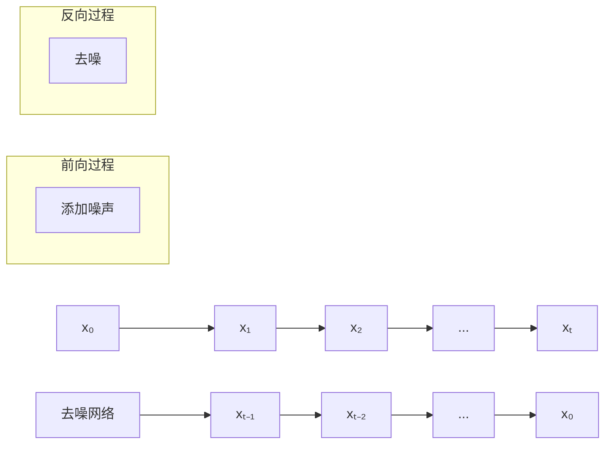

# 生成模型多表征示例 / Generative Models Multi-Representation Example

## 概述 / Overview

本文档提供生成模型的多表征实现示例，包括变分自编码器、生成对抗网络和扩散模型。

This document provides multi-representation implementation examples for generative models, including Variational Autoencoders, Generative Adversarial Networks, and Diffusion Models.

## 1. 变分自编码器 / Variational Autoencoders

### 1.1 VAE理论 / VAE Theory

#### 数学表示 / Mathematical Representation

变分自编码器通过变分推断学习数据的潜在表示：

Variational Autoencoders learn latent representations of data through variational inference:

$$\mathcal{L}(\theta, \phi; x) = \mathbb{E}_{q_\phi(z|x)}[\log p_\theta(x|z)] - D_{KL}(q_\phi(z|x) \| p(z))$$

其中：

- $q_\phi(z|x)$ 是编码器（近似后验）
- $p_\theta(x|z)$ 是解码器（似然函数）
- $p(z)$ 是先验分布（通常为标准正态分布）
- $D_{KL}$ 是KL散度

where:

- $q_\phi(z|x)$ is the encoder (approximate posterior)
- $p_\theta(x|z)$ is the decoder (likelihood function)
- $p(z)$ is the prior distribution (usually standard normal)
- $D_{KL}$ is the KL divergence

#### 可视化表示 / Visual Representation

```mermaid
graph TD
    A[输入数据 x] --> B[编码器 q(z|x)]
    B --> C[潜在变量 z]
    C --> D[解码器 p(x|z)]
    D --> E[重构数据 x']
    
    subgraph "变分推断"
        F[KL散度损失]
        G[重构损失]
        H[总损失 = 重构损失 - KL散度]
    end
    
    C --> F
    E --> G
    F --> H
    G --> H
```

#### Python实现 / Python Implementation

```python
import numpy as np
import torch
import torch.nn as nn
import torch.nn.functional as F
import torch.optim as optim
import matplotlib.pyplot as plt
from torch.utils.data import DataLoader, TensorDataset
from dataclasses import dataclass
from typing import List, Tuple, Optional

class Encoder(nn.Module):
    """编码器"""
    
    def __init__(self, input_dim: int, hidden_dim: int, latent_dim: int):
        super(Encoder, self).__init__()
        
        self.fc1 = nn.Linear(input_dim, hidden_dim)
        self.fc2 = nn.Linear(input_dim, hidden_dim)
        self.fc3 = nn.Linear(hidden_dim, latent_dim)
        self.fc4 = nn.Linear(hidden_dim, latent_dim)
    
    def forward(self, x: torch.Tensor) -> Tuple[torch.Tensor, torch.Tensor]:
        """前向传播"""
        h = F.relu(self.fc1(x))
        
        # 均值和方差
        mu = self.fc3(h)
        log_var = self.fc4(h)
        
        return mu, log_var

class Decoder(nn.Module):
    """解码器"""
    
    def __init__(self, latent_dim: int, hidden_dim: int, output_dim: int):
        super(Decoder, self).__init__()
        
        self.fc1 = nn.Linear(latent_dim, hidden_dim)
        self.fc2 = nn.Linear(hidden_dim, hidden_dim)
        self.fc3 = nn.Linear(hidden_dim, output_dim)
    
    def forward(self, z: torch.Tensor) -> torch.Tensor:
        """前向传播"""
        h = F.relu(self.fc1(z))
        h = F.relu(self.fc2(h))
        x_recon = torch.sigmoid(self.fc3(h))
        
        return x_recon

class VariationalAutoencoder(nn.Module):
    """变分自编码器"""
    
    def __init__(self, input_dim: int, hidden_dim: int, latent_dim: int):
        super(VariationalAutoencoder, self).__init__()
        
        self.encoder = Encoder(input_dim, hidden_dim, latent_dim)
        self.decoder = Decoder(latent_dim, hidden_dim, input_dim)
    
    def reparameterize(self, mu: torch.Tensor, log_var: torch.Tensor) -> torch.Tensor:
        """重参数化技巧"""
        std = torch.exp(0.5 * log_var)
        eps = torch.randn_like(std)
        return mu + eps * std
    
    def forward(self, x: torch.Tensor) -> Tuple[torch.Tensor, torch.Tensor, torch.Tensor]:
        """前向传播"""
        mu, log_var = self.encoder(x)
        z = self.reparameterize(mu, log_var)
        x_recon = self.decoder(z)
        
        return x_recon, mu, log_var
    
    def loss_function(self, x: torch.Tensor, x_recon: torch.Tensor, 
                     mu: torch.Tensor, log_var: torch.Tensor) -> Tuple[torch.Tensor, torch.Tensor, torch.Tensor]:
        """损失函数"""
        # 重构损失
        recon_loss = F.binary_cross_entropy(x_recon, x, reduction='sum')
        
        # KL散度
        kl_loss = -0.5 * torch.sum(1 + log_var - mu.pow(2) - log_var.exp())
        
        # 总损失
        total_loss = recon_loss + kl_loss
        
        return total_loss, recon_loss, kl_loss

def create_synthetic_data(num_samples: int = 1000, input_dim: int = 20) -> torch.Tensor:
    """创建合成数据"""
    # 生成一些简单的模式
    data = torch.randn(num_samples, input_dim)
    
    # 添加一些结构
    for i in range(num_samples):
        if i % 3 == 0:
            data[i, :5] += 2.0  # 模式1
        elif i % 3 == 1:
            data[i, 5:10] += 1.5  # 模式2
        else:
            data[i, 10:15] += 1.0  # 模式3
    
    # 归一化到[0,1]
    data = torch.sigmoid(data)
    
    return data

def train_vae(model: VariationalAutoencoder, dataloader: DataLoader, 
              epochs: int = 100, lr: float = 0.001) -> List[float]:
    """训练VAE"""
    optimizer = optim.Adam(model.parameters(), lr=lr)
    losses = []
    
    for epoch in range(epochs):
        total_loss = 0
        recon_loss = 0
        kl_loss = 0
        
        for batch_x in dataloader:
            batch_x = batch_x[0]
            optimizer.zero_grad()
            
            # 前向传播
            x_recon, mu, log_var = model(batch_x)
            
            # 计算损失
            loss, recon, kl = model.loss_function(batch_x, x_recon, mu, log_var)
            
            # 反向传播
            loss.backward()
            optimizer.step()
            
            total_loss += loss.item()
            recon_loss += recon.item()
            kl_loss += kl.item()
        
        losses.append(total_loss / len(dataloader))
        
        if epoch % 20 == 0:
            print(f"Epoch {epoch}, Total Loss: {total_loss/len(dataloader):.4f}, "
                  f"Recon Loss: {recon_loss/len(dataloader):.4f}, "
                  f"KL Loss: {kl_loss/len(dataloader):.4f}")
    
    return losses

def visualize_vae_results(model: VariationalAutoencoder, data: torch.Tensor) -> None:
    """可视化VAE结果"""
    model.eval()
    with torch.no_grad():
        # 编码
        mu, log_var = model.encoder(data)
        z = model.reparameterize(mu, log_var)
        
        # 解码
        x_recon, _, _ = model(data)
        
        plt.figure(figsize=(15, 5))
        
        # 原始数据
        plt.subplot(1, 3, 1)
        plt.imshow(data[:50].numpy(), cmap='viridis')
        plt.title('Original Data')
        plt.xlabel('Feature')
        plt.ylabel('Sample')
        
        # 潜在空间
        plt.subplot(1, 3, 2)
        plt.scatter(z[:, 0].numpy(), z[:, 1].numpy(), alpha=0.6)
        plt.title('Latent Space')
        plt.xlabel('z1')
        plt.ylabel('z2')
        
        # 重构数据
        plt.subplot(1, 3, 3)
        plt.imshow(x_recon[:50].numpy(), cmap='viridis')
        plt.title('Reconstructed Data')
        plt.xlabel('Feature')
        plt.ylabel('Sample')
        
        plt.tight_layout()
        plt.show()

# 测试VAE
if __name__ == "__main__":
    # 创建数据
    data = create_synthetic_data(1000, 20)
    dataloader = DataLoader(TensorDataset(data), batch_size=32, shuffle=True)
    
    # 创建模型
    vae = VariationalAutoencoder(input_dim=20, hidden_dim=64, latent_dim=2)
    
    # 训练
    losses = train_vae(vae, dataloader)
    
    # 可视化
    visualize_vae_results(vae, data)
    
    # 损失曲线
    plt.figure(figsize=(10, 6))
    plt.plot(losses)
    plt.title('VAE Training Loss')
    plt.xlabel('Epoch')
    plt.ylabel('Loss')
    plt.grid(True, alpha=0.3)
    plt.show()
```

## 2. 生成对抗网络 / Generative Adversarial Networks

### 2.1 GAN理论 / GAN Theory

#### 2.1.1 数学表示 / Mathematical Representation

生成对抗网络通过对抗训练学习数据分布：

Generative Adversarial Networks learn data distributions through adversarial training:

$$\min_G \max_D V(D,G) = \mathbb{E}_{x \sim p_{data}(x)}[\log D(x)] + \mathbb{E}_{z \sim p_z(z)}[\log(1-D(G(z)))]$$

其中：

- $G$ 是生成器
- $D$ 是判别器
- $p_{data}(x)$ 是真实数据分布
- $p_z(z)$ 是噪声分布

where:

- $G$ is the generator
- $D$ is the discriminator
- $p_{data}(x)$ is the real data distribution
- $p_z(z)$ is the noise distribution

#### 2.1.2 可视化表示 / Visual Representation

```mermaid
graph TD
    A[噪声 z] --> B[生成器 G]
    B --> C[生成数据 G(z)]
    C --> D[判别器 D]
    D --> E[判别结果]
    
    F[真实数据 x] --> D
    
    subgraph "对抗训练"
        G[生成器损失: log(1-D(G(z)))]
        H[判别器损失: log(D(x)) + log(1-D(G(z)))]
    end
    
    E --> G
    E --> H
```

#### 2.1.3 Python实现 / Python Implementation

```python
import numpy as np
import torch
import torch.nn as nn
import torch.nn.functional as F
import torch.optim as optim
import matplotlib.pyplot as plt
from torch.utils.data import DataLoader, TensorDataset
from dataclasses import dataclass
from typing import List, Tuple, Optional

class Generator(nn.Module):
    """生成器"""
    
    def __init__(self, latent_dim: int, hidden_dim: int, output_dim: int):
        super(Generator, self).__init__()
        
        self.fc1 = nn.Linear(latent_dim, hidden_dim)
        self.fc2 = nn.Linear(hidden_dim, hidden_dim)
        self.fc3 = nn.Linear(hidden_dim, output_dim)
        
        self.bn1 = nn.BatchNorm1d(hidden_dim)
        self.bn2 = nn.BatchNorm1d(hidden_dim)
    
    def forward(self, z: torch.Tensor) -> torch.Tensor:
        """前向传播"""
        x = F.relu(self.bn1(self.fc1(z)))
        x = F.relu(self.bn2(self.fc2(x)))
        x = torch.tanh(self.fc3(x))
        
        return x

class Discriminator(nn.Module):
    """判别器"""
    
    def __init__(self, input_dim: int, hidden_dim: int):
        super(Discriminator, self).__init__()
        
        self.fc1 = nn.Linear(input_dim, hidden_dim)
        self.fc2 = nn.Linear(hidden_dim, hidden_dim)
        self.fc3 = nn.Linear(hidden_dim, 1)
        
        self.dropout = nn.Dropout(0.3)
    
    def forward(self, x: torch.Tensor) -> torch.Tensor:
        """前向传播"""
        x = F.leaky_relu(self.fc1(x), 0.2)
        x = self.dropout(x)
        x = F.leaky_relu(self.fc2(x), 0.2)
        x = self.dropout(x)
        x = torch.sigmoid(self.fc3(x))
        
        return x

class GAN:
    """生成对抗网络"""
    
    def __init__(self, latent_dim: int, hidden_dim: int, output_dim: int, lr: float = 0.0002):
        self.generator = Generator(latent_dim, hidden_dim, output_dim)
        self.discriminator = Discriminator(output_dim, hidden_dim)
        
        self.g_optimizer = optim.Adam(self.generator.parameters(), lr=lr, betas=(0.5, 0.999))
        self.d_optimizer = optim.Adam(self.discriminator.parameters(), lr=lr, betas=(0.5, 0.999))
        
        self.criterion = nn.BCELoss()
        self.latent_dim = latent_dim
    
    def train_step(self, real_data: torch.Tensor) -> Tuple[float, float]:
        """训练一步"""
        batch_size = real_data.size(0)
        
        # 真实和虚假标签
        real_labels = torch.ones(batch_size, 1)
        fake_labels = torch.zeros(batch_size, 1)
        
        # 训练判别器
        self.d_optimizer.zero_grad()
        
        # 真实数据的判别结果
        real_outputs = self.discriminator(real_data)
        d_real_loss = self.criterion(real_outputs, real_labels)
        
        # 生成虚假数据
        noise = torch.randn(batch_size, self.latent_dim)
        fake_data = self.generator(noise)
        fake_outputs = self.discriminator(fake_data.detach())
        d_fake_loss = self.criterion(fake_outputs, fake_labels)
        
        # 判别器总损失
        d_loss = d_real_loss + d_fake_loss
        d_loss.backward()
        self.d_optimizer.step()
        
        # 训练生成器
        self.g_optimizer.zero_grad()
        
        # 重新计算虚假数据的判别结果
        fake_outputs = self.discriminator(fake_data)
        g_loss = self.criterion(fake_outputs, real_labels)
        
        g_loss.backward()
        self.g_optimizer.step()
        
        return d_loss.item(), g_loss.item()
    
    def generate(self, num_samples: int) -> torch.Tensor:
        """生成样本"""
        self.generator.eval()
        with torch.no_grad():
            noise = torch.randn(num_samples, self.latent_dim)
            fake_data = self.generator(noise)
        return fake_data

def create_gan_data(num_samples: int = 1000, output_dim: int = 20) -> torch.Tensor:
    """创建GAN训练数据"""
    # 生成一些复杂的模式
    data = torch.randn(num_samples, output_dim)
    
    # 添加多个模式
    for i in range(num_samples):
        if i % 4 == 0:
            data[i, :] = torch.sin(torch.arange(output_dim) * 0.5) + 0.1 * torch.randn(output_dim)
        elif i % 4 == 1:
            data[i, :] = torch.cos(torch.arange(output_dim) * 0.3) + 0.1 * torch.randn(output_dim)
        elif i % 4 == 2:
            data[i, :] = torch.exp(-torch.arange(output_dim) * 0.1) + 0.1 * torch.randn(output_dim)
        else:
            data[i, :] = torch.sigmoid(torch.arange(output_dim) * 0.2) + 0.1 * torch.randn(output_dim)
    
    return data

def train_gan(gan: GAN, dataloader: DataLoader, epochs: int = 100) -> Tuple[List[float], List[float]]:
    """训练GAN"""
    d_losses = []
    g_losses = []
    
    for epoch in range(epochs):
        epoch_d_loss = 0
        epoch_g_loss = 0
        
        for batch_x in dataloader:
            batch_x = batch_x[0]
            d_loss, g_loss = gan.train_step(batch_x)
            
            epoch_d_loss += d_loss
            epoch_g_loss += g_loss
        
        d_losses.append(epoch_d_loss / len(dataloader))
        g_losses.append(epoch_g_loss / len(dataloader))
        
        if epoch % 20 == 0:
            print(f"Epoch {epoch}, D Loss: {d_losses[-1]:.4f}, G Loss: {g_losses[-1]:.4f}")
    
    return d_losses, g_losses

def visualize_gan_results(gan: GAN, real_data: torch.Tensor) -> None:
    """可视化GAN结果"""
    # 生成虚假数据
    fake_data = gan.generate(100)
    
    plt.figure(figsize=(15, 5))
    
    # 真实数据
    plt.subplot(1, 3, 1)
    plt.imshow(real_data[:50].numpy(), cmap='viridis')
    plt.title('Real Data')
    plt.xlabel('Feature')
    plt.ylabel('Sample')
    
    # 生成数据
    plt.subplot(1, 3, 2)
    plt.imshow(fake_data[:50].numpy(), cmap='viridis')
    plt.title('Generated Data')
    plt.xlabel('Feature')
    plt.ylabel('Sample')
    
    # 数据分布对比
    plt.subplot(1, 3, 3)
    plt.hist(real_data.flatten().numpy(), bins=50, alpha=0.7, label='Real', density=True)
    plt.hist(fake_data.flatten().numpy(), bins=50, alpha=0.7, label='Generated', density=True)
    plt.title('Data Distribution')
    plt.xlabel('Value')
    plt.ylabel('Density')
    plt.legend()
    
    plt.tight_layout()
    plt.show()

# 测试GAN
if __name__ == "__main__":
    # 创建数据
    data = create_gan_data(1000, 20)
    dataloader = DataLoader(TensorDataset(data), batch_size=32, shuffle=True)
    
    # 创建GAN
    gan = GAN(latent_dim=10, hidden_dim=64, output_dim=20)
    
    # 训练
    d_losses, g_losses = train_gan(gan, dataloader)
    
    # 可视化
    visualize_gan_results(gan, data)
    
    # 损失曲线
    plt.figure(figsize=(10, 6))
    plt.plot(d_losses, label='Discriminator Loss')
    plt.plot(g_losses, label='Generator Loss')
    plt.title('GAN Training Loss')
    plt.xlabel('Epoch')
    plt.ylabel('Loss')
    plt.legend()
    plt.grid(True, alpha=0.3)
    plt.show()
```

## 3. 扩散模型 / Diffusion Models

### 3.1 扩散理论 / Diffusion Theory

#### 3.1.1 数学表示 / Mathematical Representation

扩散模型通过逐步去噪学习数据分布：

Diffusion models learn data distributions through gradual denoising:

$$q(x_t|x_{t-1}) = \mathcal{N}(x_t; \sqrt{1-\beta_t}x_{t-1}, \beta_t I)$$

$$p_\theta(x_{t-1}|x_t) = \mathcal{N}(x_{t-1}; \mu_\theta(x_t, t), \Sigma_\theta(x_t, t))$$

其中：

- $\beta_t$ 是噪声调度
- $\mu_\theta$ 是预测的均值
- $\Sigma_\theta$ 是预测的方差

where:

- $\beta_t$ is the noise schedule
- $\mu_\theta$ is the predicted mean
- $\Sigma_\theta$ is the predicted variance

#### 3.1.2 可视化表示 / Visual Representation



#### 3.1.3 Python实现 / Python Implementation

```python
import numpy as np
import torch
import torch.nn as nn
import torch.nn.functional as F
import torch.optim as optim
import matplotlib.pyplot as plt
from torch.utils.data import DataLoader, TensorDataset
from dataclasses import dataclass
from typing import List, Tuple, Optional

class DiffusionModel(nn.Module):
    """扩散模型"""
    
    def __init__(self, input_dim: int, hidden_dim: int, num_timesteps: int = 1000):
        super(DiffusionModel, self).__init__()
        
        self.input_dim = input_dim
        self.num_timesteps = num_timesteps
        
        # 时间嵌入
        self.time_embed = nn.Sequential(
            nn.Linear(1, hidden_dim),
            nn.ReLU(),
            nn.Linear(hidden_dim, hidden_dim)
        )
        
        # 去噪网络
        self.denoise_net = nn.Sequential(
            nn.Linear(input_dim + hidden_dim, hidden_dim),
            nn.ReLU(),
            nn.Linear(hidden_dim, hidden_dim),
            nn.ReLU(),
            nn.Linear(hidden_dim, input_dim)
        )
        
        # 噪声调度
        self.betas = torch.linspace(1e-4, 0.02, num_timesteps)
        self.alphas = 1 - self.betas
        self.alphas_cumprod = torch.cumprod(self.alphas, dim=0)
    
    def forward(self, x: torch.Tensor, t: torch.Tensor) -> torch.Tensor:
        """前向传播"""
        # 时间嵌入
        t_embed = self.time_embed(t.unsqueeze(-1).float())
        
        # 连接输入和时间嵌入
        x_t_embed = torch.cat([x, t_embed], dim=-1)
        
        # 预测噪声
        noise_pred = self.denoise_net(x_t_embed)
        
        return noise_pred
    
    def add_noise(self, x: torch.Tensor, t: torch.Tensor) -> Tuple[torch.Tensor, torch.Tensor]:
        """添加噪声"""
        noise = torch.randn_like(x)
        sqrt_alphas_cumprod_t = torch.sqrt(self.alphas_cumprod[t])
        sqrt_one_minus_alphas_cumprod_t = torch.sqrt(1 - self.alphas_cumprod[t])
        
        x_t = sqrt_alphas_cumprod_t * x + sqrt_one_minus_alphas_cumprod_t * noise
        
        return x_t, noise
    
    def sample(self, num_samples: int, device: torch.device) -> torch.Tensor:
        """采样"""
        self.eval()
        
        # 从纯噪声开始
        x = torch.randn(num_samples, self.input_dim, device=device)
        
        # 逐步去噪
        for t in reversed(range(self.num_timesteps)):
            t_tensor = torch.full((num_samples,), t, device=device)
            
            with torch.no_grad():
                noise_pred = self.forward(x, t_tensor)
                
                # 计算去噪步骤
                alpha_t = self.alphas[t]
                alpha_cumprod_t = self.alphas_cumprod[t]
                beta_t = self.betas[t]
                
                if t > 0:
                    noise = torch.randn_like(x)
                else:
                    noise = torch.zeros_like(x)
                
                x = (1 / torch.sqrt(alpha_t)) * (x - (beta_t / torch.sqrt(1 - alpha_cumprod_t)) * noise_pred) + torch.sqrt(beta_t) * noise
        
        return x

def create_diffusion_data(num_samples: int = 1000, input_dim: int = 20) -> torch.Tensor:
    """创建扩散模型训练数据"""
    # 生成一些复杂的模式
    data = torch.randn(num_samples, input_dim)
    
    # 添加多个模式
    for i in range(num_samples):
        if i % 5 == 0:
            data[i, :] = torch.sin(torch.arange(input_dim) * 0.3) + 0.05 * torch.randn(input_dim)
        elif i % 5 == 1:
            data[i, :] = torch.cos(torch.arange(input_dim) * 0.4) + 0.05 * torch.randn(input_dim)
        elif i % 5 == 2:
            data[i, :] = torch.exp(-torch.arange(input_dim) * 0.1) + 0.05 * torch.randn(input_dim)
        elif i % 5 == 3:
            data[i, :] = torch.sigmoid(torch.arange(input_dim) * 0.2) + 0.05 * torch.randn(input_dim)
        else:
            data[i, :] = torch.tanh(torch.arange(input_dim) * 0.15) + 0.05 * torch.randn(input_dim)
    
    return data

def train_diffusion(model: DiffusionModel, dataloader: DataLoader, 
                   epochs: int = 100, lr: float = 0.001) -> List[float]:
    """训练扩散模型"""
    optimizer = optim.Adam(model.parameters(), lr=lr)
    criterion = nn.MSELoss()
    losses = []
    
    for epoch in range(epochs):
        epoch_loss = 0
        
        for batch_x in dataloader:
            batch_x = batch_x[0]
            batch_size = batch_x.size(0)
            
            # 随机选择时间步
            t = torch.randint(0, model.num_timesteps, (batch_size,))
            
            # 添加噪声
            x_t, noise = model.add_noise(batch_x, t)
            
            # 预测噪声
            noise_pred = model(x_t, t)
            
            # 计算损失
            loss = criterion(noise_pred, noise)
            
            # 反向传播
            optimizer.zero_grad()
            loss.backward()
            optimizer.step()
            
            epoch_loss += loss.item()
        
        losses.append(epoch_loss / len(dataloader))
        
        if epoch % 20 == 0:
            print(f"Epoch {epoch}, Loss: {losses[-1]:.4f}")
    
    return losses

def visualize_diffusion_results(model: DiffusionModel, real_data: torch.Tensor) -> None:
    """可视化扩散模型结果"""
    device = next(model.parameters()).device
    
    # 生成样本
    fake_data = model.sample(100, device)
    
    plt.figure(figsize=(15, 5))
    
    # 真实数据
    plt.subplot(1, 3, 1)
    plt.imshow(real_data[:50].numpy(), cmap='viridis')
    plt.title('Real Data')
    plt.xlabel('Feature')
    plt.ylabel('Sample')
    
    # 生成数据
    plt.subplot(1, 3, 2)
    plt.imshow(fake_data[:50].cpu().numpy(), cmap='viridis')
    plt.title('Generated Data')
    plt.xlabel('Feature')
    plt.ylabel('Sample')
    
    # 数据分布对比
    plt.subplot(1, 3, 3)
    plt.hist(real_data.flatten().numpy(), bins=50, alpha=0.7, label='Real', density=True)
    plt.hist(fake_data.flatten().cpu().numpy(), bins=50, alpha=0.7, label='Generated', density=True)
    plt.title('Data Distribution')
    plt.xlabel('Value')
    plt.ylabel('Density')
    plt.legend()
    
    plt.tight_layout()
    plt.show()

# 测试扩散模型
if __name__ == "__main__":
    # 创建数据
    data = create_diffusion_data(1000, 20)
    dataloader = DataLoader(TensorDataset(data), batch_size=32, shuffle=True)
    
    # 创建模型
    diffusion_model = DiffusionModel(input_dim=20, hidden_dim=64, num_timesteps=100)
    
    # 训练
    losses = train_diffusion(diffusion_model, dataloader)
    
    # 可视化
    visualize_diffusion_results(diffusion_model, data)
    
    # 损失曲线
    plt.figure(figsize=(10, 6))
    plt.plot(losses)
    plt.title('Diffusion Model Training Loss')
    plt.xlabel('Epoch')
    plt.ylabel('Loss')
    plt.grid(True, alpha=0.3)
    plt.show()
```

## 总结 / Summary

本文档提供了生成模型的多表征实现示例，包括：

This document provides multi-representation implementation examples for generative models, including:

1. **变分自编码器** / Variational Autoencoders
   - 变分推断 / Variational Inference
   - 重参数化技巧 / Reparameterization Trick
   - 潜在空间学习 / Latent Space Learning

2. **生成对抗网络** / Generative Adversarial Networks
   - 对抗训练 / Adversarial Training
   - 生成器-判别器架构 / Generator-Discriminator Architecture
   - 模式崩溃问题 / Mode Collapse

3. **扩散模型** / Diffusion Models
   - 前向扩散过程 / Forward Diffusion Process
   - 反向去噪过程 / Reverse Denoising Process
   - 噪声调度 / Noise Scheduling

每个模型都包含数学表示、可视化图表、Python实现，展示了生成模型在不同领域的应用。

Each model includes mathematical representation, visual diagrams, and Python implementations, demonstrating the applications of generative models in different domains.
