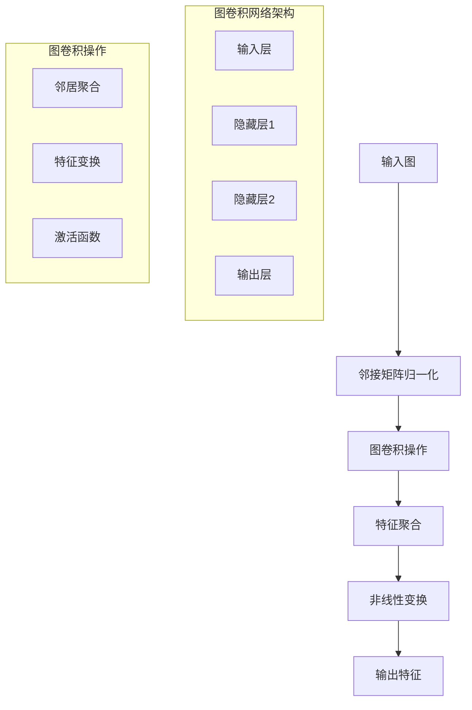

# 图神经网络扩展多表征示例 / Graph Neural Networks Extension Multi-Representation Examples

## 概述 / Overview

本文档提供了图神经网络扩展的完整多表征示例，包括图卷积网络、图注意力网络和图生成模型。每种方法都包含数学表示、可视化图表和完整的代码实现。

## 1. 图卷积网络 / Graph Convolutional Networks (GCN)

### 1.1 GCN理论 / GCN Theory

#### 数学表示 / Mathematical Representation

图卷积网络的核心思想是将卷积操作扩展到图结构数据上。

图卷积层：

Graph Convolutional Layer:

$$H^{(l+1)} = \sigma\left(\tilde{D}^{-\frac{1}{2}} \tilde{A} \tilde{D}^{-\frac{1}{2}} H^{(l)} W^{(l)}\right)$$

其中：

- $H^{(l)}$ 是第$l$层的节点特征矩阵
- $\tilde{A} = A + I$ 是添加自环的邻接矩阵
- $\tilde{D}$ 是$\tilde{A}$的度矩阵
- $W^{(l)}$ 是第$l$层的权重矩阵
- $\sigma$ 是激活函数

where:

- $H^{(l)}$ is the node feature matrix at layer $l$
- $\tilde{A} = A + I$ is the adjacency matrix with self-loops
- $\tilde{D}$ is the degree matrix of $\tilde{A}$
- $W^{(l)}$ is the weight matrix at layer $l$
- $\sigma$ is the activation function

多层GCN：

Multi-layer GCN:

$$Z = \text{GCN}(X, A) = \text{softmax}\left(\tilde{A} \text{ReLU}\left(\tilde{A} X W^{(0)}\right) W^{(1)}\right)$$

其中：

- $X$ 是输入节点特征
- $A$ 是邻接矩阵
- $Z$ 是输出预测

where:

- $X$ is the input node features
- $A$ is the adjacency matrix
- $Z$ is the output prediction

#### 可视化表示 / Visual Representation



#### Python实现 / Python Implementation

```python
import torch
import torch.nn as nn
import torch.nn.functional as F
import torch.optim as optim
import numpy as np
import matplotlib.pyplot as plt
import networkx as nx
from sklearn.manifold import TSNE
from sklearn.metrics import accuracy_score
from typing import List, Dict, Tuple, Optional
import warnings
warnings.filterwarnings('ignore')

class GraphConvolution(nn.Module):
    """图卷积层"""
    
    def __init__(self, in_features: int, out_features: int, bias: bool = True):
        super(GraphConvolution, self).__init__()
        self.in_features = in_features
        self.out_features = out_features
        
        # 权重矩阵
        self.weight = nn.Parameter(torch.FloatTensor(in_features, out_features))
        
        if bias:
            self.bias = nn.Parameter(torch.FloatTensor(out_features))
        else:
            self.register_parameter('bias', None)
        
        self.reset_parameters()
    
    def reset_parameters(self):
        """重置参数"""
        nn.init.kaiming_uniform_(self.weight)
        if self.bias is not None:
            nn.init.zeros_(self.bias)
    
    def forward(self, input_features: torch.Tensor, adj_matrix: torch.Tensor) -> torch.Tensor:
        """前向传播"""
        # 计算归一化邻接矩阵
        adj_normalized = self._normalize_adjacency(adj_matrix)
        
        # 图卷积操作
        support = torch.mm(input_features, self.weight)
        output = torch.spmm(adj_normalized, support)
        
        if self.bias is not None:
            output += self.bias
        
        return output
    
    def _normalize_adjacency(self, adj: torch.Tensor) -> torch.Tensor:
        """归一化邻接矩阵"""
        # 添加自环
        adj = adj + torch.eye(adj.size(0))
        
        # 计算度矩阵
        degree = torch.sum(adj, dim=1)
        degree_matrix = torch.diag(torch.pow(degree, -0.5))
        
        # 归一化
        adj_normalized = torch.mm(torch.mm(degree_matrix, adj), degree_matrix)
        
        return adj_normalized

class GCN(nn.Module):
    """图卷积网络"""
    
    def __init__(self, input_dim: int, hidden_dim: int, output_dim: int, 
                 num_layers: int = 2, dropout: float = 0.5):
        super(GCN, self).__init__()
        self.num_layers = num_layers
        self.dropout = dropout
        
        # 构建GCN层
        self.layers = nn.ModuleList()
        
        # 输入层
        self.layers.append(GraphConvolution(input_dim, hidden_dim))
        
        # 隐藏层
        for _ in range(num_layers - 2):
            self.layers.append(GraphConvolution(hidden_dim, hidden_dim))
        
        # 输出层
        self.layers.append(GraphConvolution(hidden_dim, output_dim))
    
    def forward(self, features: torch.Tensor, adj: torch.Tensor) -> torch.Tensor:
        """前向传播"""
        x = features
        
        # 前向传播通过所有层
        for i, layer in enumerate(self.layers):
            x = layer(x, adj)
            
            # 除了最后一层，都应用激活函数和dropout
            if i < len(self.layers) - 1:
                x = F.relu(x)
                x = F.dropout(x, self.dropout, training=self.training)
        
        return x

def generate_synthetic_graph(n_nodes: int = 100, n_classes: int = 3, 
                           feature_dim: int = 16, edge_prob: float = 0.1) -> Tuple[torch.Tensor, torch.Tensor, torch.Tensor]:
    """生成合成图数据"""
    np.random.seed(42)
    
    # 生成随机图
    adj_matrix = np.random.rand(n_nodes, n_nodes) < edge_prob
    adj_matrix = adj_matrix.astype(np.float32)
    
    # 确保对称性
    adj_matrix = (adj_matrix + adj_matrix.T) > 0
    adj_matrix = adj_matrix.astype(np.float32)
    
    # 移除自环
    np.fill_diagonal(adj_matrix, 0)
    
    # 生成节点特征
    features = np.random.randn(n_nodes, feature_dim).astype(np.float32)
    
    # 生成节点标签（基于图结构）
    # 使用图聚类来生成标签
    G = nx.from_numpy_array(adj_matrix)
    communities = list(nx.community.greedy_modularity_communities(G))
    
    labels = np.zeros(n_nodes, dtype=np.int64)
    for i, community in enumerate(communities):
        for node in community:
            labels[node] = i % n_classes
    
    return torch.FloatTensor(features), torch.FloatTensor(adj_matrix), torch.LongTensor(labels)

def train_gcn(model: GCN, features: torch.Tensor, adj: torch.Tensor, 
              labels: torch.Tensor, train_mask: torch.Tensor, 
              val_mask: torch.Tensor, epochs: int = 200) -> Tuple[List[float], List[float]]:
    """训练GCN模型"""
    optimizer = optim.Adam(model.parameters(), lr=0.01, weight_decay=5e-4)
    criterion = nn.CrossEntropyLoss()
    
    train_losses = []
    val_accuracies = []
    
    for epoch in range(epochs):
        model.train()
        
        # 前向传播
        output = model(features, adj)
        loss = criterion(output[train_mask], labels[train_mask])
        
        # 反向传播
        optimizer.zero_grad()
        loss.backward()
        optimizer.step()
        
        # 验证
        model.eval()
        with torch.no_grad():
            output = model(features, adj)
            predictions = torch.argmax(output, dim=1)
            val_accuracy = accuracy_score(labels[val_mask].numpy(), 
                                        predictions[val_mask].numpy())
        
        train_losses.append(loss.item())
        val_accuracies.append(val_accuracy)
        
        if epoch % 50 == 0:
            print(f"Epoch {epoch}: Loss = {loss.item():.4f}, Val Accuracy = {val_accuracy:.4f}")
    
    return train_losses, val_accuracies

def visualize_gcn_results(features: torch.Tensor, adj: torch.Tensor, 
                         labels: torch.Tensor, model: GCN) -> None:
    """可视化GCN结果"""
    model.eval()
    with torch.no_grad():
        # 获取最后一层的特征
        embeddings = model(features, adj)
        
        # 使用t-SNE降维
        tsne = TSNE(n_components=2, random_state=42)
        embeddings_2d = tsne.fit_transform(embeddings.numpy())
        
        # 可视化
        plt.figure(figsize=(15, 5))
        
        # 原始特征
        plt.subplot(1, 3, 1)
        features_2d = tsne.fit_transform(features.numpy())
        scatter = plt.scatter(features_2d[:, 0], features_2d[:, 1], 
                            c=labels.numpy(), cmap='viridis', alpha=0.7)
        plt.title('Original Features (t-SNE)')
        plt.colorbar(scatter)
        
        # 学习到的嵌入
        plt.subplot(1, 3, 2)
        scatter = plt.scatter(embeddings_2d[:, 0], embeddings_2d[:, 1], 
                            c=labels.numpy(), cmap='viridis', alpha=0.7)
        plt.title('Learned Embeddings (t-SNE)')
        plt.colorbar(scatter)
        
        # 图结构
        plt.subplot(1, 3, 3)
        G = nx.from_numpy_array(adj.numpy())
        pos = nx.spring_layout(G, k=1, iterations=50)
        nx.draw(G, pos, node_color=labels.numpy(), cmap='viridis', 
               node_size=50, alpha=0.8, with_labels=False)
        plt.title('Graph Structure')
        
        plt.tight_layout()
        plt.show()

# 测试GCN
if __name__ == "__main__":
    # 生成数据
    features, adj, labels = generate_synthetic_graph(n_nodes=100, n_classes=3)
    
    # 创建训练和验证掩码
    n_nodes = features.size(0)
    train_mask = torch.zeros(n_nodes, dtype=torch.bool)
    val_mask = torch.zeros(n_nodes, dtype=torch.bool)
    
    # 随机选择训练和验证节点
    indices = torch.randperm(n_nodes)
    train_mask[indices[:60]] = True
    val_mask[indices[60:80]] = True
    
    # 创建模型
    model = GCN(input_dim=features.size(1), hidden_dim=16, output_dim=3)
    
    # 训练模型
    train_losses, val_accuracies = train_gcn(model, features, adj, labels, 
                                            train_mask, val_mask)
    
    # 可视化结果
    visualize_gcn_results(features, adj, labels, model)
    
    # 绘制训练曲线
    plt.figure(figsize=(12, 4))
    
    plt.subplot(1, 2, 1)
    plt.plot(train_losses)
    plt.title('Training Loss')
    plt.xlabel('Epoch')
    plt.ylabel('Loss')
    plt.grid(True, alpha=0.3)
    
    plt.subplot(1, 2, 2)
    plt.plot(val_accuracies)
    plt.title('Validation Accuracy')
    plt.xlabel('Epoch')
    plt.ylabel('Accuracy')
    plt.grid(True, alpha=0.3)
    
    plt.tight_layout()
    plt.show()
```
