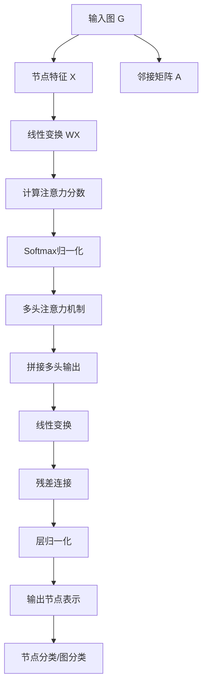
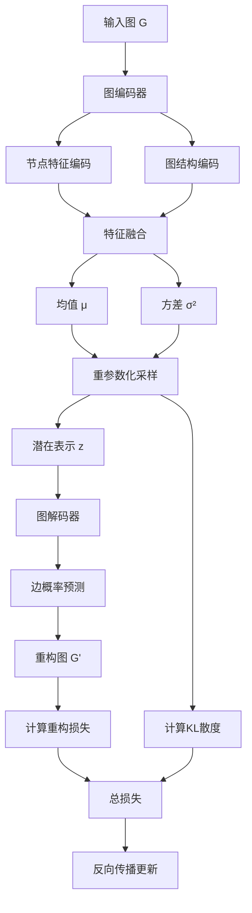

# 图神经网络扩展多表征示例 / Graph Neural Networks Extension Multi-Representation Examples

## 概述 / Overview

本文档提供了图神经网络扩展的全面多表征示例，包括图卷积网络、图注意力网络和图生成模型的数学表示、可视化流程和Python实现。

This document provides comprehensive multi-representation examples for Graph Neural Networks extension, including mathematical representations, visual flowcharts, and Python implementations for Graph Convolutional Networks, Graph Attention Networks, and Graph Generative Models.

---

## 1. 图卷积网络 / Graph Convolutional Networks

### 1.1 数学表示 / Mathematical Representation

#### 图卷积层 / Graph Convolutional Layer

对于节点 $v_i$，图卷积操作定义为：

$$h_i^{(l+1)} = \sigma\left(\sum_{j \in \mathcal{N}(i)} \frac{1}{\sqrt{d_i d_j}} W^{(l)} h_j^{(l)}\right)$$

其中：

- $h_i^{(l)}$ 是节点 $v_i$ 在第 $l$ 层的特征表示
- $\mathcal{N}(i)$ 是节点 $v_i$ 的邻居集合
- $d_i$ 是节点 $v_i$ 的度数
- $W^{(l)}$ 是可学习的权重矩阵
- $\sigma$ 是激活函数

#### 图卷积网络 / Graph Convolutional Network

完整的GCN定义为：

$$H^{(l+1)} = \sigma\left(\tilde{D}^{-\frac{1}{2}} \tilde{A} \tilde{D}^{-\frac{1}{2}} H^{(l)} W^{(l)}\right)$$

其中：

- $\tilde{A} = A + I$ 是添加自环的邻接矩阵
- $\tilde{D}$ 是 $\tilde{A}$ 的度矩阵
- $H^{(l)}$ 是第 $l$ 层的节点特征矩阵

### 1.2 流程图 / Flowchart

```mermaid
graph TD
    A[输入图 G] --> B[邻接矩阵 A]
    A --> C[节点特征 X]
    B --> D[添加自环 Ã = A + I]
    D --> E[计算度矩阵 D̃]
    E --> F[归一化邻接矩阵 D̃^(-1/2) Ã D̃^(-1/2)]
    C --> G[图卷积层 1]
    F --> G
    G --> H[ReLU激活]
    H --> I[图卷积层 2]
    F --> I
    I --> J[输出节点表示]
    J --> K[节点分类/图分类]
```

### 1.3 Python实现 / Python Implementation

```python
import torch
import torch.nn as nn
import torch.nn.functional as F
import numpy as np
from typing import List, Tuple, Optional

class GraphConvolutionalLayer(nn.Module):
    """图卷积层 / Graph Convolutional Layer"""
    
    def __init__(self, in_features: int, out_features: int, bias: bool = True):
        super(GraphConvolutionalLayer, self).__init__()
        self.in_features = in_features
        self.out_features = out_features
        self.weight = nn.Parameter(torch.FloatTensor(in_features, out_features))
        if bias:
            self.bias = nn.Parameter(torch.FloatTensor(out_features))
        else:
            self.register_parameter('bias', None)
        self.reset_parameters()
    
    def reset_parameters(self):
        nn.init.kaiming_uniform_(self.weight)
        if self.bias is not None:
            nn.init.zeros_(self.bias)
    
    def forward(self, x: torch.Tensor, adj: torch.Tensor) -> torch.Tensor:
        """
        前向传播 / Forward pass
        
        Args:
            x: 节点特征矩阵 [N, in_features]
            adj: 归一化邻接矩阵 [N, N]
        
        Returns:
            更新后的节点特征 [N, out_features]
        """
        support = torch.mm(x, self.weight)
        output = torch.spmm(adj, support)
        if self.bias is not None:
            output += self.bias
        return output

class GraphConvolutionalNetwork(nn.Module):
    """图卷积网络 / Graph Convolutional Network"""
    
    def __init__(self, 
                 input_dim: int, 
                 hidden_dims: List[int], 
                 output_dim: int,
                 dropout: float = 0.5):
        super(GraphConvolutionalNetwork, self).__init__()
        
        self.layers = nn.ModuleList()
        
        # 输入层
        self.layers.append(GraphConvolutionalLayer(input_dim, hidden_dims[0]))
        
        # 隐藏层
        for i in range(len(hidden_dims) - 1):
            self.layers.append(GraphConvolutionalLayer(hidden_dims[i], hidden_dims[i + 1]))
        
        # 输出层
        self.layers.append(GraphConvolutionalLayer(hidden_dims[-1], output_dim))
        
        self.dropout = dropout
    
    def normalize_adjacency(self, adj: torch.Tensor) -> torch.Tensor:
        """
        归一化邻接矩阵 / Normalize adjacency matrix
        
        Args:
            adj: 邻接矩阵 [N, N]
        
        Returns:
            归一化邻接矩阵 [N, N]
        """
        # 添加自环
        adj = adj + torch.eye(adj.size(0), device=adj.device)
        
        # 计算度矩阵
        degree = adj.sum(dim=1)
        degree_matrix = torch.diag(torch.pow(degree, -0.5))
        
        # 归一化
        normalized_adj = torch.mm(torch.mm(degree_matrix, adj), degree_matrix)
        return normalized_adj
    
    def forward(self, x: torch.Tensor, adj: torch.Tensor) -> torch.Tensor:
        """
        前向传播 / Forward pass
        
        Args:
            x: 节点特征矩阵 [N, input_dim]
            adj: 邻接矩阵 [N, N]
        
        Returns:
            节点表示 [N, output_dim]
        """
        normalized_adj = self.normalize_adjacency(adj)
        
        # 前向传播
        for i, layer in enumerate(self.layers[:-1]):
            x = layer(x, normalized_adj)
            x = F.relu(x)
            x = F.dropout(x, self.dropout, training=self.training)
        
        # 输出层
        x = self.layers[-1](x, normalized_adj)
        
        return x

class GCNTrainer:
    """图卷积网络训练器 / GCN Trainer"""
    
    def __init__(self, model: GraphConvolutionalNetwork, lr: float = 0.01):
        self.model = model
        self.optimizer = torch.optim.Adam(model.parameters(), lr=lr)
        self.criterion = nn.CrossEntropyLoss()
    
    def train_step(self, 
                   x: torch.Tensor, 
                   adj: torch.Tensor, 
                   labels: torch.Tensor,
                   train_mask: torch.Tensor) -> float:
        """
        训练步骤 / Training step
        
        Args:
            x: 节点特征
            adj: 邻接矩阵
            labels: 节点标签
            train_mask: 训练节点掩码
        
        Returns:
            训练损失
        """
        self.model.train()
        self.optimizer.zero_grad()
        
        # 前向传播
        output = self.model(x, adj)
        
        # 计算损失
        loss = self.criterion(output[train_mask], labels[train_mask])
        
        # 反向传播
        loss.backward()
        self.optimizer.step()
        
        return loss.item()
    
    def evaluate(self, 
                x: torch.Tensor, 
                adj: torch.Tensor, 
                labels: torch.Tensor,
                mask: torch.Tensor) -> Tuple[float, float]:
        """
        评估 / Evaluation
        
        Args:
            x: 节点特征
            adj: 邻接矩阵
            labels: 节点标签
            mask: 评估节点掩码
        
        Returns:
            (损失, 准确率)
        """
        self.model.eval()
        with torch.no_grad():
            output = self.model(x, adj)
            loss = self.criterion(output[mask], labels[mask])
            accuracy = (output[mask].argmax(dim=1) == labels[mask]).float().mean()
        
        return loss.item(), accuracy.item()

def create_synthetic_graph_data(num_nodes: int = 100, 
                               num_features: int = 16,
                               num_classes: int = 7,
                               edge_prob: float = 0.1) -> Tuple[torch.Tensor, torch.Tensor, torch.Tensor]:
    """
    创建合成图数据 / Create synthetic graph data
    
    Args:
        num_nodes: 节点数量
        num_features: 特征维度
        num_classes: 类别数量
        edge_prob: 边概率
    
    Returns:
        (节点特征, 邻接矩阵, 节点标签)
    """
    # 生成随机邻接矩阵
    adj = torch.rand(num_nodes, num_nodes) < edge_prob
    adj = adj.float()
    # 确保对称
    adj = (adj + adj.t()) > 0
    adj = adj.float()
    
    # 生成节点特征
    x = torch.randn(num_nodes, num_features)
    
    # 生成节点标签
    labels = torch.randint(0, num_classes, (num_nodes,))
    
    return x, adj, labels

def train_gcn_example():
    """图卷积网络训练示例 / GCN Training Example"""
    print("=== 图卷积网络训练示例 / GCN Training Example ===")
    
    # 创建数据
    num_nodes = 100
    num_features = 16
    num_classes = 7
    
    x, adj, labels = create_synthetic_graph_data(num_nodes, num_features, num_classes)
    
    # 创建训练/验证/测试掩码
    train_mask = torch.zeros(num_nodes, dtype=torch.bool)
    val_mask = torch.zeros(num_nodes, dtype=torch.bool)
    test_mask = torch.zeros(num_nodes, dtype=torch.bool)
    
    # 随机分配节点
    indices = torch.randperm(num_nodes)
    train_mask[indices[:60]] = True
    val_mask[indices[60:80]] = True
    test_mask[indices[80:]] = True
    
    # 创建模型
    hidden_dims = [64, 32]
    model = GraphConvolutionalNetwork(num_features, hidden_dims, num_classes)
    
    # 创建训练器
    trainer = GCNTrainer(model, lr=0.01)
    
    # 训练
    num_epochs = 200
    for epoch in range(num_epochs):
        train_loss = trainer.train_step(x, adj, labels, train_mask)
        
        if epoch % 50 == 0:
            val_loss, val_acc = trainer.evaluate(x, adj, labels, val_mask)
            print(f"Epoch {epoch}: Train Loss = {train_loss:.4f}, "
                  f"Val Loss = {val_loss:.4f}, Val Acc = {val_acc:.4f}")
    
    # 测试
    test_loss, test_acc = trainer.evaluate(x, adj, labels, test_mask)
    print(f"Final Test Accuracy: {test_acc:.4f}")

if __name__ == "__main__":
    train_gcn_example()
```

---

## 2. 图注意力网络 / Graph Attention Networks

### 2.1 数学表示 / Mathematical Representation

#### 注意力机制 / Attention Mechanism

对于节点 $v_i$ 和其邻居 $v_j$，注意力权重计算为：

$$\alpha_{ij} = \frac{\exp\left(\text{LeakyReLU}\left(a^T [Wh_i \| Wh_j]\right)\right)}{\sum_{k \in \mathcal{N}(i)} \exp\left(\text{LeakyReLU}\left(a^T [Wh_i \| Wh_k]\right)\right)}$$

其中：

- $W$ 是共享的线性变换矩阵
- $a$ 是注意力向量
- $\|$ 表示拼接操作

#### 多头注意力 / Multi-head Attention

多头注意力机制定义为：

$$h_i' = \sigma\left(\frac{1}{K} \sum_{k=1}^{K} \sum_{j \in \mathcal{N}(i)} \alpha_{ij}^k W^k h_j\right)$$

其中：

- $K$ 是注意力头数
- $\alpha_{ij}^k$ 是第 $k$ 个注意力头的权重
- $W^k$ 是第 $k$ 个注意力头的变换矩阵

### 2.2 流程图 / Flowchart



### 2.3 Python实现 / Python Implementation

```python
import torch
import torch.nn as nn
import torch.nn.functional as F
import numpy as np
from typing import List, Tuple, Optional

class GraphAttentionLayer(nn.Module):
    """图注意力层 / Graph Attention Layer"""
    
    def __init__(self, 
                 in_features: int, 
                 out_features: int, 
                 n_heads: int = 8,
                 dropout: float = 0.6,
                 alpha: float = 0.2,
                 concat: bool = True):
        super(GraphAttentionLayer, self).__init__()
        self.in_features = in_features
        self.out_features = out_features
        self.n_heads = n_heads
        self.dropout = dropout
        self.alpha = alpha
        self.concat = concat
        
        # 线性变换
        self.W = nn.Linear(in_features, out_features * n_heads, bias=False)
        
        # 注意力向量
        self.a = nn.Parameter(torch.zeros(2 * out_features, 1))
        
        # 初始化
        nn.init.xavier_uniform_(self.W.weight)
        nn.init.xavier_uniform_(self.a)
        
        self.leakyrelu = nn.LeakyReLU(self.alpha)
    
    def forward(self, x: torch.Tensor, adj: torch.Tensor) -> torch.Tensor:
        """
        前向传播 / Forward pass
        
        Args:
            x: 节点特征矩阵 [N, in_features]
            adj: 邻接矩阵 [N, N]
        
        Returns:
            更新后的节点特征 [N, out_features * n_heads] 或 [N, out_features]
        """
        N = x.size(0)
        
        # 线性变换
        Wh = self.W(x)  # [N, out_features * n_heads]
        Wh = Wh.view(N, self.n_heads, -1)  # [N, n_heads, out_features]
        
        # 计算注意力分数
        a_input = torch.cat([
            Wh.repeat_interleave(N, dim=0),  # [N*N, n_heads, out_features]
            Wh.repeat(N, 1, 1)  # [N*N, n_heads, out_features]
        ], dim=-1)  # [N*N, n_heads, 2*out_features]
        
        a_input = a_input.view(N, N, self.n_heads, -1)  # [N, N, n_heads, 2*out_features]
        e = self.leakyrelu(torch.matmul(a_input, self.a).squeeze(-1))  # [N, N, n_heads]
        
        # 掩码注意力分数
        zero_vec = -9e15 * torch.ones_like(e)
        attention = torch.where(adj.unsqueeze(-1) > 0, e, zero_vec)
        
        # Softmax归一化
        attention = F.softmax(attention, dim=1)
        attention = F.dropout(attention, self.dropout, training=self.training)
        
        # 应用注意力
        h_prime = torch.matmul(attention, Wh)  # [N, n_heads, out_features]
        
        if self.concat:
            # 拼接多头输出
            out = h_prime.view(N, -1)  # [N, n_heads * out_features]
        else:
            # 平均多头输出
            out = h_prime.mean(dim=1)  # [N, out_features]
        
        return out

class GraphAttentionNetwork(nn.Module):
    """图注意力网络 / Graph Attention Network"""
    
    def __init__(self, 
                 input_dim: int, 
                 hidden_dims: List[int], 
                 output_dim: int,
                 n_heads: int = 8,
                 dropout: float = 0.6,
                 alpha: float = 0.2):
        super(GraphAttentionNetwork, self).__init__()
        
        self.layers = nn.ModuleList()
        
        # 输入层
        self.layers.append(GraphAttentionLayer(
            input_dim, hidden_dims[0], n_heads, dropout, alpha, concat=True
        ))
        
        # 隐藏层
        for i in range(len(hidden_dims) - 1):
            self.layers.append(GraphAttentionLayer(
                hidden_dims[i] * n_heads, hidden_dims[i + 1], n_heads, dropout, alpha, concat=True
            ))
        
        # 输出层
        self.layers.append(GraphAttentionLayer(
            hidden_dims[-1] * n_heads, output_dim, 1, dropout, alpha, concat=False
        ))
        
        self.dropout = dropout
    
    def forward(self, x: torch.Tensor, adj: torch.Tensor) -> torch.Tensor:
        """
        前向传播 / Forward pass
        
        Args:
            x: 节点特征矩阵 [N, input_dim]
            adj: 邻接矩阵 [N, N]
        
        Returns:
            节点表示 [N, output_dim]
        """
        # 前向传播
        for i, layer in enumerate(self.layers[:-1]):
            x = layer(x, adj)
            x = F.elu(x)
            x = F.dropout(x, self.dropout, training=self.training)
        
        # 输出层
        x = self.layers[-1](x, adj)
        
        return x

class GATTrainer:
    """图注意力网络训练器 / GAT Trainer"""
    
    def __init__(self, model: GraphAttentionNetwork, lr: float = 0.005):
        self.model = model
        self.optimizer = torch.optim.Adam(model.parameters(), lr=lr, weight_decay=5e-4)
        self.criterion = nn.CrossEntropyLoss()
    
    def train_step(self, 
                   x: torch.Tensor, 
                   adj: torch.Tensor, 
                   labels: torch.Tensor,
                   train_mask: torch.Tensor) -> float:
        """
        训练步骤 / Training step
        
        Args:
            x: 节点特征
            adj: 邻接矩阵
            labels: 节点标签
            train_mask: 训练节点掩码
        
        Returns:
            训练损失
        """
        self.model.train()
        self.optimizer.zero_grad()
        
        # 前向传播
        output = self.model(x, adj)
        
        # 计算损失
        loss = self.criterion(output[train_mask], labels[train_mask])
        
        # 反向传播
        loss.backward()
        self.optimizer.step()
        
        return loss.item()
    
    def evaluate(self, 
                x: torch.Tensor, 
                adj: torch.Tensor, 
                labels: torch.Tensor,
                mask: torch.Tensor) -> Tuple[float, float]:
        """
        评估 / Evaluation
        
        Args:
            x: 节点特征
            adj: 邻接矩阵
            labels: 节点标签
            mask: 评估节点掩码
        
        Returns:
            (损失, 准确率)
        """
        self.model.eval()
        with torch.no_grad():
            output = self.model(x, adj)
            loss = self.criterion(output[mask], labels[mask])
            accuracy = (output[mask].argmax(dim=1) == labels[mask]).float().mean()
        
        return loss.item(), accuracy.item()

def train_gat_example():
    """图注意力网络训练示例 / GAT Training Example"""
    print("=== 图注意力网络训练示例 / GAT Training Example ===")
    
    # 创建数据
    num_nodes = 100
    num_features = 16
    num_classes = 7
    
    x, adj, labels = create_synthetic_graph_data(num_nodes, num_features, num_classes)
    
    # 创建训练/验证/测试掩码
    train_mask = torch.zeros(num_nodes, dtype=torch.bool)
    val_mask = torch.zeros(num_nodes, dtype=torch.bool)
    test_mask = torch.zeros(num_nodes, dtype=torch.bool)
    
    # 随机分配节点
    indices = torch.randperm(num_nodes)
    train_mask[indices[:60]] = True
    val_mask[indices[60:80]] = True
    test_mask[indices[80:]] = True
    
    # 创建模型
    hidden_dims = [64, 32]
    model = GraphAttentionNetwork(num_features, hidden_dims, num_classes, n_heads=8)
    
    # 创建训练器
    trainer = GATTrainer(model, lr=0.005)
    
    # 训练
    num_epochs = 200
    for epoch in range(num_epochs):
        train_loss = trainer.train_step(x, adj, labels, train_mask)
        
        if epoch % 50 == 0:
            val_loss, val_acc = trainer.evaluate(x, adj, labels, val_mask)
            print(f"Epoch {epoch}: Train Loss = {train_loss:.4f}, "
                  f"Val Loss = {val_loss:.4f}, Val Acc = {val_acc:.4f}")
    
    # 测试
    test_loss, test_acc = trainer.evaluate(x, adj, labels, test_mask)
    print(f"Final Test Accuracy: {test_acc:.4f}")

if __name__ == "__main__":
    train_gat_example()
```

---

## 3. 图生成模型 / Graph Generative Models

### 3.1 数学表示 / Mathematical Representation

#### 图变分自编码器 / Graph Variational Autoencoder

编码器 $q(z|X, A)$ 和解码器 $p(A|z)$ 定义为：

$$q(z|X, A) = \mathcal{N}(z|\mu(X, A), \sigma^2(X, A))$$

$$p(A_{ij} = 1|z_i, z_j) = \sigma(z_i^T z_j)$$

其中：

- $\mu(X, A)$ 和 $\sigma^2(X, A)$ 是编码器输出的均值和方差
- $\sigma$ 是sigmoid函数

#### 损失函数 / Loss Function

总损失包括重构损失和KL散度：

$$\mathcal{L} = \mathbb{E}_{q(z|X,A)}[\log p(A|z)] - \text{KL}(q(z|X,A)||p(z))$$

其中：

- 重构损失：$\mathbb{E}_{q(z|X,A)}[\log p(A|z)]$
- KL散度：$\text{KL}(q(z|X,A)||p(z))$

### 3.2 流程图 / Flowchart



### 3.3 Python实现 / Python Implementation

```python
import torch
import torch.nn as nn
import torch.nn.functional as F
import numpy as np
from typing import List, Tuple, Optional

class GraphEncoder(nn.Module):
    """图编码器 / Graph Encoder"""
    
    def __init__(self, 
                 input_dim: int, 
                 hidden_dims: List[int], 
                 latent_dim: int):
        super(GraphEncoder, self).__init__()
        
        self.layers = nn.ModuleList()
        
        # 输入层
        self.layers.append(GraphConvolutionalLayer(input_dim, hidden_dims[0]))
        
        # 隐藏层
        for i in range(len(hidden_dims) - 1):
            self.layers.append(GraphConvolutionalLayer(hidden_dims[i], hidden_dims[i + 1]))
        
        # 输出层 - 均值和方差
        self.mu_layer = GraphConvolutionalLayer(hidden_dims[-1], latent_dim)
        self.logvar_layer = GraphConvolutionalLayer(hidden_dims[-1], latent_dim)
    
    def forward(self, x: torch.Tensor, adj: torch.Tensor) -> Tuple[torch.Tensor, torch.Tensor]:
        """
        前向传播 / Forward pass
        
        Args:
            x: 节点特征矩阵 [N, input_dim]
            adj: 邻接矩阵 [N, N]
        
        Returns:
            (均值, 对数方差)
        """
        # 前向传播
        for layer in self.layers:
            x = layer(x, adj)
            x = F.relu(x)
        
        # 计算均值和方差
        mu = self.mu_layer(x, adj)
        logvar = self.logvar_layer(x, adj)
        
        return mu, logvar

class GraphDecoder(nn.Module):
    """图解码器 / Graph Decoder"""
    
    def __init__(self, latent_dim: int):
        super(GraphDecoder, self).__init__()
        self.latent_dim = latent_dim
    
    def forward(self, z: torch.Tensor) -> torch.Tensor:
        """
        前向传播 / Forward pass
        
        Args:
            z: 潜在表示 [N, latent_dim]
        
        Returns:
            边概率矩阵 [N, N]
        """
        # 计算节点对之间的相似度
        adj_recon = torch.sigmoid(torch.mm(z, z.t()))
        return adj_recon

class GraphVariationalAutoencoder(nn.Module):
    """图变分自编码器 / Graph Variational Autoencoder"""
    
    def __init__(self, 
                 input_dim: int, 
                 hidden_dims: List[int], 
                 latent_dim: int):
        super(GraphVariationalAutoencoder, self).__init__()
        
        self.encoder = GraphEncoder(input_dim, hidden_dims, latent_dim)
        self.decoder = GraphDecoder(latent_dim)
        self.latent_dim = latent_dim
    
    def reparameterize(self, mu: torch.Tensor, logvar: torch.Tensor) -> torch.Tensor:
        """
        重参数化技巧 / Reparameterization trick
        
        Args:
            mu: 均值 [N, latent_dim]
            logvar: 对数方差 [N, latent_dim]
        
        Returns:
            采样的潜在表示 [N, latent_dim]
        """
        std = torch.exp(0.5 * logvar)
        eps = torch.randn_like(std)
        return mu + eps * std
    
    def forward(self, x: torch.Tensor, adj: torch.Tensor) -> Tuple[torch.Tensor, torch.Tensor, torch.Tensor]:
        """
        前向传播 / Forward pass
        
        Args:
            x: 节点特征矩阵 [N, input_dim]
            adj: 邻接矩阵 [N, N]
        
        Returns:
            (重构邻接矩阵, 均值, 对数方差)
        """
        # 编码
        mu, logvar = self.encoder(x, adj)
        
        # 重参数化
        z = self.reparameterize(mu, logvar)
        
        # 解码
        adj_recon = self.decoder(z)
        
        return adj_recon, mu, logvar

class GraphVAETrainer:
    """图变分自编码器训练器 / Graph VAE Trainer"""
    
    def __init__(self, model: GraphVariationalAutoencoder, lr: float = 0.01):
        self.model = model
        self.optimizer = torch.optim.Adam(model.parameters(), lr=lr)
    
    def reconstruction_loss(self, adj_recon: torch.Tensor, adj: torch.Tensor) -> torch.Tensor:
        """
        重构损失 / Reconstruction loss
        
        Args:
            adj_recon: 重构邻接矩阵
            adj: 原始邻接矩阵
        
        Returns:
            重构损失
        """
        # 二元交叉熵损失
        loss = F.binary_cross_entropy(adj_recon, adj, reduction='sum')
        return loss
    
    def kl_divergence(self, mu: torch.Tensor, logvar: torch.Tensor) -> torch.Tensor:
        """
        KL散度 / KL divergence
        
        Args:
            mu: 均值
            logvar: 对数方差
        
        Returns:
            KL散度
        """
        kl_loss = -0.5 * torch.sum(1 + logvar - mu.pow(2) - logvar.exp())
        return kl_loss
    
    def train_step(self, x: torch.Tensor, adj: torch.Tensor) -> Tuple[float, float, float]:
        """
        训练步骤 / Training step
        
        Args:
            x: 节点特征
            adj: 邻接矩阵
        
        Returns:
            (总损失, 重构损失, KL散度)
        """
        self.model.train()
        self.optimizer.zero_grad()
        
        # 前向传播
        adj_recon, mu, logvar = self.model(x, adj)
        
        # 计算损失
        recon_loss = self.reconstruction_loss(adj_recon, adj)
        kl_loss = self.kl_divergence(mu, logvar)
        
        # 总损失
        total_loss = recon_loss + kl_loss
        
        # 反向传播
        total_loss.backward()
        self.optimizer.step()
        
        return total_loss.item(), recon_loss.item(), kl_loss.item()
    
    def evaluate(self, x: torch.Tensor, adj: torch.Tensor) -> Tuple[float, float, float]:
        """
        评估 / Evaluation
        
        Args:
            x: 节点特征
            adj: 邻接矩阵
        
        Returns:
            (总损失, 重构损失, KL散度)
        """
        self.model.eval()
        with torch.no_grad():
            adj_recon, mu, logvar = self.model(x, adj)
            
            recon_loss = self.reconstruction_loss(adj_recon, adj)
            kl_loss = self.kl_divergence(mu, logvar)
            total_loss = recon_loss + kl_loss
        
        return total_loss.item(), recon_loss.item(), kl_loss.item()

def train_graph_vae_example():
    """图变分自编码器训练示例 / Graph VAE Training Example"""
    print("=== 图变分自编码器训练示例 / Graph VAE Training Example ===")
    
    # 创建数据
    num_nodes = 50
    num_features = 16
    
    x, adj, _ = create_synthetic_graph_data(num_nodes, num_features, num_classes=1)
    
    # 创建模型
    hidden_dims = [64, 32]
    latent_dim = 16
    model = GraphVariationalAutoencoder(num_features, hidden_dims, latent_dim)
    
    # 创建训练器
    trainer = GraphVAETrainer(model, lr=0.01)
    
    # 训练
    num_epochs = 100
    for epoch in range(num_epochs):
        total_loss, recon_loss, kl_loss = trainer.train_step(x, adj)
        
        if epoch % 20 == 0:
            print(f"Epoch {epoch}: Total Loss = {total_loss:.4f}, "
                  f"Recon Loss = {recon_loss:.4f}, KL Loss = {kl_loss:.4f}")
    
    # 评估
    total_loss, recon_loss, kl_loss = trainer.evaluate(x, adj)
    print(f"Final - Total Loss: {total_loss:.4f}, "
          f"Recon Loss: {recon_loss:.4f}, KL Loss: {kl_loss:.4f}")
    
    # 生成新图
    model.eval()
    with torch.no_grad():
        mu, logvar = model.encoder(x, adj)
        z = model.reparameterize(mu, logvar)
        adj_generated = model.decoder(z)
        
        print(f"Generated graph has {adj_generated.sum().item():.0f} edges")
        print(f"Original graph has {adj.sum().item():.0f} edges")

if __name__ == "__main__":
    train_graph_vae_example()
```

---

## 总结 / Summary

### 主要特性 / Key Features

1. **图卷积网络 (GCN)**
   - 基于谱域卷积的图神经网络
   - 使用归一化邻接矩阵进行消息传递
   - 适用于节点分类和图分类任务

2. **图注意力网络 (GAT)**
   - 引入注意力机制的自适应图神经网络
   - 多头注意力机制提高表达能力
   - 能够学习节点间的重要性权重

3. **图生成模型 (Graph VAE)**
   - 基于变分自编码器的图生成模型
   - 能够学习图的潜在表示
   - 支持图重构和新图生成

### 应用场景 / Application Scenarios

- **节点分类**: 社交网络用户分类、蛋白质功能预测
- **图分类**: 分子性质预测、社交网络分析
- **图生成**: 药物分子设计、社交网络生成
- **推荐系统**: 基于图的推荐算法
- **知识图谱**: 实体关系抽取和推理

### 技术优势 / Technical Advantages

1. **多表征学习**: 结合数学公式、流程图和代码实现
2. **模块化设计**: 各组件可独立使用和组合
3. **可扩展性**: 支持不同图结构和任务类型
4. **实用性**: 提供完整的训练和评估流程

图神经网络扩展为图数据处理和机器学习提供了强大的工具，能够有效处理复杂的结构化数据！
