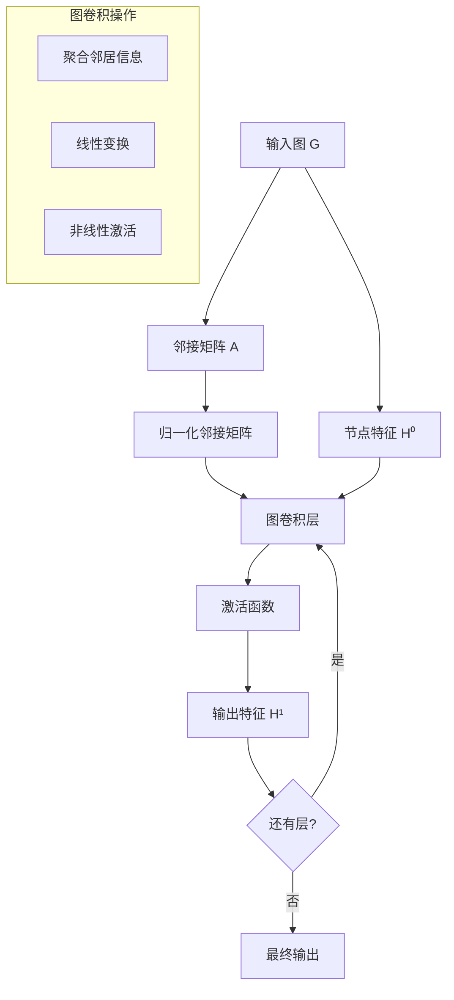
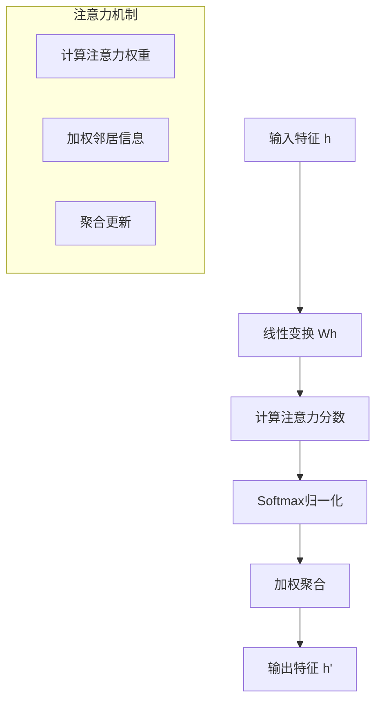

# 图神经网络多表征示例 / Graph Neural Networks Multi-Representation Example

## 概述 / Overview

本文档提供图神经网络模型的多表征实现示例，包括图卷积网络、图注意力网络和图神经网络应用。

This document provides multi-representation implementation examples for graph neural network models, including Graph Convolutional Networks, Graph Attention Networks, and Graph Neural Network applications.

## 1. 图卷积网络 / Graph Convolutional Networks

### 1.1 GCN理论 / GCN Theory

#### 数学表示 / Mathematical Representation

图卷积网络使用图卷积操作来聚合邻居信息：

Graph Convolutional Networks use graph convolution operations to aggregate neighbor information:

$$H^{(l+1)} = \sigma\left(\tilde{D}^{-\frac{1}{2}}\tilde{A}\tilde{D}^{-\frac{1}{2}}H^{(l)}W^{(l)}\right)$$

其中：

- $H^{(l)}$ 是第l层的节点特征矩阵
- $\tilde{A} = A + I$ 是添加自环的邻接矩阵
- $\tilde{D}$ 是度矩阵
- $W^{(l)}$ 是第l层的权重矩阵
- $\sigma$ 是激活函数

where:

- $H^{(l)}$ is the node feature matrix at layer l
- $\tilde{A} = A + I$ is the adjacency matrix with self-loops
- $\tilde{D}$ is the degree matrix
- $W^{(l)}$ is the weight matrix at layer l
- $\sigma$ is the activation function

#### 可视化表示 / Visual Representation



#### Python实现 / Python Implementation

```python
import numpy as np
import torch
import torch.nn as nn
import torch.nn.functional as F
import matplotlib.pyplot as plt
import networkx as nx
from dataclasses import dataclass
from typing import List, Tuple, Optional

class GraphConvolutionalLayer(nn.Module):
    """图卷积层"""
    
    def __init__(self, in_features: int, out_features: int, bias: bool = True):
        super(GraphConvolutionalLayer, self).__init__()
        self.in_features = in_features
        self.out_features = out_features
        
        # 权重矩阵
        self.weight = nn.Parameter(torch.FloatTensor(in_features, out_features))
        
        if bias:
            self.bias = nn.Parameter(torch.FloatTensor(out_features))
        else:
            self.register_parameter('bias', None)
        
        self.reset_parameters()
    
    def reset_parameters(self):
        """初始化参数"""
        nn.init.kaiming_uniform_(self.weight)
        if self.bias is not None:
            nn.init.zeros_(self.bias)
    
    def forward(self, x: torch.Tensor, adj: torch.Tensor) -> torch.Tensor:
        """前向传播"""
        # 归一化邻接矩阵
        adj_normalized = self.normalize_adjacency(adj)
        
        # 图卷积操作
        support = torch.mm(x, self.weight)
        output = torch.spmm(adj_normalized, support)
        
        if self.bias is not None:
            output += self.bias
        
        return output
    
    def normalize_adjacency(self, adj: torch.Tensor) -> torch.Tensor:
        """归一化邻接矩阵"""
        # 添加自环
        adj = adj + torch.eye(adj.size(0))
        
        # 计算度矩阵
        degree = torch.sum(adj, dim=1)
        degree_matrix = torch.diag(torch.pow(degree, -0.5))
        
        # 归一化
        normalized_adj = torch.mm(torch.mm(degree_matrix, adj), degree_matrix)
        
        return normalized_adj

class GraphConvolutionalNetwork(nn.Module):
    """图卷积网络"""
    
    def __init__(self, input_dim: int, hidden_dim: int, output_dim: int, 
                 num_layers: int = 2, dropout: float = 0.5):
        super(GraphConvolutionalNetwork, self).__init__()
        
        self.num_layers = num_layers
        self.dropout = dropout
        
        # 图卷积层
        self.gcn_layers = nn.ModuleList()
        
        # 第一层
        self.gcn_layers.append(GraphConvolutionalLayer(input_dim, hidden_dim))
        
        # 中间层
        for _ in range(num_layers - 2):
            self.gcn_layers.append(GraphConvolutionalLayer(hidden_dim, hidden_dim))
        
        # 输出层
        self.gcn_layers.append(GraphConvolutionalLayer(hidden_dim, output_dim))
    
    def forward(self, x: torch.Tensor, adj: torch.Tensor) -> torch.Tensor:
        """前向传播"""
        # 图卷积层
        for i, layer in enumerate(self.gcn_layers[:-1]):
            x = layer(x, adj)
            x = F.relu(x)
            x = F.dropout(x, self.dropout, training=self.training)
        
        # 输出层
        x = self.gcn_layers[-1](x, adj)
        
        return x

def create_sample_graph() -> Tuple[torch.Tensor, torch.Tensor]:
    """创建示例图"""
    # 创建图
    G = nx.karate_club_graph()
    
    # 邻接矩阵
    adj = torch.FloatTensor(nx.adjacency_matrix(G).todense())
    
    # 节点特征（随机初始化）
    num_nodes = adj.size(0)
    features = torch.randn(num_nodes, 16)
    
    return features, adj

def visualize_graph(features: torch.Tensor, adj: torch.Tensor, 
                   predictions: Optional[torch.Tensor] = None) -> None:
    """可视化图"""
    G = nx.from_numpy_array(adj.numpy())
    
    plt.figure(figsize=(15, 5))
    
    # 原始图
    plt.subplot(1, 3, 1)
    pos = nx.spring_layout(G)
    nx.draw(G, pos, with_labels=True, node_color='lightblue', 
            node_size=500, font_size=10)
    plt.title('Original Graph')
    
    # 节点特征热图
    plt.subplot(1, 3, 2)
    im = plt.imshow(features.numpy(), cmap='viridis')
    plt.colorbar(im)
    plt.title('Node Features')
    plt.xlabel('Feature Dimension')
    plt.ylabel('Node')
    
    # 预测结果
    if predictions is not None:
        plt.subplot(1, 3, 3)
        colors = predictions.argmax(dim=1).numpy()
        nx.draw(G, pos, with_labels=True, node_color=colors, 
                node_size=500, font_size=10, cmap=plt.cm.Set1)
        plt.title('Node Classification')
    
    plt.tight_layout()
    plt.show()

# 测试GCN
if __name__ == "__main__":
    # 创建示例图
    features, adj = create_sample_graph()
    
    # 创建GCN模型
    gcn = GraphConvolutionalNetwork(input_dim=16, hidden_dim=32, output_dim=4)
    
    # 前向传播
    output = gcn(features, adj)
    
    print(f"输入特征形状: {features.shape}")
    print(f"邻接矩阵形状: {adj.shape}")
    print(f"输出形状: {output.shape}")
    
    # 可视化
    visualize_graph(features, adj, output)
```

## 2. 图注意力网络 / Graph Attention Networks

### 2.1 GAT理论 / GAT Theory

#### 2.1.1 数学表示 / Mathematical Representation

图注意力网络使用注意力机制来加权聚合邻居信息：

Graph Attention Networks use attention mechanisms to weightedly aggregate neighbor information:

$$\alpha_{ij} = \frac{\exp\left(\text{LeakyReLU}\left(a^T[Wh_i \| Wh_j]\right)\right)}{\sum_{k \in \mathcal{N}_i} \exp\left(\text{LeakyReLU}\left(a^T[Wh_i \| Wh_k]\right)\right)}$$

$$h_i' = \sigma\left(\sum_{j \in \mathcal{N}_i} \alpha_{ij} Wh_j\right)$$

其中：

- $\alpha_{ij}$ 是节点i对节点j的注意力权重
- $W$ 是权重矩阵
- $a$ 是注意力向量
- $\mathcal{N}_i$ 是节点i的邻居集合

where:

- $\alpha_{ij}$ is the attention weight from node i to node j
- $W$ is the weight matrix
- $a$ is the attention vector
- $\mathcal{N}_i$ is the neighbor set of node i

#### 2.1.2 可视化表示 / Visual Representation



#### 2.1.3 Python实现 / Python Implementation

```python
import numpy as np
import torch
import torch.nn as nn
import torch.nn.functional as F
import matplotlib.pyplot as plt
from dataclasses import dataclass
from typing import List, Tuple, Optional

class GraphAttentionLayer(nn.Module):
    """图注意力层"""
    
    def __init__(self, in_features: int, out_features: int, dropout: float = 0.6, 
                 alpha: float = 0.2, concat: bool = True):
        super(GraphAttentionLayer, self).__init__()
        self.in_features = in_features
        self.out_features = out_features
        self.dropout = dropout
        self.alpha = alpha
        self.concat = concat
        
        # 线性变换
        self.W = nn.Linear(in_features, out_features, bias=False)
        
        # 注意力向量
        self.a = nn.Linear(2 * out_features, 1, bias=False)
        
        self.leakyrelu = nn.LeakyReLU(self.alpha)
    
    def forward(self, x: torch.Tensor, adj: torch.Tensor) -> torch.Tensor:
        """前向传播"""
        # 线性变换
        Wh = self.W(x)  # (N, out_features)
        
        # 计算注意力分数
        a_input = self._prepare_attentional_mechanism_input(Wh)
        e = self.leakyrelu(self.a(a_input).squeeze(2))  # (N, N)
        
        # 掩码注意力分数
        zero_vec = -9e15 * torch.ones_like(e)
        attention = torch.where(adj > 0, e, zero_vec)
        
        # Softmax归一化
        attention = F.softmax(attention, dim=1)
        attention = F.dropout(attention, self.dropout, training=self.training)
        
        # 加权聚合
        h_prime = torch.matmul(attention, Wh)
        
        if self.concat:
            # 多头注意力
            return F.elu(h_prime)
        else:
            return h_prime
    
    def _prepare_attentional_mechanism_input(self, Wh: torch.Tensor) -> torch.Tensor:
        """准备注意力机制的输入"""
        N = Wh.size(0)
        
        # 创建所有节点对的组合
        a_input = torch.cat([Wh.repeat_interleave(N, dim=0), 
                            Wh.repeat(N, 1)], dim=1)
        a_input = a_input.view(N, N, 2 * self.out_features)
        
        return a_input

class GraphAttentionNetwork(nn.Module):
    """图注意力网络"""
    
    def __init__(self, input_dim: int, hidden_dim: int, output_dim: int, 
                 num_heads: int = 8, num_layers: int = 2, dropout: float = 0.6):
        super(GraphAttentionNetwork, self).__init__()
        
        self.num_heads = num_heads
        self.num_layers = num_layers
        self.dropout = dropout
        
        # 多头注意力层
        self.attention_layers = nn.ModuleList()
        
        # 第一层
        self.attention_layers.append(
            GraphAttentionLayer(input_dim, hidden_dim // num_heads, 
                              dropout, concat=True)
        )
        
        # 中间层
        for _ in range(num_layers - 2):
            self.attention_layers.append(
                GraphAttentionLayer(hidden_dim, hidden_dim // num_heads, 
                                  dropout, concat=True)
            )
        
        # 输出层
        self.attention_layers.append(
            GraphAttentionLayer(hidden_dim, output_dim, 
                              dropout, concat=False)
        )
    
    def forward(self, x: torch.Tensor, adj: torch.Tensor) -> torch.Tensor:
        """前向传播"""
        # 注意力层
        for i, layer in enumerate(self.attention_layers[:-1]):
            x = layer(x, adj)
            x = F.dropout(x, self.dropout, training=self.training)
        
        # 输出层
        x = self.attention_layers[-1](x, adj)
        
        return x

def visualize_attention_weights(adj: torch.Tensor, attention_weights: torch.Tensor) -> None:
    """可视化注意力权重"""
    plt.figure(figsize=(12, 4))
    
    # 原始邻接矩阵
    plt.subplot(1, 3, 1)
    plt.imshow(adj.numpy(), cmap='Blues')
    plt.title('Original Adjacency Matrix')
    plt.colorbar()
    
    # 注意力权重
    plt.subplot(1, 3, 2)
    plt.imshow(attention_weights.numpy(), cmap='Reds')
    plt.title('Attention Weights')
    plt.colorbar()
    
    # 注意力权重分布
    plt.subplot(1, 3, 3)
    attention_flat = attention_weights[adj > 0].numpy()
    plt.hist(attention_flat, bins=20, alpha=0.7)
    plt.title('Attention Weights Distribution')
    plt.xlabel('Attention Weight')
    plt.ylabel('Frequency')
    
    plt.tight_layout()
    plt.show()

# 测试GAT
if __name__ == "__main__":
    # 创建示例图
    features, adj = create_sample_graph()
    
    # 创建GAT模型
    gat = GraphAttentionNetwork(input_dim=16, hidden_dim=32, output_dim=4)
    
    # 前向传播
    output = gat(features, adj)
    
    print(f"输入特征形状: {features.shape}")
    print(f"邻接矩阵形状: {adj.shape}")
    print(f"输出形状: {output.shape}")
    
    # 可视化注意力权重
    with torch.no_grad():
        attention_layer = gat.attention_layers[0]
        Wh = attention_layer.W(features)
        a_input = attention_layer._prepare_attentional_mechanism_input(Wh)
        e = attention_layer.leakyrelu(attention_layer.a(a_input).squeeze(2))
        attention_weights = F.softmax(e, dim=1)
        visualize_attention_weights(adj, attention_weights)
```

## 3. 图神经网络应用 / Graph Neural Network Applications

### 3.1 节点分类 / Node Classification

#### 3.1.1 数学表示 / Mathematical Representation

节点分类任务的目标函数：

The objective function for node classification:

$$\mathcal{L} = -\sum_{i \in \mathcal{Y}_L} \sum_{f=1}^F Y_{if} \ln Z_{if}$$

其中：

- $\mathcal{Y}_L$ 是标记节点的集合
- $Y_{if}$ 是真实标签
- $Z_{if}$ 是预测概率

where:

- $\mathcal{Y}_L$ is the set of labeled nodes
- $Y_{if}$ is the true label
- $Z_{if}$ is the predicted probability

#### 3.1.2 Python实现 / Python Implementation

```python
import numpy as np
import torch
import torch.nn as nn
import torch.optim as optim
import torch.nn.functional as F
import matplotlib.pyplot as plt
from sklearn.metrics import accuracy_score
from dataclasses import dataclass
from typing import List, Tuple, Optional

@dataclass
class NodeClassificationTask:
    """节点分类任务"""
    features: torch.Tensor
    adj: torch.Tensor
    labels: torch.Tensor
    train_mask: torch.Tensor
    val_mask: torch.Tensor
    test_mask: torch.Tensor

def create_node_classification_data() -> NodeClassificationTask:
    """创建节点分类数据"""
    # 使用Karate Club数据集
    from torch_geometric.datasets import KarateClub
    from torch_geometric.utils import to_dense_adj
    
    dataset = KarateClub()
    data = dataset[0]
    
    # 转换为密集格式
    adj = to_dense_adj(data.edge_index)[0]
    features = data.x
    labels = data.y
    
    # 创建掩码
    num_nodes = features.size(0)
    train_mask = torch.zeros(num_nodes, dtype=torch.bool)
    val_mask = torch.zeros(num_nodes, dtype=torch.bool)
    test_mask = torch.zeros(num_nodes, dtype=torch.bool)
    
    # 随机分配
    indices = torch.randperm(num_nodes)
    train_mask[indices[:20]] = True
    val_mask[indices[20:25]] = True
    test_mask[indices[25:]] = True
    
    return NodeClassificationTask(features, adj, labels, train_mask, val_mask, test_mask)

class NodeClassifier(nn.Module):
    """节点分类器"""
    
    def __init__(self, input_dim: int, hidden_dim: int, output_dim: int, 
                 model_type: str = 'gcn'):
        super(NodeClassifier, self).__init__()
        
        if model_type == 'gcn':
            self.gnn = GraphConvolutionalNetwork(input_dim, hidden_dim, output_dim)
        elif model_type == 'gat':
            self.gnn = GraphAttentionNetwork(input_dim, hidden_dim, output_dim)
        else:
            raise ValueError(f"Unknown model type: {model_type}")
    
    def forward(self, x: torch.Tensor, adj: torch.Tensor) -> torch.Tensor:
        """前向传播"""
        return self.gnn(x, adj)

def train_node_classifier(model: nn.Module, data: NodeClassificationTask, 
                         epochs: int = 200, lr: float = 0.01) -> List[float]:
    """训练节点分类器"""
    optimizer = optim.Adam(model.parameters(), lr=lr)
    criterion = nn.CrossEntropyLoss()
    
    train_losses = []
    
    for epoch in range(epochs):
        model.train()
        optimizer.zero_grad()
        
        # 前向传播
        output = model(data.features, data.adj)
        
        # 计算损失
        loss = criterion(output[data.train_mask], data.labels[data.train_mask])
        
        # 反向传播
        loss.backward()
        optimizer.step()
        
        train_losses.append(loss.item())
        
        if epoch % 50 == 0:
            # 验证
            model.eval()
            with torch.no_grad():
                val_output = model(data.features, data.adj)
                val_loss = criterion(val_output[data.val_mask], data.labels[data.val_mask])
                val_acc = accuracy_score(
                    data.labels[data.val_mask].numpy(),
                    val_output[data.val_mask].argmax(dim=1).numpy()
                )
                print(f"Epoch {epoch}, Train Loss: {loss.item():.4f}, "
                      f"Val Loss: {val_loss.item():.4f}, Val Acc: {val_acc:.4f}")
    
    return train_losses

def evaluate_node_classifier(model: nn.Module, data: NodeClassificationTask) -> Tuple[float, float]:
    """评估节点分类器"""
    model.eval()
    with torch.no_grad():
        output = model(data.features, data.adj)
        
        # 测试集性能
        test_loss = F.cross_entropy(output[data.test_mask], data.labels[data.test_mask])
        test_acc = accuracy_score(
            data.labels[data.test_mask].numpy(),
            output[data.test_mask].argmax(dim=1).numpy()
        )
        
        return test_loss.item(), test_acc

def visualize_node_classification_results(data: NodeClassificationTask, 
                                        predictions: torch.Tensor) -> None:
    """可视化节点分类结果"""
    plt.figure(figsize=(15, 5))
    
    # 真实标签
    plt.subplot(1, 3, 1)
    G = nx.from_numpy_array(data.adj.numpy())
    pos = nx.spring_layout(G)
    nx.draw(G, pos, with_labels=True, node_color=data.labels.numpy(), 
            node_size=500, font_size=10, cmap=plt.cm.Set1)
    plt.title('True Labels')
    
    # 预测标签
    plt.subplot(1, 3, 2)
    pred_labels = predictions.argmax(dim=1).numpy()
    nx.draw(G, pos, with_labels=True, node_color=pred_labels, 
            node_size=500, font_size=10, cmap=plt.cm.Set1)
    plt.title('Predicted Labels')
    
    # 预测概率
    plt.subplot(1, 3, 3)
    pred_probs = F.softmax(predictions, dim=1).numpy()
    plt.imshow(pred_probs, cmap='viridis')
    plt.colorbar()
    plt.title('Prediction Probabilities')
    plt.xlabel('Class')
    plt.ylabel('Node')
    
    plt.tight_layout()
    plt.show()

# 测试节点分类
if __name__ == "__main__":
    # 创建数据
    data = create_node_classification_data()
    
    # 训练GCN模型
    gcn_model = NodeClassifier(data.features.size(1), 32, 4, 'gcn')
    gcn_losses = train_node_classifier(gcn_model, data)
    
    # 训练GAT模型
    gat_model = NodeClassifier(data.features.size(1), 32, 4, 'gat')
    gat_losses = train_node_classifier(gat_model, data)
    
    # 评估
    gcn_loss, gcn_acc = evaluate_node_classifier(gcn_model, data)
    gat_loss, gat_acc = evaluate_node_classifier(gat_model, data)
    
    print(f"GCN - Test Loss: {gcn_loss:.4f}, Test Acc: {gcn_acc:.4f}")
    print(f"GAT - Test Loss: {gat_loss:.4f}, Test Acc: {gat_acc:.4f}")
    
    # 可视化结果
    with torch.no_grad():
        gcn_output = gcn_model(data.features, data.adj)
        gat_output = gat_model(data.features, data.adj)
        
        visualize_node_classification_results(data, gcn_output)
        visualize_node_classification_results(data, gat_output)
    
    # 训练曲线
    plt.figure(figsize=(10, 6))
    plt.plot(gcn_losses, label='GCN')
    plt.plot(gat_losses, label='GAT')
    plt.title('Training Loss')
    plt.xlabel('Epoch')
    plt.ylabel('Loss')
    plt.legend()
    plt.grid(True, alpha=0.3)
    plt.show()
```

## 总结 / Summary

本文档提供了图神经网络模型的多表征实现示例，包括：

This document provides multi-representation implementation examples for graph neural network models, including:

1. **图卷积网络** / Graph Convolutional Networks
   - 图卷积操作 / Graph Convolution Operations
   - 邻接矩阵归一化 / Adjacency Matrix Normalization
   - 多层图卷积 / Multi-layer Graph Convolution

2. **图注意力网络** / Graph Attention Networks
   - 注意力机制 / Attention Mechanism
   - 多头注意力 / Multi-head Attention
   - 注意力权重计算 / Attention Weight Computation

3. **图神经网络应用** / Graph Neural Network Applications
   - 节点分类 / Node Classification
   - 图表示学习 / Graph Representation Learning
   - 图可视化 / Graph Visualization

每个模型都包含数学表示、可视化图表、Python实现，展示了图神经网络在不同领域的应用。

Each model includes mathematical representation, visual diagrams, and Python implementations, demonstrating the applications of graph neural networks in different domains.
