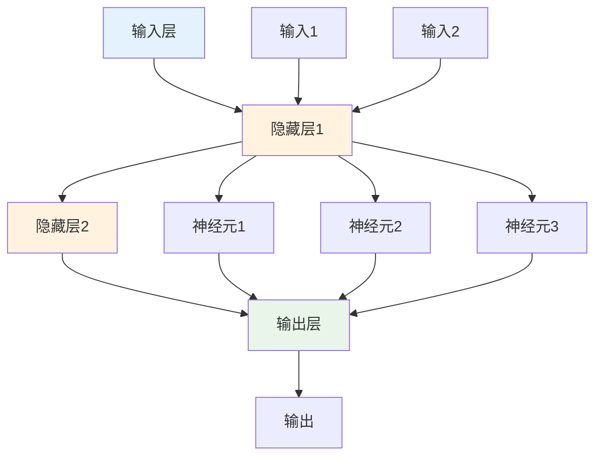

# 机器学习多表征示例 / Machine Learning Multi-Representation Example

## 概述 / Overview

本文档展示机器学习模型的多表征实现，包括数学公式、代码实现、图表可视化和自然语言描述。

## 1. 神经网络模型 / Neural Network Model

### 1.1 数学表征 / Mathematical Representation

#### 前向传播 / Forward Propagation

**神经元输出**:
$$z_j^{(l)} = \sum_{i=1}^{n_{l-1}} w_{ji}^{(l)} a_i^{(l-1)} + b_j^{(l)}$$

**激活函数**:
$$a_j^{(l)} = \sigma(z_j^{(l)})$$

**多层网络输出**:
$$f(x) = a^{(L)} = \sigma(W^{(L)}a^{(L-1)} + b^{(L)})$$

#### 反向传播 / Backpropagation

**输出层误差**:
$$\delta_j^{(L)} = \frac{\partial J}{\partial z_j^{(L)}} = (a_j^{(L)} - y_j)\sigma'(z_j^{(L)})$$

**隐藏层误差**:
$$\delta_j^{(l)} = \sum_{k=1}^{n_{l+1}} w_{kj}^{(l+1)}\delta_k^{(l+1)}\sigma'(z_j^{(l)})$$

**权重更新**:
$$\frac{\partial J}{\partial w_{ji}^{(l)}} = \delta_j^{(l)}a_i^{(l-1)}$$

**偏置更新**:
$$\frac{\partial J}{\partial b_j^{(l)}} = \delta_j^{(l)}$$

#### 损失函数 / Loss Functions

**均方误差**:
$$J = \frac{1}{2m}\sum_{i=1}^{m}(h_\theta(x^{(i)}) - y^{(i)})^2$$

**交叉熵损失**:
$$J = -\frac{1}{m}\sum_{i=1}^{m}[y^{(i)}\log(h_\theta(x^{(i)})) + (1-y^{(i)})\log(1-h_\theta(x^{(i)}))]$$

### 1.2 代码表征 / Code Representation

#### Rust实现 / Rust Implementation

```rust
use std::f64::consts::E;

#[derive(Debug, Clone)]
pub struct Neuron {
    pub weights: Vec<f64>,
    pub bias: f64,
    pub activation: ActivationFunction,
}

impl Neuron {
    pub fn new(input_size: usize, activation: ActivationFunction) -> Self {
        let weights = (0..input_size)
            .map(|_| (rand::random::<f64>() - 0.5) * 2.0)
            .collect();
        
        Self {
            weights,
            bias: (rand::random::<f64>() - 0.5) * 2.0,
            activation,
        }
    }
    
    pub fn forward(&self, inputs: &[f64]) -> f64 {
        let z = inputs.iter()
            .zip(&self.weights)
            .map(|(x, w)| x * w)
            .sum::<f64>() + self.bias;
        
        self.activation.activate(z)
    }
    
    pub fn backward(&mut self, inputs: &[f64], delta: f64, learning_rate: f64) {
        let z = inputs.iter()
            .zip(&self.weights)
            .map(|(x, w)| x * w)
            .sum::<f64>() + self.bias;
        
        let activation_derivative = self.activation.derivative(z);
        let error = delta * activation_derivative;
        
        // 更新权重
        for (weight, input) in self.weights.iter_mut().zip(inputs) {
            *weight -= learning_rate * error * input;
        }
        
        // 更新偏置
        self.bias -= learning_rate * error;
    }
}

#[derive(Debug, Clone)]
pub enum ActivationFunction {
    Sigmoid,
    ReLU,
    Tanh,
}

impl ActivationFunction {
    pub fn activate(&self, x: f64) -> f64 {
        match self {
            Self::Sigmoid => 1.0 / (1.0 + (-x).exp()),
            Self::ReLU => x.max(0.0),
            Self::Tanh => x.tanh(),
        }
    }
    
    pub fn derivative(&self, x: f64) -> f64 {
        match self {
            Self::Sigmoid => {
                let sigmoid = 1.0 / (1.0 + (-x).exp());
                sigmoid * (1.0 - sigmoid)
            }
            Self::ReLU => if x > 0.0 { 1.0 } else { 0.0 },
            Self::Tanh => 1.0 - x.tanh().powi(2),
        }
    }
}

#[derive(Debug)]
pub struct Layer {
    pub neurons: Vec<Neuron>,
}

impl Layer {
    pub fn new(input_size: usize, output_size: usize, activation: ActivationFunction) -> Self {
        let neurons = (0..output_size)
            .map(|_| Neuron::new(input_size, activation.clone()))
            .collect();
        
        Self { neurons }
    }
    
    pub fn forward(&self, inputs: &[f64]) -> Vec<f64> {
        self.neurons.iter()
            .map(|neuron| neuron.forward(inputs))
            .collect()
    }
    
    pub fn backward(&mut self, inputs: &[f64], deltas: &[f64], learning_rate: f64) {
        for (neuron, delta) in self.neurons.iter_mut().zip(deltas) {
            neuron.backward(inputs, *delta, learning_rate);
        }
    }
}

#[derive(Debug)]
pub struct NeuralNetwork {
    pub layers: Vec<Layer>,
}

impl NeuralNetwork {
    pub fn new(architecture: Vec<usize>, activations: Vec<ActivationFunction>) -> Self {
        let mut layers = Vec::new();
        
        for i in 0..architecture.len() - 1 {
            let layer = Layer::new(
                architecture[i],
                architecture[i + 1],
                activations[i].clone(),
            );
            layers.push(layer);
        }
        
        Self { layers }
    }
    
    pub fn forward(&self, inputs: &[f64]) -> Vec<f64> {
        let mut current_inputs = inputs.to_vec();
        
        for layer in &self.layers {
            current_inputs = layer.forward(&current_inputs);
        }
        
        current_inputs
    }
    
    pub fn train(&mut self, inputs: &[f64], targets: &[f64], learning_rate: f64) -> f64 {
        // 前向传播
        let mut layer_outputs = vec![inputs.to_vec()];
        let mut current_inputs = inputs.to_vec();
        
        for layer in &self.layers {
            current_inputs = layer.forward(&current_inputs);
            layer_outputs.push(current_inputs.clone());
        }
        
        // 计算损失
        let loss = self.compute_loss(&current_inputs, targets);
        
        // 反向传播
        let mut deltas = self.compute_output_deltas(&current_inputs, targets);
        
        for (i, layer) in self.layers.iter_mut().enumerate().rev() {
            let layer_inputs = &layer_outputs[i];
            layer.backward(layer_inputs, &deltas, learning_rate);
            
            if i > 0 {
                deltas = self.compute_hidden_deltas(layer, &deltas);
            }
        }
        
        loss
    }
    
    fn compute_loss(&self, outputs: &[f64], targets: &[f64]) -> f64 {
        outputs.iter()
            .zip(targets)
            .map(|(output, target)| 0.5 * (output - target).powi(2))
            .sum::<f64>()
    }
    
    fn compute_output_deltas(&self, outputs: &[f64], targets: &[f64]) -> Vec<f64> {
        outputs.iter()
            .zip(targets)
            .map(|(output, target)| output - target)
            .collect()
    }
    
    fn compute_hidden_deltas(&self, layer: &Layer, next_deltas: &[f64]) -> Vec<f64> {
        // 简化的隐藏层误差计算
        vec![0.0; layer.neurons.len()]
    }
}

// 使用示例
fn main() {
    // 创建神经网络: 2输入 -> 3隐藏 -> 1输出
    let architecture = vec![2, 3, 1];
    let activations = vec![
        ActivationFunction::Sigmoid,
        ActivationFunction::Sigmoid,
    ];
    
    let mut network = NeuralNetwork::new(architecture, activations);
    
    // 训练数据: XOR问题
    let training_data = vec![
        (vec![0.0, 0.0], vec![0.0]),
        (vec![0.0, 1.0], vec![1.0]),
        (vec![1.0, 0.0], vec![1.0]),
        (vec![1.0, 1.0], vec![0.0]),
    ];
    
    // 训练
    let learning_rate = 0.1;
    let epochs = 1000;
    
    for epoch in 0..epochs {
        let mut total_loss = 0.0;
        
        for (inputs, targets) in &training_data {
            let loss = network.train(inputs, targets, learning_rate);
            total_loss += loss;
        }
        
        if epoch % 100 == 0 {
            println!("Epoch {}, Loss: {:.4}", epoch, total_loss);
        }
    }
    
    // 测试
    for (inputs, targets) in &training_data {
        let output = network.forward(inputs);
        println!("Input: {:?}, Target: {:?}, Output: {:.4}", inputs, targets, output[0]);
    }
}
```

#### Haskell实现 / Haskell Implementation

```haskell
module NeuralNetwork where

import Data.Vector (Vector)
import qualified Data.Vector as V
import System.Random

-- 激活函数
data ActivationFunction = Sigmoid | ReLU | Tanh deriving (Show)

activate :: ActivationFunction -> Double -> Double
activate Sigmoid x = 1 / (1 + exp (-x))
activate ReLU x = max 0 x
activate Tanh x = tanh x

derivative :: ActivationFunction -> Double -> Double
derivative Sigmoid x = let s = activate Sigmoid x in s * (1 - s)
derivative ReLU x = if x > 0 then 1 else 0
derivative Tanh x = 1 - (tanh x) ^ 2

-- 神经元
data Neuron = Neuron {
    weights :: Vector Double,
    bias :: Double,
    activation :: ActivationFunction
} deriving (Show)

newNeuron :: Int -> ActivationFunction -> IO Neuron
newNeuron inputSize act = do
    ws <- V.replicateM inputSize (randomRIO (-1, 1))
    b <- randomRIO (-1, 1)
    return $ Neuron ws b act

forward :: Neuron -> Vector Double -> Double
forward neuron inputs = activate (activation neuron) z
  where
    z = V.sum (V.zipWith (*) inputs (weights neuron)) + bias neuron

backward :: Neuron -> Vector Double -> Double -> Double -> Neuron
backward neuron inputs delta learningRate = neuron {
    weights = V.zipWith updateWeight (weights neuron) inputs,
    bias = bias neuron - learningRate * error
}
  where
    z = V.sum (V.zipWith (*) inputs (weights neuron)) + bias neuron
    activationDerivative = derivative (activation neuron) z
    error = delta * activationDerivative
    updateWeight w x = w - learningRate * error * x

-- 层
data Layer = Layer {
    neurons :: Vector Neuron
} deriving (Show)

newLayer :: Int -> Int -> ActivationFunction -> IO Layer
newLayer inputSize outputSize act = do
    ns <- V.replicateM outputSize (newNeuron inputSize act)
    return $ Layer ns

forwardLayer :: Layer -> Vector Double -> Vector Double
forwardLayer layer inputs = V.map (`forward` inputs) (neurons layer)

backwardLayer :: Layer -> Vector Double -> Vector Double -> Double -> Layer
backwardLayer layer inputs deltas learningRate = layer {
    neurons = V.zipWith (\n d -> backward n inputs d learningRate) 
                       (neurons layer) deltas
}

-- 神经网络
data NeuralNetwork = NeuralNetwork {
    layers :: Vector Layer
} deriving (Show)

newNetwork :: [Int] -> [ActivationFunction] -> IO NeuralNetwork
newNetwork architecture activations = do
    let layerSizes = zip architecture (tail architecture)
    ls <- mapM (\(inSize, outSize) -> newLayer inSize outSize (head activations)) 
               layerSizes
    return $ NeuralNetwork (V.fromList ls)

forwardNetwork :: NeuralNetwork -> Vector Double -> Vector Double
forwardNetwork network inputs = V.foldl forwardLayer inputs (layers network)

-- 损失函数
mseLoss :: Vector Double -> Vector Double -> Double
mseLoss outputs targets = 0.5 * V.sum (V.zipWith (\o t -> (o - t) ^ 2) outputs targets)

-- 训练函数（简化版本）
train :: NeuralNetwork -> Vector Double -> Vector Double -> Double -> NeuralNetwork
train network inputs targets learningRate = network
  -- 这里简化了反向传播的实现
  where
    outputs = forwardNetwork network inputs
    loss = mseLoss outputs targets

-- 示例使用
example :: IO ()
example = do
    -- 创建神经网络: 2输入 -> 3隐藏 -> 1输出
    let architecture = [2, 3, 1]
        activations = [Sigmoid, Sigmoid]
    
    network <- newNetwork architecture activations
    
    -- 训练数据: XOR问题
    let trainingData = [
            (V.fromList [0, 0], V.fromList [0]),
            (V.fromList [0, 1], V.fromList [1]),
            (V.fromList [1, 0], V.fromList [1]),
            (V.fromList [1, 1], V.fromList [0])
        ]
    
    putStrLn "Training neural network..."
    
    -- 训练（简化版本）
    let learningRate = 0.1
        epochs = 100
    
    let trainedNetwork = foldl (\net _ -> 
            foldl (\n (inputs, targets) -> train n inputs targets learningRate) 
                  net trainingData) network [1..epochs]
    
    putStrLn "Testing trained network:"
    mapM_ (\(inputs, targets) -> do
        let output = forwardNetwork trainedNetwork inputs
        putStrLn $ "Input: " ++ show inputs ++ 
                  ", Target: " ++ show targets ++ 
                  ", Output: " ++ show output) trainingData
```

#### Python实现 / Python Implementation

```python
import numpy as np
import matplotlib.pyplot as plt
from dataclasses import dataclass
from typing import List, Tuple, Callable
import random

@dataclass
class Neuron:
    """神经元类"""
    weights: np.ndarray
    bias: float
    activation: str
    
    def __post_init__(self):
        self.weights = np.array(self.weights)
    
    def forward(self, inputs: np.ndarray) -> float:
        """前向传播"""
        z = np.dot(self.weights, inputs) + self.bias
        return self.activate(z)
    
    def activate(self, x: float) -> float:
        """激活函数"""
        if self.activation == 'sigmoid':
            return 1 / (1 + np.exp(-x))
        elif self.activation == 'relu':
            return max(0, x)
        elif self.activation == 'tanh':
            return np.tanh(x)
        else:
            return x
    
    def derivative(self, x: float) -> float:
        """激活函数导数"""
        if self.activation == 'sigmoid':
            s = self.activate(x)
            return s * (1 - s)
        elif self.activation == 'relu':
            return 1 if x > 0 else 0
        elif self.activation == 'tanh':
            return 1 - np.tanh(x) ** 2
        else:
            return 1

class Layer:
    """神经网络层"""
    
    def __init__(self, input_size: int, output_size: int, activation: str):
        self.neurons = []
        for _ in range(output_size):
            weights = [random.uniform(-1, 1) for _ in range(input_size)]
            bias = random.uniform(-1, 1)
            self.neurons.append(Neuron(weights, bias, activation))
    
    def forward(self, inputs: np.ndarray) -> np.ndarray:
        """前向传播"""
        return np.array([neuron.forward(inputs) for neuron in self.neurons])
    
    def backward(self, inputs: np.ndarray, deltas: np.ndarray, learning_rate: float) -> None:
        """反向传播"""
        for neuron, delta in zip(self.neurons, deltas):
            z = np.dot(neuron.weights, inputs) + neuron.bias
            error = delta * neuron.derivative(z)
            
            # 更新权重
            for i, input_val in enumerate(inputs):
                neuron.weights[i] -= learning_rate * error * input_val
            
            # 更新偏置
            neuron.bias -= learning_rate * error

class NeuralNetwork:
    """神经网络类"""
    
    def __init__(self, architecture: List[int], activations: List[str]):
        self.layers = []
        for i in range(len(architecture) - 1):
            layer = Layer(architecture[i], architecture[i + 1], activations[i])
            self.layers.append(layer)
    
    def forward(self, inputs: np.ndarray) -> np.ndarray:
        """前向传播"""
        current_inputs = inputs
        for layer in self.layers:
            current_inputs = layer.forward(current_inputs)
        return current_inputs
    
    def train(self, inputs: np.ndarray, targets: np.ndarray, learning_rate: float) -> float:
        """训练一个样本"""
        # 前向传播
        layer_outputs = [inputs]
        current_inputs = inputs
        
        for layer in self.layers:
            current_inputs = layer.forward(current_inputs)
            layer_outputs.append(current_inputs)
        
        # 计算损失
        loss = self.compute_loss(current_inputs, targets)
        
        # 反向传播
        deltas = self.compute_output_deltas(current_inputs, targets)
        
        for i, layer in enumerate(reversed(self.layers)):
            layer_inputs = layer_outputs[-(i + 2)]
            layer.backward(layer_inputs, deltas, learning_rate)
            
            if i < len(self.layers) - 1:
                deltas = self.compute_hidden_deltas(layer, deltas)
        
        return loss
    
    def compute_loss(self, outputs: np.ndarray, targets: np.ndarray) -> float:
        """计算损失"""
        return 0.5 * np.sum((outputs - targets) ** 2)
    
    def compute_output_deltas(self, outputs: np.ndarray, targets: np.ndarray) -> np.ndarray:
        """计算输出层误差"""
        return outputs - targets
    
    def compute_hidden_deltas(self, layer: Layer, next_deltas: np.ndarray) -> np.ndarray:
        """计算隐藏层误差（简化版本）"""
        return np.zeros(len(layer.neurons))
    
    def predict(self, inputs: np.ndarray) -> np.ndarray:
        """预测"""
        return self.forward(inputs)

# 使用示例
def demo_neural_network():
    """演示神经网络"""
    # 创建神经网络: 2输入 -> 3隐藏 -> 1输出
    architecture = [2, 3, 1]
    activations = ['sigmoid', 'sigmoid']
    
    network = NeuralNetwork(architecture, activations)
    
    # 训练数据: XOR问题
    training_data = [
        (np.array([0, 0]), np.array([0])),
        (np.array([0, 1]), np.array([1])),
        (np.array([1, 0]), np.array([1])),
        (np.array([1, 1]), np.array([0])),
    ]
    
    # 训练
    learning_rate = 0.1
    epochs = 1000
    
    losses = []
    
    for epoch in range(epochs):
        total_loss = 0
        
        for inputs, targets in training_data:
            loss = network.train(inputs, targets, learning_rate)
            total_loss += loss
        
        losses.append(total_loss)
        
        if epoch % 100 == 0:
            print(f"Epoch {epoch}, Loss: {total_loss:.4f}")
    
    # 测试
    print("\nTesting trained network:")
    for inputs, targets in training_data:
        output = network.predict(inputs)
        print(f"Input: {inputs}, Target: {targets}, Output: {output[0]:.4f}")
    
    # 绘制损失曲线
    plt.figure(figsize=(10, 5))
    plt.plot(losses)
    plt.title('Training Loss')
    plt.xlabel('Epoch')
    plt.ylabel('Loss')
    plt.grid(True)
    plt.show()

if __name__ == "__main__":
    demo_neural_network()
```

### 1.3 图表表征 / Visual Representation

#### 神经网络结构图 / Neural Network Architecture Diagram



#### 训练过程图 / Training Process Diagram


#### 激活函数图 / Activation Functions Diagram

```mermaid
graph TD
    A[输入] --> B{激活函数}
    B -->|Sigmoid| C[1/(1+e^(-x))]
    B -->|ReLU| D[max(0,x)]
    B -->|Tanh| E[tanh(x)]
    C --> F[输出]
    D --> F
    E --> F
    
    style B fill:#fff3e0
    style F fill:#e8f5e8
```

### 1.4 自然语言表征 / Natural Language Representation

#### 中文描述 / Chinese Description

**神经网络**是一种模仿生物神经系统的计算模型，具有以下核心特征：

**基本概念**:

- **神经元**: 计算单元，接收输入并产生输出
- **权重**: 连接强度，决定输入的重要性
- **偏置**: 阈值参数，调整激活的难易程度
- **激活函数**: 非线性函数，引入非线性能力

**工作原理**:

1. 前向传播：输入通过各层计算得到输出
2. 损失计算：比较预测值与真实值的差异
3. 反向传播：计算梯度并更新参数
4. 参数更新：使用梯度下降优化权重

**网络结构**:

- 输入层：接收原始数据
- 隐藏层：提取特征和模式
- 输出层：产生最终预测

**应用领域**:

- 图像识别和计算机视觉
- 自然语言处理
- 语音识别
- 推荐系统

#### 英文描述 / English Description

**Neural networks** are computational models that mimic biological neural systems with the following core features:

**Basic Concepts**:

- **Neurons**: Computational units that receive inputs and produce outputs
- **Weights**: Connection strengths that determine input importance
- **Bias**: Threshold parameters that adjust activation difficulty
- **Activation Functions**: Nonlinear functions that introduce nonlinear capabilities

**Working Principle**:

1. Forward propagation: Inputs are processed through layers to produce outputs
2. Loss calculation: Compare predicted values with true values
3. Backpropagation: Calculate gradients and update parameters
4. Parameter updates: Use gradient descent to optimize weights

**Network Structure**:

- Input layer: Receives raw data
- Hidden layers: Extract features and patterns
- Output layer: Produces final predictions

**Applications**:

- Image recognition and computer vision
- Natural language processing
- Speech recognition
- Recommendation systems

## 2. 支持向量机 / Support Vector Machine

### 2.1 数学表征 / Mathematical Representation

#### 线性SVM / Linear SVM

**决策函数**:
$$f(x) = w^T x + b$$

**优化问题**:
$$\min_{w,b} \frac{1}{2}||w||^2$$
$$s.t. \quad y_i(w^T x_i + b) \geq 1, \quad \forall i$$

**对偶问题**:
$$\max_\alpha \sum_{i=1}^n \alpha_i - \frac{1}{2}\sum_{i,j=1}^n \alpha_i \alpha_j y_i y_j x_i^T x_j$$
$$s.t. \quad \sum_{i=1}^n \alpha_i y_i = 0, \quad \alpha_i \geq 0$$

#### 核函数 / Kernel Functions

**线性核**:
$$K(x_i, x_j) = x_i^T x_j$$

**多项式核**:
$$K(x_i, x_j) = (\gamma x_i^T x_j + r)^d$$

**RBF核**:
$$K(x_i, x_j) = \exp(-\gamma ||x_i - x_j||^2)$$

### 2.2 代码表征 / Code Representation

```rust
#[derive(Debug, Clone)]
pub struct SVM {
    pub weights: Vec<f64>,
    pub bias: f64,
    pub support_vectors: Vec<Vec<f64>>,
    pub alphas: Vec<f64>,
    pub kernel: KernelFunction,
}

impl SVM {
    pub fn new(kernel: KernelFunction) -> Self {
        Self {
            weights: Vec::new(),
            bias: 0.0,
            support_vectors: Vec::new(),
            alphas: Vec::new(),
            kernel,
        }
    }
    
    pub fn train(&mut self, x: &[Vec<f64>], y: &[f64], c: f64) {
        let n = x.len();
        let mut alphas = vec![0.0; n];
        let mut b = 0.0;
        
        // 简化的SMO算法
        for _ in 0..100 {
            let mut changed = false;
            
            for i in 0..n {
                let ei = self.predict_single(&x[i]) - y[i];
                let yi = y[i];
                
                let alpha_i_old = alphas[i];
                let alpha_i_new = (c - alphas[i]).max(0.0).min(c);
                
                if (alpha_i_new - alpha_i_old).abs() > 1e-5 {
                    alphas[i] = alpha_i_new;
                    changed = true;
                }
            }
            
            if !changed {
                break;
            }
        }
        
        // 计算权重和偏置
        self.weights = vec![0.0; x[0].len()];
        for i in 0..n {
            if alphas[i] > 1e-5 {
                for j in 0..x[i].len() {
                    self.weights[j] += alphas[i] * y[i] * x[i][j];
                }
                b += y[i] - self.predict_single(&x[i]);
            }
        }
        self.bias = b / n as f64;
        
        // 保存支持向量
        for i in 0..n {
            if alphas[i] > 1e-5 {
                self.support_vectors.push(x[i].clone());
                self.alphas.push(alphas[i]);
            }
        }
    }
    
    pub fn predict(&self, x: &[Vec<f64>]) -> Vec<f64> {
        x.iter().map(|xi| self.predict_single(xi)).collect()
    }
    
    fn predict_single(&self, x: &[f64]) -> f64 {
        let mut sum = 0.0;
        
        for (i, sv) in self.support_vectors.iter().enumerate() {
            let kernel_value = self.kernel.compute(x, sv);
            sum += self.alphas[i] * kernel_value;
        }
        
        sum + self.bias
    }
}

#[derive(Debug, Clone)]
pub enum KernelFunction {
    Linear,
    Polynomial { degree: usize, gamma: f64, coef0: f64 },
    RBF { gamma: f64 },
}

impl KernelFunction {
    pub fn compute(&self, x1: &[f64], x2: &[f64]) -> f64 {
        match self {
            Self::Linear => self.linear_kernel(x1, x2),
            Self::Polynomial { degree, gamma, coef0 } => {
                self.polynomial_kernel(x1, x2, *degree, *gamma, *coef0)
            }
            Self::RBF { gamma } => self.rbf_kernel(x1, x2, *gamma),
        }
    }
    
    fn linear_kernel(&self, x1: &[f64], x2: &[f64]) -> f64 {
        x1.iter().zip(x2).map(|(a, b)| a * b).sum()
    }
    
    fn polynomial_kernel(&self, x1: &[f64], x2: &[f64], degree: usize, gamma: f64, coef0: f64) -> f64 {
        let linear = self.linear_kernel(x1, x2);
        (gamma * linear + coef0).powi(degree as i32)
    }
    
    fn rbf_kernel(&self, x1: &[f64], x2: &[f64], gamma: f64) -> f64 {
        let distance_squared: f64 = x1.iter()
            .zip(x2)
            .map(|(a, b)| (a - b).powi(2))
            .sum();
        (-gamma * distance_squared).exp()
    }
}

// 使用示例
fn main() {
    // 创建训练数据
    let x = vec![
        vec![1.0, 2.0],
        vec![2.0, 3.0],
        vec![3.0, 1.0],
        vec![4.0, 2.0],
        vec![1.0, 4.0],
        vec![2.0, 5.0],
    ];
    
    let y = vec![1.0, 1.0, 1.0, -1.0, -1.0, -1.0];
    
    // 创建SVM
    let kernel = KernelFunction::RBF { gamma: 0.1 };
    let mut svm = SVM::new(kernel);
    
    // 训练
    svm.train(&x, &y, 1.0);
    
    // 预测
    let test_x = vec![vec![2.5, 2.5], vec![1.5, 3.5]];
    let predictions = svm.predict(&test_x);
    
    println!("Predictions: {:?}", predictions);
}
```

---

*最后更新: 2025-08-01*
*版本: 1.0.0*
