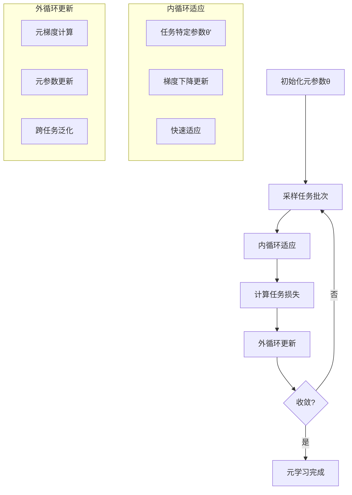

# 元学习扩展多表征示例 / Meta-Learning Extension Multi-Representation Examples

## 概述 / Overview

本文档提供了元学习扩展的完整多表征示例，包括模型无关元学习(MAML)、快速适应算法和少样本学习。每种方法都包含数学表示、可视化图表和完整的代码实现。

## 1. 模型无关元学习 / Model-Agnostic Meta-Learning (MAML)

### 1.1 MAML理论 / MAML Theory

#### 数学表示 / Mathematical Representation

MAML的核心思想是通过元学习来学习一个良好的初始化参数，使得模型能够快速适应新任务。

MAML Core Idea:

$$\theta' = \theta - \alpha \nabla_\theta \mathcal{L}_{\mathcal{T}_i}(\theta)$$

其中：

- $\theta$ 是元参数（初始化参数）
- $\theta'$ 是任务特定参数
- $\alpha$ 是内循环学习率
- $\mathcal{L}_{\mathcal{T}_i}$ 是任务$\mathcal{T}_i$的损失函数

where:

- $\theta$ is the meta-parameters (initialization parameters)
- $\theta'$ is the task-specific parameters
- $\alpha$ is the inner-loop learning rate
- $\mathcal{L}_{\mathcal{T}_i}$ is the loss function for task $\mathcal{T}_i$

元目标函数：

Meta-Objective Function:

$$\min_\theta \sum_{\mathcal{T}_i \sim p(\mathcal{T})} \mathcal{L}_{\mathcal{T}_i}(f_{\theta'_i})$$

其中：

- $p(\mathcal{T})$ 是任务分布
- $f_{\theta'_i}$ 是使用$\theta'_i$参数化的模型

where:

- $p(\mathcal{T})$ is the task distribution
- $f_{\theta'_i}$ is the model parameterized by $\theta'_i$

元参数更新：

Meta-Parameter Update:

$$\theta \leftarrow \theta - \beta \nabla_\theta \sum_{\mathcal{T}_i \sim p(\mathcal{T})} \mathcal{L}_{\mathcal{T}_i}(f_{\theta'_i})$$

其中：

- $\beta$ 是外循环学习率

where:

- $\beta$ is the outer-loop learning rate

#### 可视化表示 / Visual Representation



#### Python实现 / Python Implementation

```python
import torch
import torch.nn as nn
import torch.optim as optim
import torch.nn.functional as F
import numpy as np
import matplotlib.pyplot as plt
from typing import List, Dict, Tuple, Optional
import copy
import random

class Task:
    """元学习任务"""
    
    def __init__(self, num_classes: int = 5, num_samples: int = 10, 
                 input_dim: int = 10, noise_level: float = 0.1):
        self.num_classes = num_classes
        self.num_samples = num_samples
        self.input_dim = input_dim
        self.noise_level = noise_level
        self._generate_task()
    
    def _generate_task(self) -> None:
        """生成任务数据"""
        # 为每个类别生成一个中心点
        self.class_centers = torch.randn(self.num_classes, self.input_dim)
        
        # 生成数据点
        self.data = []
        self.labels = []
        
        for class_idx in range(self.num_classes):
            center = self.class_centers[class_idx]
            # 在中心点周围生成数据
            for _ in range(self.num_samples):
                point = center + torch.randn(self.input_dim) * self.noise_level
                self.data.append(point)
                self.labels.append(class_idx)
        
        self.data = torch.stack(self.data)
        self.labels = torch.tensor(self.labels)
    
    def get_support_set(self, num_shots: int) -> Tuple[torch.Tensor, torch.Tensor]:
        """获取支持集（训练数据）"""
        support_data = []
        support_labels = []
        
        for class_idx in range(self.num_classes):
            class_indices = (self.labels == class_idx).nonzero().squeeze()
            selected_indices = random.sample(class_indices.tolist(), num_shots)
            support_data.extend([self.data[i] for i in selected_indices])
            support_labels.extend([class_idx] * num_shots)
        
        return torch.stack(support_data), torch.tensor(support_labels)
    
    def get_query_set(self, num_query: int) -> Tuple[torch.Tensor, torch.Tensor]:
        """获取查询集（测试数据）"""
        query_data = []
        query_labels = []
        
        for class_idx in range(self.num_classes):
            class_indices = (self.labels == class_idx).nonzero().squeeze()
            selected_indices = random.sample(class_indices.tolist(), num_query)
            query_data.extend([self.data[i] for i in selected_indices])
            query_labels.extend([class_idx] * num_query)
        
        return torch.stack(query_data), torch.tensor(query_labels)

class MAMLModel(nn.Module):
    """MAML模型"""
    
    def __init__(self, input_dim: int = 10, hidden_dim: int = 64, num_classes: int = 5):
        super(MAMLModel, self).__init__()
        self.fc1 = nn.Linear(input_dim, hidden_dim)
        self.fc2 = nn.Linear(hidden_dim, hidden_dim)
        self.fc3 = nn.Linear(hidden_dim, num_classes)
    
    def forward(self, x: torch.Tensor) -> torch.Tensor:
        x = F.relu(self.fc1(x))
        x = F.relu(self.fc2(x))
        x = self.fc3(x)
        return x

class MAML:
    """模型无关元学习算法"""
    
    def __init__(self, model: MAMLModel, inner_lr: float = 0.01, 
                 outer_lr: float = 0.001, num_inner_steps: int = 5):
        self.model = model
        self.inner_lr = inner_lr
        self.outer_lr = outer_lr
        self.num_inner_steps = num_inner_steps
        self.meta_optimizer = optim.Adam(self.model.parameters(), lr=outer_lr)
    
    def inner_loop(self, task: Task, num_shots: int = 5) -> Tuple[MAMLModel, float]:
        """内循环：快速适应到特定任务"""
        # 获取支持集
        support_data, support_labels = task.get_support_set(num_shots)
        
        # 复制模型参数
        adapted_model = copy.deepcopy(self.model)
        inner_optimizer = optim.SGD(adapted_model.parameters(), lr=self.inner_lr)
        
        # 内循环训练
        for _ in range(self.num_inner_steps):
            outputs = adapted_model(support_data)
            loss = F.cross_entropy(outputs, support_labels)
            
            inner_optimizer.zero_grad()
            loss.backward()
            inner_optimizer.step()
        
        return adapted_model, loss.item()
    
    def outer_loop(self, tasks: List[Task], num_shots: int = 5, 
                   num_query: int = 5) -> float:
        """外循环：元参数更新"""
        meta_loss = 0.0
        
        for task in tasks:
            # 内循环适应
            adapted_model, _ = self.inner_loop(task, num_shots)
            
            # 获取查询集
            query_data, query_labels = task.get_query_set(num_query)
            
            # 计算元损失
            query_outputs = adapted_model(query_data)
            task_loss = F.cross_entropy(query_outputs, query_labels)
            meta_loss += task_loss
        
        meta_loss /= len(tasks)
        
        # 元参数更新
        self.meta_optimizer.zero_grad()
        meta_loss.backward()
        self.meta_optimizer.step()
        
        return meta_loss.item()
    
    def train(self, num_meta_epochs: int = 100, num_tasks_per_epoch: int = 8,
              num_shots: int = 5, num_query: int = 5) -> List[float]:
        """训练MAML模型"""
        meta_losses = []
        
        for epoch in range(num_meta_epochs):
            # 生成任务批次
            tasks = [Task() for _ in range(num_tasks_per_epoch)]
            
            # 外循环更新
            meta_loss = self.outer_loop(tasks, num_shots, num_query)
            meta_losses.append(meta_loss)
            
            if epoch % 10 == 0:
                print(f"Meta Epoch {epoch}: Meta Loss = {meta_loss:.4f}")
        
        return meta_losses
    
    def evaluate(self, test_tasks: List[Task], num_shots: int = 5, 
                num_query: int = 5) -> float:
        """评估MAML模型"""
        total_accuracy = 0.0
        
        for task in test_tasks:
            # 内循环适应
            adapted_model, _ = self.inner_loop(task, num_shots)
            
            # 获取查询集
            query_data, query_labels = task.get_query_set(num_query)
            
            # 预测
            with torch.no_grad():
                query_outputs = adapted_model(query_data)
                predictions = torch.argmax(query_outputs, dim=1)
                accuracy = (predictions == query_labels).float().mean()
                total_accuracy += accuracy.item()
        
        return total_accuracy / len(test_tasks)

def visualize_maml_training(meta_losses: List[float]) -> None:
    """可视化MAML训练过程"""
    plt.figure(figsize=(12, 4))
    
    # 元损失曲线
    plt.subplot(1, 2, 1)
    epochs = range(len(meta_losses))
    plt.plot(epochs, meta_losses, 'b-', linewidth=2)
    plt.title('MAML Meta-Loss During Training')
    plt.xlabel('Meta Epoch')
    plt.ylabel('Meta Loss')
    plt.grid(True, alpha=0.3)
    
    # 损失分布
    plt.subplot(1, 2, 2)
    plt.hist(meta_losses, bins=20, alpha=0.7, color='blue')
    plt.title('Meta-Loss Distribution')
    plt.xlabel('Meta Loss')
    plt.ylabel('Frequency')
    plt.grid(True, alpha=0.3)
    
    plt.tight_layout()
    plt.show()

# 测试MAML
if __name__ == "__main__":
    # 创建MAML模型
    model = MAMLModel(input_dim=10, hidden_dim=64, num_classes=5)
    maml = MAML(model, inner_lr=0.01, outer_lr=0.001, num_inner_steps=5)
    
    # 训练MAML
    meta_losses = maml.train(num_meta_epochs=100, num_tasks_per_epoch=8)
    
    # 可视化训练过程
    visualize_maml_training(meta_losses)
    
    # 评估模型
    test_tasks = [Task() for _ in range(20)]
    accuracy = maml.evaluate(test_tasks)
    print(f"Test Accuracy: {accuracy:.4f}")
```
