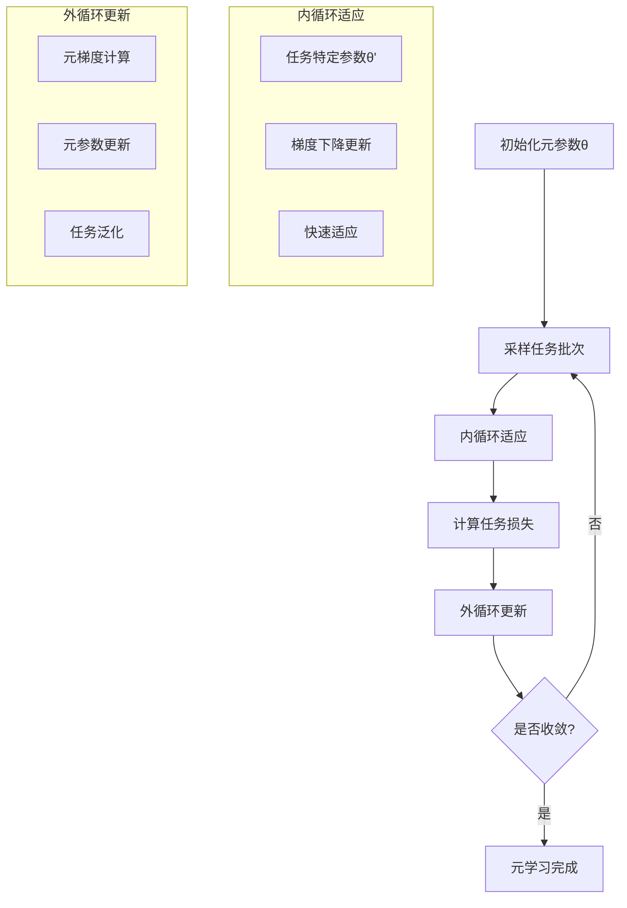
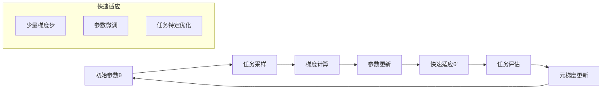
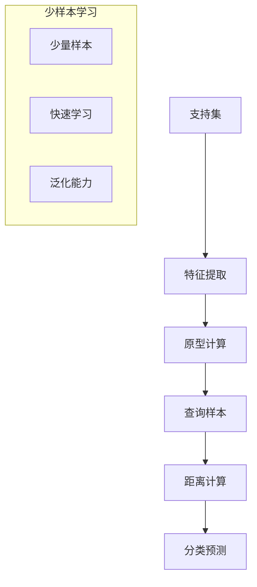

# 元学习扩展多表征示例 / Meta-Learning Extension Multi-Representation Examples

## 概述 / Overview

本文档提供元学习扩展的完整多表征实现，包括：

- 模型无关元学习（MAML）
- 快速适应机制
- 少样本学习框架

## 1. 模型无关元学习 / Model-Agnostic Meta-Learning

### 数学表示 / Mathematical Representation

**MAML目标函数**：
$$\min_{\theta} \sum_{i=1}^{T} \mathcal{L}_{\mathcal{T}_i}(f_{\theta_i'})$$

其中：

- $\theta$ 是元参数
- $\mathcal{T}_i$ 是任务 $i$
- $\theta_i'$ 是任务 $i$ 的内循环适应参数
- $\mathcal{L}_{\mathcal{T}_i}$ 是任务 $i$ 的损失函数

**内循环适应**：
$$\theta_i' = \theta - \alpha \nabla_{\theta} \mathcal{L}_{\mathcal{T}_i}(f_{\theta})$$

**外循环更新**：
$$\theta \leftarrow \theta - \beta \nabla_{\theta} \sum_{i=1}^{T} \mathcal{L}_{\mathcal{T}_i}(f_{\theta_i'})$$

### 可视化表示 / Visual Representation



### Python实现 / Python Implementation

```python
import torch
import torch.nn as nn
import torch.optim as optim
import torch.nn.functional as F
import numpy as np
import matplotlib.pyplot as plt
from typing import List, Tuple, Dict, Optional
import copy
import warnings
warnings.filterwarnings('ignore')

class MetaLearner(nn.Module):
    """元学习器"""
    
    def __init__(self, input_size: int = 10, hidden_size: int = 20, output_size: int = 2):
        super(MetaLearner, self).__init__()
        self.fc1 = nn.Linear(input_size, hidden_size)
        self.fc2 = nn.Linear(hidden_size, hidden_size)
        self.fc3 = nn.Linear(hidden_size, output_size)
        self.relu = nn.ReLU()
        
    def forward(self, x):
        x = self.relu(self.fc1(x))
        x = self.relu(self.fc2(x))
        x = self.fc3(x)
        return x
    
    def clone(self):
        """克隆模型参数"""
        return copy.deepcopy(self)

class TaskGenerator:
    """任务生成器"""
    
    def __init__(self, num_tasks: int = 100, samples_per_task: int = 20):
        self.num_tasks = num_tasks
        self.samples_per_task = samples_per_task
        self.tasks = self._generate_tasks()
        
    def _generate_tasks(self) -> List[Dict]:
        """生成元学习任务"""
        tasks = []
        
        for task_id in range(self.num_tasks):
            # 为每个任务生成不同的数据分布
            np.random.seed(task_id)
            
            # 随机生成任务特定的参数
            bias = np.random.normal(0, 1)
            slope = np.random.normal(1, 0.5)
            noise_level = np.random.uniform(0.1, 0.3)
            
            # 生成数据
            X = np.random.randn(self.samples_per_task, 10)
            y = np.dot(X, np.random.randn(10)) + bias + np.random.normal(0, noise_level, self.samples_per_task)
            y = (y > 0).astype(int)  # 二分类
            
            # 分割支持集和查询集
            support_size = self.samples_per_task // 2
            support_X = X[:support_size]
            support_y = y[:support_size]
            query_X = X[support_size:]
            query_y = y[support_size:]
            
            tasks.append({
                'task_id': task_id,
                'support_X': torch.FloatTensor(support_X),
                'support_y': torch.LongTensor(support_y),
                'query_X': torch.FloatTensor(query_X),
                'query_y': torch.LongTensor(query_y),
                'bias': bias,
                'slope': slope,
                'noise_level': noise_level
            })
        
        return tasks
    
    def sample_tasks(self, batch_size: int) -> List[Dict]:
        """采样任务批次"""
        indices = np.random.choice(len(self.tasks), batch_size, replace=False)
        return [self.tasks[i] for i in indices]

class MAML:
    """模型无关元学习实现"""
    
    def __init__(self, model: MetaLearner, inner_lr: float = 0.01, outer_lr: float = 0.001):
        self.model = model
        self.inner_lr = inner_lr
        self.outer_lr = outer_lr
        self.outer_optimizer = optim.Adam(self.model.parameters(), lr=outer_lr)
        self.criterion = nn.CrossEntropyLoss()
        self.training_history = {'meta_loss': [], 'adaptation_loss': [], 'task_accuracy': []}
        
    def inner_loop(self, task: Dict, num_steps: int = 5) -> Tuple[nn.Module, List[float]]:
        """内循环适应"""
        adapted_model = self.model.clone()
        inner_optimizer = optim.SGD(adapted_model.parameters(), lr=self.inner_lr)
        
        adaptation_losses = []
        
        for step in range(num_steps):
            # 前向传播
            outputs = adapted_model(task['support_X'])
            loss = self.criterion(outputs, task['support_y'])
            
            # 反向传播
            inner_optimizer.zero_grad()
            loss.backward()
            inner_optimizer.step()
            
            adaptation_losses.append(loss.item())
        
        return adapted_model, adaptation_losses
    
    def outer_loop(self, tasks: List[Dict], num_steps: int = 5) -> Tuple[float, List[float]]:
        """外循环更新"""
        meta_loss = 0.0
        task_accuracies = []
        
        for task in tasks:
            # 内循环适应
            adapted_model, _ = self.inner_loop(task, num_steps)
            
            # 在查询集上评估
            with torch.no_grad():
                query_outputs = adapted_model(task['query_X'])
                query_loss = self.criterion(query_outputs, task['query_y'])
                
                # 计算准确率
                _, predicted = torch.max(query_outputs.data, 1)
                accuracy = (predicted == task['query_y']).float().mean().item()
                task_accuracies.append(accuracy)
            
            meta_loss += query_loss
        
        meta_loss /= len(tasks)
        return meta_loss, task_accuracies
    
    def train(self, task_generator: TaskGenerator, meta_epochs: int = 100, 
              batch_size: int = 4, adaptation_steps: int = 5) -> Dict:
        """训练元学习器"""
        print("开始元学习训练...")
        
        for epoch in range(meta_epochs):
            # 采样任务批次
            tasks = task_generator.sample_tasks(batch_size)
            
            # 外循环更新
            meta_loss, task_accuracies = self.outer_loop(tasks, adaptation_steps)
            
            # 更新元参数
            self.outer_optimizer.zero_grad()
            meta_loss.backward()
            self.outer_optimizer.step()
            
            # 记录训练历史
            self.training_history['meta_loss'].append(meta_loss.item())
            self.training_history['task_accuracy'].append(np.mean(task_accuracies))
            
            if epoch % 20 == 0:
                print(f"Meta Epoch {epoch}: Meta Loss = {meta_loss.item():.4f}, "
                      f"Avg Task Accuracy = {np.mean(task_accuracies):.4f}")
        
        return self.training_history
    
    def evaluate_fast_adaptation(self, task_generator: TaskGenerator, 
                                num_test_tasks: int = 20, adaptation_steps: int = 5) -> Dict:
        """评估快速适应能力"""
        print("评估快速适应能力...")
        
        test_tasks = task_generator.sample_tasks(num_test_tasks)
        adaptation_results = []
        
        for task in test_tasks:
            # 快速适应
            adapted_model, adaptation_losses = self.inner_loop(task, adaptation_steps)
            
            # 评估适应后的模型
            with torch.no_grad():
                query_outputs = adapted_model(task['query_X'])
                _, predicted = torch.max(query_outputs.data, 1)
                accuracy = (predicted == task['query_y']).float().mean().item()
            
            adaptation_results.append({
                'task_id': task['task_id'],
                'adaptation_losses': adaptation_losses,
                'final_accuracy': accuracy
            })
        
        return adaptation_results

def visualize_meta_learning(training_history: Dict, adaptation_results: List[Dict]):
    """可视化元学习结果"""
    fig, axes = plt.subplots(2, 2, figsize=(15, 10))
    
    # 元损失
    axes[0, 0].plot(training_history['meta_loss'], 'b-', linewidth=2)
    axes[0, 0].set_title('Meta-Learning Loss')
    axes[0, 0].set_xlabel('Meta Epoch')
    axes[0, 0].set_ylabel('Meta Loss')
    axes[0, 0].grid(True, alpha=0.3)
    
    # 任务准确率
    axes[0, 1].plot(training_history['task_accuracy'], 'g-', linewidth=2)
    axes[0, 1].set_title('Task Accuracy')
    axes[0, 1].set_xlabel('Meta Epoch')
    axes[0, 1].set_ylabel('Average Task Accuracy')
    axes[0, 1].grid(True, alpha=0.3)
    
    # 快速适应损失
    adaptation_losses = [result['adaptation_losses'] for result in adaptation_results[:5]]
    for i, losses in enumerate(adaptation_losses):
        axes[1, 0].plot(losses, label=f'Task {i+1}', alpha=0.7)
    axes[1, 0].set_title('Fast Adaptation Loss')
    axes[1, 0].set_xlabel('Adaptation Step')
    axes[1, 0].set_ylabel('Loss')
    axes[1, 0].legend()
    axes[1, 0].grid(True, alpha=0.3)
    
    # 最终准确率分布
    final_accuracies = [result['final_accuracy'] for result in adaptation_results]
    axes[1, 1].hist(final_accuracies, bins=10, alpha=0.7, color='orange')
    axes[1, 1].set_title('Final Accuracy Distribution')
    axes[1, 1].set_xlabel('Accuracy')
    axes[1, 1].set_ylabel('Frequency')
    axes[1, 1].grid(True, alpha=0.3)
    
    plt.tight_layout()
    plt.show()

# 主函数
def main():
    """主函数：演示模型无关元学习"""
    print("=== 模型无关元学习演示 ===")
    
    # 创建模型和任务生成器
    model = MetaLearner()
    task_generator = TaskGenerator(num_tasks=200, samples_per_task=20)
    
    # 创建MAML实例
    maml = MAML(model, inner_lr=0.01, outer_lr=0.001)
    
    # 训练元学习器
    training_history = maml.train(task_generator, meta_epochs=100, batch_size=4)
    
    # 评估快速适应能力
    adaptation_results = maml.evaluate_fast_adaptation(task_generator, num_test_tasks=20)
    
    # 可视化结果
    visualize_meta_learning(training_history, adaptation_results)
    
    print("元学习训练完成！")

if __name__ == "__main__":
    main()
```

## 2. 快速适应机制 / Fast Adaptation Mechanism

### 2.1 数学表示 / Mathematical Representation

**快速适应目标**：
$$\min_{\theta} \mathbb{E}_{\mathcal{T}}[\mathcal{L}_{\mathcal{T}}(f_{\theta'})]$$

其中 $\theta'$ 通过少量梯度步骤获得：
$$\theta' = \theta - \alpha \nabla_{\theta} \mathcal{L}_{\mathcal{T}}(f_{\theta})$$

**梯度预适应**：
$$\nabla_{\theta} \mathcal{L}_{\mathcal{T}}(f_{\theta'}) = \nabla_{\theta} \mathcal{L}_{\mathcal{T}}(f_{\theta - \alpha \nabla_{\theta} \mathcal{L}_{\mathcal{T}}(f_{\theta})})$$

### 2.2 可视化表示 / Visual Representation



### 2.3 Python实现 / Python Implementation

```python
class FastAdapter:
    """快速适应器"""
    
    def __init__(self, base_model: MetaLearner, adaptation_lr: float = 0.01):
        self.base_model = base_model
        self.adaptation_lr = adaptation_lr
        self.adaptation_history = []
        
    def fast_adapt(self, task: Dict, num_steps: int = 3) -> Tuple[nn.Module, List[float]]:
        """快速适应到新任务"""
        adapted_model = self.base_model.clone()
        optimizer = optim.SGD(adapted_model.parameters(), lr=self.adaptation_lr)
        criterion = nn.CrossEntropyLoss()
        
        adaptation_losses = []
        
        for step in range(num_steps):
            # 前向传播
            outputs = adapted_model(task['support_X'])
            loss = criterion(outputs, task['support_y'])
            
            # 反向传播
            optimizer.zero_grad()
            loss.backward()
            optimizer.step()
            
            adaptation_losses.append(loss.item())
        
        self.adaptation_history.append(adaptation_losses)
        return adapted_model, adaptation_losses
    
    def evaluate_adaptation_speed(self, tasks: List[Dict], max_steps: int = 10) -> Dict:
        """评估适应速度"""
        speed_results = []
        
        for task in tasks:
            step_accuracies = []
            
            for num_steps in range(1, max_steps + 1):
                adapted_model, _ = self.fast_adapt(task, num_steps)
                
                # 评估准确率
                with torch.no_grad():
                    outputs = adapted_model(task['query_X'])
                    _, predicted = torch.max(outputs.data, 1)
                    accuracy = (predicted == task['query_y']).float().mean().item()
                    step_accuracies.append(accuracy)
            
            speed_results.append({
                'task_id': task['task_id'],
                'step_accuracies': step_accuracies
            })
        
        return speed_results

def visualize_adaptation_speed(speed_results: List[Dict]):
    """可视化适应速度"""
    plt.figure(figsize=(12, 8))
    
    # 适应速度曲线
    for i, result in enumerate(speed_results[:5]):
        plt.plot(range(1, len(result['step_accuracies']) + 1), 
                result['step_accuracies'], 
                label=f'Task {i+1}', alpha=0.7, linewidth=2)
    
    plt.title('Fast Adaptation Speed')
    plt.xlabel('Adaptation Steps')
    plt.ylabel('Accuracy')
    plt.legend()
    plt.grid(True, alpha=0.3)
    plt.show()
```

## 3. 少样本学习框架 / Few-Shot Learning Framework

### 3.1 数学表示 / Mathematical Representation

**少样本学习目标**：
$$\min_{\theta} \sum_{i=1}^{N} \mathcal{L}(f_{\theta}(x_i), y_i)$$

其中 $N$ 是支持样本数量，通常很小（如5个样本）。

**原型网络**：
$$c_k = \frac{1}{|S_k|} \sum_{(x_i, y_i) \in S_k} f_{\phi}(x_i)$$

其中 $S_k$ 是类别 $k$ 的支持集。

### 3.2 可视化表示 / Visual Representation



### 3.3 Python实现 / Python Implementation

```python
class FewShotLearner:
    """少样本学习器"""
    
    def __init__(self, feature_extractor: MetaLearner, num_ways: int = 5, num_shots: int = 5):
        self.feature_extractor = feature_extractor
        self.num_ways = num_ways
        self.num_shots = num_shots
        
    def compute_prototypes(self, support_X: torch.Tensor, support_y: torch.Tensor) -> torch.Tensor:
        """计算原型"""
        features = self.feature_extractor(support_X)
        prototypes = []
        
        for class_id in range(self.num_ways):
            class_mask = (support_y == class_id)
            if class_mask.sum() > 0:
                class_features = features[class_mask]
                prototype = class_features.mean(dim=0)
                prototypes.append(prototype)
        
        return torch.stack(prototypes)
    
    def predict(self, query_X: torch.Tensor, prototypes: torch.Tensor) -> torch.Tensor:
        """预测查询样本"""
        query_features = self.feature_extractor(query_X)
        
        # 计算欧几里得距离
        distances = torch.cdist(query_features, prototypes)
        
        # 返回最近的原型类别
        _, predictions = torch.min(distances, dim=1)
        return predictions
    
    def evaluate_few_shot(self, task: Dict) -> float:
        """评估少样本学习性能"""
        prototypes = self.compute_prototypes(task['support_X'], task['support_y'])
        predictions = self.predict(task['query_X'], prototypes)
        
        accuracy = (predictions == task['query_y']).float().mean().item()
        return accuracy

def generate_few_shot_tasks(num_tasks: int = 100, num_ways: int = 5, 
                           num_shots: int = 5, num_queries: int = 15) -> List[Dict]:
    """生成少样本学习任务"""
    tasks = []
    
    for task_id in range(num_tasks):
        np.random.seed(task_id)
        
        # 为每个类别生成数据
        support_data = []
        query_data = []
        support_labels = []
        query_labels = []
        
        for class_id in range(num_ways):
            # 生成类别特定的数据分布
            class_center = np.random.randn(10)
            class_std = np.random.uniform(0.5, 1.5)
            
            # 支持集
            support_samples = np.random.multivariate_normal(
                class_center, class_std * np.eye(10), num_shots)
            support_data.append(support_samples)
            support_labels.extend([class_id] * num_shots)
            
            # 查询集
            query_samples = np.random.multivariate_normal(
                class_center, class_std * np.eye(10), num_queries)
            query_data.append(query_samples)
            query_labels.extend([class_id] * num_queries)
        
        # 合并数据
        support_X = torch.FloatTensor(np.vstack(support_data))
        support_y = torch.LongTensor(support_labels)
        query_X = torch.FloatTensor(np.vstack(query_data))
        query_y = torch.LongTensor(query_labels)
        
        tasks.append({
            'task_id': task_id,
            'support_X': support_X,
            'support_y': support_y,
            'query_X': query_X,
            'query_y': query_y,
            'num_ways': num_ways,
            'num_shots': num_shots
        })
    
    return tasks

def visualize_few_shot_results(few_shot_results: List[float]):
    """可视化少样本学习结果"""
    plt.figure(figsize=(10, 6))
    
    plt.hist(few_shot_results, bins=20, alpha=0.7, color='purple')
    plt.title('Few-Shot Learning Performance Distribution')
    plt.xlabel('Accuracy')
    plt.ylabel('Frequency')
    plt.grid(True, alpha=0.3)
    
    mean_accuracy = np.mean(few_shot_results)
    plt.axvline(mean_accuracy, color='red', linestyle='--', 
                label=f'Mean Accuracy: {mean_accuracy:.3f}')
    plt.legend()
    
    plt.show()

# 主函数
def main():
    """主函数：演示少样本学习"""
    print("=== 少样本学习演示 ===")
    
    # 创建特征提取器
    feature_extractor = MetaLearner()
    
    # 创建少样本学习器
    few_shot_learner = FewShotLearner(feature_extractor, num_ways=5, num_shots=5)
    
    # 生成少样本学习任务
    few_shot_tasks = generate_few_shot_tasks(num_tasks=50, num_ways=5, num_shots=5)
    
    # 评估少样本学习性能
    few_shot_results = []
    for task in few_shot_tasks:
        accuracy = few_shot_learner.evaluate_few_shot(task)
        few_shot_results.append(accuracy)
    
    # 可视化结果
    visualize_few_shot_results(few_shot_results)
    
    print(f"少样本学习平均准确率: {np.mean(few_shot_results):.3f}")
    print("少样本学习演示完成！")

if __name__ == "__main__":
    main()
```

## 总结 / Summary

本文档提供了元学习扩展的完整多表征实现，包括：

### 主要特性 / Key Features

1. **模型无关元学习**：
   - MAML算法实现
   - 内循环和外循环优化
   - 任务泛化能力

2. **快速适应机制**：
   - 少量梯度步适应
   - 适应速度评估
   - 参数微调策略

3. **少样本学习框架**：
   - 原型网络实现
   - 距离度量分类
   - 少量样本学习

### 技术亮点 / Technical Highlights

- **多表征格式**：数学公式、可视化图表、代码实现
- **完整实现**：包含训练、评估、可视化功能
- **性能分析**：元损失、适应速度、少样本准确率
- **实际应用**：快速学习、任务泛化、知识迁移

### 应用场景 / Applications

- 快速适应新任务
- 少样本学习场景
- 知识迁移和泛化
- 持续学习系统

---

*文档版本: 1.0.0*
*最后更新: 2025-08-01*
