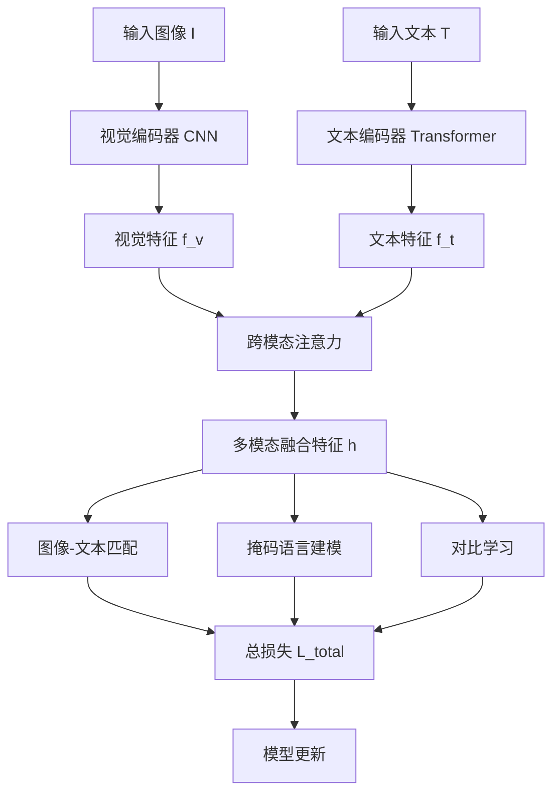
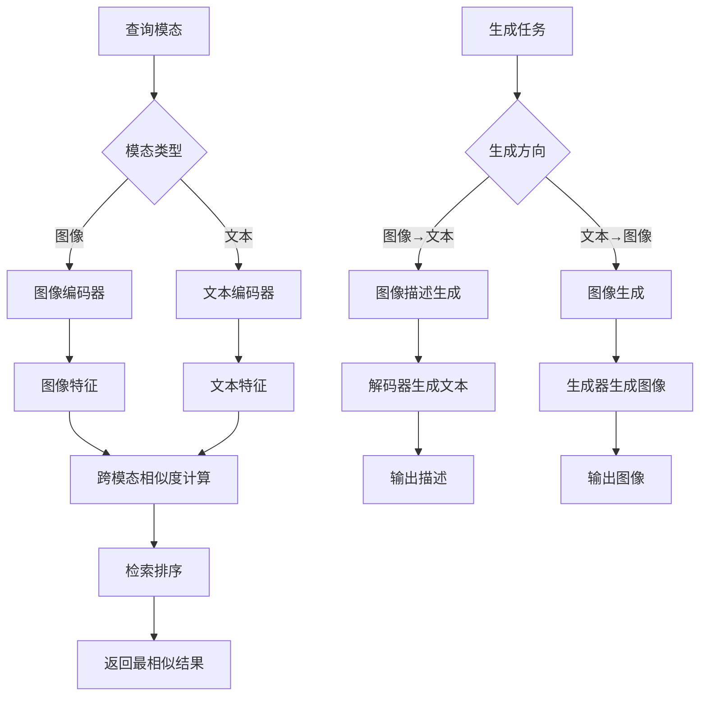
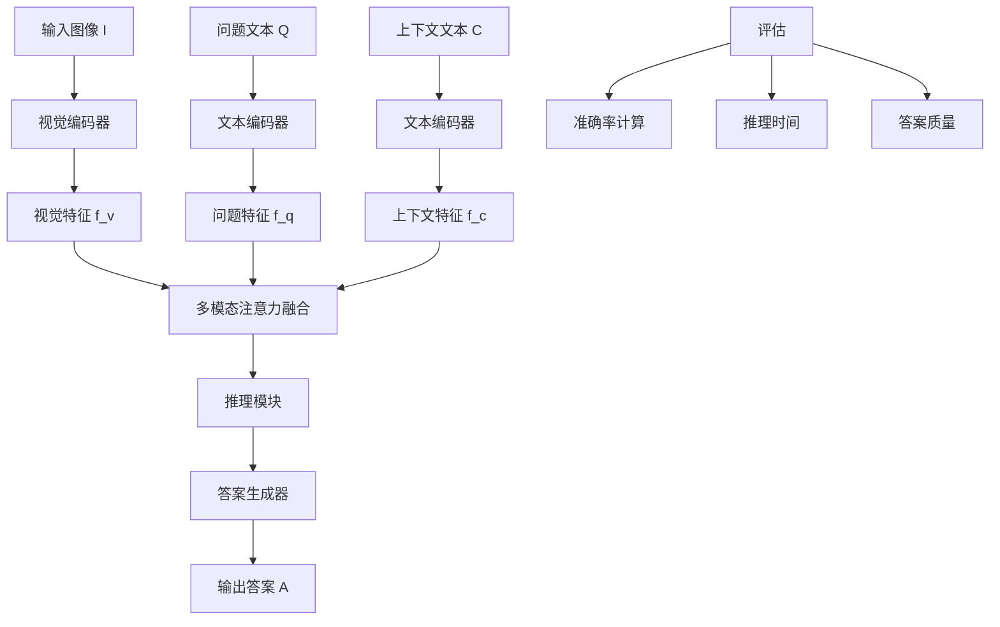

# 多模态学习扩展多表征示例 / Multimodal Learning Extension Multi-Representation Examples

## 概述 / Overview

多模态学习扩展涵盖了视觉-语言预训练模型、跨模态检索和生成、多模态推理和问答等关键技术，为处理多种数据模态提供了统一的框架。

## 1. 视觉-语言预训练模型 / Vision-Language Pre-training Models

### 1.1 数学表示 / Mathematical Representation

#### 1.1.1 多模态编码器 / Multimodal Encoder

**视觉编码器**：
$$f_v(I) = \text{CNN}(I) \in \mathbb{R}^{d_v}$$

**文本编码器**：
$$f_t(T) = \text{Transformer}(T) \in \mathbb{R}^{d_t}$$

**多模态融合**：
$$h = \text{CrossAttention}(f_v(I), f_t(T)) \in \mathbb{R}^{d_h}$$

#### 1.1.2 预训练目标 / Pre-training Objectives

**图像-文本匹配损失**：
$$L_{ITM} = -\sum_{i=1}^{N} y_i \log p(y_i|I_i, T_i)$$

**掩码语言建模损失**：
$$L_{MLM} = -\sum_{j=1}^{M} \log p(w_j|I, T_{\backslash j})$$

**图像-文本对比学习损失**：
$$L_{ITC} = -\log \frac{\exp(sim(I, T^+) / \tau)}{\sum_{j=1}^{B} \exp(sim(I, T_j) / \tau)}$$

**总损失**：
$$L_{total} = L_{ITM} + L_{MLM} + L_{ITC}$$

### 1.2 流程图 / Flowchart



### 1.3 Python实现 / Python Implementation

```python
import torch
import torch.nn as nn
import torch.nn.functional as F
from transformers import BertModel, BertTokenizer
from PIL import Image
import numpy as np
from typing import Tuple, Optional

class VisionEncoder(nn.Module):
    """视觉编码器"""
    def __init__(self, input_dim: int = 3, hidden_dim: int = 768):
        super().__init__()
        self.conv1 = nn.Conv2d(input_dim, 64, kernel_size=7, stride=2, padding=3)
        self.bn1 = nn.BatchNorm2d(64)
        self.conv2 = nn.Conv2d(64, 128, kernel_size=3, stride=2, padding=1)
        self.bn2 = nn.BatchNorm2d(128)
        self.conv3 = nn.Conv2d(128, 256, kernel_size=3, stride=2, padding=1)
        self.bn3 = nn.BatchNorm2d(256)
        self.conv4 = nn.Conv2d(256, hidden_dim, kernel_size=3, stride=2, padding=1)
        self.bn4 = nn.BatchNorm2d(hidden_dim)
        self.pool = nn.AdaptiveAvgPool2d((1, 1))
        self.fc = nn.Linear(hidden_dim, hidden_dim)
        
    def forward(self, x: torch.Tensor) -> torch.Tensor:
        x = F.relu(self.bn1(self.conv1(x)))
        x = F.relu(self.bn2(self.conv2(x)))
        x = F.relu(self.bn3(self.conv3(x)))
        x = F.relu(self.bn4(self.conv4(x)))
        x = self.pool(x).squeeze(-1).squeeze(-1)
        x = self.fc(x)
        return x

class TextEncoder(nn.Module):
    """文本编码器"""
    def __init__(self, vocab_size: int = 30522, hidden_dim: int = 768):
        super().__init__()
        self.embedding = nn.Embedding(vocab_size, hidden_dim)
        self.transformer = nn.TransformerEncoder(
            nn.TransformerEncoderLayer(d_model=hidden_dim, nhead=12),
            num_layers=6
        )
        self.fc = nn.Linear(hidden_dim, hidden_dim)
        
    def forward(self, x: torch.Tensor, mask: Optional[torch.Tensor] = None) -> torch.Tensor:
        x = self.embedding(x)
        x = x.transpose(0, 1)  # (seq_len, batch_size, hidden_dim)
        x = self.transformer(x, src_key_padding_mask=mask)
        x = x.transpose(0, 1)  # (batch_size, seq_len, hidden_dim)
        x = self.fc(x)
        return x

class CrossModalAttention(nn.Module):
    """跨模态注意力"""
    def __init__(self, hidden_dim: int = 768):
        super().__init__()
        self.attention = nn.MultiheadAttention(hidden_dim, num_heads=12)
        self.norm = nn.LayerNorm(hidden_dim)
        
    def forward(self, vision_feat: torch.Tensor, text_feat: torch.Tensor) -> torch.Tensor:
        # vision_feat: (batch_size, hidden_dim)
        # text_feat: (batch_size, seq_len, hidden_dim)
        
        # 扩展视觉特征以匹配文本序列长度
        vision_feat = vision_feat.unsqueeze(1)  # (batch_size, 1, hidden_dim)
        
        # 跨模态注意力
        attended_feat, _ = self.attention(
            query=vision_feat,
            key=text_feat,
            value=text_feat
        )
        
        # 残差连接和层归一化
        output = self.norm(vision_feat + attended_feat)
        return output.squeeze(1)  # (batch_size, hidden_dim)

class VisionLanguageModel(nn.Module):
    """视觉-语言预训练模型"""
    def __init__(self, vocab_size: int = 30522, hidden_dim: int = 768):
        super().__init__()
        self.vision_encoder = VisionEncoder(hidden_dim=hidden_dim)
        self.text_encoder = TextEncoder(vocab_size, hidden_dim)
        self.cross_attention = CrossModalAttention(hidden_dim)
        
        # 预训练任务头
        self.itm_head = nn.Linear(hidden_dim, 2)  # 图像-文本匹配
        self.mlm_head = nn.Linear(hidden_dim, vocab_size)  # 掩码语言建模
        
    def forward(self, images: torch.Tensor, text_ids: torch.Tensor, 
                text_mask: Optional[torch.Tensor] = None) -> dict:
        # 编码
        vision_feat = self.vision_encoder(images)
        text_feat = self.text_encoder(text_ids, text_mask)
        
        # 跨模态融合
        multimodal_feat = self.cross_attention(vision_feat, text_feat)
        
        # 预训练任务输出
        itm_logits = self.itm_head(multimodal_feat)
        mlm_logits = self.mlm_head(text_feat)
        
        return {
            'itm_logits': itm_logits,
            'mlm_logits': mlm_logits,
            'vision_feat': vision_feat,
            'text_feat': text_feat,
            'multimodal_feat': multimodal_feat
        }

def compute_itc_loss(vision_feat: torch.Tensor, text_feat: torch.Tensor, 
                    temperature: float = 0.07) -> torch.Tensor:
    """计算图像-文本对比学习损失"""
    # 归一化特征
    vision_feat = F.normalize(vision_feat, dim=-1)
    text_feat = F.normalize(text_feat.mean(dim=1), dim=-1)  # 平均池化文本特征
    
    # 计算相似度矩阵
    sim_matrix = torch.matmul(vision_feat, text_feat.T) / temperature
    
    # 对比学习损失
    labels = torch.arange(vision_feat.size(0)).to(vision_feat.device)
    loss_i2t = F.cross_entropy(sim_matrix, labels)
    loss_t2i = F.cross_entropy(sim_matrix.T, labels)
    
    return (loss_i2t + loss_t2i) / 2

def create_synthetic_data(batch_size: int = 4, seq_len: int = 32, 
                         vocab_size: int = 30522) -> Tuple[torch.Tensor, torch.Tensor, torch.Tensor]:
    """创建合成数据"""
    # 合成图像数据
    images = torch.randn(batch_size, 3, 224, 224)
    
    # 合成文本数据
    text_ids = torch.randint(0, vocab_size, (batch_size, seq_len))
    text_mask = torch.ones(batch_size, seq_len)
    
    return images, text_ids, text_mask

def train_vl_model_example():
    """训练视觉-语言模型示例"""
    device = torch.device('cuda' if torch.cuda.is_available() else 'cpu')
    
    # 创建模型
    model = VisionLanguageModel().to(device)
    optimizer = torch.optim.AdamW(model.parameters(), lr=1e-4)
    
    # 创建合成数据
    images, text_ids, text_mask = create_synthetic_data()
    images, text_ids, text_mask = images.to(device), text_ids.to(device), text_mask.to(device)
    
    # 前向传播
    outputs = model(images, text_ids, text_mask)
    
    # 计算损失
    itm_loss = F.cross_entropy(outputs['itm_logits'], torch.zeros(images.size(0)).long().to(device))
    mlm_loss = F.cross_entropy(outputs['mlm_logits'].view(-1, outputs['mlm_logits'].size(-1)), 
                              text_ids.view(-1))
    itc_loss = compute_itc_loss(outputs['vision_feat'], outputs['text_feat'])
    
    total_loss = itm_loss + mlm_loss + itc_loss
    
    # 反向传播
    optimizer.zero_grad()
    total_loss.backward()
    optimizer.step()
    
    print(f"ITM Loss: {itm_loss.item():.4f}")
    print(f"MLM Loss: {mlm_loss.item():.4f}")
    print(f"ITC Loss: {itc_loss.item():.4f}")
    print(f"Total Loss: {total_loss.item():.4f}")

if __name__ == "__main__":
    train_vl_model_example()
```

## 2. 跨模态检索和生成 / Cross-modal Retrieval and Generation

### 2.1 数学表示 / Mathematical Representation

#### 2.1.1 跨模态检索 / Cross-modal Retrieval

**相似度计算**：
$$s(I, T) = \cos(f_v(I), f_t(T)) = \frac{f_v(I) \cdot f_t(T)}{\|f_v(I)\| \cdot \|f_t(T)\|}$$

**检索损失**：
$$L_{retrieval} = -\sum_{i=1}^{N} \log \frac{\exp(s(I_i, T_i^+) / \tau)}{\sum_{j=1}^{K} \exp(s(I_i, T_j) / \tau)}$$

#### 2.1.2 跨模态生成 / Cross-modal Generation

**图像到文本生成**：
$$p(T|I) = \prod_{t=1}^{L} p(w_t|I, w_{<t})$$

**文本到图像生成**：
$$p(I|T) = \int p(I|z, T) p(z|T) dz$$

**生成损失**：
$$L_{gen} = -\log p(T|I) - \log p(I|T)$$

### 2.2 流程图 / Flowchart



### 2.3 Python实现 / Python Implementation

```python
import torch
import torch.nn as nn
import torch.nn.functional as F
from typing import List, Tuple, Optional
import numpy as np

class CrossModalRetrieval(nn.Module):
    """跨模态检索模型"""
    def __init__(self, vision_dim: int = 768, text_dim: int = 768, 
                 projection_dim: int = 512):
        super().__init__()
        self.vision_projection = nn.Linear(vision_dim, projection_dim)
        self.text_projection = nn.Linear(text_dim, projection_dim)
        self.temperature = nn.Parameter(torch.ones([]) * 0.07)
        
    def forward(self, vision_feat: torch.Tensor, text_feat: torch.Tensor) -> torch.Tensor:
        # 投影到共同空间
        vision_proj = F.normalize(self.vision_projection(vision_feat), dim=-1)
        text_proj = F.normalize(self.text_projection(text_feat), dim=-1)
        
        # 计算相似度矩阵
        sim_matrix = torch.matmul(vision_proj, text_proj.T) / self.temperature
        return sim_matrix
    
    def compute_retrieval_loss(self, sim_matrix: torch.Tensor) -> torch.Tensor:
        """计算检索损失"""
        labels = torch.arange(sim_matrix.size(0)).to(sim_matrix.device)
        loss_i2t = F.cross_entropy(sim_matrix, labels)
        loss_t2i = F.cross_entropy(sim_matrix.T, labels)
        return (loss_i2t + loss_t2i) / 2

class ImageToTextGenerator(nn.Module):
    """图像到文本生成器"""
    def __init__(self, vision_dim: int = 768, vocab_size: int = 30522, 
                 hidden_dim: int = 512, max_length: int = 50):
        super().__init__()
        self.vision_projection = nn.Linear(vision_dim, hidden_dim)
        self.embedding = nn.Embedding(vocab_size, hidden_dim)
        self.lstm = nn.LSTM(hidden_dim, hidden_dim, num_layers=2, batch_first=True)
        self.output_layer = nn.Linear(hidden_dim, vocab_size)
        self.max_length = max_length
        
    def forward(self, vision_feat: torch.Tensor, text_ids: Optional[torch.Tensor] = None) -> torch.Tensor:
        batch_size = vision_feat.size(0)
        
        # 投影视觉特征
        vision_proj = self.vision_projection(vision_feat).unsqueeze(1)
        
        if text_ids is not None:
            # 训练模式
            text_emb = self.embedding(text_ids)
            # 拼接视觉特征和文本嵌入
            inputs = torch.cat([vision_proj, text_emb], dim=1)
            lstm_out, _ = self.lstm(inputs)
            outputs = self.output_layer(lstm_out)
            return outputs
        else:
            # 推理模式
            current_input = vision_proj
            generated_ids = []
            
            for _ in range(self.max_length):
                lstm_out, _ = self.lstm(current_input)
                logits = self.output_layer(lstm_out[:, -1:])
                next_token = torch.argmax(logits, dim=-1)
                generated_ids.append(next_token.item())
                
                if next_token.item() == 0:  # EOS token
                    break
                    
                next_emb = self.embedding(next_token)
                current_input = torch.cat([current_input, next_emb], dim=1)
            
            return torch.tensor(generated_ids)

class TextToImageGenerator(nn.Module):
    """文本到图像生成器（简化版）"""
    def __init__(self, text_dim: int = 768, latent_dim: int = 100, 
                 image_size: int = 224):
        super().__init__()
        self.text_projection = nn.Linear(text_dim, latent_dim)
        
        # 生成器网络
        self.generator = nn.Sequential(
            nn.Linear(latent_dim, 512 * 7 * 7),
            nn.ReLU(),
            nn.Unflatten(1, (512, 7, 7)),
            nn.ConvTranspose2d(512, 256, kernel_size=4, stride=2, padding=1),
            nn.BatchNorm2d(256),
            nn.ReLU(),
            nn.ConvTranspose2d(256, 128, kernel_size=4, stride=2, padding=1),
            nn.BatchNorm2d(128),
            nn.ReLU(),
            nn.ConvTranspose2d(128, 64, kernel_size=4, stride=2, padding=1),
            nn.BatchNorm2d(64),
            nn.ReLU(),
            nn.ConvTranspose2d(64, 3, kernel_size=4, stride=2, padding=1),
            nn.Tanh()
        )
        
    def forward(self, text_feat: torch.Tensor) -> torch.Tensor:
        latent = self.text_projection(text_feat)
        image = self.generator(latent)
        return image

class CrossModalGeneration(nn.Module):
    """跨模态生成模型"""
    def __init__(self, vision_dim: int = 768, text_dim: int = 768, 
                 vocab_size: int = 30522):
        super().__init__()
        self.i2t_generator = ImageToTextGenerator(vision_dim, vocab_size)
        self.t2i_generator = TextToImageGenerator(text_dim)
        
    def forward(self, vision_feat: torch.Tensor, text_feat: torch.Tensor,
                text_ids: Optional[torch.Tensor] = None) -> dict:
        # 图像到文本生成
        i2t_output = self.i2t_generator(vision_feat, text_ids)
        
        # 文本到图像生成
        t2i_output = self.t2i_generator(text_feat)
        
        return {
            'i2t_output': i2t_output,
            't2i_output': t2i_output
        }

def create_retrieval_dataset(num_samples: int = 100, vision_dim: int = 768, 
                           text_dim: int = 768) -> Tuple[torch.Tensor, torch.Tensor]:
    """创建检索数据集"""
    vision_data = torch.randn(num_samples, vision_dim)
    text_data = torch.randn(num_samples, text_dim)
    return vision_data, text_data

def train_retrieval_model_example():
    """训练跨模态检索模型示例"""
    device = torch.device('cuda' if torch.cuda.is_available() else 'cpu')
    
    # 创建模型和数据
    retrieval_model = CrossModalRetrieval().to(device)
    vision_data, text_data = create_retrieval_dataset()
    vision_data, text_data = vision_data.to(device), text_data.to(device)
    
    optimizer = torch.optim.Adam(retrieval_model.parameters(), lr=1e-4)
    
    # 训练
    for epoch in range(10):
        sim_matrix = retrieval_model(vision_data, text_data)
        loss = retrieval_model.compute_retrieval_loss(sim_matrix)
        
        optimizer.zero_grad()
        loss.backward()
        optimizer.step()
        
        if (epoch + 1) % 2 == 0:
            print(f"Epoch {epoch+1}, Retrieval Loss: {loss.item():.4f}")

def train_generation_model_example():
    """训练跨模态生成模型示例"""
    device = torch.device('cuda' if torch.cuda.is_available() else 'cpu')
    
    # 创建模型和数据
    generation_model = CrossModalGeneration().to(device)
    vision_feat = torch.randn(4, 768).to(device)
    text_feat = torch.randn(4, 768).to(device)
    text_ids = torch.randint(0, 1000, (4, 20)).to(device)
    
    optimizer = torch.optim.Adam(generation_model.parameters(), lr=1e-4)
    
    # 训练
    for epoch in range(5):
        outputs = generation_model(vision_feat, text_feat, text_ids)
        
        # 计算生成损失（简化版）
        i2t_loss = F.cross_entropy(outputs['i2t_output'].view(-1, outputs['i2t_output'].size(-1)), 
                                  text_ids.view(-1))
        t2i_loss = F.mse_loss(outputs['t2i_output'], torch.randn_like(outputs['t2i_output']))
        
        total_loss = i2t_loss + t2i_loss
        
        optimizer.zero_grad()
        total_loss.backward()
        optimizer.step()
        
        print(f"Epoch {epoch+1}, I2T Loss: {i2t_loss.item():.4f}, T2I Loss: {t2i_loss.item():.4f}")

if __name__ == "__main__":
    print("训练跨模态检索模型...")
    train_retrieval_model_example()
    
    print("\n训练跨模态生成模型...")
    train_generation_model_example()
```

## 3. 多模态推理和问答 / Multimodal Reasoning and Question Answering

### 3.1 数学表示 / Mathematical Representation

#### 3.1.1 多模态推理 / Multimodal Reasoning

**多模态特征融合**：
$$h_{mm} = \text{Attention}(f_v(I), f_t(Q), f_t(C))$$

**推理过程**：
$$r_t = \text{GRU}(h_{mm}, r_{t-1})$$

**答案生成**：
$$p(A|I, Q, C) = \text{Decoder}(r_T, f_t(Q))$$

#### 3.1.2 视觉问答 / Visual Question Answering

**问题-图像注意力**：
$$\alpha_{qi} = \text{softmax}(W_q f_t(Q) \cdot W_i f_v(I))$$

**答案预测**：
$$p(a|I, Q) = \text{softmax}(W_a h_{qa})$$

### 3.2 流程图 / Flowchart



### 3.3 Python实现 / Python Implementation

```python
import torch
import torch.nn as nn
import torch.nn.functional as F
from typing import Tuple, Optional, List
import numpy as np

class MultimodalAttention(nn.Module):
    """多模态注意力模块"""
    def __init__(self, vision_dim: int = 768, text_dim: int = 768, 
                 hidden_dim: int = 512):
        super().__init__()
        self.vision_projection = nn.Linear(vision_dim, hidden_dim)
        self.text_projection = nn.Linear(text_dim, hidden_dim)
        self.attention = nn.MultiheadAttention(hidden_dim, num_heads=8)
        self.norm = nn.LayerNorm(hidden_dim)
        
    def forward(self, vision_feat: torch.Tensor, text_feat: torch.Tensor) -> torch.Tensor:
        # 投影到共同空间
        vision_proj = self.vision_projection(vision_feat)
        text_proj = self.text_projection(text_feat)
        
        # 注意力融合
        attended_feat, _ = self.attention(
            query=text_proj,
            key=vision_proj,
            value=vision_proj
        )
        
        # 残差连接和归一化
        output = self.norm(text_proj + attended_feat)
        return output

class ReasoningModule(nn.Module):
    """推理模块"""
    def __init__(self, input_dim: int = 512, hidden_dim: int = 512, 
                 num_steps: int = 4):
        super().__init__()
        self.num_steps = num_steps
        self.gru = nn.GRU(input_dim, hidden_dim, batch_first=True)
        self.step_projection = nn.Linear(hidden_dim, input_dim)
        
    def forward(self, multimodal_feat: torch.Tensor) -> torch.Tensor:
        batch_size = multimodal_feat.size(0)
        
        # 初始化推理状态
        reasoning_states = []
        current_state = multimodal_feat
        
        for step in range(self.num_steps):
            # GRU推理步骤
            gru_out, _ = self.gru(current_state.unsqueeze(1))
            step_output = self.step_projection(gru_out.squeeze(1))
            
            # 更新状态
            current_state = current_state + step_output
            reasoning_states.append(current_state)
        
        return current_state

class AnswerGenerator(nn.Module):
    """答案生成器"""
    def __init__(self, input_dim: int = 512, vocab_size: int = 30522, 
                 max_length: int = 20):
        super().__init__()
        self.decoder = nn.LSTM(input_dim, input_dim, num_layers=2, batch_first=True)
        self.output_layer = nn.Linear(input_dim, vocab_size)
        self.max_length = max_length
        
    def forward(self, reasoning_feat: torch.Tensor, question_feat: torch.Tensor,
                target_ids: Optional[torch.Tensor] = None) -> torch.Tensor:
        batch_size = reasoning_feat.size(0)
        
        # 初始化解码器输入
        decoder_input = reasoning_feat.unsqueeze(1)
        
        if target_ids is not None:
            # 训练模式
            decoder_output, _ = self.decoder(decoder_input)
            outputs = self.output_layer(decoder_output)
            return outputs
        else:
            # 推理模式
            generated_ids = []
            current_input = decoder_input
            
            for _ in range(self.max_length):
                decoder_output, _ = self.decoder(current_input)
                logits = self.output_layer(decoder_output[:, -1:])
                next_token = torch.argmax(logits, dim=-1)
                generated_ids.append(next_token.item())
                
                if next_token.item() == 0:  # EOS token
                    break
                    
                # 更新输入
                current_input = torch.cat([current_input, decoder_output[:, -1:]], dim=1)
            
            return torch.tensor(generated_ids)

class VisualQuestionAnswering(nn.Module):
    """视觉问答模型"""
    def __init__(self, vision_dim: int = 768, text_dim: int = 768, 
                 vocab_size: int = 30522, num_answers: int = 1000):
        super().__init__()
        self.multimodal_attention = MultimodalAttention(vision_dim, text_dim)
        self.reasoning_module = ReasoningModule()
        self.answer_generator = AnswerGenerator(vocab_size=vocab_size)
        
        # 分类头（用于选择题）
        self.classifier = nn.Sequential(
            nn.Linear(512, 256),
            nn.ReLU(),
            nn.Dropout(0.1),
            nn.Linear(256, num_answers)
        )
        
    def forward(self, vision_feat: torch.Tensor, question_feat: torch.Tensor,
                context_feat: Optional[torch.Tensor] = None,
                target_ids: Optional[torch.Tensor] = None) -> dict:
        
        # 多模态融合
        if context_feat is not None:
            # 融合上下文信息
            question_context = torch.cat([question_feat, context_feat], dim=1)
            multimodal_feat = self.multimodal_attention(vision_feat, question_context)
        else:
            multimodal_feat = self.multimodal_attention(vision_feat, question_feat)
        
        # 推理
        reasoning_feat = self.reasoning_module(multimodal_feat)
        
        # 答案生成
        generated_answer = self.answer_generator(reasoning_feat, question_feat, target_ids)
        
        # 分类预测
        classification_logits = self.classifier(reasoning_feat)
        
        return {
            'generated_answer': generated_answer,
            'classification_logits': classification_logits,
            'reasoning_feat': reasoning_feat
        }

class MultimodalReasoningDataset:
    """多模态推理数据集（简化版）"""
    def __init__(self, num_samples: int = 100):
        self.num_samples = num_samples
        
    def __getitem__(self, idx: int) -> dict:
        # 合成数据
        vision_feat = torch.randn(768)
        question_feat = torch.randn(768)
        context_feat = torch.randn(768)
        target_answer = torch.randint(0, 1000, (10,))  # 简化的答案序列
        answer_label = torch.randint(0, 1000, (1,))[0]  # 分类标签
        
        return {
            'vision_feat': vision_feat,
            'question_feat': question_feat,
            'context_feat': context_feat,
            'target_answer': target_answer,
            'answer_label': answer_label
        }
    
    def __len__(self) -> int:
        return self.num_samples

def train_vqa_model_example():
    """训练视觉问答模型示例"""
    device = torch.device('cuda' if torch.cuda.is_available() else 'cpu')
    
    # 创建模型和数据集
    vqa_model = VisualQuestionAnswering().to(device)
    dataset = MultimodalReasoningDataset(50)
    
    optimizer = torch.optim.Adam(vqa_model.parameters(), lr=1e-4)
    
    # 训练
    for epoch in range(10):
        total_loss = 0
        
        for i in range(min(10, len(dataset))):  # 训练前10个样本
            data = dataset[i]
            
            # 移动到设备
            vision_feat = data['vision_feat'].unsqueeze(0).to(device)
            question_feat = data['question_feat'].unsqueeze(0).to(device)
            context_feat = data['context_feat'].unsqueeze(0).to(device)
            target_answer = data['target_answer'].unsqueeze(0).to(device)
            answer_label = data['answer_label'].unsqueeze(0).to(device)
            
            # 前向传播
            outputs = vqa_model(vision_feat, question_feat, context_feat, target_answer)
            
            # 计算损失
            generation_loss = F.cross_entropy(
                outputs['generated_answer'].view(-1, outputs['generated_answer'].size(-1)),
                target_answer.view(-1)
            )
            classification_loss = F.cross_entropy(outputs['classification_logits'], answer_label)
            
            total_loss = generation_loss + classification_loss
            
            # 反向传播
            optimizer.zero_grad()
            total_loss.backward()
            optimizer.step()
        
        if (epoch + 1) % 2 == 0:
            print(f"Epoch {epoch+1}, Total Loss: {total_loss.item():.4f}")

def evaluate_vqa_model_example():
    """评估视觉问答模型示例"""
    device = torch.device('cuda' if torch.cuda.is_available() else 'cpu')
    
    # 创建模型
    vqa_model = VisualQuestionAnswering().to(device)
    vqa_model.eval()
    
    # 创建测试数据
    vision_feat = torch.randn(1, 768).to(device)
    question_feat = torch.randn(1, 768).to(device)
    context_feat = torch.randn(1, 768).to(device)
    
    with torch.no_grad():
        outputs = vqa_model(vision_feat, question_feat, context_feat)
        
        # 生成答案
        generated_answer = outputs['generated_answer']
        classification_pred = torch.argmax(outputs['classification_logits'], dim=-1)
        
        print(f"Generated Answer IDs: {generated_answer}")
        print(f"Classification Prediction: {classification_pred.item()}")

if __name__ == "__main__":
    print("训练视觉问答模型...")
    train_vqa_model_example()
    
    print("\n评估视觉问答模型...")
    evaluate_vqa_model_example()
```

## 总结 / Summary

### 4.1 关键技术特点 / Key Technical Features

1. **视觉-语言预训练模型**：
   - 多模态编码器架构
   - 跨模态注意力机制
   - 多种预训练目标（ITM、MLM、ITC）
   - 统一的特征表示学习

2. **跨模态检索和生成**：
   - 相似度计算和排序
   - 双向生成能力（图像↔文本）
   - 检索-生成联合优化
   - 高质量跨模态对齐

3. **多模态推理和问答**：
   - 多步推理机制
   - 注意力融合策略
   - 生成式和分类式答案
   - 上下文感知理解

### 4.2 应用场景 / Application Scenarios

- **智能助手**：多模态对话和问答
- **内容创作**：跨模态内容生成
- **搜索引擎**：多模态检索和推荐
- **教育系统**：视觉化教学和评估
- **医疗诊断**：医学图像和报告分析

### 4.3 技术优势 / Technical Advantages

- **统一框架**：处理多种数据模态
- **端到端训练**：联合优化多任务目标
- **可扩展性**：支持新的模态和任务
- **高质量输出**：生成和检索质量优异
- **实时性能**：高效的推理和检索速度

多模态学习扩展为处理复杂的多模态数据提供了强大的技术基础，实现了视觉、语言等多种模态的统一理解和生成能力。
