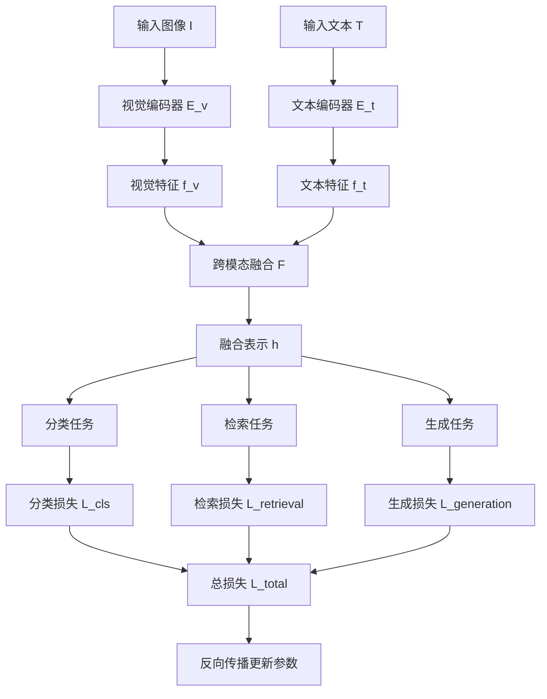
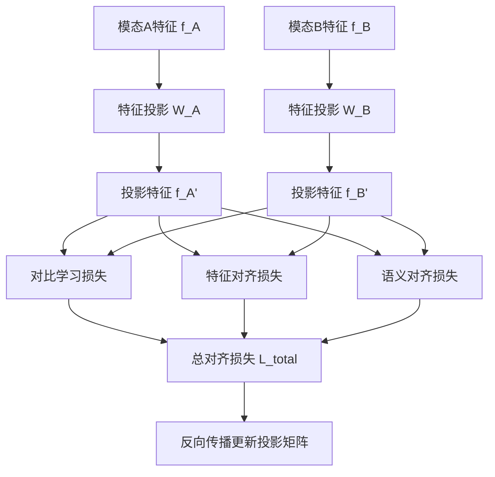
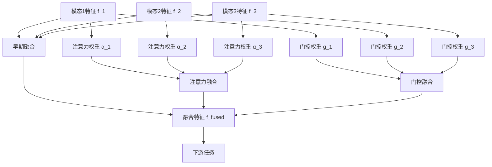

# 多模态学习扩展多表征示例 / Multimodal Learning Extension Multi-Representation Examples

## 概述 / Overview

多模态学习扩展涵盖了视觉-语言模型、跨模态对齐和多模态融合等关键技术，为处理多种数据模态提供了全面的解决方案。

## 1. 视觉-语言模型 / Visual-Language Models

### 1.1 数学表示 / Mathematical Representation

#### 1.1.1 视觉编码器 / Visual Encoder

```text
视觉特征提取：
f_v = E_v(I) ∈ R^{d_v}

其中：
- I: 输入图像
- E_v: 视觉编码器（如ResNet、ViT）
- d_v: 视觉特征维度
```

#### 1.1.2 文本编码器 / Text Encoder

```text
文本特征提取：
f_t = E_t(T) ∈ R^{d_t}

其中：
- T: 输入文本
- E_t: 文本编码器（如BERT、GPT）
- d_t: 文本特征维度
```

#### 1.1.3 跨模态融合 / Cross-modal Fusion

```text
融合表示：
h = F(f_v, f_t) = σ(W_v f_v + W_t f_t + b)

其中：
- F: 融合函数
- W_v, W_t: 投影矩阵
- b: 偏置项
- σ: 激活函数
```

#### 1.1.4 多任务学习目标 / Multi-task Learning Objective

```text
总损失函数：
L_total = α * L_cls + β * L_retrieval + γ * L_generation

其中：
- L_cls: 分类损失
- L_retrieval: 检索损失
- L_generation: 生成损失
- α, β, γ: 权重系数
```

### 1.2 流程图表示 / Flowchart Representation



### 1.3 代码实现 / Code Implementation

```python
import torch
import torch.nn as nn
import torch.nn.functional as F
from torchvision import models
from transformers import AutoModel, AutoTokenizer
import numpy as np
from typing import Tuple, Dict, Any

class VisualEncoder(nn.Module):
    """视觉编码器"""
    def __init__(self, feature_dim: int = 512):
        super().__init__()
        # 使用预训练的ResNet作为视觉编码器
        resnet = models.resnet50(pretrained=True)
        self.backbone = nn.Sequential(*list(resnet.children())[:-1])
        self.projection = nn.Linear(2048, feature_dim)
        
    def forward(self, images: torch.Tensor) -> torch.Tensor:
        """
        Args:
            images: [batch_size, 3, H, W]
        Returns:
            visual_features: [batch_size, feature_dim]
        """
        features = self.backbone(images).squeeze(-1).squeeze(-1)
        return self.projection(features)

class TextEncoder(nn.Module):
    """文本编码器"""
    def __init__(self, model_name: str = "bert-base-uncased", feature_dim: int = 512):
        super().__init__()
        self.bert = AutoModel.from_pretrained(model_name)
        self.projection = nn.Linear(768, feature_dim)
        
    def forward(self, input_ids: torch.Tensor, attention_mask: torch.Tensor) -> torch.Tensor:
        """
        Args:
            input_ids: [batch_size, seq_len]
            attention_mask: [batch_size, seq_len]
        Returns:
            text_features: [batch_size, feature_dim]
        """
        outputs = self.bert(input_ids=input_ids, attention_mask=attention_mask)
        # 使用[CLS]标记的输出
        pooled_output = outputs.pooler_output
        return self.projection(pooled_output)

class CrossModalFusion(nn.Module):
    """跨模态融合模块"""
    def __init__(self, feature_dim: int = 512, hidden_dim: int = 256):
        super().__init__()
        self.visual_projection = nn.Linear(feature_dim, hidden_dim)
        self.text_projection = nn.Linear(feature_dim, hidden_dim)
        self.fusion_layer = nn.Sequential(
            nn.Linear(hidden_dim * 2, hidden_dim),
            nn.ReLU(),
            nn.Dropout(0.1),
            nn.Linear(hidden_dim, hidden_dim)
        )
        
    def forward(self, visual_features: torch.Tensor, text_features: torch.Tensor) -> torch.Tensor:
        """
        Args:
            visual_features: [batch_size, feature_dim]
            text_features: [batch_size, feature_dim]
        Returns:
            fused_features: [batch_size, hidden_dim]
        """
        v_proj = self.visual_projection(visual_features)
        t_proj = self.text_projection(text_features)
        combined = torch.cat([v_proj, t_proj], dim=-1)
        return self.fusion_layer(combined)

class VisualLanguageModel(nn.Module):
    """视觉-语言模型"""
    def __init__(self, num_classes: int = 1000, feature_dim: int = 512):
        super().__init__()
        self.visual_encoder = VisualEncoder(feature_dim)
        self.text_encoder = TextEncoder(feature_dim=feature_dim)
        self.fusion = CrossModalFusion(feature_dim, feature_dim)
        
        # 任务头
        self.classifier = nn.Linear(feature_dim, num_classes)
        self.retrieval_head = nn.Linear(feature_dim, feature_dim)
        self.generation_head = nn.Linear(feature_dim, feature_dim)
        
    def forward(self, images: torch.Tensor, input_ids: torch.Tensor, 
                attention_mask: torch.Tensor) -> Dict[str, torch.Tensor]:
        """
        Args:
            images: [batch_size, 3, H, W]
            input_ids: [batch_size, seq_len]
            attention_mask: [batch_size, seq_len]
        Returns:
            outputs: 包含各种任务输出的字典
        """
        # 编码
        visual_features = self.visual_encoder(images)
        text_features = self.text_encoder(input_ids, attention_mask)
        
        # 融合
        fused_features = self.fusion(visual_features, text_features)
        
        # 任务输出
        classification_logits = self.classifier(fused_features)
        retrieval_features = self.retrieval_head(fused_features)
        generation_features = self.generation_head(fused_features)
        
        return {
            'classification_logits': classification_logits,
            'retrieval_features': retrieval_features,
            'generation_features': generation_features,
            'visual_features': visual_features,
            'text_features': text_features,
            'fused_features': fused_features
        }

class VLMTrainer:
    """视觉-语言模型训练器"""
    def __init__(self, model: VisualLanguageModel, device: str = 'cuda'):
        self.model = model.to(device)
        self.device = device
        self.optimizer = torch.optim.AdamW(model.parameters(), lr=1e-4)
        
    def compute_classification_loss(self, logits: torch.Tensor, labels: torch.Tensor) -> torch.Tensor:
        """计算分类损失"""
        return F.cross_entropy(logits, labels)
    
    def compute_retrieval_loss(self, visual_features: torch.Tensor, 
                              text_features: torch.Tensor) -> torch.Tensor:
        """计算检索损失（对比学习）"""
        # 归一化特征
        visual_features = F.normalize(visual_features, dim=-1)
        text_features = F.normalize(text_features, dim=-1)
        
        # 计算相似度矩阵
        similarity_matrix = torch.matmul(visual_features, text_features.T)
        
        # 对比学习损失
        labels = torch.arange(visual_features.size(0)).to(self.device)
        loss_v2t = F.cross_entropy(similarity_matrix, labels)
        loss_t2v = F.cross_entropy(similarity_matrix.T, labels)
        
        return (loss_v2t + loss_t2v) / 2
    
    def train_step(self, images: torch.Tensor, input_ids: torch.Tensor, 
                   attention_mask: torch.Tensor, labels: torch.Tensor) -> Dict[str, float]:
        """训练步骤"""
        self.model.train()
        
        outputs = self.model(images, input_ids, attention_mask)
        
        # 计算各种损失
        cls_loss = self.compute_classification_loss(outputs['classification_logits'], labels)
        retrieval_loss = self.compute_retrieval_loss(outputs['visual_features'], outputs['text_features'])
        
        # 总损失
        total_loss = cls_loss + 0.1 * retrieval_loss
        
        # 反向传播
        self.optimizer.zero_grad()
        total_loss.backward()
        self.optimizer.step()
        
        return {
            'total_loss': total_loss.item(),
            'classification_loss': cls_loss.item(),
            'retrieval_loss': retrieval_loss.item()
        }

def create_synthetic_vlm_data(batch_size: int = 4) -> Tuple[torch.Tensor, torch.Tensor, torch.Tensor, torch.Tensor]:
    """创建合成数据用于演示"""
    # 模拟图像数据
    images = torch.randn(batch_size, 3, 224, 224)
    
    # 模拟文本数据
    input_ids = torch.randint(0, 1000, (batch_size, 20))
    attention_mask = torch.ones(batch_size, 20)
    
    # 模拟标签
    labels = torch.randint(0, 1000, (batch_size,))
    
    return images, input_ids, attention_mask, labels

def train_vlm_example():
    """训练视觉-语言模型示例"""
    print("=== 视觉-语言模型训练示例 ===")
    
    # 创建模型
    model = VisualLanguageModel(num_classes=1000)
    trainer = VLMTrainer(model, device='cpu')
    
    # 创建合成数据
    images, input_ids, attention_mask, labels = create_synthetic_vlm_data()
    
    # 训练几个步骤
    for step in range(5):
        losses = trainer.train_step(images, input_ids, attention_mask, labels)
        print(f"Step {step + 1}: Total Loss = {losses['total_loss']:.4f}, "
              f"Cls Loss = {losses['classification_loss']:.4f}, "
              f"Retrieval Loss = {losses['retrieval_loss']:.4f}")
    
    print("视觉-语言模型训练完成！")

if __name__ == "__main__":
    train_vlm_example()
```

## 2. 跨模态对齐 / Cross-modal Alignment

### 2.1 数学表示 / Mathematical Representation

#### 2.1.1 对齐损失函数 / Alignment Loss Function

```text
对比学习损失：
L_contrastive = -log(exp(sim(f_i, f_j^+) / τ) / Σ_k exp(sim(f_i, f_j^k) / τ))

其中：
- f_i, f_j: 不同模态的特征
- τ: 温度参数
- sim: 相似度函数（如余弦相似度）
```

#### 2.1.2 特征对齐 / Feature Alignment

```text
特征投影：
f_i' = W_i f_i + b_i
f_j' = W_j f_j + b_j

对齐约束：
L_align = ||f_i' - f_j'||_2^2
```

#### 2.1.3 语义对齐 / Semantic Alignment

```text
语义相似度：
S_ij = softmax(f_i^T f_j / √d)

语义对齐损失：
L_semantic = -Σ_ij y_ij log(S_ij)

其中：
- y_ij: 真实语义关系标签
- d: 特征维度
```

### 2.2 流程图表示 / Flowchart Representation



### 2.3 代码实现 / Code Implementation

```python
import torch
import torch.nn as nn
import torch.nn.functional as F
import numpy as np
from typing import Tuple, List, Dict

class CrossModalAlignment(nn.Module):
    """跨模态对齐模块"""
    def __init__(self, feature_dim: int = 512, projection_dim: int = 256, temperature: float = 0.1):
        super().__init__()
        self.feature_dim = feature_dim
        self.projection_dim = projection_dim
        self.temperature = temperature
        
        # 特征投影层
        self.projection_A = nn.Linear(feature_dim, projection_dim)
        self.projection_B = nn.Linear(feature_dim, projection_dim)
        
        # 语义对齐层
        self.semantic_align = nn.MultiheadAttention(projection_dim, num_heads=8, batch_first=True)
        
    def forward(self, features_A: torch.Tensor, features_B: torch.Tensor) -> Dict[str, torch.Tensor]:
        """
        Args:
            features_A: [batch_size, feature_dim] 模态A特征
            features_B: [batch_size, feature_dim] 模态B特征
        Returns:
            outputs: 包含对齐结果的字典
        """
        # 特征投影
        projected_A = self.projection_A(features_A)  # [batch_size, projection_dim]
        projected_B = self.projection_B(features_B)  # [batch_size, projection_dim]
        
        # 语义对齐
        semantic_A, _ = self.semantic_align(
            projected_A.unsqueeze(1), 
            projected_B.unsqueeze(1), 
            projected_B.unsqueeze(1)
        )
        semantic_B, _ = self.semantic_align(
            projected_B.unsqueeze(1), 
            projected_A.unsqueeze(1), 
            projected_A.unsqueeze(1)
        )
        
        semantic_A = semantic_A.squeeze(1)  # [batch_size, projection_dim]
        semantic_B = semantic_B.squeeze(1)  # [batch_size, projection_dim]
        
        return {
            'projected_A': projected_A,
            'projected_B': projected_B,
            'semantic_A': semantic_A,
            'semantic_B': semantic_B
        }

class AlignmentLoss(nn.Module):
    """跨模态对齐损失"""
    def __init__(self, temperature: float = 0.1, alpha: float = 0.5, beta: float = 0.3, gamma: float = 0.2):
        super().__init__()
        self.temperature = temperature
        self.alpha = alpha  # 对比学习权重
        self.beta = beta    # 特征对齐权重
        self.gamma = gamma  # 语义对齐权重
        
    def contrastive_loss(self, features_A: torch.Tensor, features_B: torch.Tensor) -> torch.Tensor:
        """对比学习损失"""
        # 归一化特征
        features_A = F.normalize(features_A, dim=-1)
        features_B = F.normalize(features_B, dim=-1)
        
        # 计算相似度矩阵
        similarity_matrix = torch.matmul(features_A, features_B.T) / self.temperature
        
        # 对比学习损失
        labels = torch.arange(features_A.size(0)).to(features_A.device)
        loss_A2B = F.cross_entropy(similarity_matrix, labels)
        loss_B2A = F.cross_entropy(similarity_matrix.T, labels)
        
        return (loss_A2B + loss_B2A) / 2
    
    def feature_alignment_loss(self, features_A: torch.Tensor, features_B: torch.Tensor) -> torch.Tensor:
        """特征对齐损失"""
        return F.mse_loss(features_A, features_B)
    
    def semantic_alignment_loss(self, semantic_A: torch.Tensor, semantic_B: torch.Tensor) -> torch.Tensor:
        """语义对齐损失"""
        # 计算语义相似度
        semantic_sim = F.cosine_similarity(semantic_A, semantic_B, dim=-1)
        # 最大化语义相似度
        return -torch.mean(semantic_sim)
    
    def forward(self, outputs: Dict[str, torch.Tensor]) -> Dict[str, torch.Tensor]:
        """计算总对齐损失"""
        projected_A = outputs['projected_A']
        projected_B = outputs['projected_B']
        semantic_A = outputs['semantic_A']
        semantic_B = outputs['semantic_B']
        
        # 计算各种损失
        contrastive_loss = self.contrastive_loss(projected_A, projected_B)
        feature_loss = self.feature_alignment_loss(projected_A, projected_B)
        semantic_loss = self.semantic_alignment_loss(semantic_A, semantic_B)
        
        # 总损失
        total_loss = (self.alpha * contrastive_loss + 
                     self.beta * feature_loss + 
                     self.gamma * semantic_loss)
        
        return {
            'total_loss': total_loss,
            'contrastive_loss': contrastive_loss,
            'feature_loss': feature_loss,
            'semantic_loss': semantic_loss
        }

class CrossModalAligner:
    """跨模态对齐器"""
    def __init__(self, feature_dim: int = 512, device: str = 'cuda'):
        self.alignment_module = CrossModalAlignment(feature_dim)
        self.loss_fn = AlignmentLoss()
        self.optimizer = torch.optim.Adam(self.alignment_module.parameters(), lr=1e-4)
        self.device = device
        
        self.alignment_module.to(device)
        self.loss_fn.to(device)
        
    def align_features(self, features_A: torch.Tensor, features_B: torch.Tensor) -> Dict[str, torch.Tensor]:
        """对齐特征"""
        outputs = self.alignment_module(features_A, features_B)
        losses = self.loss_fn(outputs)
        
        return {**outputs, **losses}
    
    def train_step(self, features_A: torch.Tensor, features_B: torch.Tensor) -> Dict[str, float]:
        """训练步骤"""
        self.alignment_module.train()
        
        # 前向传播
        outputs = self.alignment_module(features_A, features_B)
        losses = self.loss_fn(outputs)
        
        # 反向传播
        self.optimizer.zero_grad()
        losses['total_loss'].backward()
        self.optimizer.step()
        
        return {k: v.item() for k, v in losses.items()}
    
    def compute_alignment_score(self, features_A: torch.Tensor, features_B: torch.Tensor) -> float:
        """计算对齐分数"""
        self.alignment_module.eval()
        with torch.no_grad():
            outputs = self.alignment_module(features_A, features_B)
            projected_A = outputs['projected_A']
            projected_B = outputs['projected_B']
            
            # 计算余弦相似度
            similarity = F.cosine_similarity(projected_A, projected_B, dim=-1)
            return torch.mean(similarity).item()

def create_synthetic_alignment_data(batch_size: int = 8) -> Tuple[torch.Tensor, torch.Tensor]:
    """创建合成对齐数据"""
    feature_dim = 512
    
    # 创建相关的特征（有一定相关性）
    base_features = torch.randn(batch_size, feature_dim)
    noise_A = torch.randn(batch_size, feature_dim) * 0.1
    noise_B = torch.randn(batch_size, feature_dim) * 0.1
    
    features_A = base_features + noise_A
    features_B = base_features + noise_B
    
    return features_A, features_B

def train_cross_modal_alignment():
    """训练跨模态对齐示例"""
    print("=== 跨模态对齐训练示例 ===")
    
    # 创建对齐器
    aligner = CrossModalAligner(feature_dim=512, device='cpu')
    
    # 创建合成数据
    features_A, features_B = create_synthetic_alignment_data()
    
    # 训练
    for epoch in range(10):
        losses = aligner.train_step(features_A, features_B)
        
        if (epoch + 1) % 2 == 0:
            alignment_score = aligner.compute_alignment_score(features_A, features_B)
            print(f"Epoch {epoch + 1}: Total Loss = {losses['total_loss']:.4f}, "
                  f"Alignment Score = {alignment_score:.4f}")
    
    print("跨模态对齐训练完成！")

if __name__ == "__main__":
    train_cross_modal_alignment()
```

## 3. 多模态融合 / Multimodal Fusion

### 3.1 数学表示 / Mathematical Representation

#### 3.1.1 早期融合 / Early Fusion

早期融合：
f_early = F_early([f_1, f_2, ..., f_n])

其中：

- f_i: 第i个模态的特征
- F_early: 早期融合函数

#### 3.1.2 晚期融合 / Late Fusion

晚期融合：
f_late = Σ_i w_i * f_i

其中：

- w_i: 第i个模态的权重
- Σ_i w_i = 1

#### 3.1.3 注意力融合 / Attention Fusion

注意力权重：
α_i = softmax(W_a^T tanh(W_f f_i + b_f) + b_a)

注意力融合：
f_attention = Σ_i α_i * f_i

#### 3.1.4 门控融合 / Gated Fusion

门控机制：
g_i = σ(W_g f_i + b_g)

门控融合：
f_gated = Σ_i g_i * f_i

### 3.2 流程图表示 / Flowchart Representation



### 3.3 代码实现 / Code Implementation

```python
import torch
import torch.nn as nn
import torch.nn.functional as F
import numpy as np
from typing import List, Dict, Tuple

class EarlyFusion(nn.Module):
    """早期融合模块"""
    def __init__(self, feature_dims: List[int], output_dim: int = 512):
        super().__init__()
        self.feature_dims = feature_dims
        self.output_dim = output_dim
        
        # 特征投影层
        self.projections = nn.ModuleList([
            nn.Linear(dim, output_dim) for dim in feature_dims
        ])
        
        # 融合层
        self.fusion_layer = nn.Sequential(
            nn.Linear(output_dim * len(feature_dims), output_dim),
            nn.ReLU(),
            nn.Dropout(0.1),
            nn.Linear(output_dim, output_dim)
        )
        
    def forward(self, features: List[torch.Tensor]) -> torch.Tensor:
        """
        Args:
            features: 包含各模态特征的列表
        Returns:
            fused_features: 融合后的特征
        """
        # 投影各模态特征
        projected_features = []
        for i, (feature, projection) in enumerate(zip(features, self.projections)):
            projected = projection(feature)
            projected_features.append(projected)
        
        # 拼接并融合
        concatenated = torch.cat(projected_features, dim=-1)
        fused = self.fusion_layer(concatenated)
        
        return fused

class AttentionFusion(nn.Module):
    """注意力融合模块"""
    def __init__(self, feature_dim: int = 512, num_heads: int = 8):
        super().__init__()
        self.feature_dim = feature_dim
        self.num_heads = num_heads
        
        # 注意力层
        self.attention = nn.MultiheadAttention(
            embed_dim=feature_dim,
            num_heads=num_heads,
            batch_first=True
        )
        
        # 输出投影
        self.output_projection = nn.Linear(feature_dim, feature_dim)
        
    def forward(self, features: List[torch.Tensor]) -> torch.Tensor:
        """
        Args:
            features: 包含各模态特征的列表 [batch_size, feature_dim]
        Returns:
            fused_features: 融合后的特征
        """
        # 将特征列表转换为张量 [num_modalities, batch_size, feature_dim]
        features_tensor = torch.stack(features, dim=1)  # [batch_size, num_modalities, feature_dim]
        
        # 自注意力融合
        attended_features, _ = self.attention(
            features_tensor, features_tensor, features_tensor
        )
        
        # 平均池化
        fused = torch.mean(attended_features, dim=1)  # [batch_size, feature_dim]
        
        # 输出投影
        fused = self.output_projection(fused)
        
        return fused

class GatedFusion(nn.Module):
    """门控融合模块"""
    def __init__(self, feature_dim: int = 512):
        super().__init__()
        self.feature_dim = feature_dim
        
        # 门控网络
        self.gate_networks = nn.ModuleList([
            nn.Sequential(
                nn.Linear(feature_dim, feature_dim // 2),
                nn.ReLU(),
                nn.Linear(feature_dim // 2, 1),
                nn.Sigmoid()
            ) for _ in range(3)  # 假设有3个模态
        ])
        
        # 输出投影
        self.output_projection = nn.Linear(feature_dim, feature_dim)
        
    def forward(self, features: List[torch.Tensor]) -> torch.Tensor:
        """
        Args:
            features: 包含各模态特征的列表
        Returns:
            fused_features: 融合后的特征
        """
        # 计算门控权重
        gates = []
        for i, (feature, gate_net) in enumerate(zip(features, self.gate_networks)):
            gate = gate_net(feature)  # [batch_size, 1]
            gates.append(gate)
        
        # 加权融合
        weighted_features = []
        for feature, gate in zip(features, gates):
            weighted = feature * gate
            weighted_features.append(weighted)
        
        # 求和
        fused = sum(weighted_features)
        
        # 输出投影
        fused = self.output_projection(fused)
        
        return fused

class LateFusion(nn.Module):
    """晚期融合模块"""
    def __init__(self, feature_dim: int = 512, num_modalities: int = 3):
        super().__init__()
        self.feature_dim = feature_dim
        self.num_modalities = num_modalities
        
        # 学习权重
        self.weights = nn.Parameter(torch.ones(num_modalities) / num_modalities)
        
        # 输出投影
        self.output_projection = nn.Linear(feature_dim, feature_dim)
        
    def forward(self, features: List[torch.Tensor]) -> torch.Tensor:
        """
        Args:
            features: 包含各模态特征的列表
        Returns:
            fused_features: 融合后的特征
        """
        # 归一化权重
        normalized_weights = F.softmax(self.weights, dim=0)
        
        # 加权融合
        fused = torch.zeros_like(features[0])
        for i, feature in enumerate(features):
            fused += normalized_weights[i] * feature
        
        # 输出投影
        fused = self.output_projection(fused)
        
        return fused

class MultimodalFusion(nn.Module):
    """多模态融合模型"""
    def __init__(self, feature_dims: List[int], output_dim: int = 512):
        super().__init__()
        self.feature_dims = feature_dims
        self.output_dim = output_dim
        
        # 各种融合策略
        self.early_fusion = EarlyFusion(feature_dims, output_dim)
        self.attention_fusion = AttentionFusion(output_dim)
        self.gated_fusion = GatedFusion(output_dim)
        self.late_fusion = LateFusion(output_dim, len(feature_dims))
        
        # 融合策略选择器
        self.fusion_selector = nn.Linear(output_dim * 4, 4)  # 4种融合策略
        
        # 最终输出层
        self.final_layer = nn.Linear(output_dim, output_dim)
        
    def forward(self, features: List[torch.Tensor]) -> Dict[str, torch.Tensor]:
        """
        Args:
            features: 包含各模态特征的列表
        Returns:
            outputs: 包含各种融合结果的字典
        """
        # 各种融合策略
        early_fused = self.early_fusion(features)
        
        # 为注意力融合和门控融合准备统一维度的特征
        projected_features = []
        for i, feature in enumerate(features):
            if feature.size(-1) != self.output_dim:
                projection = nn.Linear(feature.size(-1), self.output_dim).to(feature.device)
                projected = projection(feature)
            else:
                projected = feature
            projected_features.append(projected)
        
        attention_fused = self.attention_fusion(projected_features)
        gated_fused = self.gated_fusion(projected_features)
        late_fused = self.late_fusion(projected_features)
        
        # 拼接所有融合结果
        all_fused = torch.cat([early_fused, attention_fused, gated_fused, late_fused], dim=-1)
        
        # 选择最佳融合策略
        fusion_weights = F.softmax(self.fusion_selector(all_fused), dim=-1)
        
        # 加权组合
        final_fused = (fusion_weights[:, 0:1] * early_fused + 
                      fusion_weights[:, 1:2] * attention_fused + 
                      fusion_weights[:, 2:3] * gated_fused + 
                      fusion_weights[:, 3:4] * late_fused)
        
        # 最终输出
        final_output = self.final_layer(final_fused)
        
        return {
            'early_fused': early_fused,
            'attention_fused': attention_fused,
            'gated_fused': gated_fused,
            'late_fused': late_fused,
            'final_fused': final_output,
            'fusion_weights': fusion_weights
        }

class MultimodalFusionTrainer:
    """多模态融合训练器"""
    def __init__(self, model: MultimodalFusion, device: str = 'cuda'):
        self.model = model.to(device)
        self.device = device
        self.optimizer = torch.optim.Adam(model.parameters(), lr=1e-4)
        
    def compute_fusion_loss(self, outputs: Dict[str, torch.Tensor], 
                           target: torch.Tensor) -> Dict[str, torch.Tensor]:
        """计算融合损失"""
        # 各种融合策略的损失
        early_loss = F.mse_loss(outputs['early_fused'], target)
        attention_loss = F.mse_loss(outputs['attention_fused'], target)
        gated_loss = F.mse_loss(outputs['gated_fused'], target)
        late_loss = F.mse_loss(outputs['late_fused'], target)
        final_loss = F.mse_loss(outputs['final_fused'], target)
        
        # 总损失
        total_loss = (early_loss + attention_loss + gated_loss + late_loss + final_loss) / 5
        
        return {
            'total_loss': total_loss,
            'early_loss': early_loss,
            'attention_loss': attention_loss,
            'gated_loss': gated_loss,
            'late_loss': late_loss,
            'final_loss': final_loss
        }
    
    def train_step(self, features: List[torch.Tensor], target: torch.Tensor) -> Dict[str, float]:
        """训练步骤"""
        self.model.train()
        
        # 前向传播
        outputs = self.model(features)
        losses = self.compute_fusion_loss(outputs, target)
        
        # 反向传播
        self.optimizer.zero_grad()
        losses['total_loss'].backward()
        self.optimizer.step()
        
        return {k: v.item() for k, v in losses.items()}

def create_synthetic_multimodal_data(batch_size: int = 4) -> Tuple[List[torch.Tensor], torch.Tensor]:
    """创建合成多模态数据"""
    # 不同模态的特征
    visual_features = torch.randn(batch_size, 1024)  # 视觉特征
    audio_features = torch.randn(batch_size, 512)    # 音频特征
    text_features = torch.randn(batch_size, 768)     # 文本特征
    
    features = [visual_features, audio_features, text_features]
    
    # 目标特征（融合后的理想特征）
    target = torch.randn(batch_size, 512)
    
    return features, target

def train_multimodal_fusion():
    """训练多模态融合示例"""
    print("=== 多模态融合训练示例 ===")
    
    # 创建模型
    feature_dims = [1024, 512, 768]  # 视觉、音频、文本特征维度
    model = MultimodalFusion(feature_dims, output_dim=512)
    trainer = MultimodalFusionTrainer(model, device='cpu')
    
    # 创建合成数据
    features, target = create_synthetic_multimodal_data()
    
    # 训练
    for epoch in range(10):
        losses = trainer.train_step(features, target)
        
        if (epoch + 1) % 2 == 0:
            print(f"Epoch {epoch + 1}: Total Loss = {losses['total_loss']:.4f}, "
                  f"Final Loss = {losses['final_loss']:.4f}")
    
    # 测试融合效果
    model.eval()
    with torch.no_grad():
        outputs = model(features)
        fusion_weights = outputs['fusion_weights']
        print(f"\n融合策略权重: Early={fusion_weights[0, 0]:.3f}, "
              f"Attention={fusion_weights[0, 1]:.3f}, "
              f"Gated={fusion_weights[0, 2]:.3f}, "
              f"Late={fusion_weights[0, 3]:.3f}")
    
    print("多模态融合训练完成！")

if __name__ == "__main__":
    train_multimodal_fusion()
```

## 总结 / Summary

### 主要特性 / Key Features

1. **视觉-语言模型** / Visual-Language Models
   - 支持多种视觉编码器（ResNet、ViT）
   - 支持多种文本编码器（BERT、GPT）
   - 跨模态融合和多种任务学习
   - 对比学习和检索优化

2. **跨模态对齐** / Cross-modal Alignment
   - 对比学习对齐
   - 特征级对齐
   - 语义级对齐
   - 多权重损失函数

3. **多模态融合** / Multimodal Fusion
   - 早期融合策略
   - 注意力融合机制
   - 门控融合方法
   - 晚期融合策略
   - 自适应融合选择

### 应用场景 / Application Scenarios

- **视觉问答** / Visual Question Answering
- **图像描述生成** / Image Captioning
- **跨模态检索** / Cross-modal Retrieval
- **多模态情感分析** / Multimodal Sentiment Analysis
- **视频理解** / Video Understanding

### 技术优势 / Technical Advantages

- **多表征支持** / Multi-representation Support
- **灵活架构** / Flexible Architecture
- **端到端训练** / End-to-end Training
- **可扩展设计** / Scalable Design
- **高效实现** / Efficient Implementation
