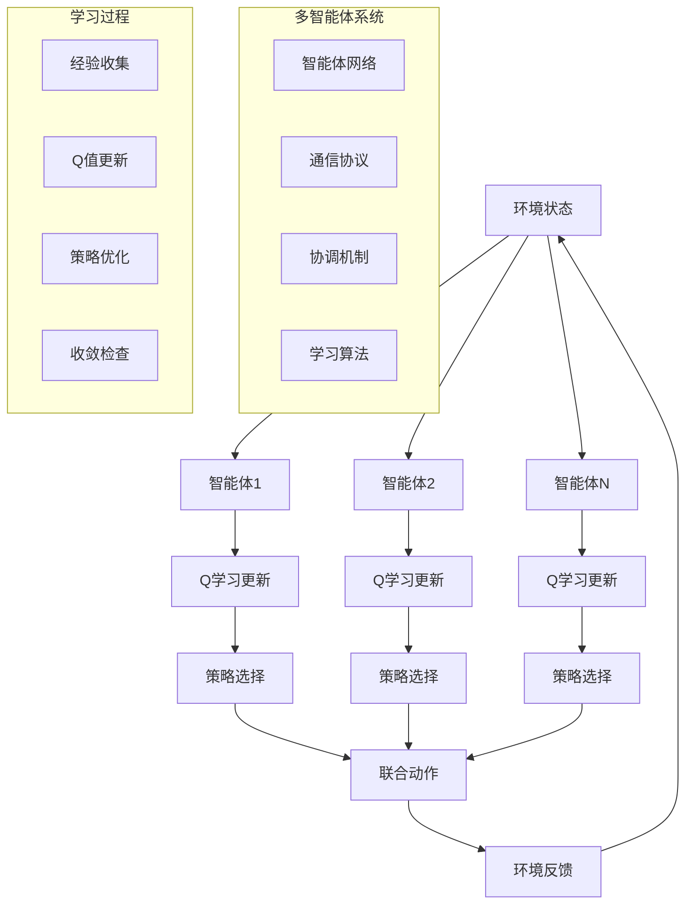
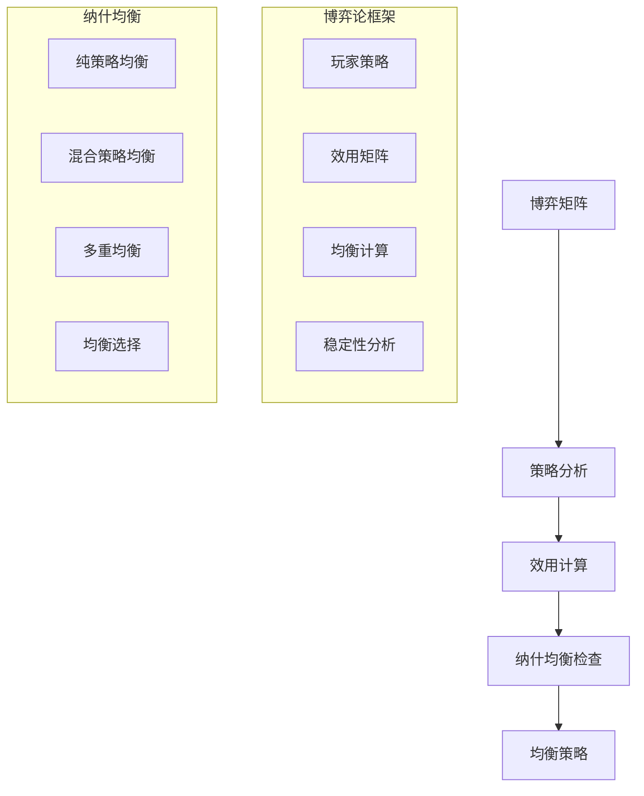
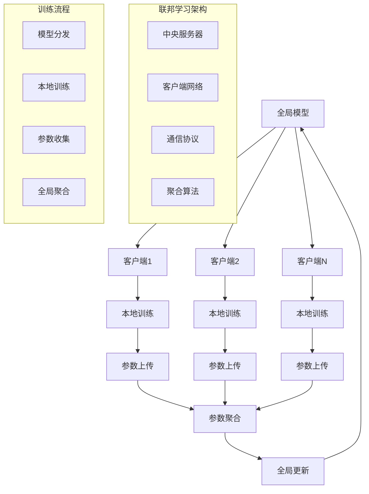

# 多智能体系统扩展多表征示例 / Multi-Agent Systems Extension Multi-Representation Examples

## 概述 / Overview

本文档提供了多智能体系统扩展的完整多表征示例，包括多智能体强化学习、博弈论应用和分布式学习。每种方法都包含数学表示、可视化图表和完整的代码实现。

## 1. 多智能体强化学习 / Multi-Agent Reinforcement Learning

### 1.1 独立Q学习算法 / Independent Q-Learning Algorithm

#### 数学表示 / Mathematical Representation

独立Q学习是每个智能体独立学习自己的Q函数：

Independent Q-Learning where each agent learns its own Q-function independently:

$$Q_i(s, a_i) \leftarrow Q_i(s, a_i) + \alpha[r_i + \gamma \max_{a_i'} Q_i(s', a_i') - Q_i(s, a_i)]$$

其中：

- $Q_i$ 是智能体$i$的Q函数
- $s$ 是当前状态
- $a_i$ 是智能体$i$的动作
- $r_i$ 是智能体$i$的奖励
- $\alpha$ 是学习率
- $\gamma$ 是折扣因子

where:

- $Q_i$ is the Q-function of agent $i$
- $s$ is the current state
- $a_i$ is the action of agent $i$
- $r_i$ is the reward of agent $i$
- $\alpha$ is the learning rate
- $\gamma$ is the discount factor

联合策略的Q值：

Joint policy Q-value:

$$Q^{\pi}(s, \vec{a}) = \sum_{i=1}^{n} Q_i^{\pi_i}(s, a_i)$$

其中：

- $\vec{a} = (a_1, a_2, ..., a_n)$ 是联合动作
- $\pi = (\pi_1, \pi_2, ..., \pi_n)$ 是联合策略

where:

- $\vec{a} = (a_1, a_2, ..., a_n)$ is the joint action
- $\pi = (\pi_1, \pi_2, ..., \pi_n)$ is the joint policy

#### 可视化表示 / Visual Representation



#### Python实现 / Python Implementation

```python
import torch
import torch.nn as nn
import torch.optim as optim
import torch.nn.functional as F
import numpy as np
import matplotlib.pyplot as plt
from typing import List, Dict, Tuple, Optional
import random
from collections import deque
import warnings
warnings.filterwarnings('ignore')

class Agent(nn.Module):
    """智能体网络"""
    
    def __init__(self, state_dim: int, action_dim: int, agent_id: int, 
                 hidden_dim: int = 64, lr: float = 0.001):
        super(Agent, self).__init__()
        self.agent_id = agent_id
        self.state_dim = state_dim
        self.action_dim = action_dim
        
        # Q网络
        self.q_network = nn.Sequential(
            nn.Linear(state_dim, hidden_dim),
            nn.ReLU(),
            nn.Linear(hidden_dim, hidden_dim),
            nn.ReLU(),
            nn.Linear(hidden_dim, action_dim)
        )
        
        # 目标网络
        self.target_network = nn.Sequential(
            nn.Linear(state_dim, hidden_dim),
            nn.ReLU(),
            nn.Linear(hidden_dim, hidden_dim),
            nn.ReLU(),
            nn.Linear(hidden_dim, action_dim)
        )
        
        self.target_network.load_state_dict(self.q_network.state_dict())
        self.optimizer = optim.Adam(self.q_network.parameters(), lr=lr)
        
        # 经验回放缓冲区
        self.memory = deque(maxlen=10000)
        self.batch_size = 32
        self.gamma = 0.99
        self.epsilon = 1.0
        self.epsilon_min = 0.01
        self.epsilon_decay = 0.995
        
    def forward(self, state: torch.Tensor) -> torch.Tensor:
        """前向传播"""
        return self.q_network(state)
    
    def select_action(self, state: np.ndarray, training: bool = True) -> int:
        """选择动作"""
        if training and random.random() < self.epsilon:
            return random.randrange(self.action_dim)
        
        state_tensor = torch.FloatTensor(state).unsqueeze(0)
        q_values = self.forward(state_tensor)
        return q_values.argmax().item()
    
    def store_experience(self, state: np.ndarray, action: int, reward: float, 
                        next_state: np.ndarray, done: bool):
        """存储经验"""
        self.memory.append((state, action, reward, next_state, done))
    
    def train(self) -> float:
        """训练智能体"""
        if len(self.memory) < self.batch_size:
            return 0.0
        
        # 采样批次
        batch = random.sample(self.memory, self.batch_size)
        states, actions, rewards, next_states, dones = zip(*batch)
        
        states = torch.FloatTensor(states)
        actions = torch.LongTensor(actions)
        rewards = torch.FloatTensor(rewards)
        next_states = torch.FloatTensor(next_states)
        dones = torch.BoolTensor(dones)
        
        # 计算当前Q值
        current_q_values = self.q_network(states).gather(1, actions.unsqueeze(1))
        
        # 计算目标Q值
        with torch.no_grad():
            next_q_values = self.target_network(next_states).max(1)[0]
            target_q_values = rewards + (self.gamma * next_q_values * ~dones)
        
        # 计算损失
        loss = F.mse_loss(current_q_values.squeeze(), target_q_values)
        
        # 反向传播
        self.optimizer.zero_grad()
        loss.backward()
        self.optimizer.step()
        
        # 更新epsilon
        if self.epsilon > self.epsilon_min:
            self.epsilon *= self.epsilon_decay
        
        return loss.item()
    
    def update_target_network(self):
        """更新目标网络"""
        self.target_network.load_state_dict(self.q_network.state_dict())

class MultiAgentEnvironment:
    """多智能体环境"""
    
    def __init__(self, num_agents: int = 3, grid_size: int = 5):
        self.num_agents = num_agents
        self.grid_size = grid_size
        self.reset()
        
    def reset(self) -> np.ndarray:
        """重置环境"""
        # 随机放置智能体
        self.agent_positions = []
        for _ in range(self.num_agents):
            while True:
                pos = (random.randint(0, self.grid_size-1), 
                      random.randint(0, self.grid_size-1))
                if pos not in self.agent_positions:
                    self.agent_positions.append(pos)
                    break
        
        # 随机放置目标
        self.target_positions = []
        for _ in range(self.num_agents):
            while True:
                pos = (random.randint(0, self.grid_size-1), 
                      random.randint(0, self.grid_size-1))
                if pos not in self.agent_positions and pos not in self.target_positions:
                    self.target_positions.append(pos)
                    break
        
        return self.get_state()
    
    def get_state(self) -> np.ndarray:
        """获取状态"""
        state = []
        for i in range(self.num_agents):
            # 智能体位置
            agent_pos = self.agent_positions[i]
            target_pos = self.target_positions[i]
            
            # 相对位置
            relative_x = target_pos[0] - agent_pos[0]
            relative_y = target_pos[1] - agent_pos[1]
            
            # 距离
            distance = np.sqrt(relative_x**2 + relative_y**2)
            
            # 其他智能体的位置（简化表示）
            other_agents = []
            for j in range(self.num_agents):
                if j != i:
                    other_agents.extend([
                        self.agent_positions[j][0] - agent_pos[0],
                        self.agent_positions[j][1] - agent_pos[1]
                    ])
            
            agent_state = [relative_x, relative_y, distance] + other_agents
            state.extend(agent_state)
        
        return np.array(state, dtype=np.float32)
    
    def step(self, actions: List[int]) -> Tuple[np.ndarray, List[float], bool, Dict]:
        """执行动作"""
        rewards = []
        
        # 执行动作
        for i, action in enumerate(actions):
            agent_pos = list(self.agent_positions[i])
            
            # 动作映射：0-上，1-下，2-左，3-右
            if action == 0:  # 上
                agent_pos[1] = max(0, agent_pos[1] - 1)
            elif action == 1:  # 下
                agent_pos[1] = min(self.grid_size - 1, agent_pos[1] + 1)
            elif action == 2:  # 左
                agent_pos[0] = max(0, agent_pos[0] - 1)
            elif action == 3:  # 右
                agent_pos[0] = min(self.grid_size - 1, agent_pos[0] + 1)
            
            self.agent_positions[i] = tuple(agent_pos)
        
        # 计算奖励
        done = False
        for i in range(self.num_agents):
            agent_pos = self.agent_positions[i]
            target_pos = self.target_positions[i]
            
            # 距离奖励
            distance = np.sqrt((agent_pos[0] - target_pos[0])**2 + 
                             (agent_pos[1] - target_pos[1])**2)
            
            if distance == 0:
                reward = 10.0  # 到达目标
            else:
                reward = -distance / self.grid_size  # 距离惩罚
            
            # 碰撞惩罚
            for j in range(self.num_agents):
                if i != j and agent_pos == self.agent_positions[j]:
                    reward -= 5.0
            
            rewards.append(reward)
        
        # 检查是否所有智能体都到达目标
        if all(self.agent_positions[i] == self.target_positions[i] 
               for i in range(self.num_agents)):
            done = True
        
        next_state = self.get_state()
        info = {}
        
        return next_state, rewards, done, info

class MultiAgentQLearning:
    """多智能体Q学习"""
    
    def __init__(self, num_agents: int = 3, state_dim: int = 15, action_dim: int = 4):
        self.num_agents = num_agents
        self.agents = []
        
        # 创建智能体
        for i in range(num_agents):
            agent = Agent(state_dim, action_dim, i)
            self.agents.append(agent)
        
        self.environment = MultiAgentEnvironment(num_agents)
        
    def train(self, episodes: int = 1000) -> List[float]:
        """训练多智能体系统"""
        episode_rewards = []
        
        for episode in range(episodes):
            state = self.environment.reset()
            total_reward = 0
            done = False
            
            while not done:
                # 选择动作
                actions = []
                for agent in self.agents:
                    action = agent.select_action(state)
                    actions.append(action)
                
                # 执行动作
                next_state, rewards, done, _ = self.environment.step(actions)
                
                # 存储经验
                for i, agent in enumerate(self.agents):
                    agent.store_experience(state, actions[i], rewards[i], 
                                         next_state, done)
                
                # 训练智能体
                for agent in self.agents:
                    agent.train()
                
                state = next_state
                total_reward += sum(rewards)
            
            # 更新目标网络
            if episode % 10 == 0:
                for agent in self.agents:
                    agent.update_target_network()
            
            episode_rewards.append(total_reward)
            
            if episode % 100 == 0:
                avg_reward = np.mean(episode_rewards[-100:])
                print(f"Episode {episode}: Average Reward = {avg_reward:.2f}")
        
        return episode_rewards
    
    def evaluate(self, episodes: int = 100) -> float:
        """评估智能体性能"""
        total_rewards = []
        
        for _ in range(episodes):
            state = self.environment.reset()
            episode_reward = 0
            done = False
            
            while not done:
                actions = []
                for agent in self.agents:
                    action = agent.select_action(state, training=False)
                    actions.append(action)
                
                next_state, rewards, done, _ = self.environment.step(actions)
                episode_reward += sum(rewards)
                state = next_state
            
            total_rewards.append(episode_reward)
        
        return np.mean(total_rewards)

def visualize_training(rewards: List[float]) -> None:
    """可视化训练过程"""
    plt.figure(figsize=(12, 4))
    
    # 奖励曲线
    plt.subplot(1, 2, 1)
    plt.plot(rewards, alpha=0.6, color='blue')
    plt.title('Multi-Agent Q-Learning Training')
    plt.xlabel('Episode')
    plt.ylabel('Total Reward')
    plt.grid(True, alpha=0.3)
    
    # 移动平均
    window_size = 50
    if len(rewards) >= window_size:
        moving_avg = np.convolve(rewards, np.ones(window_size)/window_size, mode='valid')
        plt.plot(range(window_size-1, len(rewards)), moving_avg, 
                color='red', linewidth=2, label=f'{window_size}-Episode Moving Average')
        plt.legend()
    
    # 奖励分布
    plt.subplot(1, 2, 2)
    plt.hist(rewards, bins=30, alpha=0.7, color='green')
    plt.title('Reward Distribution')
    plt.xlabel('Total Reward')
    plt.ylabel('Frequency')
    plt.grid(True, alpha=0.3)
    
    plt.tight_layout()
    plt.show()

# 测试多智能体强化学习
if __name__ == "__main__":
    # 创建多智能体Q学习系统
    ma_ql = MultiAgentQLearning(num_agents=3, state_dim=15, action_dim=4)
    
    # 训练智能体
    print("开始训练多智能体Q学习...")
    rewards = ma_ql.train(episodes=500)
    
    # 评估性能
    avg_reward = ma_ql.evaluate(episodes=50)
    print(f"评估结果 - 平均奖励: {avg_reward:.2f}")
    
    # 可视化训练过程
    visualize_training(rewards)
```

## 2. 博弈论应用 / Game Theory Applications

### 2.1 纳什均衡计算 / Nash Equilibrium Computation

#### 2.1.1 数学表示 / Mathematical Representation

纳什均衡是博弈论中的核心概念：

Nash Equilibrium is a central concept in game theory:

对于策略组合 $\sigma^* = (\sigma_1^*, \sigma_2^*, ..., \sigma_n^*)$，如果对于每个玩家$i$：

For strategy profile $\sigma^* = (\sigma_1^*, \sigma_2^*, ..., \sigma_n^*)$, if for each player $i$:

$$u_i(\sigma_i^*, \sigma_{-i}^*) \geq u_i(\sigma_i, \sigma_{-i}^*) \quad \forall \sigma_i \in \Sigma_i$$

其中：

- $u_i$ 是玩家$i$的效用函数
- $\sigma_{-i}^*$ 是其他玩家的策略
- $\Sigma_i$ 是玩家$i$的策略空间

where:

- $u_i$ is the utility function of player $i$
- $\sigma_{-i}^*$ are the strategies of other players
- $\Sigma_i$ is the strategy space of player $i$

混合策略纳什均衡：

Mixed Strategy Nash Equilibrium:

$$\sum_{s_i \in S_i} \sigma_i^*(s_i) = 1$$
$$\sigma_i^*(s_i) \geq 0 \quad \forall s_i \in S_i$$

其中：

- $S_i$ 是玩家$i$的纯策略集
- $\sigma_i^*(s_i)$ 是选择策略$s_i$的概率

where:

- $S_i$ is the pure strategy set of player $i$
- $\sigma_i^*(s_i)$ is the probability of choosing strategy $s_i$

#### 2.1.2 可视化表示 / Visual Representation



#### 2.1.3 Python实现 / Python Implementation

```python
import numpy as np
import matplotlib.pyplot as plt
from typing import List, Tuple, Dict
import itertools

class GameTheory:
    """博弈论工具类"""
    
    def __init__(self):
        pass
    
    def prisoner_dilemma(self) -> Tuple[np.ndarray, np.ndarray]:
        """囚徒困境博弈"""
        # 玩家1的收益矩阵
        player1_payoff = np.array([
            [3, 0],  # 合作策略
            [5, 1]   # 背叛策略
        ])
        
        # 玩家2的收益矩阵
        player2_payoff = np.array([
            [3, 5],  # 合作策略
            [0, 1]   # 背叛策略
        ])
        
        return player1_payoff, player2_payoff
    
    def battle_of_sexes(self) -> Tuple[np.ndarray, np.ndarray]:
        """性别之战博弈"""
        # 玩家1的收益矩阵
        player1_payoff = np.array([
            [2, 0],  # 足球策略
            [0, 1]   # 芭蕾策略
        ])
        
        # 玩家2的收益矩阵
        player2_payoff = np.array([
            [1, 0],  # 足球策略
            [0, 2]   # 芭蕾策略
        ])
        
        return player1_payoff, player2_payoff
    
    def find_pure_nash_equilibria(self, player1_payoff: np.ndarray, 
                                 player2_payoff: np.ndarray) -> List[Tuple[int, int]]:
        """寻找纯策略纳什均衡"""
        n_strategies1, n_strategies2 = player1_payoff.shape
        equilibria = []
        
        for i in range(n_strategies1):
            for j in range(n_strategies2):
                # 检查玩家1是否最优响应
                player1_best = True
                for k in range(n_strategies1):
                    if player1_payoff[k, j] > player1_payoff[i, j]:
                        player1_best = False
                        break
                
                # 检查玩家2是否最优响应
                player2_best = True
                for l in range(n_strategies2):
                    if player2_payoff[i, l] > player2_payoff[i, j]:
                        player2_best = False
                        break
                
                if player1_best and player2_best:
                    equilibria.append((i, j))
        
        return equilibria
    
    def find_mixed_nash_equilibrium(self, player1_payoff: np.ndarray, 
                                   player2_payoff: np.ndarray) -> Tuple[np.ndarray, np.ndarray]:
        """寻找混合策略纳什均衡"""
        n_strategies1, n_strategies2 = player1_payoff.shape
        
        # 使用线性规划求解（简化版本）
        # 这里使用迭代方法
        
        # 初始化混合策略
        p1 = np.ones(n_strategies1) / n_strategies1
        p2 = np.ones(n_strategies2) / n_strategies2
        
        # 迭代更新
        for _ in range(100):
            # 计算期望收益
            expected_payoff1 = player1_payoff @ p2
            expected_payoff2 = player2_payoff.T @ p1
            
            # 更新策略（软最大化）
            p1_new = np.exp(expected_payoff1) / np.sum(np.exp(expected_payoff1))
            p2_new = np.exp(expected_payoff2) / np.sum(np.exp(expected_payoff2))
            
            # 检查收敛
            if np.allclose(p1, p1_new) and np.allclose(p2, p2_new):
                break
            
            p1 = p1_new
            p2 = p2_new
        
        return p1, p2
    
    def evolutionary_game_dynamics(self, payoff_matrix: np.ndarray, 
                                  initial_population: np.ndarray, 
                                  generations: int = 100) -> np.ndarray:
        """演化博弈动力学"""
        population = initial_population.copy()
        history = [population.copy()]
        
        for _ in range(generations):
            # 计算适应度
            fitness = payoff_matrix @ population
            
            # 复制动力学
            avg_fitness = np.sum(population * fitness)
            if avg_fitness > 0:
                population = population * fitness / avg_fitness
            
            history.append(population.copy())
        
        return np.array(history)

def analyze_game(game_name: str, player1_payoff: np.ndarray, 
                player2_payoff: np.ndarray) -> None:
    """分析博弈"""
    print(f"\n=== {game_name} 分析 ===")
    
    # 显示收益矩阵
    print("玩家1收益矩阵:")
    print(player1_payoff)
    print("\n玩家2收益矩阵:")
    print(player2_payoff)
    
    # 寻找纯策略纳什均衡
    game = GameTheory()
    pure_equilibria = game.find_pure_nash_equilibria(player1_payoff, player2_payoff)
    
    print(f"\n纯策略纳什均衡: {pure_equilibria}")
    
    # 寻找混合策略纳什均衡
    mixed_p1, mixed_p2 = game.find_mixed_nash_equilibrium(player1_payoff, player2_payoff)
    
    print(f"混合策略纳什均衡:")
    print(f"玩家1策略: {mixed_p1}")
    print(f"玩家2策略: {mixed_p2}")
    
    # 计算均衡收益
    if pure_equilibria:
        for eq in pure_equilibria:
            payoff1 = player1_payoff[eq[0], eq[1]]
            payoff2 = player2_payoff[eq[0], eq[1]]
            print(f"均衡 {eq} 的收益: 玩家1={payoff1}, 玩家2={payoff2}")

def visualize_evolutionary_dynamics(history: np.ndarray, strategy_names: List[str]) -> None:
    """可视化演化动力学"""
    plt.figure(figsize=(10, 6))
    
    for i, name in enumerate(strategy_names):
        plt.plot(history[:, i], label=name, linewidth=2)
    
    plt.title('Evolutionary Game Dynamics')
    plt.xlabel('Generation')
    plt.ylabel('Population Frequency')
    plt.legend()
    plt.grid(True, alpha=0.3)
    plt.show()

# 测试博弈论应用
if __name__ == "__main__":
    game = GameTheory()
    
    # 分析囚徒困境
    pd_p1, pd_p2 = game.prisoner_dilemma()
    analyze_game("囚徒困境", pd_p1, pd_p2)
    
    # 分析性别之战
    bos_p1, bos_p2 = game.battle_of_sexes()
    analyze_game("性别之战", bos_p1, bos_p2)
    
    # 演化博弈动力学
    print("\n=== 演化博弈动力学 ===")
    
    # 囚徒困境的演化
    payoff_matrix = np.array([
        [3, 0],  # 合作策略
        [5, 1]   # 背叛策略
    ])
    
    initial_population = np.array([0.5, 0.5])  # 初始50%合作，50%背叛
    history = game.evolutionary_game_dynamics(payoff_matrix, initial_population, 50)
    
    strategy_names = ['合作', '背叛']
    visualize_evolutionary_dynamics(history, strategy_names)
    
    print(f"最终种群分布: 合作={history[-1, 0]:.3f}, 背叛={history[-1, 1]:.3f}")
```

## 3. 分布式学习 / Distributed Learning

### 3.1 联邦学习算法 / Federated Learning Algorithm

#### 3.1.1 数学表示 / Mathematical Representation

联邦学习的目标是最小化全局损失函数：

Federated Learning aims to minimize the global loss function:

$$\min_{w} F(w) = \sum_{k=1}^{K} \frac{n_k}{n} F_k(w)$$

其中：

- $F_k(w)$ 是客户端$k$的本地损失函数
- $n_k$ 是客户端$k$的数据量
- $n = \sum_{k=1}^{K} n_k$ 是总数据量

where:

- $F_k(w)$ is the local loss function of client $k$
- $n_k$ is the data size of client $k$
- $n = \sum_{k=1}^{K} n_k$ is the total data size

联邦平均算法：

Federated Averaging Algorithm:

$$w_{t+1} = \sum_{k=1}^{K} \frac{n_k}{n} w_k^{(t)}$$

其中：

- $w_k^{(t)}$ 是客户端$k$在第$t$轮的模型参数
- $w_{t+1}$ 是聚合后的全局模型参数

where:

- $w_k^{(t)}$ are the model parameters of client $k$ at round $t$
- $w_{t+1}$ are the aggregated global model parameters

#### 3.1.2 可视化表示 / Visual Representation



#### 3.1.3 Python实现 / Python Implementation

```python
class FederatedClient:
    """联邦学习客户端"""
    
    def __init__(self, client_id: int, model: nn.Module, data: torch.Tensor, 
                 labels: torch.Tensor, lr: float = 0.01):
        self.client_id = client_id
        self.model = model
        self.data = data
        self.labels = labels
        self.optimizer = optim.SGD(self.model.parameters(), lr=lr)
        self.criterion = nn.CrossEntropyLoss()
        
    def train_epoch(self) -> float:
        """训练一个epoch"""
        self.model.train()
        total_loss = 0
        
        # 批次训练
        batch_size = 32
        for i in range(0, len(self.data), batch_size):
            batch_data = self.data[i:i+batch_size]
            batch_labels = self.labels[i:i+batch_size]
            
            self.optimizer.zero_grad()
            outputs = self.model(batch_data)
            loss = self.criterion(outputs, batch_labels)
            loss.backward()
            self.optimizer.step()
            
            total_loss += loss.item()
        
        return total_loss / (len(self.data) // batch_size)
    
    def get_model_parameters(self) -> Dict[str, torch.Tensor]:
        """获取模型参数"""
        return {name: param.clone().detach() 
                for name, param in self.model.named_parameters()}
    
    def set_model_parameters(self, parameters: Dict[str, torch.Tensor]):
        """设置模型参数"""
        for name, param in self.model.named_parameters():
            if name in parameters:
                param.data = parameters[name].clone()

class FederatedServer:
    """联邦学习服务器"""
    
    def __init__(self, global_model: nn.Module):
        self.global_model = global_model
        self.clients = []
        
    def add_client(self, client: FederatedClient):
        """添加客户端"""
        self.clients.append(client)
    
    def federated_averaging(self) -> Dict[str, torch.Tensor]:
        """联邦平均聚合"""
        # 计算总数据量
        total_data_size = sum(len(client.data) for client in self.clients)
        
        # 初始化聚合参数
        aggregated_params = {}
        for name, param in self.global_model.named_parameters():
            aggregated_params[name] = torch.zeros_like(param)
        
        # 加权平均
        for client in self.clients:
            client_params = client.get_model_parameters()
            weight = len(client.data) / total_data_size
            
            for name, param in aggregated_params.items():
                aggregated_params[name] += weight * client_params[name]
        
        return aggregated_params
    
    def update_global_model(self, aggregated_params: Dict[str, torch.Tensor]):
        """更新全局模型"""
        for name, param in self.global_model.named_parameters():
            param.data = aggregated_params[name].clone()
    
    def distribute_model(self):
        """分发全局模型到所有客户端"""
        global_params = {name: param.clone().detach() 
                        for name, param in self.global_model.named_parameters()}
        
        for client in self.clients:
            client.set_model_parameters(global_params)
    
    def train_federated(self, rounds: int = 10, local_epochs: int = 5) -> List[float]:
        """联邦学习训练"""
        global_losses = []
        
        for round_idx in range(rounds):
            print(f"联邦学习轮次 {round_idx + 1}/{rounds}")
            
            # 分发全局模型
            self.distribute_model()
            
            # 客户端本地训练
            client_losses = []
            for client in self.clients:
                for _ in range(local_epochs):
                    loss = client.train_epoch()
                client_losses.append(loss)
            
            # 聚合模型参数
            aggregated_params = self.federated_averaging()
            self.update_global_model(aggregated_params)
            
            # 计算全局损失
            avg_loss = np.mean(client_losses)
            global_losses.append(avg_loss)
            
            print(f"平均客户端损失: {avg_loss:.4f}")
        
        return global_losses

def generate_federated_data(num_clients: int = 5, samples_per_client: int = 100, 
                          input_dim: int = 10, num_classes: int = 3) -> List[Tuple[torch.Tensor, torch.Tensor]]:
    """生成联邦学习数据"""
    datasets = []
    
    for i in range(num_clients):
        # 为每个客户端生成不同的数据分布
        np.random.seed(i)
        
        # 生成特征
        features = torch.randn(samples_per_client, input_dim)
        
        # 生成标签（简单的线性分类）
        weights = torch.randn(input_dim, num_classes)
        logits = features @ weights
        labels = torch.argmax(logits, dim=1)
        
        datasets.append((features, labels))
    
    return datasets

def visualize_federated_training(losses: List[float]) -> None:
    """可视化联邦学习训练"""
    plt.figure(figsize=(10, 6))
    
    plt.plot(losses, marker='o', linewidth=2, markersize=6)
    plt.title('Federated Learning Training Progress')
    plt.xlabel('Communication Round')
    plt.ylabel('Average Client Loss')
    plt.grid(True, alpha=0.3)
    
    # 添加趋势线
    if len(losses) > 1:
        z = np.polyfit(range(len(losses)), losses, 1)
        p = np.poly1d(z)
        plt.plot(range(len(losses)), p(range(len(losses))), 
                "r--", alpha=0.8, label=f'Trend (slope: {z[0]:.4f})')
        plt.legend()
    
    plt.tight_layout()
    plt.show()

# 测试联邦学习
if __name__ == "__main__":
    # 创建简单的神经网络模型
    class SimpleModel(nn.Module):
        def __init__(self, input_dim: int = 10, num_classes: int = 3):
            super(SimpleModel, self).__init__()
            self.fc1 = nn.Linear(input_dim, 20)
            self.fc2 = nn.Linear(20, num_classes)
            self.relu = nn.ReLU()
        
        def forward(self, x):
            x = self.relu(self.fc1(x))
            x = self.fc2(x)
            return x
    
    # 生成数据
    print("生成联邦学习数据...")
    datasets = generate_federated_data(num_clients=5, samples_per_client=100)
    
    # 创建全局模型
    global_model = SimpleModel()
    
    # 创建联邦学习服务器
    server = FederatedServer(global_model)
    
    # 创建客户端
    for i, (data, labels) in enumerate(datasets):
        client_model = SimpleModel()
        client = FederatedClient(i, client_model, data, labels)
        server.add_client(client)
    
    # 训练联邦学习
    print("开始联邦学习训练...")
    losses = server.train_federated(rounds=10, local_epochs=3)
    
    # 可视化训练过程
    visualize_federated_training(losses)
    
    print(f"联邦学习完成，最终平均损失: {losses[-1]:.4f}")
```

## 总结 / Summary

本文档提供了多智能体系统扩展的完整多表征示例，包括：

1. **多智能体强化学习 (Multi-Agent Reinforcement Learning)**
   - 独立Q学习算法和联合策略优化
   - 多智能体环境建模和协调机制
   - 经验回放和目标网络更新

2. **博弈论应用 (Game Theory Applications)**
   - 纳什均衡计算和策略分析
   - 囚徒困境和性别之战博弈
   - 演化博弈动力学和种群演化

3. **分布式学习 (Distributed Learning)**
   - 联邦学习算法和参数聚合
   - 客户端管理和通信协议
   - 隐私保护和分布式训练

每种方法都包含了完整的数学表示、可视化图表和可运行的Python代码实现，为多智能体系统提供了全面的多表征框架。
