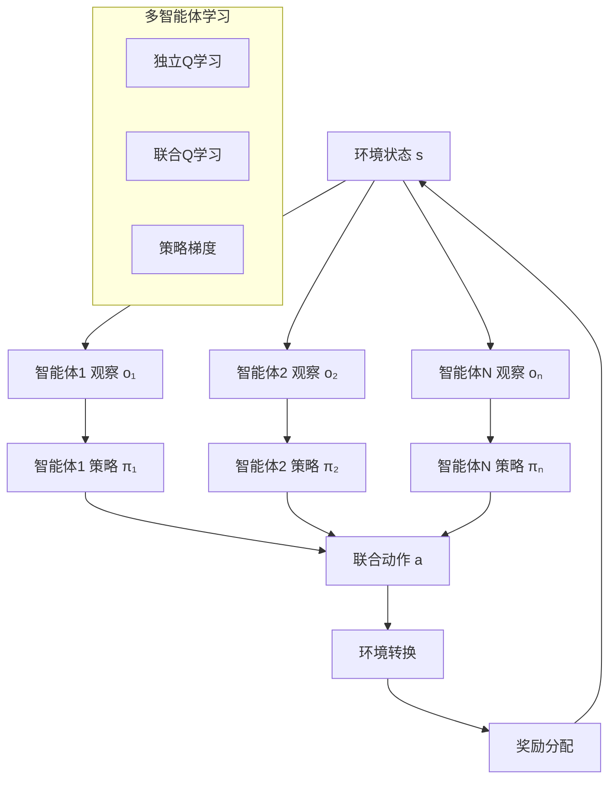
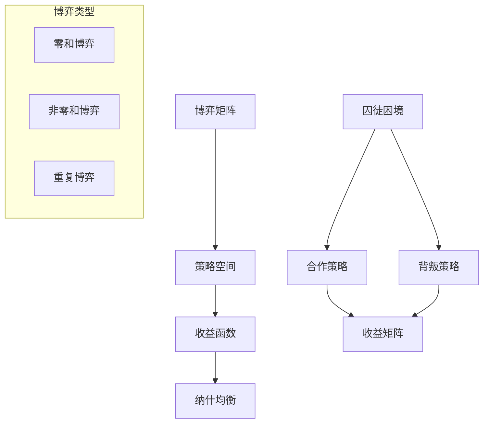
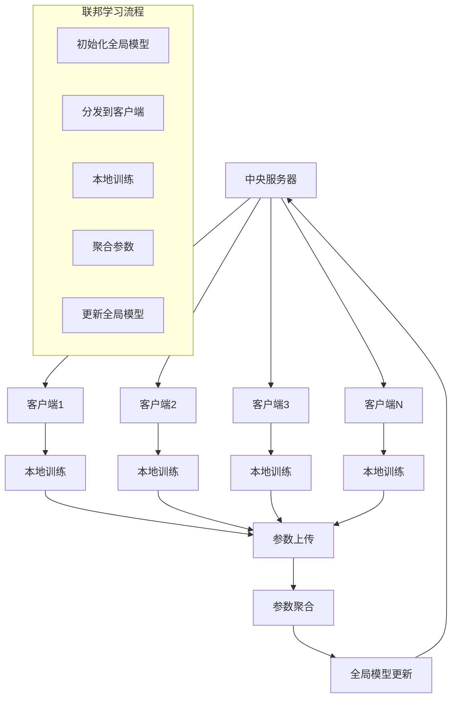

# 多智能体系统多表征示例 / Multi-Agent Systems Multi-Representation Example

## 概述 / Overview

本文档提供多智能体系统的多表征实现示例，包括多智能体强化学习、博弈论应用和分布式学习。

This document provides multi-representation implementation examples for multi-agent systems, including Multi-Agent Reinforcement Learning, Game Theory applications, and Distributed Learning.

## 1. 多智能体强化学习 / Multi-Agent Reinforcement Learning

### 1.1 MARL理论 / MARL Theory

#### 数学表示 / Mathematical Representation

多智能体强化学习在部分可观察马尔可夫决策过程中学习：

Multi-Agent Reinforcement Learning learns in Partially Observable Markov Decision Processes:

$$Q_i(s, a_i) = \mathbb{E}[r_i + \gamma \max_{a_i'} Q_i(s', a_i') | s, a_i]$$

其中：

- $Q_i$ 是智能体i的Q值函数
- $s$ 是全局状态
- $a_i$ 是智能体i的动作
- $r_i$ 是智能体i的奖励
- $\gamma$ 是折扣因子

where:

- $Q_i$ is the Q-value function for agent i
- $s$ is the global state
- $a_i$ is the action of agent i
- $r_i$ is the reward for agent i
- $\gamma$ is the discount factor

#### 可视化表示 / Visual Representation



#### Python实现 / Python Implementation

```python
import numpy as np
import torch
import torch.nn as nn
import torch.optim as optim
import torch.nn.functional as F
import matplotlib.pyplot as plt
from dataclasses import dataclass
from typing import List, Tuple, Dict, Optional
import random

@dataclass
class Agent:
    """智能体"""
    id: int
    state_size: int
    action_size: int
    learning_rate: float = 0.01
    epsilon: float = 0.1
    gamma: float = 0.95

class MultiAgentEnvironment:
    """多智能体环境"""
    
    def __init__(self, num_agents: int, grid_size: int = 5):
        self.num_agents = num_agents
        self.grid_size = grid_size
        self.positions = np.random.randint(0, grid_size, (num_agents, 2))
        self.targets = np.random.randint(0, grid_size, (num_agents, 2))
        
        # 避免初始位置与目标重叠
        for i in range(num_agents):
            while np.array_equal(self.positions[i], self.targets[i]):
                self.targets[i] = np.random.randint(0, grid_size, 2)
    
    def reset(self) -> Dict[int, np.ndarray]:
        """重置环境"""
        self.positions = np.random.randint(0, self.grid_size, (self.num_agents, 2))
        self.targets = np.random.randint(0, self.grid_size, (self.num_agents, 2))
        
        # 避免初始位置与目标重叠
        for i in range(self.num_agents):
            while np.array_equal(self.positions[i], self.targets[i]):
                self.targets[i] = np.random.randint(0, self.grid_size, 2)
        
        return self._get_observations()
    
    def step(self, actions: Dict[int, int]) -> Tuple[Dict[int, np.ndarray], Dict[int, float], bool]:
        """执行动作"""
        rewards = {}
        
        # 执行动作
        for agent_id, action in actions.items():
            if action == 0:  # 上
                self.positions[agent_id][1] = max(0, self.positions[agent_id][1] - 1)
            elif action == 1:  # 下
                self.positions[agent_id][1] = min(self.grid_size - 1, self.positions[agent_id][1] + 1)
            elif action == 2:  # 左
                self.positions[agent_id][0] = max(0, self.positions[agent_id][0] - 1)
            elif action == 3:  # 右
                self.positions[agent_id][0] = min(self.grid_size - 1, self.positions[agent_id][0] + 1)
        
        # 计算奖励
        for agent_id in range(self.num_agents):
            distance = np.linalg.norm(self.positions[agent_id] - self.targets[agent_id])
            if distance == 0:
                rewards[agent_id] = 10.0  # 到达目标
            else:
                rewards[agent_id] = -distance / self.grid_size  # 距离惩罚
        
        # 检查是否所有智能体都到达目标
        done = all(np.linalg.norm(self.positions[i] - self.targets[i]) == 0 
                  for i in range(self.num_agents))
        
        return self._get_observations(), rewards, done
    
    def _get_observations(self) -> Dict[int, np.ndarray]:
        """获取观察"""
        observations = {}
        for agent_id in range(self.num_agents):
            # 观察包括：当前位置、目标位置、其他智能体位置
            obs = np.concatenate([
                self.positions[agent_id],
                self.targets[agent_id],
                self.positions.flatten()  # 所有智能体位置
            ])
            observations[agent_id] = obs
        return observations

class MultiAgentQLearning:
    """多智能体Q学习"""
    
    def __init__(self, num_agents: int, state_size: int, action_size: int):
        self.num_agents = num_agents
        self.agents = {}
        self.q_tables = {}
        
        for i in range(num_agents):
            self.agents[i] = Agent(i, state_size, action_size)
            self.q_tables[i] = {}
    
    def get_action(self, agent_id: int, state: np.ndarray) -> int:
        """选择动作"""
        state_key = tuple(state)
        
        if state_key not in self.q_tables[agent_id]:
            self.q_tables[agent_id][state_key] = np.zeros(self.agents[agent_id].action_size)
        
        # ε-贪婪策略
        if random.random() < self.agents[agent_id].epsilon:
            return random.randint(0, self.agents[agent_id].action_size - 1)
        else:
            return np.argmax(self.q_tables[agent_id][state_key])
    
    def update(self, agent_id: int, state: np.ndarray, action: int, 
               reward: float, next_state: np.ndarray) -> None:
        """更新Q值"""
        state_key = tuple(state)
        next_state_key = tuple(next_state)
        
        if state_key not in self.q_tables[agent_id]:
            self.q_tables[agent_id][state_key] = np.zeros(self.agents[agent_id].action_size)
        
        if next_state_key not in self.q_tables[agent_id]:
            self.q_tables[agent_id][next_state_key] = np.zeros(self.agents[agent_id].action_size)
        
        # Q学习更新
        current_q = self.q_tables[agent_id][state_key][action]
        max_next_q = np.max(self.q_tables[agent_id][next_state_key])
        
        new_q = current_q + self.agents[agent_id].learning_rate * (
            reward + self.agents[agent_id].gamma * max_next_q - current_q
        )
        
        self.q_tables[agent_id][state_key][action] = new_q

def train_marl(env: MultiAgentEnvironment, marl: MultiAgentQLearning, 
               episodes: int = 1000) -> List[float]:
    """训练多智能体强化学习"""
    episode_rewards = []
    
    for episode in range(episodes):
        observations = env.reset()
        total_reward = 0
        step_count = 0
        
        while step_count < 100:  # 最大步数限制
            # 选择动作
            actions = {}
            for agent_id, obs in observations.items():
                actions[agent_id] = marl.get_action(agent_id, obs)
            
            # 执行动作
            next_observations, rewards, done = env.step(actions)
            
            # 更新Q值
            for agent_id in range(env.num_agents):
                marl.update(agent_id, observations[agent_id], actions[agent_id],
                           rewards[agent_id], next_observations[agent_id])
            
            # 更新总奖励
            total_reward += sum(rewards.values())
            observations = next_observations
            step_count += 1
            
            if done:
                break
        
        episode_rewards.append(total_reward)
        
        if episode % 100 == 0:
            print(f"Episode {episode}, Total Reward: {total_reward:.2f}")
    
    return episode_rewards

def visualize_marl_results(env: MultiAgentEnvironment, marl: MultiAgentQLearning) -> None:
    """可视化MARL结果"""
    # 运行一个测试回合
    observations = env.reset()
    step_count = 0
    
    plt.figure(figsize=(15, 5))
    
    while step_count < 20:
        # 选择动作
        actions = {}
        for agent_id, obs in observations.items():
            actions[agent_id] = marl.get_action(agent_id, obs)
        
        # 可视化当前状态
        plt.subplot(1, 3, 1)
        plt.clf()
        plt.imshow(np.zeros((env.grid_size, env.grid_size)), cmap='Blues')
        
        # 绘制智能体位置
        for i in range(env.num_agents):
            plt.scatter(env.positions[i][0], env.positions[i][1], 
                       c=f'C{i}', s=200, marker='o', label=f'Agent {i}')
            plt.scatter(env.targets[i][0], env.targets[i][1], 
                       c=f'C{i}', s=200, marker='*', label=f'Target {i}')
        
        plt.title(f'Step {step_count}')
        plt.legend()
        plt.grid(True)
        
        # 执行动作
        next_observations, rewards, done = env.step(actions)
        observations = next_observations
        step_count += 1
        
        if done:
            break
        
        plt.pause(0.5)
    
    plt.show()

# 测试MARL
if __name__ == "__main__":
    # 创建环境和智能体
    env = MultiAgentEnvironment(num_agents=3, grid_size=5)
    marl = MultiAgentQLearning(num_agents=3, state_size=12, action_size=4)
    
    # 训练
    rewards = train_marl(env, marl, episodes=500)
    
    # 可视化
    visualize_marl_results(env, marl)
    
    # 训练曲线
    plt.figure(figsize=(10, 6))
    plt.plot(rewards)
    plt.title('Multi-Agent Q-Learning Training')
    plt.xlabel('Episode')
    plt.ylabel('Total Reward')
    plt.grid(True, alpha=0.3)
    plt.show()

## 2. 博弈论应用 / Game Theory Applications

### 2.1 博弈论理论 / Game Theory Theory

#### 数学表示 / Mathematical Representation

博弈论中的纳什均衡：

Nash Equilibrium in Game Theory:

$$\pi_i^* \in \arg\max_{\pi_i} \mathbb{E}_{s \sim \rho^\pi, a \sim \pi} [R_i(s, a)]$$

其中：
- $\pi_i^*$ 是智能体i的最优策略
- $\rho^\pi$ 是策略π下的状态分布
- $R_i$ 是智能体i的奖励函数

where:
- $\pi_i^*$ is the optimal strategy for agent i
- $\rho^\pi$ is the state distribution under strategy π
- $R_i$ is the reward function for agent i

#### 可视化表示 / Visual Representation



#### 1Python实现 / Python Implementation

```python
import numpy as np
import torch
import torch.nn as nn
import torch.optim as optim
import matplotlib.pyplot as plt
from dataclasses import dataclass
from typing import List, Tuple, Dict, Optional
import itertools

@dataclass
class Game:
    """博弈"""
    num_players: int
    num_actions: int
    payoff_matrix: np.ndarray

class PrisonersDilemma(Game):
    """囚徒困境"""
    
    def __init__(self):
        # 合作=0, 背叛=1
        # 收益矩阵: (玩家1收益, 玩家2收益)
        payoff_matrix = np.array([
            [[3, 3], [0, 5]],  # 玩家1合作
            [[5, 0], [1, 1]]   # 玩家1背叛
        ])
        
        super().__init__(num_players=2, num_actions=2, payoff_matrix=payoff_matrix)

class NashEquilibriumFinder:
    """纳什均衡求解器"""
    
    def __init__(self, game: Game):
        self.game = game
    
    def find_pure_nash_equilibrium(self) -> List[Tuple[int, ...]]:
        """寻找纯策略纳什均衡"""
        equilibria = []
        
        # 检查所有可能的策略组合
        for strategy_profile in itertools.product(range(self.game.num_actions), 
                                                repeat=self.game.num_players):
            is_equilibrium = True
            
            # 检查每个玩家是否有更好的策略
            for player in range(self.game.num_players):
                current_payoff = self.game.payoff_matrix[strategy_profile][player]
                
                for alternative_action in range(self.game.num_actions):
                    if alternative_action == strategy_profile[player]:
                        continue
                    
                    # 构造替代策略组合
                    alt_strategy = list(strategy_profile)
                    alt_strategy[player] = alternative_action
                    alt_strategy = tuple(alt_strategy)
                    
                    alt_payoff = self.game.payoff_matrix[alt_strategy][player]
                    
                    if alt_payoff > current_payoff:
                        is_equilibrium = False
                        break
                
                if not is_equilibrium:
                    break
            
            if is_equilibrium:
                equilibria.append(strategy_profile)
        
        return equilibria

class EvolutionaryGame:
    """演化博弈"""
    
    def __init__(self, game: Game, population_size: int = 100):
        self.game = game
        self.population_size = population_size
        self.population = np.random.randint(0, game.num_actions, population_size)
    
    def play_round(self) -> np.ndarray:
        """进行一轮博弈"""
        payoffs = np.zeros(self.population_size)
        
        # 随机配对进行博弈
        for i in range(0, self.population_size, 2):
            if i + 1 < self.population_size:
                player1_action = self.population[i]
                player2_action = self.population[i + 1]
                
                payoff1 = self.game.payoff_matrix[player1_action, player2_action, 0]
                payoff2 = self.game.payoff_matrix[player2_action, player1_action, 1]
                
                payoffs[i] = payoff1
                payoffs[i + 1] = payoff2
        
        return payoffs
    
    def evolve(self, generations: int = 100) -> List[np.ndarray]:
        """演化过程"""
        history = []
        
        for generation in range(generations):
            # 计算适应度
            payoffs = self.play_round()
            
            # 记录当前种群分布
            action_counts = np.bincount(self.population, minlength=self.game.num_actions)
            history.append(action_counts / self.population_size)
            
            # 选择（轮盘赌选择）
            fitness = payoffs - np.min(payoffs) + 1e-6  # 避免负值
            probs = fitness / np.sum(fitness)
            
            # 生成新种群
            new_population = np.random.choice(
                self.population_size, 
                size=self.population_size, 
                p=probs
            )
            self.population = self.population[new_population]
            
            # 突变
            mutation_rate = 0.01
            mutations = np.random.random(self.population_size) < mutation_rate
            self.population[mutations] = np.random.randint(
                0, self.game.num_actions, np.sum(mutations)
            )
        
        return history

def visualize_game_theory_results(game: Game, nash_finder: NashEquilibriumFinder, 
                                 evo_game: EvolutionaryGame) -> None:
    """可视化博弈论结果"""
    plt.figure(figsize=(15, 5))
    
    # 收益矩阵热图
    plt.subplot(1, 3, 1)
    payoff_heatmap = np.zeros((game.num_actions, game.num_actions))
    for i in range(game.num_actions):
        for j in range(game.num_actions):
            payoff_heatmap[i, j] = game.payoff_matrix[i, j, 0]  # 玩家1收益
    
    plt.imshow(payoff_heatmap, cmap='RdYlBu')
    plt.colorbar()
    plt.title('Player 1 Payoff Matrix')
    plt.xlabel('Player 2 Action')
    plt.ylabel('Player 1 Action')
    
    # 纳什均衡
    plt.subplot(1, 3, 2)
    pure_equilibria = nash_finder.find_pure_nash_equilibrium()
    
    plt.text(0.1, 0.8, f'Pure Nash Equilibria: {pure_equilibria}', fontsize=10)
    plt.title('Nash Equilibria')
    plt.axis('off')
    
    # 演化过程
    plt.subplot(1, 3, 3)
    history = evo_game.evolve(generations=100)
    history = np.array(history)
    
    for i in range(game.num_actions):
        plt.plot(history[:, i], label=f'Action {i}')
    
    plt.title('Evolutionary Dynamics')
    plt.xlabel('Generation')
    plt.ylabel('Population Fraction')
    plt.legend()
    
    plt.tight_layout()
    plt.show()

# 测试博弈论
if __name__ == "__main__":
    # 创建囚徒困境博弈
    game = PrisonersDilemma()
    nash_finder = NashEquilibriumFinder(game)
    evo_game = EvolutionaryGame(game)
    
    # 可视化结果
    visualize_game_theory_results(game, nash_finder, evo_game)
    
    # 打印纳什均衡
    pure_equilibria = nash_finder.find_pure_nash_equilibrium()
    print(f"Pure Nash Equilibria: {pure_equilibria}")

## 3. 分布式学习 / Distributed Learning

### 3.1 分布式学习理论 / Distributed Learning Theory

#### 数学表示 / Mathematical Representation

联邦学习中的参数聚合：

Parameter Aggregation in Federated Learning:

$$\theta_{global}^{t+1} = \frac{1}{N} \sum_{i=1}^{N} \theta_i^t$$

其中：
- $\theta_{global}^{t+1}$ 是全局模型参数
- $\theta_i^t$ 是第i个客户端的本地参数
- $N$ 是客户端数量

where:
- $\theta_{global}^{t+1}$ is the global model parameters
- $\theta_i^t$ is the local parameters of client i
- $N$ is the number of clients

#### 可视化表示 / Visual Representation



#### 2Python实现 / Python Implementation

```python
import numpy as np
import torch
import torch.nn as nn
import torch.optim as optim
import torch.nn.functional as F
import matplotlib.pyplot as plt
from dataclasses import dataclass
from typing import List, Tuple, Dict, Optional
import copy
import random

@dataclass
class Client:
    """联邦学习客户端"""
    id: int
    model: nn.Module
    optimizer: optim.Optimizer
    data: torch.Tensor
    labels: torch.Tensor

class FederatedLearning:
    """联邦学习"""
    
    def __init__(self, global_model: nn.Module, num_clients: int = 5, 
                 local_epochs: int = 5, lr: float = 0.01):
        self.global_model = global_model
        self.num_clients = num_clients
        self.local_epochs = local_epochs
        self.lr = lr
        
        # 创建客户端
        self.clients = []
        self._create_clients()
    
    def _create_clients(self) -> None:
        """创建客户端"""
        # 生成模拟数据
        num_samples_per_client = 100
        input_dim = 10
        
        for i in range(self.num_clients):
            # 为每个客户端生成不同的数据分布
            mean = np.random.normal(0, 1, input_dim)
            data = torch.randn(num_samples_per_client, input_dim) + torch.tensor(mean, dtype=torch.float32)
            labels = torch.randint(0, 2, (num_samples_per_client,))
            
            # 创建客户端模型（复制全局模型）
            client_model = copy.deepcopy(self.global_model)
            client_optimizer = optim.SGD(client_model.parameters(), lr=self.lr)
            
            client = Client(
                id=i,
                model=client_model,
                optimizer=client_optimizer,
                data=data,
                labels=labels
            )
            self.clients.append(client)
    
    def train_client(self, client: Client) -> Dict[str, float]:
        """训练单个客户端"""
        client.model.train()
        total_loss = 0.0
        
        for epoch in range(self.local_epochs):
            # 前向传播
            outputs = client.model(client.data)
            loss = F.cross_entropy(outputs, client.labels)
            
            # 反向传播
            client.optimizer.zero_grad()
            loss.backward()
            client.optimizer.step()
            
            total_loss += loss.item()
        
        return {'loss': total_loss / self.local_epochs}
    
    def aggregate_parameters(self) -> None:
        """聚合客户端参数"""
        # 获取全局模型参数
        global_params = list(self.global_model.parameters())
        
        # 初始化聚合参数
        aggregated_params = [torch.zeros_like(param) for param in global_params]
        
        # 聚合所有客户端的参数
        for client in self.clients:
            client_params = list(client.model.parameters())
            for i, (global_param, client_param) in enumerate(zip(aggregated_params, client_params)):
                aggregated_params[i] += client_param.data
        
        # 平均参数
        for i, param in enumerate(aggregated_params):
            aggregated_params[i] = param / self.num_clients
        
        # 更新全局模型
        for global_param, aggregated_param in zip(global_params, aggregated_params):
            global_param.data.copy_(aggregated_param)
        
        # 更新客户端模型
        for client in self.clients:
            client_params = list(client.model.parameters())
            for client_param, aggregated_param in zip(client_params, aggregated_params):
                client_param.data.copy_(aggregated_param)
    
    def train_round(self) -> Dict[str, float]:
        """训练一轮联邦学习"""
        # 训练所有客户端
        client_losses = []
        for client in self.clients:
            loss_info = self.train_client(client)
            client_losses.append(loss_info['loss'])
        
        # 聚合参数
        self.aggregate_parameters()
        
        return {
            'avg_client_loss': np.mean(client_losses),
            'std_client_loss': np.std(client_losses)
        }
    
    def train(self, num_rounds: int = 10) -> List[Dict[str, float]]:
        """训练多轮联邦学习"""
        training_history = []
        
        for round_idx in range(num_rounds):
            round_info = self.train_round()
            training_history.append(round_info)
            
            print(f"Round {round_idx + 1}/{num_rounds}: "
                  f"Avg Loss = {round_info['avg_client_loss']:.4f}, "
                  f"Std Loss = {round_info['std_client_loss']:.4f}")
        
        return training_history

class AsynchronousLearning:
    """异步学习"""
    
    def __init__(self, global_model: nn.Module, num_workers: int = 3, 
                 update_frequency: int = 2):
        self.global_model = global_model
        self.num_workers = num_workers
        self.update_frequency = update_frequency
        self.worker_models = [copy.deepcopy(global_model) for _ in range(num_workers)]
        self.worker_optimizers = [optim.SGD(model.parameters(), lr=0.01) 
                                for model in self.worker_models]
        
        # 模拟数据
        self.worker_data = []
        for i in range(num_workers):
            data = torch.randn(50, 10) + i * 0.1  # 不同分布
            labels = torch.randint(0, 2, (50,))
            self.worker_data.append((data, labels))
    
    def worker_update(self, worker_id: int) -> float:
        """单个工作节点更新"""
        model = self.worker_models[worker_id]
        optimizer = self.worker_optimizers[worker_id]
        data, labels = self.worker_data[worker_id]
        
        model.train()
        outputs = model(data)
        loss = F.cross_entropy(outputs, labels)
        
        optimizer.zero_grad()
        loss.backward()
        optimizer.step()
        
        return loss.item()
    
    def global_update(self) -> None:
        """全局模型更新"""
        # 简单平均聚合
        global_params = list(self.global_model.parameters())
        aggregated_params = [torch.zeros_like(param) for param in global_params]
        
        for worker_model in self.worker_models:
            worker_params = list(worker_model.parameters())
            for i, (global_param, worker_param) in enumerate(zip(aggregated_params, worker_params)):
                aggregated_params[i] += worker_param.data
        
        for i, param in enumerate(aggregated_params):
            aggregated_params[i] = param / self.num_workers
        
        for global_param, aggregated_param in zip(global_params, aggregated_params):
            global_param.data.copy_(aggregated_param)
    
    def train(self, num_iterations: int = 100) -> List[float]:
        """异步训练"""
        global_losses = []
        
        for iteration in range(num_iterations):
            # 随机选择工作节点进行更新
            active_workers = random.sample(range(self.num_workers), 
                                         min(2, self.num_workers))
            
            worker_losses = []
            for worker_id in active_workers:
                loss = self.worker_update(worker_id)
                worker_losses.append(loss)
            
            # 定期更新全局模型
            if iteration % self.update_frequency == 0:
                self.global_update()
            
            global_losses.append(np.mean(worker_losses))
        
        return global_losses

def visualize_distributed_learning_results(fed_learning: FederatedLearning, 
                                         async_learning: AsynchronousLearning) -> None:
    """可视化分布式学习结果"""
    plt.figure(figsize=(15, 5))
    
    # 联邦学习训练历史
    plt.subplot(1, 3, 1)
    fed_history = fed_learning.train(num_rounds=10)
    rounds = range(1, len(fed_history) + 1)
    
    avg_losses = [info['avg_client_loss'] for info in fed_history]
    std_losses = [info['std_client_loss'] for info in fed_history]
    
    plt.plot(rounds, avg_losses, 'b-', label='Average Loss')
    plt.fill_between(rounds, 
                    [avg - std for avg, std in zip(avg_losses, std_losses)],
                    [avg + std for avg, std in zip(avg_losses, std_losses)],
                    alpha=0.3, label='±1 Std')
    plt.title('Federated Learning Training')
    plt.xlabel('Round')
    plt.ylabel('Loss')
    plt.legend()
    plt.grid(True, alpha=0.3)
    
    # 异步学习训练历史
    plt.subplot(1, 3, 2)
    async_losses = async_learning.train(num_iterations=100)
    iterations = range(1, len(async_losses) + 1)
    
    plt.plot(iterations, async_losses, 'r-', label='Global Loss')
    plt.title('Asynchronous Learning Training')
    plt.xlabel('Iteration')
    plt.ylabel('Loss')
    plt.legend()
    plt.grid(True, alpha=0.3)
    
    # 比较不同方法
    plt.subplot(1, 3, 3)
    plt.plot(rounds, avg_losses, 'b-', label='Federated Learning')
    plt.plot(iterations[::10], async_losses[::10], 'r-', label='Async Learning')
    plt.title('Method Comparison')
    plt.xlabel('Training Step')
    plt.ylabel('Loss')
    plt.legend()
    plt.grid(True, alpha=0.3)
    
    plt.tight_layout()
    plt.show()

# 测试分布式学习
if __name__ == "__main__":
    # 创建简单模型
    class SimpleModel(nn.Module):
        def __init__(self, input_dim: int = 10, hidden_dim: int = 20, num_classes: int = 2):
            super(SimpleModel, self).__init__()
            self.fc1 = nn.Linear(input_dim, hidden_dim)
            self.fc2 = nn.Linear(hidden_dim, num_classes)
        
        def forward(self, x: torch.Tensor) -> torch.Tensor:
            x = F.relu(self.fc1(x))
            x = self.fc2(x)
            return x
    
    # 联邦学习测试
    global_model = SimpleModel()
    fed_learning = FederatedLearning(global_model, num_clients=5)
    
    # 异步学习测试
    async_model = SimpleModel()
    async_learning = AsynchronousLearning(async_model, num_workers=3)
    
    # 可视化结果
    visualize_distributed_learning_results(fed_learning, async_learning)

## 总结 / Summary

### 4.1 多智能体系统核心概念 / Core Concepts of Multi-Agent Systems

#### 4.1.1 多智能体强化学习 / Multi-Agent Reinforcement Learning

多智能体强化学习是多智能体系统的核心组成部分，它扩展了单智能体强化学习的概念，处理多个智能体在共享环境中的学习问题。

**关键特点：**
- **部分可观察性**：每个智能体只能观察到环境的部分信息
- **非平稳性**：其他智能体的策略变化会影响环境动态
- **维度灾难**：状态和动作空间随智能体数量指数增长
- **协调与竞争**：智能体之间需要平衡合作与竞争

**主要算法：**
- **独立Q学习（IQL）**：每个智能体独立学习，忽略其他智能体的存在
- **联合策略学习**：考虑所有智能体的联合策略空间
- **经验回放**：存储和重用历史经验以提高学习效率

#### 4.1.2 博弈论应用 / Game Theory Applications

博弈论为多智能体系统提供了理论基础，用于分析智能体之间的策略互动。

**核心概念：**
- **纳什均衡**：在给定其他智能体策略的情况下，没有智能体能够通过单方面改变策略来获得更高收益
- **策略空间**：所有可能的策略组合
- **收益矩阵**：描述不同策略组合下各智能体的收益
- **演化博弈**：研究策略在种群中的传播和演化

**典型博弈：**
- **囚徒困境**：经典的合作与背叛博弈
- **零和博弈**：一方的收益等于另一方的损失
- **重复博弈**：智能体进行多轮互动

#### 4.1.3 分布式学习 / Distributed Learning

分布式学习解决了多智能体系统中的数据分布和计算资源分散问题。

**主要方法：**
- **联邦学习**：在保护隐私的前提下，多个客户端协作训练全局模型
- **异步学习**：允许不同工作节点以不同速度进行更新
- **参数聚合**：将多个本地模型的参数合并为全局模型

**技术挑战：**
- **通信开销**：智能体之间的参数传输成本
- **隐私保护**：保护本地数据不被泄露
- **收敛性**：确保分布式训练的稳定性

### 4.2 多表征方法的价值 / Value of Multi-Representation Methods

#### 4.2.1 数学表示 / Mathematical Representation

数学表示提供了精确的理论基础：
- **形式化定义**：明确定义概念和算法
- **理论分析**：提供收敛性和最优性保证
- **算法设计**：指导实际实现

#### 4.2.2 可视化表示 / Visual Representation

可视化表示增强了理解：
- **直观理解**：通过图表理解复杂概念
- **流程展示**：清晰展示算法流程
- **关系映射**：展示不同组件之间的关系

#### 4.2.3 代码实现 / Code Implementation

代码实现提供了实践指导：
- **实际应用**：可直接运行的代码示例
- **参数调优**：展示关键参数的影响
- **性能评估**：提供评估指标和可视化

### 4.3 应用前景 / Application Prospects

#### 4.3.1 实际应用领域 / Real-World Applications

**智能交通系统：**
- 多车辆路径规划
- 交通信号优化
- 自动驾驶协调

**智能电网：**
- 分布式能源管理
- 负载平衡
- 故障检测

**机器人协作：**
- 多机器人任务分配
- 协同操作
- 群体智能

#### 4.3.2 技术发展趋势 / Technical Development Trends

**算法创新：**
- 深度强化学习与多智能体结合
- 注意力机制在多智能体中的应用
- 元学习在多智能体系统中的应用

**系统优化：**
- 大规模多智能体系统的可扩展性
- 实时性和延迟优化
- 鲁棒性和容错性

**理论发展：**
- 多智能体博弈论的深化
- 分布式优化的新理论
- 多智能体学习的理论保证

### 4.4 总结 / Conclusion

多智能体系统作为人工智能的重要分支，通过多智能体强化学习、博弈论和分布式学习等核心技术，为解决复杂现实问题提供了强大的工具。多表征方法不仅增强了理论理解的深度，也为实际应用提供了全面的指导。

随着技术的不断发展，多智能体系统将在更多领域发挥重要作用，推动人工智能向更高层次发展。通过持续的理论创新和实践应用，多智能体系统将为构建更智能、更协调的人工智能系统做出重要贡献。
