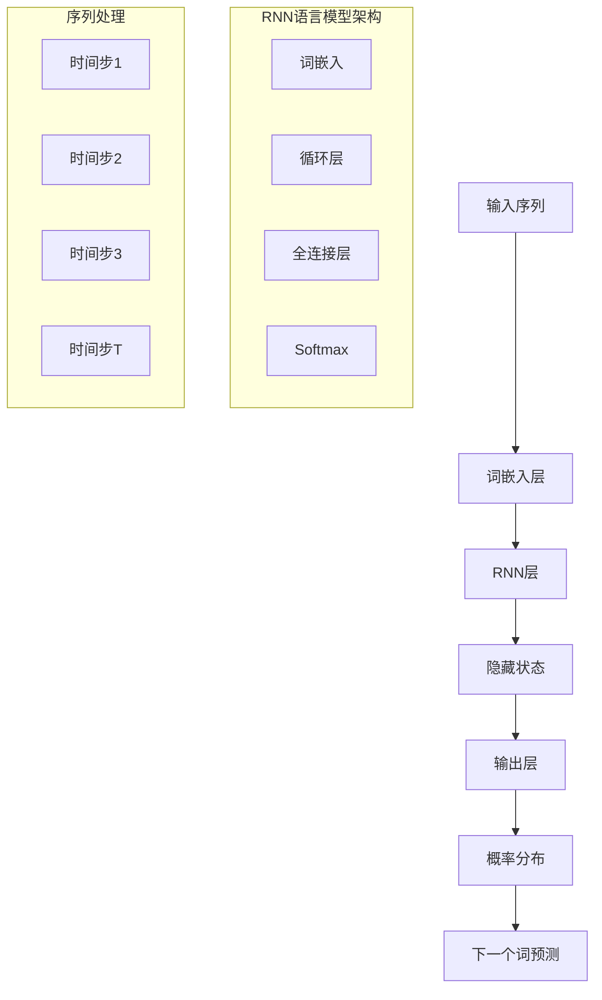

# 自然语言处理扩展多表征示例 / Natural Language Processing Extension Multi-Representation Examples

## 概述 / Overview

本文档提供了自然语言处理扩展的完整多表征示例，包括语言模型、机器翻译和文本生成。每种方法都包含数学表示、可视化图表和完整的代码实现。

## 1. 语言模型 / Language Models

### 1.1 循环神经网络语言模型 / Recurrent Neural Network Language Model

#### 数学表示 / Mathematical Representation

循环神经网络语言模型通过序列建模来预测下一个词：

RNN Language Model predicts the next word through sequence modeling:

$$P(w_t | w_{1:t-1}) = \text{softmax}(W_o h_t + b_o)$$

其中：

- $w_t$ 是第$t$个词
- $h_t$ 是隐藏状态
- $W_o$ 是输出权重矩阵
- $b_o$ 是偏置项

where:

- $w_t$ is the $t$-th word
- $h_t$ is the hidden state
- $W_o$ is the output weight matrix
- $b_o$ is the bias term

隐藏状态更新：

Hidden State Update:

$$h_t = \tanh(W_h h_{t-1} + W_x x_t + b_h)$$

其中：

- $W_h$ 是隐藏层权重矩阵
- $W_x$ 是输入权重矩阵
- $x_t$ 是词嵌入
- $b_h$ 是隐藏层偏置

where:

- $W_h$ is the hidden layer weight matrix
- $W_x$ is the input weight matrix
- $x_t$ is the word embedding
- $b_h$ is the hidden layer bias

#### 可视化表示 / Visual Representation



#### Python实现 / Python Implementation

```python
import torch
import torch.nn as nn
import torch.nn.functional as F
import torch.optim as optim
import numpy as np
import matplotlib.pyplot as plt
from collections import Counter
import re
from typing import List, Tuple, Dict, Optional
import warnings
warnings.filterwarnings('ignore')

class RNNLanguageModel(nn.Module):
    """循环神经网络语言模型"""
    
    def __init__(self, vocab_size: int, embedding_dim: int = 128, 
                 hidden_dim: int = 256, num_layers: int = 2, dropout: float = 0.5):
        super(RNNLanguageModel, self).__init__()
        self.vocab_size = vocab_size
        self.embedding_dim = embedding_dim
        self.hidden_dim = hidden_dim
        self.num_layers = num_layers
        
        # 词嵌入层
        self.embedding = nn.Embedding(vocab_size, embedding_dim)
        
        # LSTM层
        self.lstm = nn.LSTM(embedding_dim, hidden_dim, num_layers, 
                           dropout=dropout if num_layers > 1 else 0, 
                           batch_first=True)
        
        # 输出层
        self.dropout = nn.Dropout(dropout)
        self.fc = nn.Linear(hidden_dim, vocab_size)
        
    def forward(self, x: torch.Tensor, hidden: Optional[Tuple[torch.Tensor, torch.Tensor]] = None) -> Tuple[torch.Tensor, Tuple[torch.Tensor, torch.Tensor]]:
        """前向传播"""
        # 词嵌入
        embedded = self.embedding(x)
        
        # LSTM前向传播
        lstm_out, hidden = self.lstm(embedded, hidden)
        
        # 输出层
        output = self.dropout(lstm_out)
        output = self.fc(output)
        
        return output, hidden
    
    def init_hidden(self, batch_size: int, device: torch.device) -> Tuple[torch.Tensor, torch.Tensor]:
        """初始化隐藏状态"""
        return (torch.zeros(self.num_layers, batch_size, self.hidden_dim).to(device),
                torch.zeros(self.num_layers, batch_size, self.hidden_dim).to(device))

class TextPreprocessor:
    """文本预处理器"""
    
    def __init__(self, min_freq: int = 2):
        self.min_freq = min_freq
        self.word2idx = {}
        self.idx2word = {}
        self.vocab_size = 0
        
    def build_vocab(self, texts: List[str]) -> None:
        """构建词汇表"""
        # 统计词频
        word_counts = Counter()
        for text in texts:
            words = self.tokenize(text)
            word_counts.update(words)
        
        # 过滤低频词
        vocab = ['<PAD>', '<UNK>', '<START>', '<END>'] + \
                [word for word, count in word_counts.items() if count >= self.min_freq]
        
        # 创建映射
        self.word2idx = {word: idx for idx, word in enumerate(vocab)}
        self.idx2word = {idx: word for word, idx in self.word2idx.items()}
        self.vocab_size = len(vocab)
        
    def tokenize(self, text: str) -> List[str]:
        """分词"""
        # 简单的空格分词
        return re.findall(r'\b\w+\b', text.lower())
    
    def encode(self, text: str, max_length: int = 50) -> List[int]:
        """编码文本"""
        words = self.tokenize(text)
        encoded = [self.word2idx.get(word, self.word2idx['<UNK>']) for word in words]
        
        # 截断或填充
        if len(encoded) > max_length:
            encoded = encoded[:max_length]
        else:
            encoded = encoded + [self.word2idx['<PAD>']] * (max_length - len(encoded))
        
        return encoded
    
    def decode(self, indices: List[int]) -> str:
        """解码索引"""
        words = [self.idx2word.get(idx, '<UNK>') for idx in indices]
        return ' '.join(words)

def generate_sample_text() -> List[str]:
    """生成示例文本"""
    return [
        "the quick brown fox jumps over the lazy dog",
        "machine learning is a subset of artificial intelligence",
        "deep learning models can process large amounts of data",
        "natural language processing helps computers understand human language",
        "neural networks are inspired by biological brain structures",
        "the transformer architecture revolutionized natural language processing",
        "attention mechanisms allow models to focus on relevant information",
        "language models can generate human like text",
        "computer vision enables machines to interpret visual information",
        "reinforcement learning agents learn through trial and error"
    ] * 10  # 重复10次增加数据量

def create_sequences(texts: List[str], preprocessor: TextPreprocessor, 
                    seq_length: int = 10) -> Tuple[torch.Tensor, torch.Tensor]:
    """创建训练序列"""
    input_sequences = []
    target_sequences = []
    
    for text in texts:
        encoded = preprocessor.encode(text, seq_length + 1)
        
        for i in range(len(encoded) - seq_length):
            input_seq = encoded[i:i + seq_length]
            target_seq = encoded[i + 1:i + seq_length + 1]
            input_sequences.append(input_seq)
            target_sequences.append(target_seq)
    
    return torch.LongTensor(input_sequences), torch.LongTensor(target_sequences)

def train_language_model(model: RNNLanguageModel, train_data: Tuple[torch.Tensor, torch.Tensor],
                        epochs: int = 100, batch_size: int = 32, lr: float = 0.001) -> List[float]:
    """训练语言模型"""
    device = torch.device('cuda' if torch.cuda.is_available() else 'cpu')
    model.to(device)
    
    criterion = nn.CrossEntropyLoss(ignore_index=0)  # 忽略PAD token
    optimizer = optim.Adam(model.parameters(), lr=lr)
    
    input_data, target_data = train_data
    input_data = input_data.to(device)
    target_data = target_data.to(device)
    
    losses = []
    
    for epoch in range(epochs):
        model.train()
        total_loss = 0
        num_batches = 0
        
        # 批次训练
        for i in range(0, len(input_data), batch_size):
            batch_input = input_data[i:i + batch_size]
            batch_target = target_data[i:i + batch_size]
            
            # 前向传播
            output, _ = model(batch_input)
            
            # 计算损失
            loss = criterion(output.view(-1, model.vocab_size), batch_target.view(-1))
            
            # 反向传播
            optimizer.zero_grad()
            loss.backward()
            torch.nn.utils.clip_grad_norm_(model.parameters(), max_norm=1.0)
            optimizer.step()
            
            total_loss += loss.item()
            num_batches += 1
        
        avg_loss = total_loss / num_batches
        losses.append(avg_loss)
        
        if epoch % 20 == 0:
            print(f"Epoch {epoch}: Loss = {avg_loss:.4f}")
    
    return losses

def generate_text(model: RNNLanguageModel, preprocessor: TextPreprocessor, 
                  start_text: str = "the", max_length: int = 20, temperature: float = 1.0) -> str:
    """生成文本"""
    device = torch.device('cuda' if torch.cuda.is_available() else 'cpu')
    model.eval()
    
    # 初始化
    words = preprocessor.tokenize(start_text)
    generated = words.copy()
    
    # 初始化隐藏状态
    hidden = model.init_hidden(1, device)
    
    with torch.no_grad():
        for _ in range(max_length):
            # 编码当前词
            if words:
                word_idx = preprocessor.word2idx.get(words[-1], preprocessor.word2idx['<UNK>'])
                input_tensor = torch.LongTensor([[word_idx]]).to(device)
            else:
                input_tensor = torch.LongTensor([[preprocessor.word2idx['<START>']]]).to(device)
            
            # 前向传播
            output, hidden = model(input_tensor, hidden)
            
            # 采样下一个词
            probs = F.softmax(output[0, -1] / temperature, dim=-1)
            next_word_idx = torch.multinomial(probs, 1).item()
            
            # 获取词
            next_word = preprocessor.idx2word[next_word_idx]
            
            # 停止条件
            if next_word in ['<PAD>', '<END>'] or len(generated) >= max_length:
                break
            
            generated.append(next_word)
            words = [next_word]
    
    return ' '.join(generated)

def visualize_training(losses: List[float]) -> None:
    """可视化训练过程"""
    plt.figure(figsize=(12, 4))
    
    # 损失曲线
    plt.subplot(1, 2, 1)
    plt.plot(losses, color='blue', alpha=0.7)
    plt.title('Language Model Training Loss')
    plt.xlabel('Epoch')
    plt.ylabel('Loss')
    plt.grid(True, alpha=0.3)
    
    # 损失分布
    plt.subplot(1, 2, 2)
    plt.hist(losses, bins=20, color='green', alpha=0.7)
    plt.title('Loss Distribution')
    plt.xlabel('Loss')
    plt.ylabel('Frequency')
    plt.grid(True, alpha=0.3)
    
    plt.tight_layout()
    plt.show()

# 测试语言模型
if __name__ == "__main__":
    # 准备数据
    texts = generate_sample_text()
    preprocessor = TextPreprocessor(min_freq=1)
    preprocessor.build_vocab(texts)
    
    print(f"词汇表大小: {preprocessor.vocab_size}")
    print(f"示例词汇: {list(preprocessor.word2idx.keys())[:10]}")
    
    # 创建训练数据
    input_data, target_data = create_sequences(texts, preprocessor, seq_length=8)
    print(f"训练样本数: {len(input_data)}")
    
    # 创建模型
    model = RNNLanguageModel(
        vocab_size=preprocessor.vocab_size,
        embedding_dim=64,
        hidden_dim=128,
        num_layers=2,
        dropout=0.3
    )
    
    # 训练模型
    losses = train_language_model(model, (input_data, target_data), epochs=50)
    
    # 可视化训练过程
    visualize_training(losses)
    
    # 生成文本
    print("\n生成文本示例:")
    for start_word in ["the", "machine", "deep", "neural"]:
        generated = generate_text(model, preprocessor, start_word, max_length=10)
        print(f"'{start_word}' -> '{generated}'")
