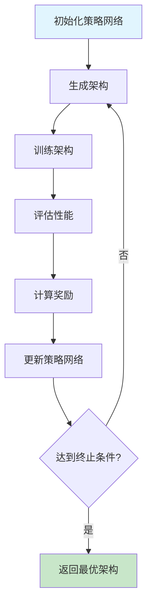
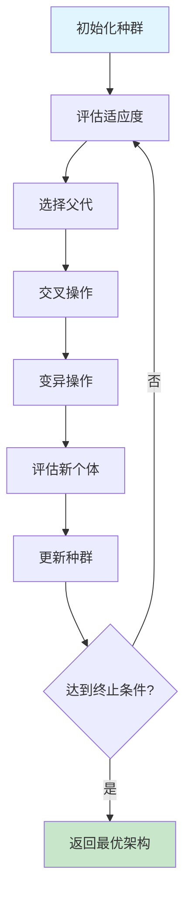
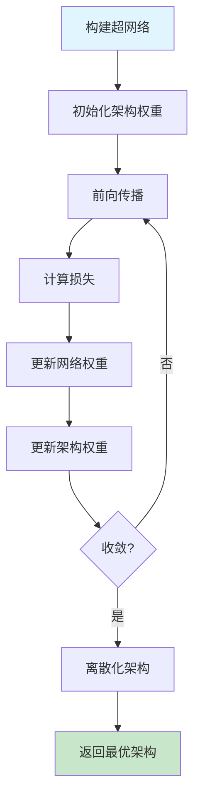

# 神经架构搜索扩展多表征示例 / Neural Architecture Search Extension Multi-Representation Examples

## 概述 / Overview

神经架构搜索（Neural Architecture Search, NAS）是自动化机器学习的重要分支，旨在自动发现最优的神经网络架构。本扩展提供了三种主要的搜索策略：强化学习搜索、进化算法搜索和可微分搜索。

Neural Architecture Search (NAS) is a crucial branch of automated machine learning, aiming to automatically discover optimal neural network architectures. This extension provides three main search strategies: Reinforcement Learning Search, Evolutionary Algorithm Search, and Differentiable Search.

## 1. 强化学习搜索 / Reinforcement Learning Search

### 1.1 数学表示 / Mathematical Representation

#### 1.1.1 策略网络 / Policy Network
策略网络定义搜索空间中的动作分布：

The policy network defines the action distribution in the search space:

$$P(a_t|s_t; \theta) = \text{softmax}(f_\theta(s_t))$$

其中 $s_t$ 是当前状态，$a_t$ 是选择的动作，$\theta$ 是策略网络参数。

where $s_t$ is the current state, $a_t$ is the selected action, and $\theta$ are the policy network parameters.

#### 1.1.2 奖励函数 / Reward Function
奖励基于验证性能：

The reward is based on validation performance:

$$R(\tau) = \text{Accuracy}_{\text{val}}(\mathcal{A}_\tau) - \lambda \cdot \text{Complexity}(\mathcal{A}_\tau)$$

其中 $\mathcal{A}_\tau$ 是架构，$\lambda$ 是复杂度惩罚系数。

where $\mathcal{A}_\tau$ is the architecture and $\lambda$ is the complexity penalty coefficient.

#### 1.1.3 策略梯度 / Policy Gradient
使用REINFORCE算法更新策略：

Update policy using REINFORCE algorithm:

$$\nabla_\theta J(\theta) = \mathbb{E}_{\tau \sim P_\theta} [R(\tau) \nabla_\theta \log P_\theta(\tau)]$$

### 1.2 流程图 / Flowchart



### 1.3 Python实现 / Python Implementation

```python
import numpy as np
import torch
import torch.nn as nn
import torch.nn.functional as F
from typing import List, Tuple, Dict, Any
import random

class Architecture:
    """神经网络架构表示"""
    def __init__(self, layers: List[Dict[str, Any]]):
        self.layers = layers
        self.accuracy = 0.0
        self.complexity = 0.0
    
    def __str__(self):
        return f"Architecture(accuracy={self.accuracy:.4f}, complexity={self.complexity:.2f})"

class PolicyNetwork(nn.Module):
    """策略网络 - 生成架构决策"""
    def __init__(self, state_dim: int, action_dim: int, hidden_dim: int = 128):
        super().__init__()
        self.fc1 = nn.Linear(state_dim, hidden_dim)
        self.fc2 = nn.Linear(hidden_dim, hidden_dim)
        self.fc3 = nn.Linear(hidden_dim, action_dim)
        
    def forward(self, state):
        x = F.relu(self.fc1(state))
        x = F.relu(self.fc2(x))
        logits = self.fc3(x)
        return F.softmax(logits, dim=-1)

class RLNASController:
    """强化学习NAS控制器"""
    def __init__(self, state_dim: int, action_dim: int, lr: float = 0.001):
        self.policy_network = PolicyNetwork(state_dim, action_dim)
        self.optimizer = torch.optim.Adam(self.policy_network.parameters(), lr=lr)
        self.action_space = self._create_action_space()
        
    def _create_action_space(self) -> List[Dict[str, Any]]:
        """创建动作空间"""
        actions = []
        # 层类型
        layer_types = ['conv', 'pool', 'fc']
        # 卷积核大小
        kernel_sizes = [1, 3, 5, 7]
        # 通道数
        channels = [16, 32, 64, 128, 256]
        # 激活函数
        activations = ['relu', 'tanh', 'sigmoid']
        
        for layer_type in layer_types:
            if layer_type == 'conv':
                for kernel_size in kernel_sizes:
                    for channel in channels:
                        for activation in activations:
                            actions.append({
                                'type': layer_type,
                                'kernel_size': kernel_size,
                                'channels': channel,
                                'activation': activation
                            })
            elif layer_type == 'pool':
                for kernel_size in [2, 3]:
                    actions.append({
                        'type': layer_type,
                        'kernel_size': kernel_size
                    })
            else:  # fc
                for units in [64, 128, 256, 512]:
                    for activation in activations:
                        actions.append({
                            'type': layer_type,
                            'units': units,
                            'activation': activation
                        })
        return actions
    
    def get_state(self, current_architecture: List[Dict]) -> torch.Tensor:
        """获取当前状态表示"""
        # 简化的状态表示：当前层数、平均通道数、平均核大小
        if not current_architecture:
            return torch.zeros(3)
        
        layer_count = len(current_architecture)
        avg_channels = 0
        avg_kernel_size = 0
        conv_count = 0
        
        for layer in current_architecture:
            if layer['type'] == 'conv':
                avg_channels += layer['channels']
                avg_kernel_size += layer['kernel_size']
                conv_count += 1
        
        if conv_count > 0:
            avg_channels /= conv_count
            avg_kernel_size /= conv_count
        
        return torch.tensor([layer_count, avg_channels, avg_kernel_size], dtype=torch.float32)
    
    def sample_action(self, state: torch.Tensor) -> Tuple[int, float]:
        """采样动作"""
        with torch.no_grad():
            action_probs = self.policy_network(state)
            action_dist = torch.distributions.Categorical(action_probs)
            action = action_dist.sample()
            log_prob = action_dist.log_prob(action)
            return action.item(), log_prob.item()
    
    def generate_architecture(self, max_layers: int = 10) -> Architecture:
        """生成完整架构"""
        architecture = []
        log_probs = []
        
        for _ in range(max_layers):
            state = self.get_state(architecture)
            action_idx, log_prob = self.sample_action(state)
            action = self.action_space[action_idx]
            
            architecture.append(action)
            log_probs.append(log_prob)
            
            # 简单的终止条件
            if len(architecture) >= 3 and action['type'] == 'fc':
                break
        
        return Architecture(architecture), log_probs
    
    def update_policy(self, rewards: List[float], log_probs: List[List[float]]):
        """更新策略网络"""
        policy_loss = 0
        for reward, episode_log_probs in zip(rewards, log_probs):
            episode_loss = -torch.tensor(episode_log_probs).sum() * reward
            policy_loss += episode_loss
        
        self.optimizer.zero_grad()
        policy_loss.backward()
        self.optimizer.step()

class ArchitectureEvaluator:
    """架构评估器（简化版）"""
    def __init__(self):
        self.evaluation_cache = {}
    
    def evaluate(self, architecture: Architecture) -> float:
        """评估架构性能（简化实现）"""
        # 计算复杂度
        complexity = self._calculate_complexity(architecture)
        
        # 模拟性能评估（实际应用中需要训练模型）
        accuracy = self._simulate_accuracy(architecture)
        
        architecture.complexity = complexity
        architecture.accuracy = accuracy
        
        # 计算奖励
        reward = accuracy - 0.001 * complexity
        return reward
    
    def _calculate_complexity(self, architecture: Architecture) -> float:
        """计算架构复杂度"""
        total_params = 0
        for layer in architecture.layers:
            if layer['type'] == 'conv':
                # 简化的参数计算
                total_params += layer['channels'] * layer['kernel_size'] ** 2
            elif layer['type'] == 'fc':
                total_params += layer['units']
        return total_params
    
    def _simulate_accuracy(self, architecture: Architecture) -> float:
        """模拟准确率（实际应用中需要真实训练）"""
        # 基于架构特征模拟性能
        conv_layers = sum(1 for layer in architecture.layers if layer['type'] == 'conv')
        fc_layers = sum(1 for layer in architecture.layers if layer['type'] == 'fc')
        
        # 简化的性能模型
        base_accuracy = 0.7
        conv_bonus = min(conv_layers * 0.02, 0.1)
        fc_bonus = min(fc_layers * 0.01, 0.05)
        
        # 添加随机噪声
        noise = np.random.normal(0, 0.02)
        
        return np.clip(base_accuracy + conv_bonus + fc_bonus + noise, 0.5, 0.95)

def train_rl_nas(episodes: int = 100, max_layers: int = 10):
    """训练强化学习NAS"""
    state_dim = 3  # 层数、平均通道数、平均核大小
    action_dim = 50  # 动作空间大小
    
    controller = RLNASController(state_dim, action_dim)
    evaluator = ArchitectureEvaluator()
    
    best_architecture = None
    best_reward = -float('inf')
    
    for episode in range(episodes):
        # 生成架构
        architecture, log_probs = controller.generate_architecture(max_layers)
        
        # 评估架构
        reward = evaluator.evaluate(architecture)
        
        # 更新最佳架构
        if reward > best_reward:
            best_reward = reward
            best_architecture = architecture
        
        # 更新策略
        controller.update_policy([reward], [log_probs])
        
        if episode % 10 == 0:
            print(f"Episode {episode}: Reward = {reward:.4f}, Best = {best_reward:.4f}")
    
    return best_architecture, best_reward

def visualize_rl_nas_architecture(architecture: Architecture):
    """可视化RL-NAS架构"""
    print("=== 强化学习NAS架构 ===")
    print(f"准确率: {architecture.accuracy:.4f}")
    print(f"复杂度: {architecture.complexity:.2f}")
    print("\n层结构:")
    
    for i, layer in enumerate(architecture.layers):
        if layer['type'] == 'conv':
            print(f"  {i+1}. Conv2D(kernel={layer['kernel_size']}, channels={layer['channels']}, activation={layer['activation']})")
        elif layer['type'] == 'pool':
            print(f"  {i+1}. MaxPool2D(kernel={layer['kernel_size']})")
        elif layer['type'] == 'fc':
            print(f"  {i+1}. Dense(units={layer['units']}, activation={layer['activation']})")

# 使用示例
if __name__ == "__main__":
    print("训练强化学习NAS...")
    best_arch, best_reward = train_rl_nas(episodes=50)
    visualize_rl_nas_architecture(best_arch)
```

## 2. 进化算法搜索 / Evolutionary Algorithm Search

### 2.1 数学表示 / Mathematical Representation

#### 2.1.1 种群表示 / Population Representation
种群 $P_t$ 包含 $N$ 个个体（架构）：

Population $P_t$ contains $N$ individuals (architectures):

$$P_t = \{\mathcal{A}_1^{(t)}, \mathcal{A}_2^{(t)}, ..., \mathcal{A}_N^{(t)}\}$$

#### 2.1.2 适应度函数 / Fitness Function
适应度基于验证准确率和复杂度：

Fitness based on validation accuracy and complexity:

$$f(\mathcal{A}) = \text{Accuracy}_{\text{val}}(\mathcal{A}) - \lambda \cdot \text{Complexity}(\mathcal{A})$$

#### 2.1.3 选择操作 / Selection Operation
使用锦标赛选择：

Using tournament selection:

$$P(\mathcal{A}_i \text{ selected}) = \frac{f(\mathcal{A}_i)}{\sum_{j=1}^{N} f(\mathcal{A}_j)}$$

#### 2.1.4 交叉操作 / Crossover Operation
架构交叉：

Architecture crossover:

$$\mathcal{A}_{\text{child}} = \text{Crossover}(\mathcal{A}_{\text{parent1}}, \mathcal{A}_{\text{parent2}})$$

#### 2.1.5 变异操作 / Mutation Operation
随机变异：

Random mutation:

$$\mathcal{A}_{\text{mutated}} = \text{Mutate}(\mathcal{A}_{\text{original}}, p_{\text{mutation}})$$

### 2.2 流程图 / Flowchart



### 2.3 Python实现 / Python Implementation

```python
import numpy as np
import random
from typing import List, Tuple, Dict, Any
from copy import deepcopy

class EvolutionaryNAS:
    """进化算法NAS"""
    def __init__(self, population_size: int = 50, mutation_rate: float = 0.1):
        self.population_size = population_size
        self.mutation_rate = mutation_rate
        self.population = []
        self.fitness_history = []
        
    def initialize_population(self):
        """初始化种群"""
        self.population = []
        for _ in range(self.population_size):
            architecture = self._generate_random_architecture()
            self.population.append(architecture)
    
    def _generate_random_architecture(self) -> Architecture:
        """生成随机架构"""
        num_layers = random.randint(3, 8)
        layers = []
        
        for i in range(num_layers):
            if i < num_layers - 1:  # 不是最后一层
                layer_type = random.choice(['conv', 'pool'])
                if layer_type == 'conv':
                    layer = {
                        'type': 'conv',
                        'kernel_size': random.choice([1, 3, 5, 7]),
                        'channels': random.choice([16, 32, 64, 128, 256]),
                        'activation': random.choice(['relu', 'tanh', 'sigmoid'])
                    }
                else:  # pool
                    layer = {
                        'type': 'pool',
                        'kernel_size': random.choice([2, 3])
                    }
            else:  # 最后一层
                layer = {
                    'type': 'fc',
                    'units': random.choice([64, 128, 256, 512]),
                    'activation': random.choice(['relu', 'tanh', 'sigmoid'])
                }
            layers.append(layer)
        
        return Architecture(layers)
    
    def evaluate_fitness(self, architecture: Architecture) -> float:
        """评估适应度"""
        # 计算复杂度
        complexity = self._calculate_complexity(architecture)
        
        # 模拟性能评估
        accuracy = self._simulate_accuracy(architecture)
        
        architecture.complexity = complexity
        architecture.accuracy = accuracy
        
        # 适应度 = 准确率 - 复杂度惩罚
        fitness = accuracy - 0.001 * complexity
        return fitness
    
    def _calculate_complexity(self, architecture: Architecture) -> float:
        """计算架构复杂度"""
        total_params = 0
        for layer in architecture.layers:
            if layer['type'] == 'conv':
                total_params += layer['channels'] * layer['kernel_size'] ** 2
            elif layer['type'] == 'fc':
                total_params += layer['units']
        return total_params
    
    def _simulate_accuracy(self, architecture: Architecture) -> float:
        """模拟准确率"""
        conv_layers = sum(1 for layer in architecture.layers if layer['type'] == 'conv')
        fc_layers = sum(1 for layer in architecture.layers if layer['type'] == 'fc')
        
        base_accuracy = 0.7
        conv_bonus = min(conv_layers * 0.02, 0.1)
        fc_bonus = min(fc_layers * 0.01, 0.05)
        
        noise = np.random.normal(0, 0.02)
        return np.clip(base_accuracy + conv_bonus + fc_bonus + noise, 0.5, 0.95)
    
    def tournament_selection(self, tournament_size: int = 3) -> Architecture:
        """锦标赛选择"""
        tournament = random.sample(self.population, tournament_size)
        return max(tournament, key=lambda x: x.fitness)
    
    def crossover(self, parent1: Architecture, parent2: Architecture) -> Architecture:
        """交叉操作"""
        # 单点交叉
        crossover_point = random.randint(1, min(len(parent1.layers), len(parent2.layers)) - 1)
        
        child_layers = parent1.layers[:crossover_point] + parent2.layers[crossover_point:]
        
        # 确保架构合理性
        if not any(layer['type'] == 'fc' for layer in child_layers):
            # 如果没有全连接层，添加一个
            child_layers.append({
                'type': 'fc',
                'units': random.choice([64, 128, 256, 512]),
                'activation': random.choice(['relu', 'tanh', 'sigmoid'])
            })
        
        return Architecture(child_layers)
    
    def mutate(self, architecture: Architecture) -> Architecture:
        """变异操作"""
        mutated_layers = deepcopy(architecture.layers)
        
        for i, layer in enumerate(mutated_layers):
            if random.random() < self.mutation_rate:
                if layer['type'] == 'conv':
                    # 变异卷积层参数
                    if random.random() < 0.5:
                        layer['kernel_size'] = random.choice([1, 3, 5, 7])
                    if random.random() < 0.5:
                        layer['channels'] = random.choice([16, 32, 64, 128, 256])
                    if random.random() < 0.5:
                        layer['activation'] = random.choice(['relu', 'tanh', 'sigmoid'])
                
                elif layer['type'] == 'fc':
                    # 变异全连接层参数
                    if random.random() < 0.5:
                        layer['units'] = random.choice([64, 128, 256, 512])
                    if random.random() < 0.5:
                        layer['activation'] = random.choice(['relu', 'tanh', 'sigmoid'])
        
        return Architecture(mutated_layers)
    
    def evolve(self, generations: int = 100):
        """进化过程"""
        # 初始化种群
        self.initialize_population()
        
        best_fitness_history = []
        
        for generation in range(generations):
            # 评估当前种群
            for architecture in self.population:
                architecture.fitness = self.evaluate_fitness(architecture)
            
            # 记录最佳适应度
            best_fitness = max(arch.fitness for arch in self.population)
            best_fitness_history.append(best_fitness)
            
            # 创建新一代
            new_population = []
            
            # 精英保留
            elite_size = self.population_size // 10
            elite = sorted(self.population, key=lambda x: x.fitness, reverse=True)[:elite_size]
            new_population.extend(elite)
            
            # 生成新个体
            while len(new_population) < self.population_size:
                # 选择父代
                parent1 = self.tournament_selection()
                parent2 = self.tournament_selection()
                
                # 交叉
                child = self.crossover(parent1, parent2)
                
                # 变异
                child = self.mutate(child)
                
                new_population.append(child)
            
            self.population = new_population
            
            if generation % 10 == 0:
                best_arch = max(self.population, key=lambda x: x.fitness)
                print(f"Generation {generation}: Best Fitness = {best_fitness:.4f}, "
                      f"Best Accuracy = {best_arch.accuracy:.4f}")
        
        self.fitness_history = best_fitness_history
        return max(self.population, key=lambda x: x.fitness)

def visualize_evolutionary_nas(evolutionary_nas: EvolutionaryNAS):
    """可视化进化算法NAS结果"""
    best_architecture = max(evolutionary_nas.population, key=lambda x: x.fitness)
    
    print("=== 进化算法NAS结果 ===")
    print(f"最佳适应度: {best_architecture.fitness:.4f}")
    print(f"最佳准确率: {best_architecture.accuracy:.4f}")
    print(f"最佳复杂度: {best_architecture.complexity:.2f}")
    print("\n最佳架构:")
    
    for i, layer in enumerate(best_architecture.layers):
        if layer['type'] == 'conv':
            print(f"  {i+1}. Conv2D(kernel={layer['kernel_size']}, channels={layer['channels']}, activation={layer['activation']})")
        elif layer['type'] == 'pool':
            print(f"  {i+1}. MaxPool2D(kernel={layer['kernel_size']})")
        elif layer['type'] == 'fc':
            print(f"  {i+1}. Dense(units={layer['units']}, activation={layer['activation']})")
    
    print(f"\n适应度进化历史: {len(evolutionary_nas.fitness_history)} 代")

# 使用示例
if __name__ == "__main__":
    print("运行进化算法NAS...")
    evolutionary_nas = EvolutionaryNAS(population_size=30, mutation_rate=0.1)
    best_arch = evolutionary_nas.evolve(generations=50)
    visualize_evolutionary_nas(evolutionary_nas)
```

## 3. 可微分搜索 / Differentiable Search

### 3.1 数学表示 / Mathematical Representation

#### 3.1.1 超网络表示 / Supernet Representation
超网络包含所有可能的操作：

The supernet contains all possible operations:

$$\mathcal{N}(x) = \sum_{i=1}^{N} \alpha_i \cdot \mathcal{O}_i(x)$$

其中 $\alpha_i$ 是架构权重，$\mathcal{O}_i$ 是候选操作。

where $\alpha_i$ are architecture weights and $\mathcal{O}_i$ are candidate operations.

#### 3.1.2 架构权重 / Architecture Weights
使用Gumbel-Softmax进行可微分采样：

Using Gumbel-Softmax for differentiable sampling:

$$\alpha_i = \frac{\exp((\log \pi_i + g_i) / \tau)}{\sum_{j=1}^{N} \exp((\log \pi_j + g_j) / \tau)}$$

其中 $g_i \sim \text{Gumbel}(0,1)$，$\tau$ 是温度参数。

where $g_i \sim \text{Gumbel}(0,1)$ and $\tau$ is the temperature parameter.

#### 3.1.3 损失函数 / Loss Function
联合优化架构权重和网络权重：

Joint optimization of architecture weights and network weights:

$$\mathcal{L} = \mathcal{L}_{\text{train}}(\theta, \alpha) + \lambda \cdot \mathcal{L}_{\text{val}}(\theta, \alpha)$$

#### 3.1.4 梯度更新 / Gradient Update
交替更新网络权重和架构权重：

Alternating updates of network weights and architecture weights:

$$\theta \leftarrow \theta - \eta_\theta \nabla_\theta \mathcal{L}_{\text{train}}$$
$$\alpha \leftarrow \alpha - \eta_\alpha \nabla_\alpha \mathcal{L}_{\text{val}}$$

### 3.2 流程图 / Flowchart



### 3.3 Python实现 / Python Implementation

```python
import numpy as np
import torch
import torch.nn as nn
import torch.nn.functional as F
from typing import List, Dict, Any, Tuple
import random

class CandidateOperation(nn.Module):
    """候选操作"""
    def __init__(self, in_channels: int, out_channels: int, operation_type: str):
        super().__init__()
        self.operation_type = operation_type
        
        if operation_type == 'conv3x3':
            self.op = nn.Conv2d(in_channels, out_channels, 3, padding=1)
        elif operation_type == 'conv1x1':
            self.op = nn.Conv2d(in_channels, out_channels, 1)
        elif operation_type == 'conv5x5':
            self.op = nn.Conv2d(in_channels, out_channels, 5, padding=2)
        elif operation_type == 'maxpool3x3':
            self.op = nn.MaxPool2d(3, padding=1)
        elif operation_type == 'avgpool3x3':
            self.op = nn.AvgPool2d(3, padding=1)
        elif operation_type == 'skip_connect':
            self.op = nn.Identity()
        elif operation_type == 'zero':
            self.op = None
        else:
            raise ValueError(f"Unknown operation type: {operation_type}")
    
    def forward(self, x):
        if self.operation_type == 'zero':
            return torch.zeros_like(x)
        return self.op(x)

class Cell(nn.Module):
    """可微分搜索单元"""
    def __init__(self, in_channels: int, out_channels: int, num_nodes: int = 4):
        super().__init__()
        self.num_nodes = num_nodes
        self.num_ops = 7  # 候选操作数量
        
        # 候选操作
        self.ops = nn.ModuleList()
        for i in range(num_nodes):
            node_ops = nn.ModuleList()
            for j in range(i + 2):  # 每个节点连接到前面的所有节点
                ops = nn.ModuleList()
                for op_type in ['conv3x3', 'conv1x1', 'conv5x5', 'maxpool3x3', 'avgpool3x3', 'skip_connect', 'zero']:
                    ops.append(CandidateOperation(in_channels, out_channels, op_type))
                node_ops.append(ops)
            self.ops.append(node_ops)
        
        # 架构权重
        self.arch_weights = nn.Parameter(torch.randn(num_nodes, num_nodes + 1, self.num_ops) * 0.1)
        
    def forward(self, x):
        states = [x]
        
        for i in range(self.num_nodes):
            # 计算当前节点的输入
            node_inputs = []
            for j in range(i + 2):
                # 使用Gumbel-Softmax采样操作
                weights = F.gumbel_softmax(self.arch_weights[i, j], tau=1.0, hard=False)
                
                # 应用加权操作
                op_output = sum(weights[k] * self.ops[i][j][k](states[j]) for k in range(self.num_ops))
                node_inputs.append(op_output)
            
            # 连接所有输入
            node_output = sum(node_inputs)
            states.append(node_output)
        
        return states[-1]

class DifferentiableNAS(nn.Module):
    """可微分NAS模型"""
    def __init__(self, num_classes: int = 10, num_cells: int = 3):
        super().__init__()
        self.num_cells = num_cells
        
        # 初始卷积层
        self.stem = nn.Conv2d(3, 16, 3, padding=1)
        
        # 可微分搜索单元
        self.cells = nn.ModuleList()
        in_channels = 16
        for i in range(num_cells):
            out_channels = 16 * (2 ** i)
            cell = Cell(in_channels, out_channels)
            self.cells.append(cell)
            in_channels = out_channels
        
        # 全局平均池化和分类器
        self.global_pool = nn.AdaptiveAvgPool2d(1)
        self.classifier = nn.Linear(in_channels, num_classes)
        
    def forward(self, x):
        x = self.stem(x)
        
        for cell in self.cells:
            x = cell(x)
        
        x = self.global_pool(x)
        x = x.view(x.size(0), -1)
        x = self.classifier(x)
        return x
    
    def get_architecture(self) -> Dict[str, Any]:
        """获取离散化架构"""
        architecture = {}
        
        for i, cell in enumerate(self.cells):
            cell_arch = []
            for j in range(cell.num_nodes):
                node_arch = []
                for k in range(j + 2):
                    # 选择概率最高的操作
                    weights = F.softmax(cell.arch_weights[j, k], dim=0)
                    op_idx = torch.argmax(weights).item()
                    op_names = ['conv3x3', 'conv1x1', 'conv5x5', 'maxpool3x3', 'avgpool3x3', 'skip_connect', 'zero']
                    node_arch.append(op_names[op_idx])
                cell_arch.append(node_arch)
            architecture[f'cell_{i}'] = cell_arch
        
        return architecture

class DifferentiableNASController:
    """可微分NAS控制器"""
    def __init__(self, model: DifferentiableNAS, lr_model: float = 0.001, lr_arch: float = 0.01):
        self.model = model
        self.optimizer_model = torch.optim.Adam(self.model.parameters(), lr=lr_model)
        self.optimizer_arch = torch.optim.Adam(self.model.parameters(), lr=lr_arch)
        
    def train_step(self, train_data, val_data):
        """训练步骤"""
        # 更新网络权重
        self.optimizer_model.zero_grad()
        train_loss = self._compute_train_loss(train_data)
        train_loss.backward()
        self.optimizer_model.step()
        
        # 更新架构权重
        self.optimizer_arch.zero_grad()
        val_loss = self._compute_val_loss(val_data)
        val_loss.backward()
        self.optimizer_arch.step()
        
        return train_loss.item(), val_loss.item()
    
    def _compute_train_loss(self, data):
        """计算训练损失"""
        # 简化实现
        x, y = data
        outputs = self.model(x)
        return F.cross_entropy(outputs, y)
    
    def _compute_val_loss(self, data):
        """计算验证损失"""
        # 简化实现
        x, y = data
        outputs = self.model(x)
        return F.cross_entropy(outputs, y)
    
    def search(self, train_loader, val_loader, epochs: int = 100):
        """搜索最优架构"""
        train_losses = []
        val_losses = []
        
        for epoch in range(epochs):
            # 简化：使用单个批次
            train_data = next(iter(train_loader))
            val_data = next(iter(val_loader))
            
            train_loss, val_loss = self.train_step(train_data, val_data)
            train_losses.append(train_loss)
            val_losses.append(val_loss)
            
            if epoch % 10 == 0:
                print(f"Epoch {epoch}: Train Loss = {train_loss:.4f}, Val Loss = {val_loss:.4f}")
        
        return train_losses, val_losses

def visualize_differentiable_nas_architecture(model: DifferentiableNAS):
    """可视化可微分NAS架构"""
    architecture = model.get_architecture()
    
    print("=== 可微分NAS架构 ===")
    print("离散化后的架构:")
    
    for cell_name, cell_arch in architecture.items():
        print(f"\n{cell_name}:")
        for i, node_ops in enumerate(cell_arch):
            print(f"  Node {i}: {node_ops}")

def create_synthetic_data(batch_size: int = 32):
    """创建合成数据"""
    x = torch.randn(batch_size, 3, 32, 32)
    y = torch.randint(0, 10, (batch_size,))
    return x, y

# 使用示例
if __name__ == "__main__":
    print("运行可微分NAS...")
    
    # 创建模型
    model = DifferentiableNAS(num_classes=10, num_cells=2)
    controller = DifferentiableNASController(model)
    
    # 创建数据加载器（简化）
    train_loader = [create_synthetic_data() for _ in range(10)]
    val_loader = [create_synthetic_data() for _ in range(5)]
    
    # 搜索架构
    train_losses, val_losses = controller.search(train_loader, val_loader, epochs=50)
    
    # 可视化结果
    visualize_differentiable_nas_architecture(model)
    
    print(f"\n训练损失历史: {len(train_losses)} 轮")
    print(f"验证损失历史: {len(val_losses)} 轮")
```

## 总结 / Summary

### 4.1 技术特点 / Technical Features

1. **强化学习搜索** / Reinforcement Learning Search
   - 使用策略网络生成架构决策
   - 基于REINFORCE算法优化策略
   - 适合离散搜索空间

2. **进化算法搜索** / Evolutionary Algorithm Search
   - 使用遗传算法进行架构优化
   - 支持交叉和变异操作
   - 全局搜索能力强

3. **可微分搜索** / Differentiable Search
   - 构建超网络包含所有候选操作
   - 使用Gumbel-Softmax进行可微分采样
   - 端到端优化架构和权重

### 4.2 应用场景 / Application Scenarios

- **计算机视觉**: 自动设计CNN架构
- **自然语言处理**: 搜索Transformer变体
- **推荐系统**: 优化深度推荐网络
- **自动驾驶**: 设计感知网络架构

### 4.3 技术优势 / Technical Advantages

- **自动化**: 减少人工设计工作量
- **高效性**: 快速发现高性能架构
- **可扩展性**: 支持不同搜索空间
- **灵活性**: 多种搜索策略可选
