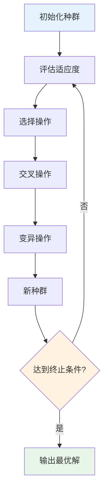
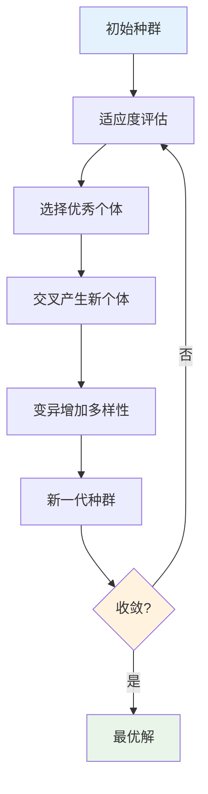

# 优化算法多表征示例 / Optimization Algorithms Multi-Representation Example

## 概述 / Overview

本文档展示优化算法的多表征实现，包括数学公式、代码实现、图表可视化和自然语言描述。

## 1. 遗传算法 / Genetic Algorithm

### 1.1 数学表征 / Mathematical Representation

#### 适应度函数 / Fitness Function

**适应度评估**:
$$f(x) = \text{objective\_function}(x)$$

其中 $x$ 是染色体（解向量）。

#### 选择概率 / Selection Probability

**轮盘赌选择**:
$$P(x_i) = \frac{f(x_i)}{\sum_{j=1}^{N} f(x_j)}$$

其中 $N$ 是种群大小。

#### 交叉操作 / Crossover Operation

**单点交叉**:
$$x_{child1} = [x_{parent1,1}, \ldots, x_{parent1,k}, x_{parent2,k+1}, \ldots, x_{parent2,n}]$$
$$x_{child2} = [x_{parent2,1}, \ldots, x_{parent2,k}, x_{parent1,k+1}, \ldots, x_{parent1,n}]$$

#### 变异操作 / Mutation Operation

**位变异**:
$$
x_{i,j}^{new} = \begin{cases}
1 - x_{i,j} & \text{if } \text{rand}() < p_m \\
x_{i,j} & \text{otherwise}
\end{cases}
$$

其中 $p_m$ 是变异概率。

### 1.2 代码表征 / Code Representation

#### Rust实现 / Rust Implementation

```rust
use rand::Rng;
use std::f64;

# [derive(Debug, Clone)]
pub struct Individual {
    pub chromosome: Vec<f64>,
    pub fitness: f64,
}

impl Individual {
    pub fn new(chromosome: Vec<f64>) -> Self {
        Self {
            chromosome,
            fitness: 0.0,
        }
    }

    pub fn evaluate_fitness(&mut self, fitness_fn: &dyn Fn(&[f64]) -> f64) {
        self.fitness = fitness_fn(&self.chromosome);
    }
}

# [derive(Debug)]
pub struct GeneticAlgorithm {
    pub population_size: usize,
    pub chromosome_length: usize,
    pub mutation_rate: f64,
    pub crossover_rate: f64,
    pub generations: usize,
}

impl GeneticAlgorithm {
    pub fn new(population_size: usize, chromosome_length: usize,
               mutation_rate: f64, crossover_rate: f64, generations: usize) -> Self {
        Self {
            population_size,
            chromosome_length,
            mutation_rate,
            crossover_rate,
            generations,
        }
    }

    pub fn run(&self, fitness_fn: &dyn Fn(&[f64]) -> f64) -> Individual {
        let mut population = self.initialize_population();
        self.evaluate_population(&mut population, fitness_fn);

        for generation in 0..self.generations {
            let mut new_population = Vec::new();

            while new_population.len() < self.population_size {
                let parent1 = self.select_parent(&population);
                let parent2 = self.select_parent(&population);

                if rand::thread_rng().gen::<f64>() < self.crossover_rate {
                    let (child1, child2) = self.crossover(&parent1, &parent2);
                    new_population.push(child1);
                    if new_population.len() < self.population_size {
                        new_population.push(child2);
                    }
                } else {
                    new_population.push(parent1.clone());
                    if new_population.len() < self.population_size {
                        new_population.push(parent2.clone());
                    }
                }
            }

            self.mutate_population(&mut new_population);
            self.evaluate_population(&mut new_population, fitness_fn);
            population = new_population;

            if generation % 100 == 0 {
                let best_fitness = population.iter().map(|ind| ind.fitness).fold(f64::NEG_INFINITY, f64::max);
                println!("Generation {}, Best Fitness: {:.4}", generation, best_fitness);
            }
        }

        population.into_iter().max_by(|a, b| a.fitness.partial_cmp(&b.fitness).unwrap()).unwrap()
    }

    fn initialize_population(&self) -> Vec<Individual> {
        let mut rng = rand::thread_rng();
        let mut population = Vec::new();

        for _ in 0..self.population_size {
            let chromosome: Vec<f64> = (0..self.chromosome_length)
                .map(|_| rng.gen_range(-10.0..10.0))
                .collect();
            population.push(Individual::new(chromosome));
        }

        population
    }

    fn evaluate_population(&self, population: &mut Vec<Individual>, fitness_fn: &dyn Fn(&[f64]) -> f64) {
        for individual in population.iter_mut() {
            individual.evaluate_fitness(fitness_fn);
        }
    }

    fn select_parent(&self, population: &[Individual]) -> &Individual {
        let total_fitness: f64 = population.iter().map(|ind| ind.fitness).sum();
        let mut rng = rand::thread_rng();
        let random_value = rng.gen_range(0.0..total_fitness);

        let mut cumulative_fitness = 0.0;
        for individual in population {
            cumulative_fitness += individual.fitness;
            if cumulative_fitness >= random_value {
                return individual;
            }
        }

        &population[population.len() - 1]
    }

    fn crossover(&self, parent1: &Individual, parent2: &Individual) -> (Individual, Individual) {
        let mut rng = rand::thread_rng();
        let crossover_point = rng.gen_range(1..self.chromosome_length);

        let mut child1_chromosome = parent1.chromosome.clone();
        let mut child2_chromosome = parent2.chromosome.clone();

        for i in crossover_point..self.chromosome_length {
            child1_chromosome[i] = parent2.chromosome[i];
            child2_chromosome[i] = parent1.chromosome[i];
        }

        (Individual::new(child1_chromosome), Individual::new(child2_chromosome))
    }

    fn mutate_population(&self, population: &mut Vec<Individual>) {
        let mut rng = rand::thread_rng();

        for individual in population.iter_mut() {
            for gene in individual.chromosome.iter_mut() {
                if rng.gen::<f64>() < self.mutation_rate {
                    *gene += rng.gen_range(-1.0..1.0);
                    *gene = gene.max(-10.0).min(10.0); // 限制在范围内
                }
            }
        }
    }
}

// 示例适应度函数
fn sphere_function(x: &[f64]) -> f64 {
    -x.iter().map(|&xi| xi * xi).sum::<f64>() // 负号因为我们要最大化适应度
}

// 使用示例
fn main() {
    let ga = GeneticAlgorithm::new(50, 10, 0.01, 0.8, 1000);
    let best_individual = ga.run(&sphere_function);

    println!("Best Solution: {:?}", best_individual.chromosome);
    println!("Best Fitness: {:.4}", best_individual.fitness);
}
```

#### Haskell实现 / Haskell Implementation

```haskell
module GeneticAlgorithm where

import System.Random
import Data.List (sortBy)
import Data.Ord (comparing)

-- 个体
data Individual = Individual {
    chromosome :: [Double],
    fitness :: Double
} deriving (Show)

-- 遗传算法参数
data GeneticAlgorithm = GeneticAlgorithm {
    populationSize :: Int,
    chromosomeLength :: Int,
    mutationRate :: Double,
    crossoverRate :: Double,
    generations :: Int
} deriving (Show)

-- 创建个体
newIndividual :: [Double] -> Individual
newIndividual chrom = Individual chrom 0.0

-- 评估适应度
evaluateFitness :: Individual -> (Double -> Double) -> Individual
evaluateFitness ind fitnessFn = ind { fitness = fitnessFn (chromosome ind) }

-- 初始化种群
initializePopulation :: GeneticAlgorithm -> StdGen -> ([Individual], StdGen)
initializePopulation ga gen = (population, finalGen)
  where
    (population, finalGen) = foldl initialize ([], gen) [1..populationSize ga]
    initialize (inds, g) _ =
        let (chrom, g') = randomChromosome (chromosomeLength ga) g
        in (newIndividual chrom : inds, g')

-- 生成随机染色体
randomChromosome :: Int -> StdGen -> ([Double], StdGen)
randomChromosome length gen = foldl generate ([], gen) [1..length]
  where
    generate (chrom, g) _ =
        let (val, g') = randomR (-10, 10) g :: (Double, StdGen)
        in (val : chrom, g')

-- 选择父代
selectParent :: [Individual] -> StdGen -> (Individual, StdGen)
selectParent population gen =
    let totalFitness = sum (map fitness population)
        (randomVal, gen') = randomR (0, totalFitness) gen
        selected = selectByFitness population randomVal
    in (selected, gen')

-- 根据适应度选择
selectByFitness :: [Individual] -> Double -> Individual
selectByFitness population randomVal = select population 0.0
  where
    select (ind:inds) cumulative
        | cumulative + fitness ind >= randomVal = ind
        | otherwise = select inds (cumulative + fitness ind)
    select [] _ = last population

-- 交叉操作
crossover :: Individual -> Individual -> StdGen -> (Individual, Individual, StdGen)
crossover parent1 parent2 gen = (child1, child2, gen')
  where
    (crossoverPoint, gen') = randomR (1, chromosomeLength parent1 - 1) gen
    child1Chrom = take crossoverPoint (chromosome parent1) ++
                  drop crossoverPoint (chromosome parent2)
    child2Chrom = take crossoverPoint (chromosome parent2) ++
                  drop crossoverPoint (chromosome parent1)
    child1 = newIndividual child1Chrom
    child2 = newIndividual child2Chrom

-- 变异操作
mutate :: Individual -> StdGen -> (Individual, StdGen)
mutate ind gen = (mutatedInd, finalGen)
  where
    (mutatedChrom, finalGen) = foldl mutateGene ([], gen) (zip [0..] (chromosome ind))
    mutateGene (chrom, g) (i, gene) =
        let (randomVal, g') = randomR (0, 1) g :: (Double, StdGen)
            (mutationVal, g'') = randomR (-1, 1) g' :: (Double, StdGen)
            newGene = if randomVal < mutationRate (undefined :: GeneticAlgorithm)
                      then max (-10) (min 10 (gene + mutationVal))
                      else gene
        in (newGene : chrom, g'')
    mutatedInd = ind { chromosome = reverse mutatedChrom }

-- 运行遗传算法
runGeneticAlgorithm :: GeneticAlgorithm -> (Double -> Double) -> StdGen -> Individual
runGeneticAlgorithm ga fitnessFn gen = bestIndividual
  where
    (initialPopulation, gen') = initializePopulation ga gen
    evaluatedPopulation = map (\ind -> evaluateFitness ind fitnessFn) initialPopulation
    (bestIndividual, _) = evolve ga fitnessFn evaluatedPopulation gen' (generations ga)

-- 进化过程
evolve :: GeneticAlgorithm -> (Double -> Double) -> [Individual] -> StdGen -> Int -> (Individual, StdGen)
evolve _ _ population _ 0 = (bestIndividual, undefined)
  where
    bestIndividual = maximumBy (comparing fitness) population
evolve ga fitnessFn population gen remaining =
    let newPopulation = generateNewPopulation ga population gen
        evaluatedPopulation = map (\ind -> evaluateFitness ind fitnessFn) newPopulation
        (best, gen') = evolve ga fitnessFn evaluatedPopulation gen (remaining - 1)
    in (best, gen')

-- 生成新种群
generateNewPopulation :: GeneticAlgorithm -> [Individual] -> StdGen -> [Individual]
generateNewPopulation ga population gen = newPopulation
  where
    (newPopulation, _) = foldl generate ([], gen) [1..populationSize ga]
    generate (inds, g) _ =
        let (parent1, g') = selectParent population g
            (parent2, g'') = selectParent population g'
            (child1, child2, g''') = crossover parent1 parent2 g''
            (mutatedChild1, g4) = mutate child1 g'''
            (mutatedChild2, g5) = mutate child2 g4
        in (mutatedChild1 : mutatedChild2 : inds, g5)

-- 示例适应度函数
sphereFunction :: [Double] -> Double
sphereFunction x = -sum (map (^2) x)

-- 示例使用
example :: IO ()
example = do
    let ga = GeneticAlgorithm 50 10 0.01 0.8 1000
    gen <- newStdGen
    let bestIndividual = runGeneticAlgorithm ga sphereFunction gen

    putStrLn $ "Best Solution: " ++ show (chromosome bestIndividual)
    putStrLn $ "Best Fitness: " ++ show (fitness bestIndividual)
```

#### Python实现 / Python Implementation

```python
import numpy as np
import matplotlib.pyplot as plt
from dataclasses import dataclass
from typing import List, Callable
import random

@dataclass
class Individual:
    """遗传算法个体"""
    chromosome: List[float]
    fitness: float = 0.0

    def evaluate_fitness(self, fitness_fn: Callable[[List[float]], float]) -> None:
        """评估适应度"""
        self.fitness = fitness_fn(self.chromosome)

class GeneticAlgorithm:
    """遗传算法类"""

    def __init__(self, population_size: int, chromosome_length: int,
                 mutation_rate: float, crossover_rate: float, generations: int):
        self.population_size = population_size
        self.chromosome_length = chromosome_length
        self.mutation_rate = mutation_rate
        self.crossover_rate = crossover_rate
        self.generations = generations
        self.fitness_history = []

    def run(self, fitness_fn: Callable[[List[float]], float]) -> Individual:
        """运行遗传算法"""
        population = self.initialize_population()
        self.evaluate_population(population, fitness_fn)

        for generation in range(self.generations):
            new_population = []

            while len(new_population) < self.population_size:
                parent1 = self.select_parent(population)
                parent2 = self.select_parent(population)

                if random.random() < self.crossover_rate:
                    child1, child2 = self.crossover(parent1, parent2)
                    new_population.extend([child1, child2])
                else:
                    new_population.extend([parent1, parent2])

            # 确保种群大小正确
            new_population = new_population[:self.population_size]

            self.mutate_population(new_population)
            self.evaluate_population(new_population, fitness_fn)
            population = new_population

            # 记录最佳适应度
            best_fitness = max(ind.fitness for ind in population)
            self.fitness_history.append(best_fitness)

            if generation % 100 == 0:
                print(f"Generation {generation}, Best Fitness: {best_fitness:.4f}")

        return max(population, key=lambda ind: ind.fitness)

    def initialize_population(self) -> List[Individual]:
        """初始化种群"""
        population = []
        for _ in range(self.population_size):
            chromosome = [random.uniform(-10, 10) for _ in range(self.chromosome_length)]
            population.append(Individual(chromosome))
        return population

    def evaluate_population(self, population: List[Individual],
                          fitness_fn: Callable[[List[float]], float]) -> None:
        """评估种群适应度"""
        for individual in population:
            individual.evaluate_fitness(fitness_fn)

    def select_parent(self, population: List[Individual]) -> Individual:
        """选择父代（轮盘赌选择）"""
        total_fitness = sum(ind.fitness for ind in population)
        if total_fitness == 0:
            return random.choice(population)

        random_value = random.uniform(0, total_fitness)
        cumulative_fitness = 0

        for individual in population:
            cumulative_fitness += individual.fitness
            if cumulative_fitness >= random_value:
                return individual

        return population[-1]

    def crossover(self, parent1: Individual, parent2: Individual) -> tuple[Individual, Individual]:
        """交叉操作"""
        crossover_point = random.randint(1, self.chromosome_length - 1)

        child1_chromosome = (parent1.chromosome[:crossover_point] +
                           parent2.chromosome[crossover_point:])
        child2_chromosome = (parent2.chromosome[:crossover_point] +
                           parent1.chromosome[crossover_point:])

        return Individual(child1_chromosome), Individual(child2_chromosome)

    def mutate_population(self, population: List[Individual]) -> None:
        """变异操作"""
        for individual in population:
            for i in range(len(individual.chromosome)):
                if random.random() < self.mutation_rate:
                    individual.chromosome[i] += random.uniform(-1, 1)
                    individual.chromosome[i] = max(-10, min(10, individual.chromosome[i]))

def sphere_function(x: List[float]) -> float:
    """球函数（测试函数）"""
    return -sum(xi ** 2 for xi in x)  # 负号因为我们要最大化适应度

def demo_genetic_algorithm():
    """演示遗传算法"""
    # 创建遗传算法实例
    ga = GeneticAlgorithm(
        population_size=50,
        chromosome_length=10,
        mutation_rate=0.01,
        crossover_rate=0.8,
        generations=1000
    )

    # 运行算法
    best_individual = ga.run(sphere_function)

    print(f"Best Solution: {best_individual.chromosome}")
    print(f"Best Fitness: {best_individual.fitness:.4f}")

    # 绘制适应度进化曲线
    plt.figure(figsize=(10, 6))
    plt.plot(ga.fitness_history)
    plt.title('Fitness Evolution')
    plt.xlabel('Generation')
    plt.ylabel('Best Fitness')
    plt.grid(True)
    plt.show()

if __name__ == "__main__":
    demo_genetic_algorithm()
```

### 1.3 图表表征 / Visual Representation

#### 遗传算法流程图 / Genetic Algorithm Flow Diagram



#### 选择机制图 / Selection Mechanism Diagram


#### 进化过程图 / Evolution Process Diagram



### 1.4 自然语言表征 / Natural Language Representation

#### 中文描述 / Chinese Description

**遗传算法**是一种模拟生物进化过程的优化算法，具有以下核心特征：

**基本概念**:

- **染色体**: 解的编码表示
- **基因**: 染色体的基本组成单位
- **适应度**: 解的质量评价指标
- **种群**: 多个解的集合

**进化过程**:

1. **初始化**: 随机生成初始种群
2. **选择**: 根据适应度选择优秀个体
3. **交叉**: 父代个体交换基因产生子代
4. **变异**: 随机改变基因增加多样性
5. **迭代**: 重复上述过程直到收敛

**算法特点**:

- 全局搜索能力强
- 适应性强，可处理多种问题
- 并行性好，易于实现
- 对问题类型要求较低

**应用领域**:

- 函数优化
- 组合优化
- 参数调优
- 机器学习超参数优化

#### 英文描述 / English Description

**Genetic algorithms** are optimization algorithms that simulate biological evolution with the following core features:

**Basic Concepts**:

- **Chromosome**: Encoded representation of a solution
- **Gene**: Basic unit of chromosome
- **Fitness**: Quality evaluation metric of solution
- **Population**: Collection of multiple solutions

**Evolution Process**:

1. **Initialization**: Randomly generate initial population
2. **Selection**: Select excellent individuals based on fitness
3. **Crossover**: Parent individuals exchange genes to produce offspring
4. **Mutation**: Randomly change genes to increase diversity
5. **Iteration**: Repeat the above process until convergence

**Algorithm Characteristics**:

- Strong global search capability
- Highly adaptive, can handle various problems
- Good parallelism, easy to implement
- Low requirements for problem types

**Applications**:

- Function optimization
- Combinatorial optimization
- Parameter tuning
- Machine learning hyperparameter optimization

---

*最后更新: 2025-08-01*
*版本: 1.0.0*
