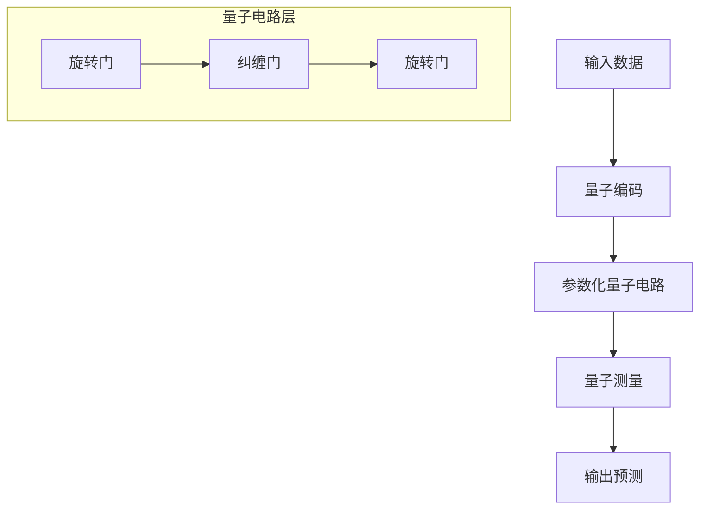

# 量子计算多表征示例 / Quantum Computing Multi-Representation Example

## 概述 / Overview

本文档提供量子计算模型的多表征实现示例，包括量子算法、量子机器学习和量子优化算法。

This document provides multi-representation implementation examples for quantum computing models, including quantum algorithms, quantum machine learning, and quantum optimization algorithms.

## 1. 量子算法 / Quantum Algorithms

### 1.1 量子傅里叶变换 / Quantum Fourier Transform

#### 数学表示 / Mathematical Representation

量子傅里叶变换将量子态从计算基转换到傅里叶基：

The quantum Fourier transform transforms quantum states from computational basis to Fourier basis:

$$QFT|j\rangle = \frac{1}{\sqrt{N}}\sum_{k=0}^{N-1} e^{2\pi i jk/N}|k\rangle$$

其中 $N = 2^n$，$n$ 是量子比特数。

where $N = 2^n$, $n$ is the number of qubits.

#### 可视化表示 / Visual Representation

```mermaid
graph TD
    A[输入量子态 |j⟩] --> B[应用Hadamard门]
    B --> C[应用受控相位门]
    C --> D[输出量子态 |k⟩]
    
    subgraph "量子门序列"
        E[H] --> F[CP]
        F --> G[H]
        G --> H[CP]
    end
```

#### Rust实现 / Rust Implementation

```rust
use num_complex::Complex64;
use std::f64::consts::PI;

#[derive(Debug, Clone)]
struct QuantumState {
    amplitudes: Vec<Complex64>,
    num_qubits: usize,
}

impl QuantumState {
    fn new(num_qubits: usize) -> Self {
        let size = 1 << num_qubits;
        let mut amplitudes = vec![Complex64::new(0.0, 0.0); size];
        amplitudes[0] = Complex64::new(1.0, 0.0);
        
        Self {
            amplitudes,
            num_qubits,
        }
    }
    
    fn quantum_fourier_transform(&mut self) {
        let n = self.amplitudes.len();
        
        for i in 0..self.num_qubits {
            // 应用Hadamard门
            self.apply_hadamard(i);
            
            // 应用受控相位门
            for j in (i + 1)..self.num_qubits {
                let phase = 2.0 * PI / (1 << (j - i + 1)) as f64;
                self.apply_controlled_phase(i, j, phase);
            }
        }
        
        // 交换量子比特顺序
        self.swap_qubits();
    }
    
    fn apply_hadamard(&mut self, qubit: usize) {
        let mask = 1 << qubit;
        let size = self.amplitudes.len();
        
        for i in 0..size {
            if (i & mask) == 0 {
                let j = i | mask;
                let a = self.amplitudes[i];
                let b = self.amplitudes[j];
                
                self.amplitudes[i] = (a + b) / 2.0_f64.sqrt();
                self.amplitudes[j] = (a - b) / 2.0_f64.sqrt();
            }
        }
    }
    
    fn apply_controlled_phase(&mut self, control: usize, target: usize, phase: f64) {
        let control_mask = 1 << control;
        let target_mask = 1 << target;
        let size = self.amplitudes.len();
        
        for i in 0..size {
            if (i & control_mask) != 0 && (i & target_mask) != 0 {
                self.amplitudes[i] *= Complex64::new(phase.cos(), phase.sin());
            }
        }
    }
    
    fn swap_qubits(&mut self) {
        let mut new_amplitudes = vec![Complex64::new(0.0, 0.0); self.amplitudes.len()];
        
        for i in 0..self.amplitudes.len() {
            let reversed = i.reverse_bits() >> (64 - self.num_qubits);
            new_amplitudes[reversed] = self.amplitudes[i];
        }
        
        self.amplitudes = new_amplitudes;
    }
    
    fn measure(&self) -> usize {
        let probabilities: Vec<f64> = self.amplitudes
            .iter()
            .map(|&amp| amp.norm_sqr())
            .collect();
        
        // 简化的测量实现
        let max_prob = probabilities.iter().fold(0.0, |a, &b| a.max(b));
        probabilities.iter().position(|&p| p == max_prob).unwrap_or(0)
    }
}

fn main() {
    let mut qstate = QuantumState::new(3);
    println!("初始状态: {:?}", qstate.measure());
    
    qstate.quantum_fourier_transform();
    println!("QFT后状态: {:?}", qstate.measure());
    
    // 显示部分振幅
    println!("前4个振幅:");
    for i in 0..4 {
        println!("|{}⟩: {:.3} + {:.3}i", i, 
                 qstate.amplitudes[i].re, qstate.amplitudes[i].im);
    }
}
```

#### Python实现 / Python Implementation

```python
import numpy as np
import matplotlib.pyplot as plt
from dataclasses import dataclass
from typing import List, Tuple
import cmath

@dataclass
class QuantumState:
    """量子态"""
    amplitudes: np.ndarray
    num_qubits: int
    
    def __post_init__(self):
        if self.amplitudes is None:
            size = 2 ** self.num_qubits
            self.amplitudes = np.zeros(size, dtype=complex)
            self.amplitudes[0] = 1.0
    
    @classmethod
    def new(cls, num_qubits: int) -> 'QuantumState':
        """创建新的量子态"""
        size = 2 ** num_qubits
        amplitudes = np.zeros(size, dtype=complex)
        amplitudes[0] = 1.0
        return cls(amplitudes, num_qubits)
    
    def quantum_fourier_transform(self) -> 'QuantumState':
        """量子傅里叶变换"""
        n = len(self.amplitudes)
        
        for i in range(self.num_qubits):
            # 应用Hadamard门
            self.apply_hadamard(i)
            
            # 应用受控相位门
            for j in range(i + 1, self.num_qubits):
                phase = 2 * np.pi / (2 ** (j - i + 1))
                self.apply_controlled_phase(i, j, phase)
        
        # 交换量子比特顺序
        self.swap_qubits()
        return self
    
    def apply_hadamard(self, qubit: int) -> None:
        """应用Hadamard门"""
        mask = 1 << qubit
        size = len(self.amplitudes)
        
        for i in range(size):
            if (i & mask) == 0:
                j = i | mask
                a = self.amplitudes[i]
                b = self.amplitudes[j]
                
                self.amplitudes[i] = (a + b) / np.sqrt(2)
                self.amplitudes[j] = (a - b) / np.sqrt(2)
    
    def apply_controlled_phase(self, control: int, target: int, phase: float) -> None:
        """应用受控相位门"""
        control_mask = 1 << control
        target_mask = 1 << target
        size = len(self.amplitudes)
        
        for i in range(size):
            if (i & control_mask) and (i & target_mask):
                self.amplitudes[i] *= cmath.rect(1.0, phase)
    
    def swap_qubits(self) -> None:
        """交换量子比特顺序"""
        new_amplitudes = np.zeros_like(self.amplitudes)
        
        for i in range(len(self.amplitudes)):
            reversed_i = int(format(i, f'0{self.num_qubits}b')[::-1], 2)
            new_amplitudes[reversed_i] = self.amplitudes[i]
        
        self.amplitudes = new_amplitudes
    
    def measure(self) -> int:
        """测量量子态"""
        probabilities = np.abs(self.amplitudes) ** 2
        return np.argmax(probabilities)
    
    def get_probabilities(self) -> np.ndarray:
        """获取概率分布"""
        return np.abs(self.amplitudes) ** 2

def visualize_qft_results(qs: QuantumState, title: str = "QFT Results") -> None:
    """可视化QFT结果"""
    probabilities = qs.get_probabilities()
    
    plt.figure(figsize=(10, 6))
    plt.bar(range(len(probabilities)), probabilities)
    plt.title(title)
    plt.xlabel('State |k⟩')
    plt.ylabel('Probability')
    plt.grid(True, alpha=0.3)
    plt.show()

# 测试量子傅里叶变换
if __name__ == "__main__":
    # 创建3量子比特系统
    qs = QuantumState.new(3)
    print(f"初始状态: |{qs.measure()}⟩")
    
    # 应用QFT
    qs.quantum_fourier_transform()
    print(f"QFT后状态: |{qs.measure()}⟩")
    
    # 显示前8个振幅
    print("\n前8个振幅:")
    for i in range(8):
        amp = qs.amplitudes[i]
        print(f"|{i}⟩: {amp.real:.3f} + {amp.imag:.3f}i")
    
    # 可视化结果
    visualize_qft_results(qs, "Quantum Fourier Transform Results")
```

### 1.2 量子搜索算法 / Quantum Search Algorithm

#### 1.2.1 数学表示 / Mathematical Representation

Grover算法使用量子振幅放大来搜索未排序数据库：

Grover's algorithm uses quantum amplitude amplification to search an unsorted database:

$$|\psi\rangle = \frac{1}{\sqrt{N}}\sum_{x=0}^{N-1}|x\rangle$$

Oracle操作：$O|x\rangle = (-1)^{f(x)}|x\rangle$

Oracle operation: $O|x\rangle = (-1)^{f(x)}|x\rangle$

扩散操作：$D = 2|\psi\rangle\langle\psi| - I$

Diffusion operation: $D = 2|\psi\rangle\langle\psi| - I$

#### 1.2.2 Python实现 / Python Implementation

```python
import numpy as np
import matplotlib.pyplot as plt
from dataclasses import dataclass
from typing import List, Tuple, Callable

@dataclass
class GroverAlgorithm:
    """Grover量子搜索算法"""
    num_qubits: int
    marked_state: int
    
    def __post_init__(self):
        self.oracle = lambda x: x == self.marked_state
    
    def run(self, iterations: int) -> QuantumState:
        """运行Grover算法"""
        state = QuantumState.new(self.num_qubits)
        
        # 应用Hadamard门创建均匀叠加
        for i in range(self.num_qubits):
            state.apply_hadamard(i)
        
        # Grover迭代
        for _ in range(iterations):
            self.apply_oracle(state)
            self.apply_diffusion(state)
        
        return state
    
    def apply_oracle(self, state: QuantumState) -> None:
        """应用Oracle操作"""
        size = len(state.amplitudes)
        
        for i in range(size):
            if self.oracle(i):
                state.amplitudes[i] = -state.amplitudes[i]
    
    def apply_diffusion(self, state: QuantumState) -> None:
        """应用扩散操作"""
        size = len(state.amplitudes)
        avg_amplitude = np.mean(state.amplitudes)
        
        for i in range(size):
            state.amplitudes[i] = 2 * avg_amplitude - state.amplitudes[i]
    
    def optimal_iterations(self) -> int:
        """计算最优迭代次数"""
        n = 2 ** self.num_qubits
        m = 1  # 标记状态数量
        return int((np.pi / 4) * np.sqrt(n / m))

# 测试Grover算法
if __name__ == "__main__":
    num_qubits = 4
    marked_state = 7
    grover = GroverAlgorithm(num_qubits, marked_state)
    
    optimal_iters = grover.optimal_iterations()
    print(f"最优迭代次数: {optimal_iters}")
    
    result = grover.run(optimal_iters)
    print(f"搜索结果: |{result.measure()}⟩")
    print(f"目标状态: |{marked_state}⟩")
    
    # 显示成功概率
    success_prob = np.abs(result.amplitudes[marked_state]) ** 2 * 100
    print(f"成功概率: {success_prob:.1f}%")
```

## 2. 量子机器学习 / Quantum Machine Learning

### 2.1 量子神经网络 / Quantum Neural Network

#### 2.1.1 数学表示 / Mathematical Representation

量子神经网络使用参数化量子电路：

Quantum neural networks use parameterized quantum circuits:

$$U(\theta) = \prod_{i=1}^{L} U_i(\theta_i)$$

其中 $U_i(\theta_i)$ 是参数化量子门。

where $U_i(\theta_i)$ are parameterized quantum gates.

#### 2.1.2 可视化表示 / Visual Representation



#### 2.1.3 Python实现 / Python Implementation

```python
import numpy as np
import torch
import torch.nn as nn
from dataclasses import dataclass
from typing import List, Tuple

@dataclass
class QuantumNeuralNetwork:
    """量子神经网络"""
    num_qubits: int
    num_layers: int
    learning_rate: float = 0.01
    
    def __post_init__(self):
        self.num_params = self.num_qubits * self.num_layers * 3  # 每个层3个参数
        self.params = np.random.randn(self.num_params) * 0.1
    
    def forward(self, input_data: np.ndarray) -> np.ndarray:
        """前向传播"""
        batch_size = input_data.shape[0]
        outputs = []
        
        for i in range(batch_size):
            # 初始化量子态
            qstate = QuantumState.new(self.num_qubits)
            
            # 编码输入数据
            self.encode_input(qstate, input_data[i])
            
            # 应用参数化量子电路
            self.apply_quantum_circuit(qstate)
            
            # 测量输出
            output = self.measure_output(qstate)
            outputs.append(output)
        
        return np.array(outputs)
    
    def encode_input(self, qstate: QuantumState, input_data: np.ndarray) -> None:
        """编码输入数据到量子态"""
        for i, value in enumerate(input_data[:self.num_qubits]):
            # 使用旋转门编码
            angle = value * np.pi
            self.apply_rotation_y(qstate, i, angle)
    
    def apply_quantum_circuit(self, qstate: QuantumState) -> None:
        """应用参数化量子电路"""
        param_idx = 0
        
        for layer in range(self.num_layers):
            # 应用旋转门
            for qubit in range(self.num_qubits):
                rx_angle = self.params[param_idx]
                ry_angle = self.params[param_idx + 1]
                rz_angle = self.params[param_idx + 2]
                
                self.apply_rotation_x(qstate, qubit, rx_angle)
                self.apply_rotation_y(qstate, qubit, ry_angle)
                self.apply_rotation_z(qstate, qubit, rz_angle)
                
                param_idx += 3
            
            # 应用纠缠门
            for qubit in range(self.num_qubits - 1):
                self.apply_cnot(qstate, qubit, qubit + 1)
    
    def apply_rotation_x(self, qstate: QuantumState, qubit: int, angle: float) -> None:
        """应用X旋转门"""
        mask = 1 << qubit
        size = len(qstate.amplitudes)
        cos_half = np.cos(angle / 2)
        sin_half = np.sin(angle / 2)
        
        for i in range(size):
            if (i & mask) == 0:
                j = i | mask
                a = qstate.amplitudes[i]
                b = qstate.amplitudes[j]
                
                qstate.amplitudes[i] = cos_half * a - 1j * sin_half * b
                qstate.amplitudes[j] = -1j * sin_half * a + cos_half * b
    
    def apply_rotation_y(self, qstate: QuantumState, qubit: int, angle: float) -> None:
        """应用Y旋转门"""
        mask = 1 << qubit
        size = len(qstate.amplitudes)
        cos_half = np.cos(angle / 2)
        sin_half = np.sin(angle / 2)
        
        for i in range(size):
            if (i & mask) == 0:
                j = i | mask
                a = qstate.amplitudes[i]
                b = qstate.amplitudes[j]
                
                qstate.amplitudes[i] = cos_half * a - sin_half * b
                qstate.amplitudes[j] = sin_half * a + cos_half * b
    
    def apply_rotation_z(self, qstate: QuantumState, qubit: int, angle: float) -> None:
        """应用Z旋转门"""
        mask = 1 << qubit
        size = len(qstate.amplitudes)
        phase = np.exp(1j * angle / 2)
        
        for i in range(size):
            if (i & mask) != 0:
                qstate.amplitudes[i] *= phase
    
    def apply_cnot(self, qstate: QuantumState, control: int, target: int) -> None:
        """应用CNOT门"""
        control_mask = 1 << control
        target_mask = 1 << target
        size = len(qstate.amplitudes)
        
        for i in range(size):
            if (i & control_mask) != 0:
                j = i ^ target_mask
                if i < j:
                    qstate.amplitudes[i], qstate.amplitudes[j] = \
                        qstate.amplitudes[j], qstate.amplitudes[i]
    
    def measure_output(self, qstate: QuantumState) -> float:
        """测量输出"""
        probabilities = qstate.get_probabilities()
        # 返回期望值
        return np.sum(probabilities * np.arange(len(probabilities)))
    
    def train(self, X: np.ndarray, y: np.ndarray, epochs: int) -> List[float]:
        """训练量子神经网络"""
        losses = []
        
        for epoch in range(epochs):
            # 前向传播
            predictions = self.forward(X)
            
            # 计算损失
            loss = np.mean((predictions - y) ** 2)
            losses.append(loss)
            
            # 简化的梯度下降
            if epoch > 0:
                grad = 2 * np.mean((predictions - y) * predictions, axis=0)
                self.params -= self.learning_rate * grad
            
            if epoch % 100 == 0:
                print(f"Epoch {epoch}, Loss: {loss:.4f}")
        
        return losses

# 测试量子神经网络
if __name__ == "__main__":
    # 生成示例数据
    np.random.seed(42)
    X = np.random.randn(100, 4)
    y = np.sin(X[:, 0]) + np.cos(X[:, 1])
    
    # 创建量子神经网络
    qnn = QuantumNeuralNetwork(num_qubits=4, num_layers=2)
    
    # 训练
    losses = qnn.train(X, y, epochs=500)
    
    # 测试
    test_X = np.random.randn(10, 4)
    predictions = qnn.forward(test_X)
    print(f"\n预测结果: {predictions[:5]}")
    
    # 可视化训练过程
    plt.figure(figsize=(10, 6))
    plt.plot(losses)
    plt.title("Quantum Neural Network Training Loss")
    plt.xlabel("Epoch")
    plt.ylabel("Loss")
    plt.grid(True)
    plt.show()
```

## 3. 量子优化算法 / Quantum Optimization Algorithms

### 3.1 量子近似优化算法 / Quantum Approximate Optimization Algorithm

#### 3.1.1 数学表示 / Mathematical Representation

QAOA使用参数化量子电路解决组合优化问题：

QAOA uses parameterized quantum circuits to solve combinatorial optimization problems:

$$|\gamma, \beta\rangle = \prod_{p=1}^{P} e^{-i\beta_p H_M} e^{-i\gamma_p H_C}|+\rangle^{\otimes n}$$

其中 $H_C$ 是问题哈密顿量，$H_M$ 是混合哈密顿量。

where $H_C$ is the problem Hamiltonian and $H_M$ is the mixing Hamiltonian.

#### 3.1.2 可视化表示 / Visual Representation

```mermaid
graph TD
    A[初始态 |+⟩⊗n] --> B[问题哈密顿量]
    B --> C[混合哈密顿量]
    C --> D[重复P次]
    D --> E[测量结果]
    
    subgraph "QAOA层"
        F[H_C] --> G[H_M]
        G --> H[参数优化]
    end
```

#### 3.1.3 Python实现 / Python Implementation

```python
import numpy as np
import matplotlib.pyplot as plt
from dataclasses import dataclass
from typing import List, Tuple, Callable
import scipy.optimize

@dataclass
class QAOA:
    """量子近似优化算法"""
    num_qubits: int
    num_layers: int
    problem_hamiltonian: Callable[[np.ndarray], float]
    
    def __post_init__(self):
        self.num_params = 2 * self.num_layers  # gamma和beta参数
    
    def solve(self, initial_params: np.ndarray = None) -> Tuple[np.ndarray, float]:
        """求解优化问题"""
        if initial_params is None:
            initial_params = np.random.randn(self.num_params) * 0.1
        
        # 优化参数
        result = scipy.optimize.minimize(
            fun=self.expectation_value,
            x0=initial_params,
            method='L-BFGS-B',
            options={'maxiter': 1000}
        )
        
        return result.x, result.fun
    
    def expectation_value(self, params: np.ndarray) -> float:
        """计算期望值"""
        gamma = params[:self.num_layers]
        beta = params[self.num_layers:]
        
        # 创建初始态
        qstate = QuantumState.new(self.num_qubits)
        
        # 应用Hadamard门
        for i in range(self.num_qubits):
            qstate.apply_hadamard(i)
        
        # 应用QAOA层
        for p in range(self.num_layers):
            # 应用问题哈密顿量
            self.apply_problem_hamiltonian(qstate, gamma[p])
            
            # 应用混合哈密顿量
            self.apply_mixing_hamiltonian(qstate, beta[p])
        
        # 计算期望值
        return self.calculate_expectation(qstate)
    
    def apply_problem_hamiltonian(self, qstate: QuantumState, gamma: float) -> None:
        """应用问题哈密顿量"""
        # 这里使用简化的MaxCut问题作为示例
        for i in range(self.num_qubits - 1):
            for j in range(i + 1, self.num_qubits):
                self.apply_zz_gate(qstate, i, j, gamma)
    
    def apply_mixing_hamiltonian(self, qstate: QuantumState, beta: float) -> None:
        """应用混合哈密顿量"""
        for i in range(self.num_qubits):
            self.apply_rotation_x(qstate, i, 2 * beta)
    
    def apply_zz_gate(self, qstate: QuantumState, qubit1: int, qubit2: int, angle: float) -> None:
        """应用ZZ门"""
        mask1 = 1 << qubit1
        mask2 = 1 << qubit2
        size = len(qstate.amplitudes)
        
        for i in range(size):
            if ((i & mask1) != 0) != ((i & mask2) != 0):  # XOR
                qstate.amplitudes[i] *= np.exp(1j * angle)
    
    def apply_rotation_x(self, qstate: QuantumState, qubit: int, angle: float) -> None:
        """应用X旋转门"""
        mask = 1 << qubit
        size = len(qstate.amplitudes)
        cos_half = np.cos(angle / 2)
        sin_half = np.sin(angle / 2)
        
        for i in range(size):
            if (i & mask) == 0:
                j = i | mask
                a = qstate.amplitudes[i]
                b = qstate.amplitudes[j]
                
                qstate.amplitudes[i] = cos_half * a - 1j * sin_half * b
                qstate.amplitudes[j] = -1j * sin_half * a + cos_half * b
    
    def calculate_expectation(self, qstate: QuantumState) -> float:
        """计算期望值"""
        # 简化的期望值计算
        probabilities = qstate.get_probabilities()
        energy = 0.0
        
        for i, prob in enumerate(probabilities):
            # 计算每个基态的经典能量
            classical_state = format(i, f'0{self.num_qubits}b')
            energy += prob * self.problem_hamiltonian(np.array([int(bit) for bit in classical_state]))
        
        return energy
    
    def get_solution(self, params: np.ndarray) -> Tuple[int, float]:
        """获取最优解"""
        gamma = params[:self.num_layers]
        beta = params[self.num_layers:]
        
        # 创建最终态
        qstate = QuantumState.new(self.num_qubits)
        
        # 应用Hadamard门
        for i in range(self.num_qubits):
            qstate.apply_hadamard(i)
        
        # 应用QAOA层
        for p in range(self.num_layers):
            self.apply_problem_hamiltonian(qstate, gamma[p])
            self.apply_mixing_hamiltonian(qstate, beta[p])
        
        # 测量最优解
        solution = qstate.measure()
        energy = self.problem_hamiltonian(np.array([int(bit) for bit in format(solution, f'0{self.num_qubits}b')]))
        
        return solution, energy

def maxcut_hamiltonian(state: np.ndarray) -> float:
    """MaxCut问题的哈密顿量"""
    # 简化的图结构：环形图
    n = len(state)
    energy = 0.0
    
    for i in range(n):
        j = (i + 1) % n
        if state[i] != state[j]:
            energy += 1.0
    
    return -energy  # 最小化问题

# 测试QAOA
if __name__ == "__main__":
    # 创建QAOA实例
    qaoa = QAOA(num_qubits=4, num_layers=2, problem_hamiltonian=maxcut_hamiltonian)
    
    # 求解
    optimal_params, optimal_energy = qaoa.solve()
    print(f"最优能量: {optimal_energy:.4f}")
    
    # 获取解
    solution, solution_energy = qaoa.get_solution(optimal_params)
    print(f"最优解: {format(solution, '04b')}")
    print(f"解的能量: {solution_energy:.4f}")
    
    # 参数可视化
    gamma = optimal_params[:qaoa.num_layers]
    beta = optimal_params[qaoa.num_layers:]
    
    plt.figure(figsize=(12, 4))
    
    plt.subplot(1, 2, 1)
    plt.bar(range(len(gamma)), gamma)
    plt.title("Optimal Gamma Parameters")
    plt.xlabel("Layer")
    plt.ylabel("Gamma")
    
    plt.subplot(1, 2, 2)
    plt.bar(range(len(beta)), beta)
    plt.title("Optimal Beta Parameters")
    plt.xlabel("Layer")
    plt.ylabel("Beta")
    
    plt.tight_layout()
    plt.show()
```

## 总结 / Summary

本文档提供了量子计算模型的多表征实现示例，包括：

This document provides multi-representation implementation examples for quantum computing models, including:

1. **量子算法** / Quantum Algorithms
   - 量子傅里叶变换 / Quantum Fourier Transform
   - 量子搜索算法 / Quantum Search Algorithm

2. **量子机器学习** / Quantum Machine Learning
   - 量子神经网络 / Quantum Neural Network

3. **量子优化算法** / Quantum Optimization Algorithms
   - 量子近似优化算法 / Quantum Approximate Optimization Algorithm

每个模型都包含数学表示、可视化图表、Rust/Python实现，展示了量子计算在不同领域的应用。

Each model includes mathematical representation, visual diagrams, and Rust/Python implementations, demonstrating the applications of quantum computing in different domains.
