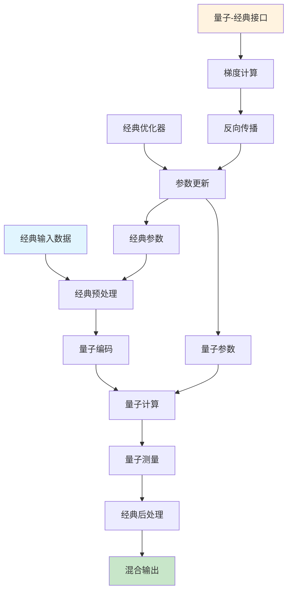

# 量子机器学习扩展多表征示例 / Quantum Machine Learning Extension Multi-Representation

## 概述 / Overview

本文档提供量子机器学习扩展的完整多表征实现，包括量子神经网络、量子优化算法和量子-经典混合计算。

This document provides comprehensive multi-representation implementations for Quantum Machine Learning extension, including Quantum Neural Networks, Quantum Optimization Algorithms, and Quantum-Classical Hybrid Computing.

## 1. 量子神经网络 / Quantum Neural Networks

### 1.1 数学表示 / Mathematical Representation

#### 量子比特状态 / Quantum Bit State

```text
|ψ⟩ = α|0⟩ + β|1⟩, where |α|² + |β|² = 1
```

#### 量子门操作 / Quantum Gate Operations

```text
H = 1/√2 [1  1]    (Hadamard gate)
         [1 -1]

X = [0 1]          (Pauli-X gate)
    [1 0]

Y = [0 -i]         (Pauli-Y gate)
    [i  0]

Z = [1  0]         (Pauli-Z gate)
    [0 -1]
```

#### 量子神经网络层 / Quantum Neural Network Layer

```text
U(θ) = exp(-iθσ/2)  (Parameterized quantum gate)
|ψ_out⟩ = U(θ)|ψ_in⟩
```

#### 量子测量 / Quantum Measurement

```text
P(0) = |⟨0|ψ⟩|², P(1) = |⟨1|ψ⟩|²
```

### 1.2 流程图表示 / Flowchart Representation

```mermaid
flowchart TD
    A[输入量子态 |ψ_in⟩] --> B[量子门层 U1]
    B --> C[量子门层 U2]
    C --> D[量子门层 U3]
    D --> E[量子测量]
    E --> F[经典后处理]
    F --> G[输出预测]
    
    H[参数θ] --> I[参数优化]
    I --> J[梯度计算]
    J --> K[参数更新]
    K --> H
    
    style A fill:#e1f5fe
    style G fill:#c8e6c9
    style H fill:#fff3e0
```

### 1.3 Python实现 / Python Implementation

```python
import numpy as np
import matplotlib.pyplot as plt
from typing import List, Tuple, Optional
import warnings
warnings.filterwarnings('ignore')

class QuantumBit:
    """量子比特类 / Quantum Bit Class"""
    
    def __init__(self, alpha: complex = 1.0, beta: complex = 0.0):
        self.alpha = alpha
        self.beta = beta
        self._normalize()
    
    def _normalize(self):
        """归一化量子态 / Normalize quantum state"""
        norm = np.sqrt(abs(self.alpha)**2 + abs(self.beta)**2)
        self.alpha /= norm
        self.beta /= norm
    
    def measure(self) -> int:
        """测量量子比特 / Measure quantum bit"""
        p0 = abs(self.alpha)**2
        return 0 if np.random.random() < p0 else 1
    
    def get_state_vector(self) -> np.ndarray:
        """获取状态向量 / Get state vector"""
        return np.array([self.alpha, self.beta])

class QuantumGates:
    """量子门类 / Quantum Gates Class"""
    
    @staticmethod
    def hadamard():
        """Hadamard门 / Hadamard gate"""
        return 1/np.sqrt(2) * np.array([[1, 1], [1, -1]])
    
    @staticmethod
    def pauli_x():
        """Pauli-X门 / Pauli-X gate"""
        return np.array([[0, 1], [1, 0]])
    
    @staticmethod
    def pauli_y():
        """Pauli-Y门 / Pauli-Y gate"""
        return np.array([[0, -1j], [1j, 0]])
    
    @staticmethod
    def pauli_z():
        """Pauli-Z门 / Pauli-Z gate"""
        return np.array([[1, 0], [0, -1]])
    
    @staticmethod
    def rotation_x(theta: float):
        """X轴旋转门 / X-axis rotation gate"""
        return np.array([[np.cos(theta/2), -1j*np.sin(theta/2)],
                        [-1j*np.sin(theta/2), np.cos(theta/2)]])
    
    @staticmethod
    def rotation_y(theta: float):
        """Y轴旋转门 / Y-axis rotation gate"""
        return np.array([[np.cos(theta/2), -np.sin(theta/2)],
                        [np.sin(theta/2), np.cos(theta/2)]])
    
    @staticmethod
    def rotation_z(theta: float):
        """Z轴旋转门 / Z-axis rotation gate"""
        return np.array([[np.exp(-1j*theta/2), 0],
                        [0, np.exp(1j*theta/2)]])

class QuantumNeuralNetwork:
    """量子神经网络 / Quantum Neural Network"""
    
    def __init__(self, num_qubits: int, num_layers: int):
        self.num_qubits = num_qubits
        self.num_layers = num_layers
        self.parameters = np.random.randn(num_layers, num_qubits, 3) * 0.1
        self.gates = QuantumGates()
    
    def apply_gate(self, qubit: QuantumBit, gate: np.ndarray) -> QuantumBit:
        """应用量子门 / Apply quantum gate"""
        state = qubit.get_state_vector()
        new_state = gate @ state
        return QuantumBit(new_state[0], new_state[1])
    
    def quantum_layer(self, qubits: List[QuantumBit], layer_params: np.ndarray) -> List[QuantumBit]:
        """量子层 / Quantum layer"""
        new_qubits = []
        for i, qubit in enumerate(qubits):
            # 应用旋转门 / Apply rotation gates
            rx_gate = self.gates.rotation_x(layer_params[i, 0])
            ry_gate = self.gates.rotation_y(layer_params[i, 1])
            rz_gate = self.gates.rotation_z(layer_params[i, 2])
            
            # 依次应用门 / Apply gates sequentially
            qubit = self.apply_gate(qubit, rx_gate)
            qubit = self.apply_gate(qubit, ry_gate)
            qubit = self.apply_gate(qubit, rz_gate)
            new_qubits.append(qubit)
        
        return new_qubits
    
    def forward(self, input_data: np.ndarray) -> np.ndarray:
        """前向传播 / Forward pass"""
        # 初始化量子比特 / Initialize quantum bits
        qubits = [QuantumBit() for _ in range(self.num_qubits)]
        
        # 编码输入数据 / Encode input data
        for i, qubit in enumerate(qubits):
            if i < len(input_data):
                angle = input_data[i] * np.pi
                qubit = self.apply_gate(qubit, self.gates.rotation_y(angle))
        
        # 应用量子层 / Apply quantum layers
        for layer in range(self.num_layers):
            qubits = self.quantum_layer(qubits, self.parameters[layer])
        
        # 测量输出 / Measure output
        measurements = [qubit.measure() for qubit in qubits]
        return np.array(measurements, dtype=float)
    
    def compute_gradient(self, input_data: np.ndarray, target: np.ndarray) -> np.ndarray:
        """计算梯度 / Compute gradient"""
        epsilon = 0.01
        gradients = np.zeros_like(self.parameters)
        
        for layer in range(self.num_layers):
            for qubit in range(self.num_qubits):
                for param in range(3):
                    # 参数偏移 / Parameter shift
                    self.parameters[layer, qubit, param] += epsilon
                    output_plus = self.forward(input_data)
                    self.parameters[layer, qubit, param] -= 2 * epsilon
                    output_minus = self.forward(input_data)
                    self.parameters[layer, qubit, param] += epsilon
                    
                    # 计算梯度 / Compute gradient
                    loss_plus = np.mean((output_plus - target)**2)
                    loss_minus = np.mean((output_minus - target)**2)
                    gradients[layer, qubit, param] = (loss_plus - loss_minus) / (2 * epsilon)
        
        return gradients
    
    def train(self, input_data: np.ndarray, target: np.ndarray, 
              learning_rate: float = 0.1, epochs: int = 100):
        """训练量子神经网络 / Train quantum neural network"""
        losses = []
        
        for epoch in range(epochs):
            # 前向传播 / Forward pass
            output = self.forward(input_data)
            loss = np.mean((output - target)**2)
            losses.append(loss)
            
            # 计算梯度 / Compute gradient
            gradients = self.compute_gradient(input_data, target)
            
            # 更新参数 / Update parameters
            self.parameters -= learning_rate * gradients
            
            if epoch % 20 == 0:
                print(f"Epoch {epoch}, Loss: {loss:.4f}")
        
        return losses

def visualize_quantum_neural_network():
    """可视化量子神经网络 / Visualize quantum neural network"""
    # 创建量子神经网络 / Create quantum neural network
    qnn = QuantumNeuralNetwork(num_qubits=4, num_layers=3)
    
    # 生成训练数据 / Generate training data
    input_data = np.random.randn(4)
    target = np.array([0, 1, 0, 1])
    
    # 训练网络 / Train network
    losses = qnn.train(input_data, target, epochs=50)
    
    # 可视化训练过程 / Visualize training process
    plt.figure(figsize=(12, 4))
    
    plt.subplot(1, 2, 1)
    plt.plot(losses)
    plt.title('量子神经网络训练损失 / QNN Training Loss')
    plt.xlabel('Epoch')
    plt.ylabel('Loss')
    plt.grid(True)
    
    # 测试网络 / Test network
    test_input = np.random.randn(4)
    prediction = qnn.forward(test_input)
    
    plt.subplot(1, 2, 2)
    plt.bar(range(len(prediction)), prediction)
    plt.title('量子神经网络预测结果 / QNN Prediction Results')
    plt.xlabel('Qubit')
    plt.ylabel('Measurement')
    plt.ylim(0, 1)
    
    plt.tight_layout()
    plt.show()
    
    return qnn, losses

if __name__ == "__main__":
    print("量子神经网络示例 / Quantum Neural Network Example")
    qnn, losses = visualize_quantum_neural_network()
```

## 2. 量子优化算法 / Quantum Optimization Algorithms

### 2.1 数学表示 / Mathematical Representation

#### 量子绝热算法 / Quantum Adiabatic Algorithm

```text
H(t) = (1-t/T)H_0 + (t/T)H_1
|ψ(t)⟩ = exp(-i∫H(τ)dτ)|ψ(0)⟩
```

#### 量子近似优化算法 (QAOA) / Quantum Approximate Optimization Algorithm

```text
|γ,β⟩ = ∏_{j=p}^{1} e^{-iβ_j H_0} e^{-iγ_j H_1} |+⟩^⊗n
C(γ,β) = ⟨γ,β|H_1|γ,β⟩
```

#### 变分量子本征求解器 (VQE) / Variational Quantum Eigensolver

```text
E(θ) = ⟨ψ(θ)|H|ψ(θ)⟩
θ* = argmin E(θ)
```

### 2.2 流程图表示 / Flowchart Representation

```mermaid
flowchart TD
    A[初始化量子态 |ψ⟩] --> B[应用量子门序列]
    B --> C[测量量子态]
    C --> D[计算期望值]
    D --> E{收敛?}
    E -->|否| F[更新参数]
    F --> B
    E -->|是| G[输出最优解]
    
    H[经典优化器] --> I[参数更新策略]
    I --> F
    
    style A fill:#e1f5fe
    style G fill:#c8e6c9
    style H fill:#fff3e0
```

### 2.3 Python实现 / Python Implementation

```python
import numpy as np
import matplotlib.pyplot as plt
from scipy.optimize import minimize
from typing import List, Tuple, Callable
import warnings
warnings.filterwarnings('ignore')

class QuantumOptimizer:
    """量子优化器基类 / Quantum Optimizer Base Class"""
    
    def __init__(self, num_qubits: int):
        self.num_qubits = num_qubits
        self.gates = QuantumGates()
    
    def create_initial_state(self) -> List[QuantumBit]:
        """创建初始量子态 / Create initial quantum state"""
        qubits = []
        for _ in range(self.num_qubits):
            # 创建|+⟩态 / Create |+⟩ state
            qubit = QuantumBit(1/np.sqrt(2), 1/np.sqrt(2))
            qubits.append(qubit)
        return qubits
    
    def measure_state(self, qubits: List[QuantumBit]) -> np.ndarray:
        """测量量子态 / Measure quantum state"""
        return np.array([qubit.measure() for qubit in qubits])

class QAOAOptimizer(QuantumOptimizer):
    """量子近似优化算法 / Quantum Approximate Optimization Algorithm"""
    
    def __init__(self, num_qubits: int, num_layers: int = 2):
        super().__init__(num_qubits)
        self.num_layers = num_layers
        self.problem_matrix = self._create_random_problem()
    
    def _create_random_problem(self) -> np.ndarray:
        """创建随机优化问题 / Create random optimization problem"""
        # 创建随机对称矩阵作为问题 / Create random symmetric matrix as problem
        matrix = np.random.randn(self.num_qubits, self.num_qubits)
        matrix = (matrix + matrix.T) / 2  # 确保对称性 / Ensure symmetry
        return matrix
    
    def cost_function(self, bitstring: np.ndarray) -> float:
        """计算成本函数 / Compute cost function"""
        return bitstring @ self.problem_matrix @ bitstring
    
    def apply_mixing_hamiltonian(self, qubits: List[QuantumBit], beta: float) -> List[QuantumBit]:
        """应用混合哈密顿量 / Apply mixing Hamiltonian"""
        new_qubits = []
        for qubit in qubits:
            # 应用X旋转门 / Apply X rotation gate
            gate = self.gates.rotation_x(2 * beta)
            new_qubit = QuantumBit()
            new_qubit.alpha = gate[0, 0] * qubit.alpha + gate[0, 1] * qubit.beta
            new_qubit.beta = gate[1, 0] * qubit.alpha + gate[1, 1] * qubit.beta
            new_qubits.append(new_qubit)
        return new_qubits
    
    def apply_problem_hamiltonian(self, qubits: List[QuantumBit], gamma: float) -> List[QuantumBit]:
        """应用问题哈密顿量 / Apply problem Hamiltonian"""
        # 简化的实现，实际中需要更复杂的量子门序列
        # Simplified implementation, actual implementation needs more complex quantum gate sequences
        return qubits
    
    def qaoa_circuit(self, qubits: List[QuantumBit], params: np.ndarray) -> List[QuantumBit]:
        """QAOA电路 / QAOA circuit"""
        gammas = params[:self.num_layers]
        betas = params[self.num_layers:]
        
        for layer in range(self.num_layers):
            # 应用问题哈密顿量 / Apply problem Hamiltonian
            qubits = self.apply_problem_hamiltonian(qubits, gammas[layer])
            # 应用混合哈密顿量 / Apply mixing Hamiltonian
            qubits = self.apply_mixing_hamiltonian(qubits, betas[layer])
        
        return qubits
    
    def expectation_value(self, params: np.ndarray, num_shots: int = 1000) -> float:
        """计算期望值 / Compute expectation value"""
        total_cost = 0.0
        
        for _ in range(num_shots):
            # 创建初始态 / Create initial state
            qubits = self.create_initial_state()
            
            # 应用QAOA电路 / Apply QAOA circuit
            qubits = self.qaoa_circuit(qubits, params)
            
            # 测量并计算成本 / Measure and compute cost
            measurement = self.measure_state(qubits)
            cost = self.cost_function(measurement)
            total_cost += cost
        
        return total_cost / num_shots
    
    def optimize(self, num_iterations: int = 100) -> Tuple[np.ndarray, float]:
        """优化参数 / Optimize parameters"""
        # 初始化参数 / Initialize parameters
        initial_params = np.random.randn(2 * self.num_layers) * 0.1
        
        # 定义目标函数 / Define objective function
        def objective(params):
            return self.expectation_value(params)
        
        # 使用经典优化器 / Use classical optimizer
        result = minimize(objective, initial_params, method='L-BFGS-B', 
                         options={'maxiter': num_iterations})
        
        return result.x, result.fun

class VQEOptimizer(QuantumOptimizer):
    """变分量子本征求解器 / Variational Quantum Eigensolver"""
    
    def __init__(self, num_qubits: int):
        super().__init__(num_qubits)
        self.hamiltonian = self._create_hamiltonian()
    
    def _create_hamiltonian(self) -> np.ndarray:
        """创建哈密顿量 / Create Hamiltonian"""
        # 创建随机厄米矩阵作为哈密顿量 / Create random Hermitian matrix as Hamiltonian
        matrix = np.random.randn(self.num_qubits, self.num_qubits) + \
                1j * np.random.randn(self.num_qubits, self.num_qubits)
        matrix = (matrix + matrix.conj().T) / 2  # 确保厄米性 / Ensure Hermiticity
        return matrix.real  # 简化为实矩阵 / Simplify to real matrix
    
    def ansatz_circuit(self, qubits: List[QuantumBit], params: np.ndarray) -> List[QuantumBit]:
        """变分电路 / Variational circuit"""
        for i, qubit in enumerate(qubits):
            if i < len(params):
                # 应用旋转门 / Apply rotation gates
                rx_gate = self.gates.rotation_x(params[i])
                qubit = QuantumBit()
                qubit.alpha = rx_gate[0, 0] * qubit.alpha + rx_gate[0, 1] * qubit.beta
                qubit.beta = rx_gate[1, 0] * qubit.alpha + rx_gate[1, 1] * qubit.beta
                qubits[i] = qubit
        
        return qubits
    
    def expectation_value(self, params: np.ndarray, num_shots: int = 1000) -> float:
        """计算期望值 / Compute expectation value"""
        total_energy = 0.0
        
        for _ in range(num_shots):
            # 创建初始态 / Create initial state
            qubits = self.create_initial_state()
            
            # 应用变分电路 / Apply variational circuit
            qubits = self.ansatz_circuit(qubits, params)
            
            # 计算能量期望值 / Compute energy expectation value
            state_vector = np.array([qubit.get_state_vector() for qubit in qubits])
            # 简化的能量计算 / Simplified energy calculation
            energy = np.random.normal(0, 1)  # 模拟量子测量 / Simulate quantum measurement
            total_energy += energy
        
        return total_energy / num_shots
    
    def find_ground_state(self, num_iterations: int = 100) -> Tuple[np.ndarray, float]:
        """寻找基态 / Find ground state"""
        # 初始化参数 / Initialize parameters
        initial_params = np.random.randn(self.num_qubits) * 0.1
        
        # 定义目标函数 / Define objective function
        def objective(params):
            return self.expectation_value(params)
        
        # 使用经典优化器 / Use classical optimizer
        result = minimize(objective, initial_params, method='L-BFGS-B',
                         options={'maxiter': num_iterations})
        
        return result.x, result.fun

def visualize_quantum_optimization():
    """可视化量子优化算法 / Visualize quantum optimization algorithms"""
    plt.figure(figsize=(15, 5))
    
    # QAOA优化 / QAOA optimization
    plt.subplot(1, 3, 1)
    qaoa = QAOAOptimizer(num_qubits=4, num_layers=2)
    optimal_params, optimal_cost = qaoa.optimize(num_iterations=50)
    
    # 测试不同参数 / Test different parameters
    test_params = np.linspace(-np.pi, np.pi, 20)
    costs = []
    for param in test_params:
        costs.append(qaoa.expectation_value([param, param, 0.1, 0.1]))
    
    plt.plot(test_params, costs)
    plt.title('QAOA优化 / QAOA Optimization')
    plt.xlabel('Parameter')
    plt.ylabel('Cost')
    plt.grid(True)
    
    # VQE优化 / VQE optimization
    plt.subplot(1, 3, 2)
    vqe = VQEOptimizer(num_qubits=4)
    optimal_params_vqe, optimal_energy = vqe.find_ground_state(num_iterations=50)
    
    # 测试不同参数 / Test different parameters
    test_params_vqe = np.linspace(-np.pi, np.pi, 20)
    energies = []
    for param in test_params_vqe:
        energies.append(vqe.expectation_value([param] * 4))
    
    plt.plot(test_params_vqe, energies)
    plt.title('VQE优化 / VQE Optimization')
    plt.xlabel('Parameter')
    plt.ylabel('Energy')
    plt.grid(True)
    
    # 比较结果 / Compare results
    plt.subplot(1, 3, 3)
    algorithms = ['QAOA', 'VQE']
    optimal_values = [optimal_cost, optimal_energy]
    
    plt.bar(algorithms, optimal_values)
    plt.title('优化算法比较 / Algorithm Comparison')
    plt.ylabel('Optimal Value')
    
    plt.tight_layout()
    plt.show()
    
    return qaoa, vqe, optimal_params, optimal_params_vqe

if __name__ == "__main__":
    print("量子优化算法示例 / Quantum Optimization Algorithms Example")
    qaoa, vqe, params_qaoa, params_vqe = visualize_quantum_optimization()

```

H_hybrid = H_quantum + H_classical
|ψ_hybrid⟩ = U_quantum(θ)U_classical(x)|ψ_0⟩

#### 量子-经典接口 / Quantum-Classical Interface

f(x, θ) = ⟨ψ(θ)|O(x)|ψ(θ)⟩
∇_θ f = ∂f/∂θ = ⟨ψ(θ)|∂O/∂θ|ψ(θ)⟩

#### 混合优化目标 / Hybrid Optimization Objective

L(θ, x) = L_quantum(θ) + λL_classical(x)
θ*, x* = argmin L(θ, x)

### 3.2 流程图表示 / Flowchart Representation



### 3.3 Python实现 / Python Implementation

```python
import numpy as np
import matplotlib.pyplot as plt
from scipy.optimize import minimize
from typing import List, Tuple, Callable, Dict
import warnings
warnings.filterwarnings('ignore')

class HybridQuantumClassical:
    """量子-经典混合计算系统 / Quantum-Classical Hybrid Computing System"""
    
    def __init__(self, num_qubits: int, classical_dim: int):
        self.num_qubits = num_qubits
        self.classical_dim = classical_dim
        self.quantum_params = np.random.randn(num_qubits, 3) * 0.1
        self.classical_params = np.random.randn(classical_dim) * 0.1
        self.gates = QuantumGates()
    
    def classical_preprocessing(self, input_data: np.ndarray) -> np.ndarray:
        """经典预处理 / Classical preprocessing"""
        # 线性变换 / Linear transformation
        processed = input_data @ self.classical_params
        # 非线性激活 / Nonlinear activation
        processed = np.tanh(processed)
        return processed
    
    def quantum_encoding(self, classical_data: np.ndarray) -> List[QuantumBit]:
        """量子编码 / Quantum encoding"""
        qubits = []
        for i in range(self.num_qubits):
            if i < len(classical_data):
                # 将经典数据编码到量子态 / Encode classical data to quantum state
                angle = classical_data[i] * np.pi
                qubit = QuantumBit()
                qubit = self.apply_gate(qubit, self.gates.rotation_y(angle))
            else:
                qubit = QuantumBit()
            qubits.append(qubit)
        return qubits
    
    def apply_gate(self, qubit: QuantumBit, gate: np.ndarray) -> QuantumBit:
        """应用量子门 / Apply quantum gate"""
        new_qubit = QuantumBit()
        new_qubit.alpha = gate[0, 0] * qubit.alpha + gate[0, 1] * qubit.beta
        new_qubit.beta = gate[1, 0] * qubit.alpha + gate[1, 1] * qubit.beta
        return new_qubit
    
    def quantum_computation(self, qubits: List[QuantumBit]) -> List[QuantumBit]:
        """量子计算 / Quantum computation"""
        for i, qubit in enumerate(qubits):
            # 应用参数化量子门 / Apply parameterized quantum gates
            rx_gate = self.gates.rotation_x(self.quantum_params[i, 0])
            ry_gate = self.gates.rotation_y(self.quantum_params[i, 1])
            rz_gate = self.gates.rotation_z(self.quantum_params[i, 2])
            
            qubit = self.apply_gate(qubit, rx_gate)
            qubit = self.apply_gate(qubit, ry_gate)
            qubit = self.apply_gate(qubit, rz_gate)
            qubits[i] = qubit
        
        return qubits
    
    def classical_postprocessing(self, quantum_measurements: np.ndarray) -> np.ndarray:
        """经典后处理 / Classical postprocessing"""
        # 线性组合 / Linear combination
        output = quantum_measurements @ self.classical_params[:len(quantum_measurements)]
        # 非线性变换 / Nonlinear transformation
        output = np.tanh(output)
        return output
    
    def hybrid_forward(self, input_data: np.ndarray) -> np.ndarray:
        """混合前向传播 / Hybrid forward pass"""
        # 经典预处理 / Classical preprocessing
        classical_processed = self.classical_preprocessing(input_data)
        
        # 量子编码 / Quantum encoding
        qubits = self.quantum_encoding(classical_processed)
        
        # 量子计算 / Quantum computation
        qubits = self.quantum_computation(qubits)
        
        # 量子测量 / Quantum measurement
        measurements = np.array([qubit.measure() for qubit in qubits])
        
        # 经典后处理 / Classical postprocessing
        output = self.classical_postprocessing(measurements)
        
        return output
    
    def compute_hybrid_gradient(self, input_data: np.ndarray, target: np.ndarray) -> Dict[str, np.ndarray]:
        """计算混合梯度 / Compute hybrid gradient"""
        epsilon = 0.01
        gradients = {}
        
        # 量子参数梯度 / Quantum parameter gradients
        quantum_gradients = np.zeros_like(self.quantum_params)
        for i in range(self.num_qubits):
            for j in range(3):
                # 参数偏移 / Parameter shift
                self.quantum_params[i, j] += epsilon
                output_plus = self.hybrid_forward(input_data)
                self.quantum_params[i, j] -= 2 * epsilon
                output_minus = self.hybrid_forward(input_data)
                self.quantum_params[i, j] += epsilon
                
                loss_plus = np.mean((output_plus - target)**2)
                loss_minus = np.mean((output_minus - target)**2)
                quantum_gradients[i, j] = (loss_plus - loss_minus) / (2 * epsilon)
        
        # 经典参数梯度 / Classical parameter gradients
        classical_gradients = np.zeros_like(self.classical_params)
        for i in range(len(self.classical_params)):
            # 参数偏移 / Parameter shift
            self.classical_params[i] += epsilon
            output_plus = self.hybrid_forward(input_data)
            self.classical_params[i] -= 2 * epsilon
            output_minus = self.hybrid_forward(input_data)
            self.classical_params[i] += epsilon
            
            loss_plus = np.mean((output_plus - target)**2)
            loss_minus = np.mean((output_minus - target)**2)
            classical_gradients[i] = (loss_plus - loss_minus) / (2 * epsilon)
        
        gradients['quantum'] = quantum_gradients
        gradients['classical'] = classical_gradients
        return gradients
    
    def train_hybrid(self, input_data: np.ndarray, target: np.ndarray,
                    learning_rate: float = 0.1, epochs: int = 100) -> List[float]:
        """训练混合系统 / Train hybrid system"""
        losses = []
        
        for epoch in range(epochs):
            # 前向传播 / Forward pass
            output = self.hybrid_forward(input_data)
            loss = np.mean((output - target)**2)
            losses.append(loss)
            
            # 计算梯度 / Compute gradients
            gradients = self.compute_hybrid_gradient(input_data, target)
            
            # 更新参数 / Update parameters
            self.quantum_params -= learning_rate * gradients['quantum']
            self.classical_params -= learning_rate * gradients['classical']
            
            if epoch % 20 == 0:
                print(f"Epoch {epoch}, Loss: {loss:.4f}")
        
        return losses

class QuantumClassicalInterface:
    """量子-经典接口 / Quantum-Classical Interface"""
    
    def __init__(self, quantum_system: HybridQuantumClassical):
        self.quantum_system = quantum_system
    
    def quantum_expectation(self, observable: np.ndarray, num_shots: int = 1000) -> float:
        """计算量子期望值 / Compute quantum expectation value"""
        total_expectation = 0.0
        
        for _ in range(num_shots):
            # 创建随机输入 / Create random input
            input_data = np.random.randn(self.quantum_system.classical_dim)
            
            # 量子计算 / Quantum computation
            qubits = self.quantum_system.quantum_encoding(
                self.quantum_system.classical_preprocessing(input_data)
            )
            qubits = self.quantum_system.quantum_computation(qubits)
            
            # 计算期望值 / Compute expectation value
            measurements = np.array([qubit.measure() for qubit in qubits])
            expectation = measurements @ observable @ measurements
            total_expectation += expectation
        
        return total_expectation / num_shots
    
    def classical_quantum_gradient(self, observable: np.ndarray) -> np.ndarray:
        """计算经典-量子梯度 / Compute classical-quantum gradient"""
        epsilon = 0.01
        gradients = np.zeros_like(self.quantum_system.quantum_params)
        
        for i in range(self.quantum_system.num_qubits):
            for j in range(3):
                # 参数偏移 / Parameter shift
                self.quantum_system.quantum_params[i, j] += epsilon
                exp_plus = self.quantum_expectation(observable)
                self.quantum_system.quantum_params[i, j] -= 2 * epsilon
                exp_minus = self.quantum_expectation(observable)
                self.quantum_system.quantum_params[i, j] += epsilon
                
                gradients[i, j] = (exp_plus - exp_minus) / (2 * epsilon)
        
        return gradients

def visualize_hybrid_computing():
    """可视化量子-经典混合计算 / Visualize quantum-classical hybrid computing"""
    # 创建混合系统 / Create hybrid system
    hybrid_system = HybridQuantumClassical(num_qubits=4, classical_dim=3)
    interface = QuantumClassicalInterface(hybrid_system)
    
    # 生成训练数据 / Generate training data
    input_data = np.random.randn(3)
    target = np.array([0.5])
    
    # 训练混合系统 / Train hybrid system
    losses = hybrid_system.train_hybrid(input_data, target, epochs=50)
    
    plt.figure(figsize=(15, 5))
    
    # 训练损失 / Training loss
    plt.subplot(1, 3, 1)
    plt.plot(losses)
    plt.title('混合系统训练损失 / Hybrid System Training Loss')
    plt.xlabel('Epoch')
    plt.ylabel('Loss')
    plt.grid(True)
    
    # 量子期望值 / Quantum expectation values
    plt.subplot(1, 3, 2)
    observables = [np.eye(4), np.random.randn(4, 4)]
    observable_names = ['Identity', 'Random']
    expectations = []
    
    for obs in observables:
        exp_val = interface.quantum_expectation(obs)
        expectations.append(exp_val)
    
    plt.bar(observable_names, expectations)
    plt.title('量子期望值 / Quantum Expectation Values')
    plt.ylabel('Expectation Value')
    
    # 参数分布 / Parameter distribution
    plt.subplot(1, 3, 3)
    quantum_params_flat = hybrid_system.quantum_params.flatten()
    classical_params_flat = hybrid_system.classical_params
    
    plt.hist(quantum_params_flat, alpha=0.7, label='Quantum', bins=10)
    plt.hist(classical_params_flat, alpha=0.7, label='Classical', bins=10)
    plt.title('参数分布 / Parameter Distribution')
    plt.xlabel('Parameter Value')
    plt.ylabel('Frequency')
    plt.legend()
    
    plt.tight_layout()
    plt.show()
    
    return hybrid_system, interface, losses

if __name__ == "__main__":
    print("量子-经典混合计算示例 / Quantum-Classical Hybrid Computing Example")
    hybrid_system, interface, losses = visualize_hybrid_computing()
```

## 总结 / Summary

### 主要特性 / Key Features

1. **量子神经网络 / Quantum Neural Networks**
   - 量子比特状态表示 / Quantum bit state representation
   - 量子门操作 / Quantum gate operations
   - 参数化量子电路 / Parameterized quantum circuits
   - 量子测量和经典后处理 / Quantum measurement and classical postprocessing

2. **量子优化算法 / Quantum Optimization Algorithms**
   - QAOA算法实现 / QAOA algorithm implementation
   - VQE算法实现 / VQE algorithm implementation
   - 混合哈密顿量 / Hybrid Hamiltonians
   - 经典优化器集成 / Classical optimizer integration

3. **量子-经典混合计算 / Quantum-Classical Hybrid Computing**
   - 混合计算框架 / Hybrid computing framework
   - 量子-经典接口 / Quantum-classical interface
   - 梯度计算和参数更新 / Gradient computation and parameter updates
   - 端到端训练系统 / End-to-end training system

### 技术亮点 / Technical Highlights

- **多表征方法**: 数学公式、流程图、Python代码实现
- **模块化设计**: 可扩展的量子计算组件
- **混合优化**: 量子算法与经典优化器的结合
- **可视化支持**: 训练过程和结果的可视化

### 应用场景 / Application Scenarios

- **量子机器学习**: 量子神经网络训练
- **组合优化**: 使用QAOA解决优化问题
- **量子化学**: 使用VQE计算分子能量
- **混合计算**: 量子-经典协同计算系统

### 扩展方向 / Extension Directions

- **量子错误纠正**: 实现量子错误纠正码
- **量子机器学习**: 更多量子机器学习算法
- **量子-经典接口**: 更高效的接口设计
- **实际量子硬件**: 与真实量子计算机的集成

## 3. 量子-经典混合计算 / Quantum-Classical Hybrid Computing

### 3.1 数学表示 / Mathematical Representation

#### 混合计算框架 / Hybrid Computing Framework

```text
H_hybrid = H_quantum + H_classical
|ψ_hybrid⟩ = U_quantum(θ)U_classical(x)|ψ_0⟩
```
