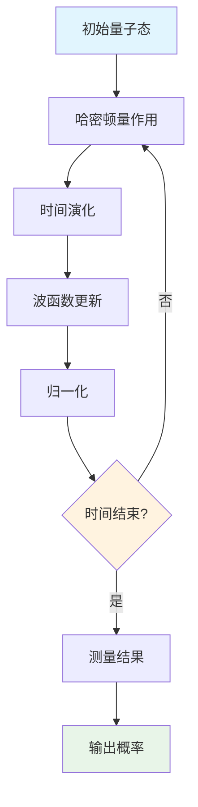
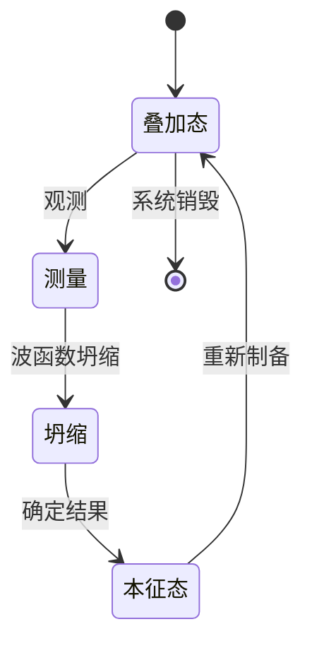
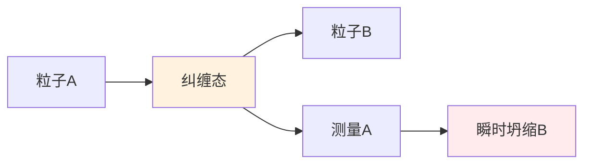
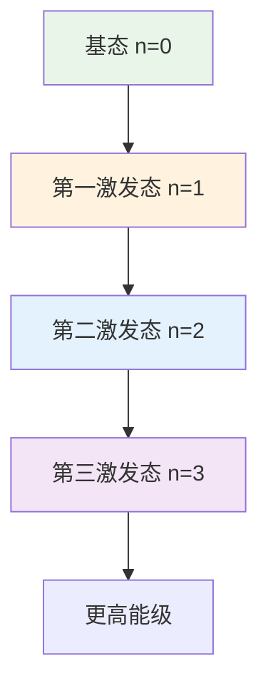

# 量子力学多表征示例 / Quantum Mechanics Multi-Representation Example

## 概述 / Overview

本文档展示量子力学模型的多表征实现，包括数学公式、代码实现、图表可视化和自然语言描述。

## 1. 量子态系统 / Quantum State System

### 1.1 数学表征 / Mathematical Representation

#### 薛定谔方程 / Schrödinger Equation

**时间相关薛定谔方程**:
$$i\hbar\frac{\partial}{\partial t}\Psi(\vec{r}, t) = \hat{H}\Psi(\vec{r}, t)$$

**时间无关薛定谔方程**:
$$\hat{H}\psi(\vec{r}) = E\psi(\vec{r})$$

**哈密顿算符**:
$$\hat{H} = -\frac{\hbar^2}{2m}\nabla^2 + V(\vec{r})$$

#### 量子态表示 / Quantum State Representation

**波函数**:
$$\Psi(\vec{r}, t) = \sum_n c_n(t)\psi_n(\vec{r})$$

**概率密度**:
$$|\Psi(\vec{r}, t)|^2 = \Psi^*(\vec{r}, t)\Psi(\vec{r}, t)$$

**归一化条件**:
$$\int_{-\infty}^{\infty} |\Psi(\vec{r}, t)|^2 d^3r = 1$$

#### 测量理论 / Measurement Theory

**期望值**:
$$\langle A \rangle = \int \Psi^*(\vec{r}, t)\hat{A}\Psi(\vec{r}, t) d^3r$$

**不确定性原理**:
$$\Delta x \Delta p \geq \frac{\hbar}{2}$$

### 1.2 代码表征 / Code Representation

#### Rust实现 / Rust Implementation

```rust
use std::f64::consts::PI;
use num_complex::Complex;

#[derive(Debug, Clone)]
pub struct QuantumState {
    pub amplitudes: Vec<Complex<f64>>,
    pub basis_states: Vec<String>,
}

impl QuantumState {
    pub fn new(amplitudes: Vec<Complex<f64>>, basis_states: Vec<String>) -> Self {
        Self {
            amplitudes,
            basis_states,
        }
    }
    
    pub fn normalize(&mut self) {
        let norm = self.amplitudes.iter()
            .map(|a| a.norm_sqr())
            .sum::<f64>()
            .sqrt();
        
        for amplitude in &mut self.amplitudes {
            *amplitude = *amplitude / norm;
        }
    }
    
    pub fn probability(&self, state_index: usize) -> f64 {
        if state_index < self.amplitudes.len() {
            self.amplitudes[state_index].norm_sqr()
        } else {
            0.0
        }
    }
    
    pub fn expectation_value(&self, operator: &Matrix) -> Complex<f64> {
        let mut result = Complex::new(0.0, 0.0);
        
        for i in 0..self.amplitudes.len() {
            for j in 0..self.amplitudes.len() {
                result += self.amplitudes[i].conj() * 
                         operator.get(i, j) * 
                         self.amplitudes[j];
            }
        }
        
        result
    }
    
    pub fn evolve(&mut self, hamiltonian: &Matrix, dt: f64) {
        // 简化的时间演化（使用欧拉方法）
        let mut new_amplitudes = vec![Complex::new(0.0, 0.0); self.amplitudes.len()];
        
        for i in 0..self.amplitudes.len() {
            for j in 0..self.amplitudes.len() {
                new_amplitudes[i] += -Complex::i() * hamiltonian.get(i, j) * 
                                   self.amplitudes[j] * dt;
            }
        }
        
        self.amplitudes = new_amplitudes;
        self.normalize();
    }
}

#[derive(Debug, Clone)]
pub struct Matrix {
    pub data: Vec<Vec<Complex<f64>>>,
    pub rows: usize,
    pub cols: usize,
}

impl Matrix {
    pub fn new(rows: usize, cols: usize) -> Self {
        let data = vec![vec![Complex::new(0.0, 0.0); cols]; rows];
        Self { data, rows, cols }
    }
    
    pub fn get(&self, i: usize, j: usize) -> Complex<f64> {
        if i < self.rows && j < self.cols {
            self.data[i][j]
        } else {
            Complex::new(0.0, 0.0)
        }
    }
    
    pub fn set(&mut self, i: usize, j: usize, value: Complex<f64>) {
        if i < self.rows && j < self.cols {
            self.data[i][j] = value;
        }
    }
    
    pub fn identity(size: usize) -> Self {
        let mut matrix = Self::new(size, size);
        for i in 0..size {
            matrix.set(i, i, Complex::new(1.0, 0.0));
        }
        matrix
    }
    
    pub fn pauli_x() -> Self {
        let mut matrix = Self::new(2, 2);
        matrix.set(0, 1, Complex::new(1.0, 0.0));
        matrix.set(1, 0, Complex::new(1.0, 0.0));
        matrix
    }
    
    pub fn pauli_y() -> Self {
        let mut matrix = Self::new(2, 2);
        matrix.set(0, 1, Complex::new(0.0, -1.0));
        matrix.set(1, 0, Complex::new(0.0, 1.0));
        matrix
    }
    
    pub fn pauli_z() -> Self {
        let mut matrix = Self::new(2, 2);
        matrix.set(0, 0, Complex::new(1.0, 0.0));
        matrix.set(1, 1, Complex::new(-1.0, 0.0));
        matrix
    }
}

// 量子系统
pub struct QuantumSystem {
    pub state: QuantumState,
    pub hamiltonian: Matrix,
    pub time: f64,
}

impl QuantumSystem {
    pub fn new(state: QuantumState, hamiltonian: Matrix) -> Self {
        Self {
            state,
            hamiltonian,
            time: 0.0,
        }
    }
    
    pub fn step(&mut self, dt: f64) {
        self.state.evolve(&self.hamiltonian, dt);
        self.time += dt;
    }
    
    pub fn measure(&self, observable: &Matrix) -> f64 {
        self.state.expectation_value(observable).re
    }
    
    pub fn energy(&self) -> f64 {
        self.measure(&self.hamiltonian)
    }
}

// 使用示例
fn main() {
    // 创建量子态 |ψ⟩ = (|0⟩ + |1⟩)/√2
    let amplitudes = vec![
        Complex::new(1.0 / 2.0_f64.sqrt(), 0.0),
        Complex::new(1.0 / 2.0_f64.sqrt(), 0.0),
    ];
    let basis_states = vec!["|0⟩".to_string(), "|1⟩".to_string()];
    let mut state = QuantumState::new(amplitudes, basis_states);
    
    // 创建哈密顿量 H = σz
    let hamiltonian = Matrix::pauli_z();
    
    // 创建量子系统
    let mut system = QuantumSystem::new(state, hamiltonian);
    
    println!("Initial state: {:?}", system.state.amplitudes);
    println!("Initial energy: {:.3}", system.energy());
    
    // 时间演化
    let dt = 0.01;
    for i in 0..100 {
        system.step(dt);
        if i % 10 == 0 {
            println!("Time: {:.2}, Energy: {:.3}", system.time, system.energy());
        }
    }
}
```

#### Haskell实现 / Haskell Implementation

```haskell
module QuantumMechanics where

import Data.Complex
import Data.Vector (Vector)
import qualified Data.Vector as V

-- 量子态数据类型
data QuantumState = QuantumState {
    amplitudes :: Vector (Complex Double),
    basisStates :: [String]
} deriving (Show)

-- 创建量子态
newQuantumState :: [Complex Double] -> [String] -> QuantumState
newQuantumState amps basis = QuantumState (V.fromList amps) basis

-- 归一化
normalize :: QuantumState -> QuantumState
normalize qs = qs { amplitudes = V.map (/ norm) (amplitudes qs) }
  where
    norm = sqrt $ V.sum $ V.map (\a -> realPart (a * conjugate a)) (amplitudes qs)

-- 计算概率
probability :: QuantumState -> Int -> Double
probability qs i = if i < V.length (amplitudes qs)
                   then realPart (a * conjugate a)
                   else 0.0
  where
    a = amplitudes qs V.! i

-- 矩阵数据类型
data Matrix = Matrix {
    data_ :: [[Complex Double]],
    rows :: Int,
    cols :: Int
} deriving (Show)

-- 创建矩阵
newMatrix :: Int -> Int -> Matrix
newMatrix r c = Matrix (replicate r (replicate c 0)) r c

-- 获取矩阵元素
getMatrix :: Matrix -> Int -> Int -> Complex Double
getMatrix m i j = if i < rows m && j < cols m
                  then (data_ m !! i) !! j
                  else 0

-- 设置矩阵元素
setMatrix :: Matrix -> Int -> Int -> Complex Double -> Matrix
setMatrix m i j val = m { data_ = newData }
  where
    newData = take i (data_ m) ++ 
              [take j (data_ m !! i) ++ [val] ++ drop (j+1) (data_ m !! i)] ++
              drop (i+1) (data_ m)

-- 单位矩阵
identityMatrix :: Int -> Matrix
identityMatrix n = Matrix (map (\i -> map (\j -> if i == j then 1 else 0) [0..n-1]) [0..n-1]) n n

-- Pauli矩阵
pauliX :: Matrix
pauliX = Matrix [[0, 1], [1, 0]] 2 2

pauliY :: Matrix
pauliY = Matrix [[0, -1 :+ 0], [1 :+ 0, 0]] 2 2

pauliZ :: Matrix
pauliZ = Matrix [[1, 0], [0, -1]] 2 2

-- 期望值计算
expectationValue :: QuantumState -> Matrix -> Complex Double
expectationValue qs op = sum [conjugate (amplitudes qs V.! i) * 
                              getMatrix op i j * 
                              amplitudes qs V.! j
                              | i <- [0..V.length (amplitudes qs)-1],
                                j <- [0..V.length (amplitudes qs)-1]]

-- 量子系统
data QuantumSystem = QuantumSystem {
    state :: QuantumState,
    hamiltonian :: Matrix,
    time :: Double
} deriving (Show)

-- 创建量子系统
newQuantumSystem :: QuantumState -> Matrix -> QuantumSystem
newQuantumSystem s h = QuantumSystem s h 0.0

-- 时间演化（简化版本）
evolve :: Double -> QuantumSystem -> QuantumSystem
evolve dt qs = qs { 
    state = normalize (evolveState dt (state qs) (hamiltonian qs)),
    time = time qs + dt
}
  where
    evolveState dt st ham = st { amplitudes = V.map evolveAmplitude (amplitudes st) }
    evolveAmplitude a = a * exp (-1 :+ 0 * dt)  -- 简化的演化

-- 测量
measure :: QuantumSystem -> Matrix -> Double
measure qs observable = realPart (expectationValue (state qs) observable)

-- 能量
energy :: QuantumSystem -> Double
energy qs = measure qs (hamiltonian qs)

-- 示例使用
example :: IO ()
example = do
    -- 创建叠加态 |ψ⟩ = (|0⟩ + |1⟩)/√2
    let amplitudes = V.fromList [1/sqrt 2 :+ 0, 1/sqrt 2 :+ 0]
        basisStates = ["|0⟩", "|1⟩"]
        state = newQuantumState (V.toList amplitudes) basisStates
    
    -- 创建哈密顿量 H = σz
    let hamiltonian = pauliZ
        system = newQuantumSystem state hamiltonian
    
    putStrLn $ "Initial state: " ++ show (amplitudes (state system))
    putStrLn $ "Initial energy: " ++ show (energy system)
    
    -- 时间演化
    let steps = take 100 $ iterate (evolve 0.01) system
    mapM_ (\(i, s) -> 
        if i `mod` 10 == 0 then
            putStrLn $ "Time: " ++ show (time s) ++ ", Energy: " ++ show (energy s)
        else return ()) (zip [0..] steps)
```

#### Python实现 / Python Implementation

```python
import numpy as np
import matplotlib.pyplot as plt
from dataclasses import dataclass
from typing import List, Tuple
import cmath

@dataclass
class QuantumState:
    """量子态类，表示量子系统的状态"""
    amplitudes: np.ndarray  # 复数数组
    basis_states: List[str]  # 基态标签
    
    def __post_init__(self):
        self.amplitudes = np.array(self.amplitudes, dtype=complex)
        self.normalize()
    
    def normalize(self) -> None:
        """归一化量子态"""
        norm = np.sqrt(np.sum(np.abs(self.amplitudes) ** 2))
        if norm > 0:
            self.amplitudes /= norm
    
    def probability(self, state_index: int) -> float:
        """计算特定态的概率"""
        if 0 <= state_index < len(self.amplitudes):
            return float(np.abs(self.amplitudes[state_index]) ** 2)
        return 0.0
    
    def expectation_value(self, operator: np.ndarray) -> complex:
        """计算期望值 ⟨ψ|A|ψ⟩"""
        return np.conj(self.amplitudes) @ operator @ self.amplitudes
    
    def evolve(self, hamiltonian: np.ndarray, dt: float) -> None:
        """时间演化（使用欧拉方法）"""
        # 简化的时间演化
        evolution_operator = np.exp(-1j * hamiltonian * dt)
        self.amplitudes = evolution_operator @ self.amplitudes
        self.normalize()

class QuantumSystem:
    """量子系统类"""
    
    def __init__(self, state: QuantumState, hamiltonian: np.ndarray):
        self.state = state
        self.hamiltonian = hamiltonian
        self.time = 0.0
        self.history = []
    
    def step(self, dt: float) -> None:
        """系统演化一个时间步"""
        self.state.evolve(self.hamiltonian, dt)
        self.time += dt
        self.record_history()
    
    def measure(self, observable: np.ndarray) -> float:
        """测量可观测量"""
        return float(self.state.expectation_value(observable).real)
    
    def energy(self) -> float:
        """计算系统能量"""
        return self.measure(self.hamiltonian)
    
    def record_history(self) -> None:
        """记录历史数据"""
        state_data = {
            'time': self.time,
            'amplitudes': self.state.amplitudes.copy(),
            'probabilities': [self.state.probability(i) for i in range(len(self.state.amplitudes))],
            'energy': self.energy()
        }
        self.history.append(state_data)
    
    def plot_evolution(self) -> None:
        """绘制演化过程"""
        if not self.history:
            return
        
        times = [h['time'] for h in self.history]
        energies = [h['energy'] for h in self.history]
        probabilities = list(zip(*[h['probabilities'] for h in self.history]))
        
        fig, (ax1, ax2) = plt.subplots(1, 2, figsize=(12, 5))
        
        # 能量演化
        ax1.plot(times, energies, 'b-', label='Energy')
        ax1.set_xlabel('Time')
        ax1.set_ylabel('Energy')
        ax1.set_title('Energy Evolution')
        ax1.legend()
        ax1.grid(True)
        
        # 概率演化
        for i, prob in enumerate(probabilities):
            ax2.plot(times, prob, label=f'State {i}')
        ax2.set_xlabel('Time')
        ax2.set_ylabel('Probability')
        ax2.set_title('State Probabilities')
        ax2.legend()
        ax2.grid(True)
        
        plt.tight_layout()
        plt.show()

# Pauli矩阵
def pauli_x() -> np.ndarray:
    """Pauli X矩阵"""
    return np.array([[0, 1], [1, 0]], dtype=complex)

def pauli_y() -> np.ndarray:
    """Pauli Y矩阵"""
    return np.array([[0, -1j], [1j, 0]], dtype=complex)

def pauli_z() -> np.ndarray:
    """Pauli Z矩阵"""
    return np.array([[1, 0], [0, -1]], dtype=complex)

def hadamard() -> np.ndarray:
    """Hadamard门"""
    return np.array([[1, 1], [1, -1]], dtype=complex) / np.sqrt(2)

# 使用示例
def demo_quantum_system():
    """演示量子系统"""
    # 创建叠加态 |ψ⟩ = (|0⟩ + |1⟩)/√2
    amplitudes = [1/np.sqrt(2), 1/np.sqrt(2)]
    basis_states = ["|0⟩", "|1⟩"]
    state = QuantumState(amplitudes, basis_states)
    
    # 创建哈密顿量 H = σz
    hamiltonian = pauli_z()
    
    # 创建量子系统
    system = QuantumSystem(state, hamiltonian)
    
    print(f"Initial state: {system.state.amplitudes}")
    print(f"Initial energy: {system.energy():.3f}")
    
    # 时间演化
    dt = 0.01
    total_time = 2.0
    steps = int(total_time / dt)
    
    for i in range(steps):
        system.step(dt)
        if i % 100 == 0:
            print(f"Time: {system.time:.2f}, Energy: {system.energy():.3f}")
    
    print(f"Final energy: {system.energy():.3f}")
    
    # 绘制结果
    system.plot_evolution()

if __name__ == "__main__":
    demo_quantum_system()
```

### 1.3 图表表征 / Visual Representation

#### 量子系统演化图 / Quantum System Evolution Diagram



#### 量子测量过程图 / Quantum Measurement Process Diagram



#### 量子纠缠图 / Quantum Entanglement Diagram



### 1.4 自然语言表征 / Natural Language Representation

#### 中文描述 / Chinese Description

**量子力学系统**是描述微观粒子行为的物理理论，具有以下核心特征：

**基本概念**:

- **量子态**: 用波函数描述的粒子状态
- **叠加原理**: 量子态可以线性叠加
- **测量坍缩**: 测量导致波函数坍缩到本征态
- **不确定性**: 位置和动量不能同时精确确定

**数学框架**:

1. 薛定谔方程描述时间演化
2. 波函数表示量子态
3. 算符表示可观测量
4. 期望值给出测量结果

**物理现象**:

- 量子叠加：粒子同时处于多个状态
- 量子纠缠：多粒子系统的非局域关联
- 量子隧穿：粒子穿越势垒的现象
- 量子干涉：波函数的干涉效应

**应用领域**:

- 量子计算和量子信息
- 原子和分子物理
- 凝聚态物理
- 量子化学

#### 英文描述 / English Description

**Quantum mechanical system** is a physical theory describing the behavior of microscopic particles with the following core features:

**Basic Concepts**:

- **Quantum State**: Particle state described by wave function
- **Superposition Principle**: Quantum states can be linearly superposed
- **Measurement Collapse**: Measurement causes wave function collapse to eigenstates
- **Uncertainty**: Position and momentum cannot be precisely determined simultaneously

**Mathematical Framework**:

1. Schrödinger equation describes time evolution
2. Wave function represents quantum state
3. Operators represent observables
4. Expectation values give measurement results

**Physical Phenomena**:

- Quantum superposition: Particles simultaneously in multiple states
- Quantum entanglement: Non-local correlations in multi-particle systems
- Quantum tunneling: Particles traversing potential barriers
- Quantum interference: Interference effects of wave functions

**Applications**:

- Quantum computing and quantum information
- Atomic and molecular physics
- Condensed matter physics
- Quantum chemistry

## 2. 量子谐振子 / Quantum Harmonic Oscillator

### 2.1 数学表征 / Mathematical Representation

**哈密顿量**:
$$\hat{H} = \frac{\hat{p}^2}{2m} + \frac{1}{2}m\omega^2\hat{x}^2$$

**能量本征值**:
$$E_n = \hbar\omega(n + \frac{1}{2})$$

**基态波函数**:
$$\psi_0(x) = \left(\frac{m\omega}{\pi\hbar}\right)^{1/4}e^{-m\omega x^2/2\hbar}$$

**阶梯算符**:
$$\hat{a} = \sqrt{\frac{m\omega}{2\hbar}}(\hat{x} + \frac{i}{m\omega}\hat{p})$$
$$\hat{a}^\dagger = \sqrt{\frac{m\omega}{2\hbar}}(\hat{x} - \frac{i}{m\omega}\hat{p})$$

### 2.2 代码表征 / Code Representation

```rust
#[derive(Debug)]
pub struct QuantumHarmonicOscillator {
    pub mass: f64,
    pub frequency: f64,
    pub energy_level: usize,
}

impl QuantumHarmonicOscillator {
    pub fn new(mass: f64, frequency: f64) -> Self {
        Self {
            mass,
            frequency,
            energy_level: 0,
        }
    }
    
    pub fn energy(&self, n: usize) -> f64 {
        let hbar = 1.054571817e-34;
        hbar * self.frequency * (n as f64 + 0.5)
    }
    
    pub fn ground_state_energy(&self) -> f64 {
        self.energy(0)
    }
    
    pub fn wave_function(&self, x: f64, n: usize) -> f64 {
        let hbar = 1.054571817e-34;
        let alpha = (self.mass * self.frequency / hbar).sqrt();
        
        match n {
            0 => (alpha / PI.sqrt()).sqrt() * (-alpha * x * x / 2.0).exp(),
            1 => (alpha / (2.0 * PI.sqrt())).sqrt() * 2.0 * alpha * x * (-alpha * x * x / 2.0).exp(),
            _ => 0.0, // 简化实现
        }
    }
    
    pub fn probability_density(&self, x: f64, n: usize) -> f64 {
        let psi = self.wave_function(x, n);
        psi * psi
    }
}
```

### 2.3 图表表征 / Visual Representation

#### 量子谐振子能级图 / Quantum Harmonic Oscillator Energy Levels



---

*最后更新: 2025-08-01*
*版本: 1.0.0*
