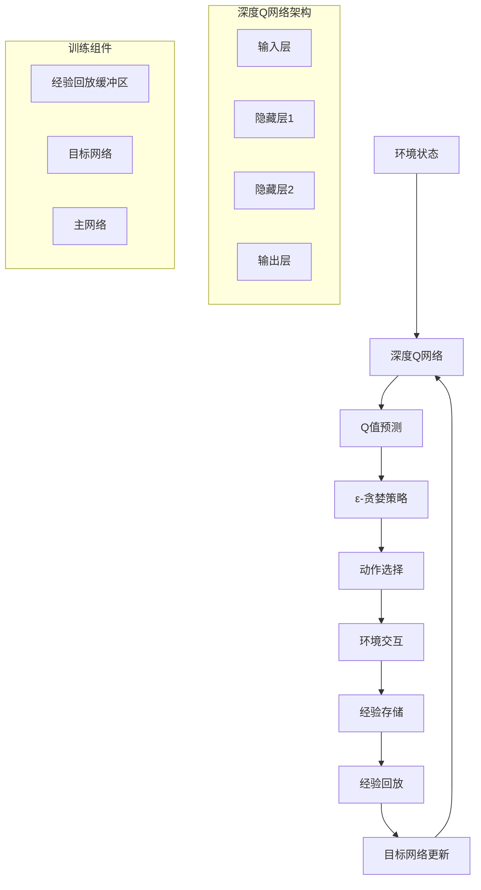

# 强化学习扩展多表征示例 / Reinforcement Learning Extension Multi-Representation Examples

## 概述 / Overview

本文档提供了强化学习扩展的完整多表征示例，包括深度强化学习、多智能体强化学习和元强化学习。每种方法都包含数学表示、可视化图表和完整的代码实现。

## 1. 深度强化学习 / Deep Reinforcement Learning

### 1.1 深度Q网络 (DQN) / Deep Q-Network

#### 数学表示 / Mathematical Representation

深度Q网络将Q-Learning与深度神经网络结合，用于处理高维状态空间。

Q-Learning更新规则：

Q-Learning Update Rule:

$$Q(s, a) \leftarrow Q(s, a) + \alpha \left[r + \gamma \max_{a'} Q(s', a') - Q(s, a)\right]$$

其中：

- $Q(s, a)$ 是状态-动作价值函数
- $\alpha$ 是学习率
- $r$ 是即时奖励
- $\gamma$ 是折扣因子
- $s'$ 是下一个状态

where:

- $Q(s, a)$ is the state-action value function
- $\alpha$ is the learning rate
- $r$ is the immediate reward
- $\gamma$ is the discount factor
- $s'$ is the next state

深度Q网络损失函数：

Deep Q-Network Loss Function:

$$\mathcal{L}(\theta) = \mathbb{E}_{(s,a,r,s') \sim \mathcal{D}} \left[\left(r + \gamma \max_{a'} Q(s', a'; \theta^-) - Q(s, a; \theta)\right)^2\right]$$

其中：

- $\theta$ 是主网络参数
- $\theta^-$ 是目标网络参数
- $\mathcal{D}$ 是经验回放缓冲区

where:

- $\theta$ are the main network parameters
- $\theta^-$ are the target network parameters
- $\mathcal{D}$ is the experience replay buffer

#### 可视化表示 / Visual Representation



#### Python实现 / Python Implementation

```python
import torch
import torch.nn as nn
import torch.nn.functional as F
import torch.optim as optim
import numpy as np
import matplotlib.pyplot as plt
from collections import deque, namedtuple
import random
from typing import List, Tuple, Optional
import warnings
warnings.filterwarnings('ignore')

# 经验元组
Experience = namedtuple('Experience', ['state', 'action', 'reward', 'next_state', 'done'])

class DQN(nn.Module):
    """深度Q网络"""
    
    def __init__(self, input_dim: int, output_dim: int, hidden_dim: int = 128):
        super(DQN, self).__init__()
        self.input_dim = input_dim
        self.output_dim = output_dim
        
        # 网络架构
        self.fc1 = nn.Linear(input_dim, hidden_dim)
        self.fc2 = nn.Linear(hidden_dim, hidden_dim)
        self.fc3 = nn.Linear(hidden_dim, output_dim)
        
    def forward(self, x: torch.Tensor) -> torch.Tensor:
        """前向传播"""
        x = F.relu(self.fc1(x))
        x = F.relu(self.fc2(x))
        return self.fc3(x)

class ReplayBuffer:
    """经验回放缓冲区"""
    
    def __init__(self, capacity: int = 10000):
        self.buffer = deque(maxlen=capacity)
    
    def push(self, experience: Experience) -> None:
        """添加经验"""
        self.buffer.append(experience)
    
    def sample(self, batch_size: int) -> List[Experience]:
        """采样经验"""
        return random.sample(self.buffer, batch_size)
    
    def __len__(self) -> int:
        return len(self.buffer)

class DQNAgent:
    """DQN智能体"""
    
    def __init__(self, state_dim: int, action_dim: int, lr: float = 0.001, 
                 gamma: float = 0.99, epsilon: float = 1.0, epsilon_min: float = 0.01,
                 epsilon_decay: float = 0.995, target_update: int = 100):
        self.state_dim = state_dim
        self.action_dim = action_dim
        self.gamma = gamma
        self.epsilon = epsilon
        self.epsilon_min = epsilon_min
        self.epsilon_decay = epsilon_decay
        self.target_update = target_update
        
        # 网络
        self.q_network = DQN(state_dim, action_dim)
        self.target_network = DQN(state_dim, action_dim)
        self.target_network.load_state_dict(self.q_network.state_dict())
        
        # 优化器
        self.optimizer = optim.Adam(self.q_network.parameters(), lr=lr)
        
        # 经验回放
        self.memory = ReplayBuffer()
        
        # 训练计数器
        self.step_count = 0
    
    def select_action(self, state: np.ndarray) -> int:
        """选择动作"""
        if random.random() < self.epsilon:
            return random.randrange(self.action_dim)
        
        with torch.no_grad():
            state_tensor = torch.FloatTensor(state).unsqueeze(0)
            q_values = self.q_network(state_tensor)
            return q_values.argmax().item()
    
    def train(self, batch_size: int = 32) -> float:
        """训练网络"""
        if len(self.memory) < batch_size:
            return 0.0
        
        # 采样经验
        experiences = self.memory.sample(batch_size)
        batch = Experience(*zip(*experiences))
        
        # 转换为张量
        state_batch = torch.FloatTensor(batch.state)
        action_batch = torch.LongTensor(batch.action)
        reward_batch = torch.FloatTensor(batch.reward)
        next_state_batch = torch.FloatTensor(batch.next_state)
        done_batch = torch.BoolTensor(batch.done)
        
        # 计算当前Q值
        current_q_values = self.q_network(state_batch).gather(1, action_batch.unsqueeze(1))
        
        # 计算目标Q值
        with torch.no_grad():
            next_q_values = self.target_network(next_state_batch).max(1)[0]
            target_q_values = reward_batch + (self.gamma * next_q_values * ~done_batch)
        
        # 计算损失
        loss = F.mse_loss(current_q_values.squeeze(), target_q_values)
        
        # 反向传播
        self.optimizer.zero_grad()
        loss.backward()
        self.optimizer.step()
        
        # 更新目标网络
        self.step_count += 1
        if self.step_count % self.target_update == 0:
            self.target_network.load_state_dict(self.q_network.state_dict())
        
        # 衰减探索率
        if self.epsilon > self.epsilon_min:
            self.epsilon *= self.epsilon_decay
        
        return loss.item()

class CartPoleEnvironment:
    """CartPole环境模拟"""
    
    def __init__(self):
        self.state_dim = 4
        self.action_dim = 2
        self.reset()
    
    def reset(self) -> np.ndarray:
        """重置环境"""
        # 初始状态：位置、速度、角度、角速度
        self.state = np.array([0.0, 0.0, 0.0, 0.0])
        return self.state.copy()
    
    def step(self, action: int) -> Tuple[np.ndarray, float, bool]:
        """执行动作"""
        # 简化的CartPole动力学
        x, x_dot, theta, theta_dot = self.state
        
        # 动作：0=左推，1=右推
        force = 10.0 if action == 1 else -10.0
        
        # 物理参数
        gravity = 9.8
        masscart = 1.0
        masspole = 0.1
        total_mass = masscart + masspole
        length = 0.5
        polemass_length = masspole * length
        
        # 计算加速度
        temp = (force + polemass_length * theta_dot**2 * np.sin(theta)) / total_mass
        thetaacc = (gravity * np.sin(theta) - temp * np.cos(theta)) / (length * (4.0/3.0 - masspole * np.cos(theta)**2 / total_mass))
        xacc = temp - polemass_length * thetaacc * np.cos(theta) / total_mass
        
        # 更新状态
        x_dot += xacc * 0.02
        x += x_dot * 0.02
        theta_dot += thetaacc * 0.02
        theta += theta_dot * 0.02
        
        self.state = np.array([x, x_dot, theta, theta_dot])
        
        # 检查是否结束
        done = (x < -2.4 or x > 2.4 or theta < -0.418 or theta > 0.418)
        
        # 奖励
        reward = 1.0 if not done else 0.0
        
        return self.state.copy(), reward, done

def train_dqn(episodes: int = 500, max_steps: int = 200) -> Tuple[List[float], List[float]]:
    """训练DQN智能体"""
    env = CartPoleEnvironment()
    agent = DQNAgent(env.state_dim, env.action_dim)
    
    episode_rewards = []
    episode_losses = []
    
    for episode in range(episodes):
        state = env.reset()
        total_reward = 0
        episode_loss = 0
        step_count = 0
        
        for step in range(max_steps):
            # 选择动作
            action = agent.select_action(state)
            
            # 执行动作
            next_state, reward, done = env.step(action)
            
            # 存储经验
            experience = Experience(state, action, reward, next_state, done)
            agent.memory.push(experience)
            
            # 训练网络
            loss = agent.train()
            if loss > 0:
                episode_loss += loss
            
            total_reward += reward
            state = next_state
            step_count += 1
            
            if done:
                break
        
        episode_rewards.append(total_reward)
        episode_losses.append(episode_loss / max(step_count, 1))
        
        if episode % 50 == 0:
            avg_reward = np.mean(episode_rewards[-50:])
            print(f"Episode {episode}: Average Reward = {avg_reward:.2f}, Epsilon = {agent.epsilon:.3f}")
    
    return episode_rewards, episode_losses

def visualize_dqn_training(rewards: List[float], losses: List[float]) -> None:
    """可视化DQN训练过程"""
    plt.figure(figsize=(15, 5))
    
    # 奖励曲线
    plt.subplot(1, 3, 1)
    plt.plot(rewards, alpha=0.6, color='blue')
    plt.title('Episode Rewards')
    plt.xlabel('Episode')
    plt.ylabel('Reward')
    plt.grid(True, alpha=0.3)
    
    # 移动平均奖励
    window_size = 50
    if len(rewards) >= window_size:
        moving_avg = np.convolve(rewards, np.ones(window_size)/window_size, mode='valid')
        plt.plot(range(window_size-1, len(rewards)), moving_avg, color='red', linewidth=2)
    
    # 损失曲线
    plt.subplot(1, 3, 2)
    plt.plot(losses, alpha=0.6, color='green')
    plt.title('Training Loss')
    plt.xlabel('Episode')
    plt.ylabel('Loss')
    plt.grid(True, alpha=0.3)
    
    # 奖励分布
    plt.subplot(1, 3, 3)
    plt.hist(rewards, bins=30, alpha=0.7, color='orange')
    plt.title('Reward Distribution')
    plt.xlabel('Reward')
    plt.ylabel('Frequency')
    plt.grid(True, alpha=0.3)
    
    plt.tight_layout()
    plt.show()

# 测试DQN
if __name__ == "__main__":
    # 训练DQN智能体
    rewards, losses = train_dqn(episodes=300)
    
    # 可视化训练过程
    visualize_dqn_training(rewards, losses)
    
    # 测试训练好的智能体
    env = CartPoleEnvironment()
    agent = DQNAgent(env.state_dim, env.action_dim)
    
    # 加载训练好的网络（这里简化处理）
    print("测试智能体性能...")
    test_episodes = 10
    test_rewards = []
    
    for episode in range(test_episodes):
        state = env.reset()
        total_reward = 0
        
        for step in range(200):
            action = agent.select_action(state)
            state, reward, done = env.step(action)
            total_reward += reward
            
            if done:
                break
        
        test_rewards.append(total_reward)
        print(f"Test Episode {episode + 1}: Reward = {total_reward}")
    
    print(f"平均测试奖励: {np.mean(test_rewards):.2f}")
```
