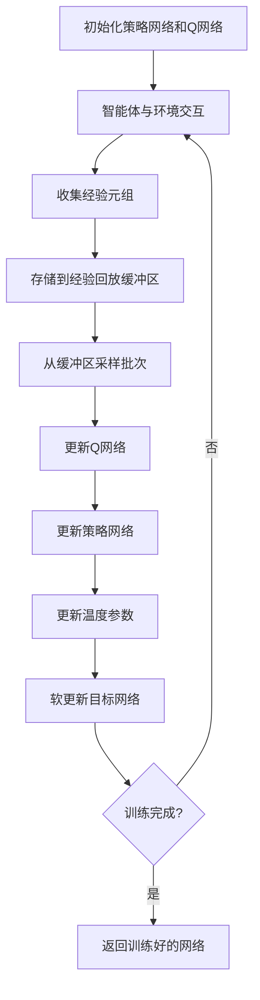
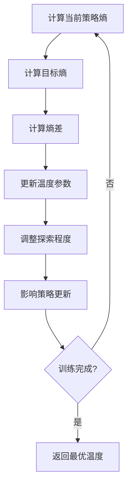
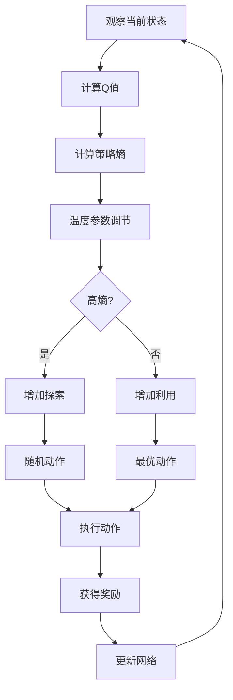

# 软演员评论家多表示示例 / Soft Actor-Critic Multi-Representation Examples

## 概述 / Overview

软演员评论家(SAC)是一种基于最大熵强化学习的算法，通过引入熵正则化来平衡探索和利用。本文档提供了SAC的多表示示例，包括数学表示、可视化流程图和代码实现。

Soft Actor-Critic (SAC) is a maximum entropy reinforcement learning algorithm that balances exploration and exploitation through entropy regularization. This document provides multi-representation examples for SAC, including mathematical representations, visual flowcharts, and code implementations.

## 1. 最大熵强化学习 / Maximum Entropy Reinforcement Learning

### 1.1 数学表示 / Mathematical Representation

#### 最大熵目标函数 / Maximum Entropy Objective

$$J(\pi) = \sum_{t=0}^T \mathbb{E}_{(s_t, a_t) \sim \rho_\pi} \left[ r(s_t, a_t) + \alpha \mathcal{H}(\pi(\cdot|s_t)) \right]$$

其中：

- $\pi$ 是策略
- $\mathcal{H}(\pi(\cdot|s_t))$ 是策略熵
- $\alpha$ 是温度参数，控制探索程度

#### 软Q函数 / Soft Q-Function

$$Q^\pi(s, a) = r(s, a) + \gamma \mathbb{E}_{s' \sim p} \left[ V^\pi(s') \right]$$

#### 软价值函数 / Soft Value Function

$$V^\pi(s) = \mathbb{E}_{a \sim \pi} \left[ Q^\pi(s, a) - \alpha \log \pi(a|s) \right]$$

#### 策略目标 / Policy Objective

$$\pi_{new} = \arg\min_{\pi'} D_{KL} \left( \pi'(\cdot|s_t) \bigg\| \frac{\exp(Q^{\pi_{old}}(s_t, \cdot))}{Z^{\pi_{old}}(s_t)} \right)$$

其中 $Z^{\pi_{old}}(s_t)$ 是归一化常数。

### 1.2 流程图 / Flowchart



### 1.3 代码实现 / Code Implementation

```python
import torch
import torch.nn as nn
import torch.nn.functional as F
import torch.optim as optim
import numpy as np
from collections import deque
import random
from typing import Tuple
import math

class SACActor(nn.Module):
    """SAC策略网络 / SAC Actor Network"""
    
    def __init__(self, state_dim: int, action_dim: int, hidden_dim: int = 256):
        super(SACActor, self).__init__()
        self.action_dim = action_dim
        
        self.fc1 = nn.Linear(state_dim, hidden_dim)
        self.fc2 = nn.Linear(hidden_dim, hidden_dim)
        self.fc_mean = nn.Linear(hidden_dim, action_dim)
        self.fc_logstd = nn.Linear(hidden_dim, action_dim)
    
    def forward(self, state: torch.Tensor) -> Tuple[torch.Tensor, torch.Tensor]:
        """前向传播 / Forward pass"""
        x = F.relu(self.fc1(state))
        x = F.relu(self.fc2(x))
        
        mean = self.fc_mean(x)
        log_std = self.fc_logstd(x)
        log_std = torch.clamp(log_std, -20, 2)
        
        return mean, log_std
    
    def sample(self, state: torch.Tensor) -> Tuple[torch.Tensor, torch.Tensor]:
        """采样动作 / Sample action"""
        mean, log_std = self.forward(state)
        std = log_std.exp()
        normal = torch.distributions.Normal(mean, std)
        
        # 重参数化技巧
        x_t = normal.rsample()
        action = torch.tanh(x_t)
        
        # 计算log概率
        log_prob = normal.log_prob(x_t)
        log_prob -= torch.log(1 - action.pow(2) + 1e-6)
        log_prob = log_prob.sum(1, keepdim=True)
        
        return action, log_prob

class SACCritic(nn.Module):
    """SAC评论家网络 / SAC Critic Network"""
    
    def __init__(self, state_dim: int, action_dim: int, hidden_dim: int = 256):
        super(SACCritic, self).__init__()
        
        self.fc1 = nn.Linear(state_dim + action_dim, hidden_dim)
        self.fc2 = nn.Linear(hidden_dim, hidden_dim)
        self.fc3 = nn.Linear(hidden_dim, 1)
    
    def forward(self, state: torch.Tensor, action: torch.Tensor) -> torch.Tensor:
        """前向传播 / Forward pass"""
        x = torch.cat([state, action], dim=1)
        x = F.relu(self.fc1(x))
        x = F.relu(self.fc2(x))
        return self.fc3(x)

class SACAgent:
    """SAC智能体 / SAC Agent"""
    
    def __init__(self, state_dim: int, action_dim: int, lr: float = 3e-4,
                 gamma: float = 0.99, tau: float = 0.005, alpha: float = 0.2,
                 auto_entropy_tuning: bool = True):
        self.state_dim = state_dim
        self.action_dim = action_dim
        self.gamma = gamma
        self.tau = tau
        self.alpha = alpha
        self.auto_entropy_tuning = auto_entropy_tuning
        
        # 网络
        self.actor = SACActor(state_dim, action_dim)
        self.critic1 = SACCritic(state_dim, action_dim)
        self.critic2 = SACCritic(state_dim, action_dim)
        self.critic1_target = SACCritic(state_dim, action_dim)
        self.critic2_target = SACCritic(state_dim, action_dim)
        
        # 初始化目标网络
        self.critic1_target.load_state_dict(self.critic1.state_dict())
        self.critic2_target.load_state_dict(self.critic2.state_dict())
        
        # 优化器
        self.actor_optimizer = optim.Adam(self.actor.parameters(), lr=lr)
        self.critic1_optimizer = optim.Adam(self.critic1.parameters(), lr=lr)
        self.critic2_optimizer = optim.Adam(self.critic2.parameters(), lr=lr)
        
        # 自动熵调节
        if self.auto_entropy_tuning:
            self.target_entropy = -action_dim
            self.log_alpha = torch.zeros(1, requires_grad=True)
            self.alpha_optimizer = optim.Adam([self.log_alpha], lr=lr)
        
        # 经验回放
        self.memory = deque(maxlen=100000)
    
    def select_action(self, state: np.ndarray, evaluate: bool = False) -> np.ndarray:
        """选择动作 / Select action"""
        with torch.no_grad():
            state_tensor = torch.FloatTensor(state).unsqueeze(0)
            if evaluate:
                mean, _ = self.actor.forward(state_tensor)
                action = torch.tanh(mean)
            else:
                action, _ = self.actor.sample(state_tensor)
            return action.squeeze().numpy()
    
    def train(self, batch_size: int = 256) -> Tuple[float, float, float]:
        """训练网络 / Train networks"""
        if len(self.memory) < batch_size:
            return 0.0, 0.0, 0.0
        
        # 采样经验
        batch = random.sample(self.memory, batch_size)
        states, actions, rewards, next_states, dones = zip(*batch)
        
        # 转换为张量
        states = torch.FloatTensor(states)
        actions = torch.FloatTensor(actions)
        rewards = torch.FloatTensor(rewards).unsqueeze(1)
        next_states = torch.FloatTensor(next_states)
        dones = torch.BoolTensor(dones).unsqueeze(1)
        
        # 更新评论家网络
        with torch.no_grad():
            next_actions, next_log_probs = self.actor.sample(next_states)
            q1_next_target = self.critic1_target(next_states, next_actions)
            q2_next_target = self.critic2_target(next_states, next_actions)
            min_q_next_target = torch.min(q1_next_target, q2_next_target) - \
                               self.alpha * next_log_probs
            next_q_value = rewards + (self.gamma * min_q_next_target * ~dones)
        
        q1 = self.critic1(states, actions)
        q2 = self.critic2(states, actions)
        q1_loss = F.mse_loss(q1, next_q_value)
        q2_loss = F.mse_loss(q2, next_q_value)
        
        self.critic1_optimizer.zero_grad()
        q1_loss.backward()
        self.critic1_optimizer.step()
        
        self.critic2_optimizer.zero_grad()
        q2_loss.backward()
        self.critic2_optimizer.step()
        
        # 更新策略网络
        new_actions, log_probs = self.actor.sample(states)
        q1_new = self.critic1(states, new_actions)
        q2_new = self.critic2(states, new_actions)
        min_q_new = torch.min(q1_new, q2_new)
        
        actor_loss = (self.alpha * log_probs - min_q_new).mean()
        
        self.actor_optimizer.zero_grad()
        actor_loss.backward()
        self.actor_optimizer.step()
        
        # 更新温度参数
        alpha_loss = 0.0
        if self.auto_entropy_tuning:
            alpha_loss = -(self.log_alpha * (log_probs + self.target_entropy).detach()).mean()
            
            self.alpha_optimizer.zero_grad()
            alpha_loss.backward()
            self.alpha_optimizer.step()
            
            self.alpha = self.log_alpha.exp()
        
        # 软更新目标网络
        self.soft_update(self.critic1_target, self.critic1)
        self.soft_update(self.critic2_target, self.critic2)
        
        return actor_loss.item(), q1_loss.item(), alpha_loss
    
    def soft_update(self, target: nn.Module, source: nn.Module):
        """软更新目标网络 / Soft update target networks"""
        for target_param, source_param in zip(target.parameters(), source.parameters()):
            target_param.data.copy_(self.tau * source_param.data + 
                                   (1 - self.tau) * target_param.data)
    
    def remember(self, state: np.ndarray, action: np.ndarray, 
                reward: float, next_state: np.ndarray, done: bool):
        """存储经验 / Store experience"""
        self.memory.append((state, action, reward, next_state, done))

# 示例使用 / Example Usage
def create_sac_environment():
    """创建SAC环境 / Create SAC environment"""
    class SACEnv:
        def __init__(self, state_dim=4, action_dim=2):
            self.state_dim = state_dim
            self.action_dim = action_dim
            self.state = np.random.randn(state_dim)
        
        def reset(self):
            """重置环境 / Reset environment"""
            self.state = np.random.randn(self.state_dim)
            return self.state
        
        def step(self, action):
            """执行动作 / Execute action"""
            # 简化的环境动态
            reward = np.sum(self.state * action) - 0.1 * np.sum(action**2)
            self.state = self.state + action * 0.1 + np.random.randn(self.state_dim) * 0.01
            done = np.random.random() < 0.05
            return self.state, reward, done
    
    return SACEnv()

# 训练SAC智能体
env = create_sac_environment()
agent = SACAgent(state_dim=4, action_dim=2)

episodes = 1000
for episode in range(episodes):
    state = env.reset()
    total_reward = 0
    
    while True:
        action = agent.select_action(state)
        next_state, reward, done = env.step(action)
        
        agent.remember(state, action, reward, next_state, done)
        actor_loss, critic_loss, alpha_loss = agent.train()
        
        state = next_state
        total_reward += reward
        
        if done:
            break
    
    if episode % 100 == 0:
        print(f"Episode {episode}, Total Reward: {total_reward:.2f}, Alpha: {agent.alpha:.3f}")
```

## 2. 温度参数自动调节 / Automatic Temperature Tuning

### 2.1 数学表示 / Mathematical Representation

#### 温度参数目标函数 / Temperature Objective Function

$$\alpha^* = \arg\min_{\alpha} \mathbb{E}_{a_t \sim \pi_t} \left[ -\alpha \log \pi_t(a_t|s_t) - \alpha \mathcal{H}_0 \right]$$

其中 $\mathcal{H}_0$ 是目标熵。

#### 温度参数更新规则 / Temperature Update Rule

$$\alpha \leftarrow \alpha - \beta \nabla_\alpha \mathbb{E}_{a_t \sim \pi_t} \left[ -\alpha \log \pi_t(a_t|s_t) - \alpha \mathcal{H}_0 \right]$$

其中 $\beta$ 是学习率。

### 2.2 流程图 / Flowchart



### 2.3 代码实现 / Code Implementation

```python
class AdaptiveSACAgent(SACAgent):
    """自适应温度SAC智能体 / Adaptive Temperature SAC Agent"""
    
    def __init__(self, state_dim: int, action_dim: int, lr: float = 3e-4,
                 gamma: float = 0.99, tau: float = 0.005, alpha: float = 0.2,
                 target_entropy: float = None):
        super().__init__(state_dim, action_dim, lr, gamma, tau, alpha, True)
        
        if target_entropy is None:
            self.target_entropy = -action_dim
        else:
            self.target_entropy = target_entropy
        
        self.log_alpha = torch.zeros(1, requires_grad=True)
        self.alpha_optimizer = optim.Adam([self.log_alpha], lr=lr)
    
    def update_temperature(self, log_probs: torch.Tensor) -> float:
        """更新温度参数 / Update temperature parameter"""
        alpha_loss = -(self.log_alpha * (log_probs + self.target_entropy).detach()).mean()
        
        self.alpha_optimizer.zero_grad()
        alpha_loss.backward()
        self.alpha_optimizer.step()
        
        self.alpha = self.log_alpha.exp().item()
        return alpha_loss.item()
    
    def train(self, batch_size: int = 256) -> Tuple[float, float, float]:
        """训练网络 / Train networks"""
        if len(self.memory) < batch_size:
            return 0.0, 0.0, 0.0
        
        # 采样经验
        batch = random.sample(self.memory, batch_size)
        states, actions, rewards, next_states, dones = zip(*batch)
        
        # 转换为张量
        states = torch.FloatTensor(states)
        actions = torch.FloatTensor(actions)
        rewards = torch.FloatTensor(rewards).unsqueeze(1)
        next_states = torch.FloatTensor(next_states)
        dones = torch.BoolTensor(dones).unsqueeze(1)
        
        # 更新评论家网络
        with torch.no_grad():
            next_actions, next_log_probs = self.actor.sample(next_states)
            q1_next_target = self.critic1_target(next_states, next_actions)
            q2_next_target = self.critic2_target(next_states, next_actions)
            min_q_next_target = torch.min(q1_next_target, q2_next_target) - \
                               self.alpha * next_log_probs
            next_q_value = rewards + (self.gamma * min_q_next_target * ~dones)
        
        q1 = self.critic1(states, actions)
        q2 = self.critic2(states, actions)
        q1_loss = F.mse_loss(q1, next_q_value)
        q2_loss = F.mse_loss(q2, next_q_value)
        
        self.critic1_optimizer.zero_grad()
        q1_loss.backward()
        self.critic1_optimizer.step()
        
        self.critic2_optimizer.zero_grad()
        q2_loss.backward()
        self.critic2_optimizer.step()
        
        # 更新策略网络
        new_actions, log_probs = self.actor.sample(states)
        q1_new = self.critic1(states, new_actions)
        q2_new = self.critic2(states, new_actions)
        min_q_new = torch.min(q1_new, q2_new)
        
        actor_loss = (self.alpha * log_probs - min_q_new).mean()
        
        self.actor_optimizer.zero_grad()
        actor_loss.backward()
        self.actor_optimizer.step()
        
        # 更新温度参数
        alpha_loss = self.update_temperature(log_probs)
        
        # 软更新目标网络
        self.soft_update(self.critic1_target, self.critic1)
        self.soft_update(self.critic2_target, self.critic2)
        
        return actor_loss.item(), q1_loss.item(), alpha_loss

# 示例使用 / Example Usage
def train_adaptive_sac():
    """训练自适应温度SAC / Train adaptive temperature SAC"""
    env = create_sac_environment()
    agent = AdaptiveSACAgent(state_dim=4, action_dim=2, target_entropy=-2.0)
    
    episodes = 1000
    for episode in range(episodes):
        state = env.reset()
        total_reward = 0
        
        while True:
            action = agent.select_action(state)
            next_state, reward, done = env.step(action)
            
            agent.remember(state, action, reward, next_state, done)
            actor_loss, critic_loss, alpha_loss = agent.train()
            
            state = next_state
            total_reward += reward
            
            if done:
                break
        
        if episode % 100 == 0:
            print(f"Episode {episode}, Total Reward: {total_reward:.2f}, "
                  f"Alpha: {agent.alpha:.3f}, Target Entropy: {agent.target_entropy:.3f}")

if __name__ == "__main__":
    train_adaptive_sac()
```

## 3. 探索与利用平衡 / Exploration vs Exploitation Balance

### 3.1 数学表示 / Mathematical Representation

#### 熵正则化项 / Entropy Regularization Term

$$\mathcal{L}_{entropy} = \alpha \mathbb{E}_{s_t \sim \mathcal{D}} \left[ \mathcal{H}(\pi(\cdot|s_t)) \right]$$

#### 探索策略 / Exploration Policy

$$\pi_{explore}(a|s) = \frac{\exp(Q(s, a)/\alpha)}{\sum_{a'} \exp(Q(s, a')/\alpha)}$$

#### 利用策略 / Exploitation Policy

$$\pi_{exploit}(a|s) = \arg\max_a Q(s, a)$$

### 3.2 流程图 / Flowchart



### 3.3 代码实现 / Code Implementation

```python
class BalancedSACAgent(SACAgent):
    """平衡探索利用的SAC智能体 / Balanced Exploration-Exploitation SAC Agent"""
    
    def __init__(self, state_dim: int, action_dim: int, lr: float = 3e-4,
                 gamma: float = 0.99, tau: float = 0.005, alpha: float = 0.2,
                 exploration_weight: float = 0.1):
        super().__init__(state_dim, action_dim, lr, gamma, tau, alpha, True)
        self.exploration_weight = exploration_weight
    
    def select_action_balanced(self, state: np.ndarray, 
                             exploration_prob: float = 0.1) -> np.ndarray:
        """平衡探索和利用的动作选择 / Balanced action selection"""
        if random.random() < exploration_prob:
            # 探索：随机动作
            action = np.random.uniform(-1, 1, self.action_dim)
        else:
            # 利用：策略动作
            action = self.select_action(state, evaluate=False)
        
        return action
    
    def compute_exploration_bonus(self, state: torch.Tensor, 
                                action: torch.Tensor) -> torch.Tensor:
        """计算探索奖励 / Compute exploration bonus"""
        # 基于状态-动作访问频率的探索奖励
        state_action_hash = torch.sum(state * action, dim=1, keepdim=True)
        exploration_bonus = self.exploration_weight * torch.exp(-state_action_hash.abs())
        return exploration_bonus
    
    def train_with_exploration(self, batch_size: int = 256) -> Tuple[float, float, float]:
        """带探索奖励的训练 / Training with exploration bonus"""
        if len(self.memory) < batch_size:
            return 0.0, 0.0, 0.0
        
        # 采样经验
        batch = random.sample(self.memory, batch_size)
        states, actions, rewards, next_states, dones = zip(*batch)
        
        # 转换为张量
        states = torch.FloatTensor(states)
        actions = torch.FloatTensor(actions)
        rewards = torch.FloatTensor(rewards).unsqueeze(1)
        next_states = torch.FloatTensor(next_states)
        dones = torch.BoolTensor(dones).unsqueeze(1)
        
        # 添加探索奖励
        exploration_bonus = self.compute_exploration_bonus(states, actions)
        rewards = rewards + exploration_bonus
        
        # 更新评论家网络
        with torch.no_grad():
            next_actions, next_log_probs = self.actor.sample(next_states)
            q1_next_target = self.critic1_target(next_states, next_actions)
            q2_next_target = self.critic2_target(next_states, next_actions)
            min_q_next_target = torch.min(q1_next_target, q2_next_target) - \
                               self.alpha * next_log_probs
            next_q_value = rewards + (self.gamma * min_q_next_target * ~dones)
        
        q1 = self.critic1(states, actions)
        q2 = self.critic2(states, actions)
        q1_loss = F.mse_loss(q1, next_q_value)
        q2_loss = F.mse_loss(q2, next_q_value)
        
        self.critic1_optimizer.zero_grad()
        q1_loss.backward()
        self.critic1_optimizer.step()
        
        self.critic2_optimizer.zero_grad()
        q2_loss.backward()
        self.critic2_optimizer.step()
        
        # 更新策略网络
        new_actions, log_probs = self.actor.sample(states)
        q1_new = self.critic1(states, new_actions)
        q2_new = self.critic2(states, new_actions)
        min_q_new = torch.min(q1_new, q2_new)
        
        actor_loss = (self.alpha * log_probs - min_q_new).mean()
        
        self.actor_optimizer.zero_grad()
        actor_loss.backward()
        self.actor_optimizer.step()
        
        # 更新温度参数
        alpha_loss = 0.0
        if self.auto_entropy_tuning:
            alpha_loss = -(self.log_alpha * (log_probs + self.target_entropy).detach()).mean()
            
            self.alpha_optimizer.zero_grad()
            alpha_loss.backward()
            self.alpha_optimizer.step()
            
            self.alpha = self.log_alpha.exp()
        
        # 软更新目标网络
        self.soft_update(self.critic1_target, self.critic1)
        self.soft_update(self.critic2_target, self.critic2)
        
        return actor_loss.item(), q1_loss.item(), alpha_loss

# 示例使用 / Example Usage
def train_balanced_sac():
    """训练平衡探索利用的SAC / Train balanced exploration-exploitation SAC"""
    env = create_sac_environment()
    agent = BalancedSACAgent(state_dim=4, action_dim=2, exploration_weight=0.1)
    
    episodes = 1000
    for episode in range(episodes):
        state = env.reset()
        total_reward = 0
        
        # 动态调整探索概率
        exploration_prob = max(0.01, 0.1 * (1 - episode / episodes))
        
        while True:
            action = agent.select_action_balanced(state, exploration_prob)
            next_state, reward, done = env.step(action)
            
            agent.remember(state, action, reward, next_state, done)
            actor_loss, critic_loss, alpha_loss = agent.train_with_exploration()
            
            state = next_state
            total_reward += reward
            
            if done:
                break
        
        if episode % 100 == 0:
            print(f"Episode {episode}, Total Reward: {total_reward:.2f}, "
                  f"Exploration Prob: {exploration_prob:.3f}, Alpha: {agent.alpha:.3f}")

if __name__ == "__main__":
    train_balanced_sac()
```

## 总结 / Summary

本文档提供了软演员评论家(SAC)的完整多表示示例：

1. **最大熵强化学习**：实现了基于熵正则化的目标函数和策略优化
2. **温度参数自动调节**：实现了自适应温度参数调节机制
3. **探索与利用平衡**：实现了平衡探索和利用的策略

每个部分都包含了详细的数学表示、可视化流程图和完整的Python代码实现，为SAC算法的研究和应用提供了全面的参考。

This document provides complete multi-representation examples for Soft Actor-Critic (SAC):

1. **Maximum Entropy Reinforcement Learning**: Implements entropy-regularized objective functions and policy optimization
2. **Automatic Temperature Tuning**: Implements adaptive temperature parameter adjustment mechanisms
3. **Exploration vs Exploitation Balance**: Implements strategies that balance exploration and exploitation

Each section includes detailed mathematical representations, visual flowcharts, and complete Python code implementations, providing comprehensive references for SAC algorithm research and applications.
