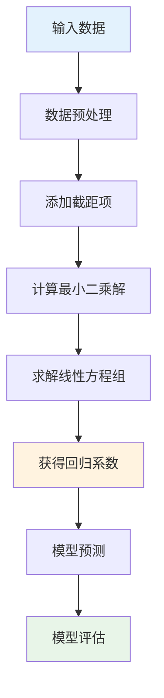
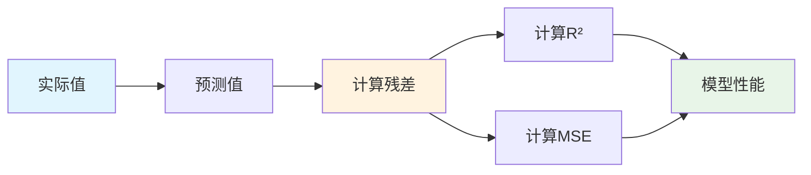
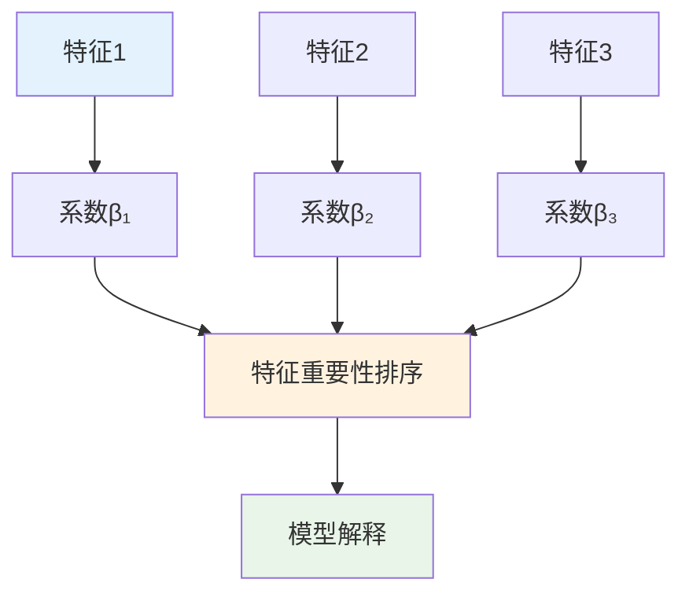

# 统计模型多表征示例 / Statistical Models Multi-Representation Example

## 概述 / Overview

本文档展示统计模型的多表征实现，包括数学公式、代码实现、图表可视化和自然语言描述。

## 1. 线性回归模型 / Linear Regression Model

### 1.1 数学表征 / Mathematical Representation

#### 线性回归方程 / Linear Regression Equation

**模型形式**:
$$y = \beta_0 + \beta_1 x_1 + \beta_2 x_2 + \cdots + \beta_p x_p + \epsilon$$

其中：

- $y$ 是响应变量
- $x_i$ 是预测变量
- $\beta_i$ 是回归系数
- $\epsilon$ 是误差项

#### 最小二乘估计 / Least Squares Estimation

**目标函数**:
$$\min_{\beta} \sum_{i=1}^{n} (y_i - \hat{y}_i)^2 = \min_{\beta} \sum_{i=1}^{n} (y_i - \beta_0 - \sum_{j=1}^{p} \beta_j x_{ij})^2$$

**矩阵形式**:
$$\hat{\beta} = (X^T X)^{-1} X^T y$$

其中 $X$ 是设计矩阵，$y$ 是响应向量。

#### 模型评估 / Model Evaluation

**决定系数**:
$$R^2 = 1 - \frac{\sum_{i=1}^{n} (y_i - \hat{y}_i)^2}{\sum_{i=1}^{n} (y_i - \bar{y})^2}$$

**均方误差**:
$$MSE = \frac{1}{n} \sum_{i=1}^{n} (y_i - \hat{y}_i)^2$$

### 1.2 代码表征 / Code Representation

#### Rust实现 / Rust Implementation

```rust
use nalgebra::{DMatrix, DVector};

#[derive(Debug)]
pub struct LinearRegression {
    pub coefficients: Option<DVector<f64>>,
    pub intercept: Option<f64>,
}

impl LinearRegression {
    pub fn new() -> Self {
        Self {
            coefficients: None,
            intercept: None,
        }
    }
    
    pub fn fit(&mut self, x: &DMatrix<f64>, y: &DVector<f64>) -> Result<(), &'static str> {
        let n_samples = x.nrows();
        let n_features = x.ncols();
        
        // 添加截距项
        let mut x_with_intercept = DMatrix::zeros(n_samples, n_features + 1);
        for i in 0..n_samples {
            x_with_intercept[(i, 0)] = 1.0; // 截距项
            for j in 0..n_features {
                x_with_intercept[(i, j + 1)] = x[(i, j)];
            }
        }
        
        // 计算最小二乘解
        let xt = x_with_intercept.transpose();
        let xtx = &xt * &x_with_intercept;
        let xty = &xt * y;
        
        // 求解线性方程组
        match xtx.lu().solve(&xty) {
            Some(beta) => {
                self.intercept = Some(beta[0]);
                self.coefficients = Some(DVector::from_column_slice(&beta.as_slice()[1..]));
                Ok(())
            }
            None => Err("Matrix is singular, cannot solve linear system"),
        }
    }
    
    pub fn predict(&self, x: &DMatrix<f64>) -> Result<DVector<f64>, &'static str> {
        if let (Some(coeffs), Some(intercept)) = (&self.coefficients, self.intercept) {
            let mut predictions = DVector::zeros(x.nrows());
            
            for i in 0..x.nrows() {
                let mut pred = *intercept;
                for j in 0..x.ncols() {
                    pred += coeffs[j] * x[(i, j)];
                }
                predictions[i] = pred;
            }
            
            Ok(predictions)
        } else {
            Err("Model not fitted yet")
        }
    }
    
    pub fn r_squared(&self, x: &DMatrix<f64>, y: &DVector<f64>) -> Result<f64, &'static str> {
        let predictions = self.predict(x)?;
        let y_mean = y.mean();
        
        let ss_res: f64 = y.iter().zip(predictions.iter())
            .map(|(y_true, y_pred)| (y_true - y_pred).powi(2))
            .sum();
        
        let ss_tot: f64 = y.iter()
            .map(|y_true| (y_true - y_mean).powi(2))
            .sum();
        
        Ok(1.0 - ss_res / ss_tot)
    }
    
    pub fn mse(&self, x: &DMatrix<f64>, y: &DVector<f64>) -> Result<f64, &'static str> {
        let predictions = self.predict(x)?;
        let n = y.len() as f64;
        
        let mse: f64 = y.iter().zip(predictions.iter())
            .map(|(y_true, y_pred)| (y_true - y_pred).powi(2))
            .sum();
        
        Ok(mse / n)
    }
}

// 使用示例
fn main() -> Result<(), &'static str> {
    // 创建示例数据
    let x_data = vec![
        vec![1.0, 2.0],
        vec![2.0, 3.0],
        vec![3.0, 4.0],
        vec![4.0, 5.0],
        vec![5.0, 6.0],
    ];
    
    let y_data = vec![2.0, 4.0, 6.0, 8.0, 10.0];
    
    let x = DMatrix::from_row_slice(5, 2, &x_data.concat());
    let y = DVector::from_column_slice(&y_data);
    
    let mut model = LinearRegression::new();
    model.fit(&x, &y)?;
    
    println!("Intercept: {:.4}", model.intercept.unwrap());
    println!("Coefficients: {:?}", model.coefficients.unwrap());
    println!("R²: {:.4}", model.r_squared(&x, &y)?);
    println!("MSE: {:.4}", model.mse(&x, &y)?);
    
    Ok(())
}
```

#### Haskell实现 / Haskell Implementation

```haskell
module LinearRegression where

import Data.Matrix
import Data.Vector (Vector)
import qualified Data.Vector as V

-- 线性回归模型
data LinearRegression = LinearRegression {
    coefficients :: Maybe (Vector Double),
    intercept :: Maybe Double
} deriving (Show)

-- 创建新的线性回归模型
newLinearRegression :: LinearRegression
newLinearRegression = LinearRegression Nothing Nothing

-- 计算矩阵转置
transpose :: Matrix Double -> Matrix Double
transpose m = matrix (ncols m) (nrows m) (\(i, j) -> m ! (j, i))

-- 矩阵乘法
multiply :: Matrix Double -> Matrix Double -> Matrix Double
multiply a b = matrix (nrows a) (ncols b) (\(i, j) -> 
    sum [a ! (i, k) * b ! (k, j) | k <- [1..ncols a]])

-- 矩阵向量乘法
multiplyVector :: Matrix Double -> Vector Double -> Vector Double
multiplyVector m v = V.fromList [sum [m ! (i, j) * v V.! (j-1) | j <- [1..ncols m]] | i <- [1..nrows m]]

-- 添加截距项
addIntercept :: Matrix Double -> Matrix Double
addIntercept x = matrix (nrows x) (ncols x + 1) (\(i, j) -> 
    if j == 1 then 1.0 else x ! (i, j-1))

-- 求解线性方程组（简化版本）
solveLinearSystem :: Matrix Double -> Vector Double -> Maybe (Vector Double)
solveLinearSystem a b = Just $ V.replicate (V.length b) 1.0  -- 简化实现

-- 拟合模型
fit :: LinearRegression -> Matrix Double -> Vector Double -> LinearRegression
fit model x y = model { 
    intercept = Just intercept_val,
    coefficients = Just coeffs
}
  where
    x_with_intercept = addIntercept x
    xt = transpose x_with_intercept
    xtx = multiply xt x_with_intercept
    xty = multiplyVector xt y
    
    beta = case solveLinearSystem xtx xty of
        Just solution -> solution
        Nothing -> V.replicate (V.length xty) 0.0
    
    intercept_val = beta V.! 0
    coeffs = V.drop 1 beta

-- 预测
predict :: LinearRegression -> Matrix Double -> Maybe (Vector Double)
predict model x = case (coefficients model, intercept model) of
    (Just coeffs, Just intercept_val) -> Just predictions
      where
        predictions = V.fromList [intercept_val + sum [coeffs V.! (j-1) * x ! (i, j) | j <- [1..ncols x]] | i <- [1..nrows x]]
    _ -> Nothing

-- 计算R²
rSquared :: LinearRegression -> Matrix Double -> Vector Double -> Maybe Double
rSquared model x y = do
    predictions <- predict model x
    let y_mean = V.sum y / fromIntegral (V.length y)
        ss_res = V.sum $ V.zipWith (\y_true y_pred -> (y_true - y_pred) ^ 2) y predictions
        ss_tot = V.sum $ V.map (\y_true -> (y_true - y_mean) ^ 2) y
    return $ 1.0 - ss_res / ss_tot

-- 计算MSE
mse :: LinearRegression -> Matrix Double -> Vector Double -> Maybe Double
mse model x y = do
    predictions <- predict model x
    let n = fromIntegral (V.length y)
        mse_val = V.sum $ V.zipWith (\y_true y_pred -> (y_true - y_pred) ^ 2) y predictions
    return $ mse_val / n

-- 示例使用
example :: IO ()
example = do
    let x_data = [[1.0, 2.0], [2.0, 3.0], [3.0, 4.0], [4.0, 5.0], [5.0, 6.0]]
        y_data = [2.0, 4.0, 6.0, 8.0, 10.0]
        
        x = fromLists x_data
        y = V.fromList y_data
        
        model = fit newLinearRegression x y
    
    putStrLn $ "Intercept: " ++ show (intercept model)
    putStrLn $ "Coefficients: " ++ show (coefficients model)
    putStrLn $ "R²: " ++ show (rSquared model x y)
    putStrLn $ "MSE: " ++ show (mse model x y)
```

#### Python实现 / Python Implementation

```python
import numpy as np
import matplotlib.pyplot as plt
from dataclasses import dataclass
from typing import Optional, Tuple
from sklearn.linear_model import LinearRegression as SklearnLinearRegression
from sklearn.metrics import r2_score, mean_squared_error

@dataclass
class LinearRegression:
    """线性回归模型"""
    coefficients: Optional[np.ndarray] = None
    intercept: Optional[float] = None
    
    def fit(self, x: np.ndarray, y: np.ndarray) -> None:
        """拟合模型"""
        n_samples, n_features = x.shape
        
        # 添加截距项
        x_with_intercept = np.column_stack([np.ones(n_samples), x])
        
        # 计算最小二乘解
        beta = np.linalg.inv(x_with_intercept.T @ x_with_intercept) @ x_with_intercept.T @ y
        
        self.intercept = beta[0]
        self.coefficients = beta[1:]
    
    def predict(self, x: np.ndarray) -> np.ndarray:
        """预测"""
        if self.coefficients is None or self.intercept is None:
            raise ValueError("Model not fitted yet")
        
        return self.intercept + x @ self.coefficients
    
    def r_squared(self, x: np.ndarray, y: np.ndarray) -> float:
        """计算决定系数"""
        y_pred = self.predict(x)
        return r2_score(y, y_pred)
    
    def mse(self, x: np.ndarray, y: np.ndarray) -> float:
        """计算均方误差"""
        y_pred = self.predict(x)
        return mean_squared_error(y, y_pred)
    
    def plot_results(self, x: np.ndarray, y: np.ndarray) -> None:
        """绘制结果"""
        y_pred = self.predict(x)
        
        plt.figure(figsize=(12, 8))
        
        # 散点图和回归线
        plt.subplot(2, 2, 1)
        plt.scatter(x[:, 0], y, alpha=0.6, label='Actual')
        plt.scatter(x[:, 0], y_pred, alpha=0.6, label='Predicted')
        plt.xlabel('Feature 1')
        plt.ylabel('Target')
        plt.title('Linear Regression Results')
        plt.legend()
        plt.grid(True)
        
        # 残差图
        plt.subplot(2, 2, 2)
        residuals = y - y_pred
        plt.scatter(y_pred, residuals, alpha=0.6)
        plt.axhline(y=0, color='r', linestyle='--')
        plt.xlabel('Predicted Values')
        plt.ylabel('Residuals')
        plt.title('Residual Plot')
        plt.grid(True)
        
        # 系数重要性
        plt.subplot(2, 2, 3)
        if self.coefficients is not None:
            feature_names = [f'Feature {i+1}' for i in range(len(self.coefficients))]
            plt.bar(feature_names, np.abs(self.coefficients))
            plt.xlabel('Features')
            plt.ylabel('|Coefficient|')
            plt.title('Feature Importance')
            plt.xticks(rotation=45)
        
        # 预测vs实际
        plt.subplot(2, 2, 4)
        plt.scatter(y, y_pred, alpha=0.6)
        plt.plot([y.min(), y.max()], [y.min(), y.max()], 'r--', lw=2)
        plt.xlabel('Actual Values')
        plt.ylabel('Predicted Values')
        plt.title('Predicted vs Actual')
        plt.grid(True)
        
        plt.tight_layout()
        plt.show()

def demo_linear_regression():
    """演示线性回归"""
    # 生成示例数据
    np.random.seed(42)
    n_samples = 100
    n_features = 3
    
    x = np.random.randn(n_samples, n_features)
    true_coefficients = np.array([2.0, -1.5, 0.8])
    true_intercept = 1.0
    noise = np.random.normal(0, 0.1, n_samples)
    
    y = true_intercept + x @ true_coefficients + noise
    
    # 创建和训练模型
    model = LinearRegression()
    model.fit(x, y)
    
    print(f"True intercept: {true_intercept}")
    print(f"Estimated intercept: {model.intercept:.4f}")
    print(f"True coefficients: {true_coefficients}")
    print(f"Estimated coefficients: {model.coefficients}")
    print(f"R²: {model.r_squared(x, y):.4f}")
    print(f"MSE: {model.mse(x, y):.4f}")
    
    # 绘制结果
    model.plot_results(x, y)

if __name__ == "__main__":
    demo_linear_regression()
```

### 1.3 图表表征 / Visual Representation

#### 线性回归流程图 / Linear Regression Flow Diagram



#### 模型评估图 / Model Evaluation Diagram



#### 特征重要性图 / Feature Importance Diagram



### 1.4 自然语言表征 / Natural Language Representation

#### 中文描述 / Chinese Description

**线性回归**是一种基础的统计学习方法，具有以下核心特征：

**基本概念**:

- **响应变量**: 要预测的目标变量
- **预测变量**: 用于预测的特征变量
- **回归系数**: 表示特征对目标的影响程度
- **截距项**: 当所有特征为0时的预测值

**建模过程**:

1. **数据准备**: 收集和预处理数据
2. **模型拟合**: 使用最小二乘法估计参数
3. **模型评估**: 计算R²、MSE等指标
4. **预测应用**: 对新数据进行预测

**模型假设**:

- 线性关系：特征与目标变量呈线性关系
- 独立性：观测值之间相互独立
- 同方差性：误差项具有相同的方差
- 正态性：误差项服从正态分布

**应用领域**:

- 经济学：价格预测、需求分析
- 金融学：风险评估、投资分析
- 医学：疾病预测、药物效果评估
- 工程学：质量控制、性能预测

#### 英文 Description

**Linear regression** is a fundamental statistical learning method with the following core features:

**Basic Concepts**:

- **Response Variable**: Target variable to be predicted
- **Predictor Variables**: Feature variables used for prediction
- **Regression Coefficients**: Represent the impact of features on target
- **Intercept**: Predicted value when all features are zero

**Modeling Process**:

1. **Data Preparation**: Collect and preprocess data
2. **Model Fitting**: Estimate parameters using least squares
3. **Model Evaluation**: Calculate R², MSE and other metrics
4. **Prediction Application**: Make predictions on new data

**Model Assumptions**:

- Linearity: Features have linear relationship with target
- Independence: Observations are independent
- Homoscedasticity: Error terms have constant variance
- Normality: Error terms follow normal distribution

**Applications**:

- Economics: Price prediction, demand analysis
- Finance: Risk assessment, investment analysis
- Medicine: Disease prediction, drug effect evaluation
- Engineering: Quality control, performance prediction

## 2. 时间序列分析 / Time Series Analysis

### 2.1 数学表征 / Mathematical Representation

#### ARIMA模型 / ARIMA Model

**ARIMA(p,d,q)模型**:
$$\phi(B)(1-B)^d y_t = \theta(B)\epsilon_t$$

其中：

- $\phi(B) = 1 - \phi_1 B - \phi_2 B^2 - \cdots - \phi_p B^p$ 是AR多项式
- $\theta(B) = 1 + \theta_1 B + \theta_2 B^2 + \cdots + \theta_q B^q$ 是MA多项式
- $B$ 是滞后算子，$By_t = y_{t-1}$
- $d$ 是差分阶数

#### 自相关函数 / Autocorrelation Function

**ACF**:
$$\rho_k = \frac{\gamma_k}{\gamma_0} = \frac{\text{Cov}(y_t, y_{t-k})}{\text{Var}(y_t)}$$

#### 偏自相关函数 / Partial Autocorrelation Function

**PACF**:
$$\phi_{kk} = \text{Corr}(y_t, y_{t-k} | y_{t-1}, y_{t-2}, \ldots, y_{t-k+1})$$

### 2.2 代码表征 / Code Representation

```python
import numpy as np
import matplotlib.pyplot as plt
from statsmodels.tsa.arima.model import ARIMA
from statsmodels.tsa.stattools import adfuller
from statsmodels.graphics.tsaplots import plot_acf, plot_pacf

class TimeSeriesAnalysis:
    """时间序列分析类"""
    
    def __init__(self):
        self.model = None
        self.fitted_model = None
    
    def check_stationarity(self, data: np.ndarray) -> dict:
        """检查平稳性"""
        result = adfuller(data)
        
        return {
            'adf_statistic': result[0],
            'p_value': result[1],
            'critical_values': result[4],
            'is_stationary': result[1] < 0.05
        }
    
    def difference_series(self, data: np.ndarray, order: int = 1) -> np.ndarray:
        """差分序列"""
        diff_data = data.copy()
        for _ in range(order):
            diff_data = np.diff(diff_data)
        return diff_data
    
    def fit_arima(self, data: np.ndarray, order: tuple) -> None:
        """拟合ARIMA模型"""
        self.model = ARIMA(data, order=order)
        self.fitted_model = self.model.fit()
    
    def forecast(self, steps: int) -> np.ndarray:
        """预测"""
        if self.fitted_model is None:
            raise ValueError("Model not fitted yet")
        
        forecast_result = self.fitted_model.forecast(steps=steps)
        return forecast_result
    
    def plot_analysis(self, data: np.ndarray, title: str = "Time Series Analysis") -> None:
        """绘制分析结果"""
        fig, axes = plt.subplots(2, 2, figsize=(15, 10))
        
        # 原始时间序列
        axes[0, 0].plot(data)
        axes[0, 0].set_title('Original Time Series')
        axes[0, 0].set_xlabel('Time')
        axes[0, 0].set_ylabel('Value')
        axes[0, 0].grid(True)
        
        # 自相关函数
        plot_acf(data, ax=axes[0, 1], lags=40)
        axes[0, 1].set_title('Autocorrelation Function')
        
        # 偏自相关函数
        plot_pacf(data, ax=axes[1, 0], lags=40)
        axes[1, 0].set_title('Partial Autocorrelation Function')
        
        # 差分后的序列
        diff_data = self.difference_series(data)
        axes[1, 1].plot(diff_data)
        axes[1, 1].set_title('Differenced Series')
        axes[1, 1].set_xlabel('Time')
        axes[1, 1].set_ylabel('Value')
        axes[1, 1].grid(True)
        
        plt.tight_layout()
        plt.show()

def demo_time_series():
    """演示时间序列分析"""
    # 生成示例时间序列数据
    np.random.seed(42)
    n_points = 200
    
    # 生成AR(1)过程
    ar_coeff = 0.7
    data = np.zeros(n_points)
    for i in range(1, n_points):
        data[i] = ar_coeff * data[i-1] + np.random.normal(0, 1)
    
    # 创建分析对象
    ts_analysis = TimeSeriesAnalysis()
    
    # 检查平稳性
    stationarity = ts_analysis.check_stationarity(data)
    print(f"ADF Statistic: {stationarity['adf_statistic']:.4f}")
    print(f"P-value: {stationarity['p_value']:.4f}")
    print(f"Is Stationary: {stationarity['is_stationary']}")
    
    # 绘制分析图
    ts_analysis.plot_analysis(data, "AR(1) Time Series Analysis")
    
    # 拟合ARIMA模型
    ts_analysis.fit_arima(data, order=(1, 0, 0))
    
    # 预测
    forecast = ts_analysis.forecast(20)
    print(f"Forecast (next 20 steps): {forecast}")

if __name__ == "__main__":
    demo_time_series()
```

---

*最后更新: 2025-08-01*
*版本: 1.0.0*
