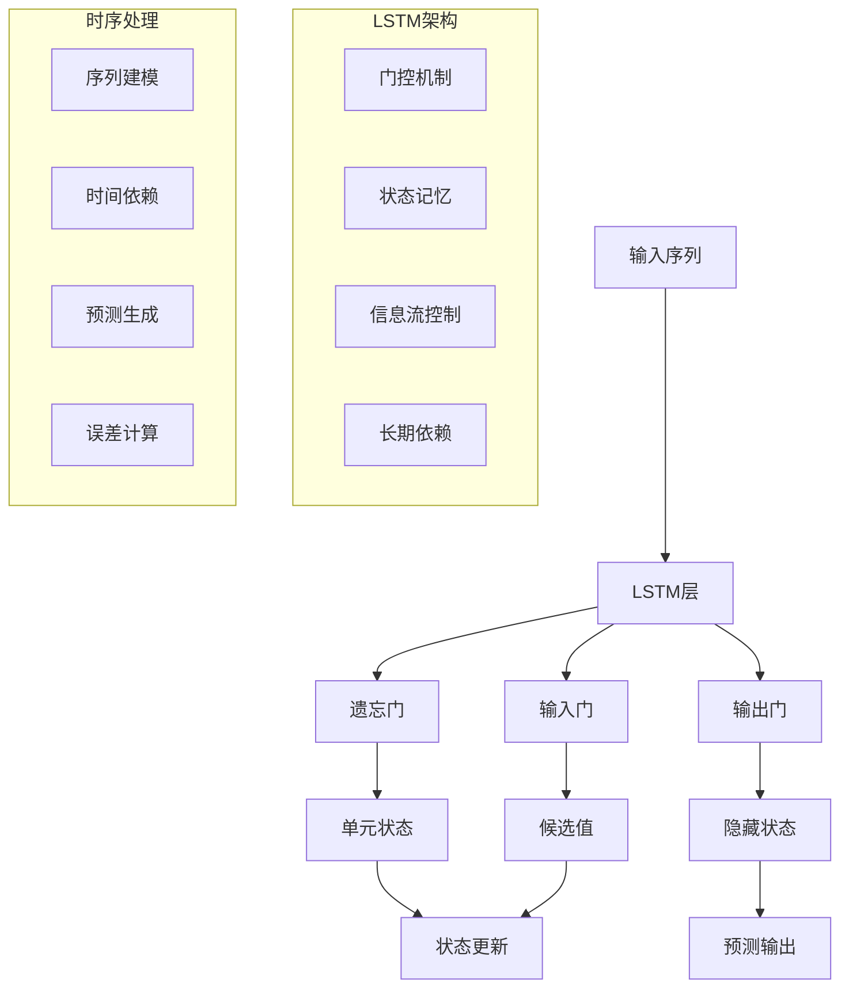

# 时序建模扩展多表征示例 / Temporal Modeling Extension Multi-Representation Examples

## 概述 / Overview

本文档提供了时序建模扩展的完整多表征示例，包括时间序列预测、动态图神经网络和时序注意力机制。每种方法都包含数学表示、可视化图表和完整的代码实现。

## 1. 时间序列预测 / Time Series Prediction

### 1.1 长短期记忆网络 (LSTM) / Long Short-Term Memory Network

#### 数学表示 / Mathematical Representation

LSTM通过门控机制控制信息流：

LSTM controls information flow through gating mechanisms:

遗忘门：

Forget Gate:

$$f_t = \sigma(W_f \cdot [h_{t-1}, x_t] + b_f)$$

输入门：

Input Gate:

$$i_t = \sigma(W_i \cdot [h_{t-1}, x_t] + b_i)$$

候选值：

Candidate Values:

$$\tilde{C}_t = \tanh(W_C \cdot [h_{t-1}, x_t] + b_C)$$

单元状态更新：

Cell State Update:

$$C_t = f_t * C_{t-1} + i_t * \tilde{C}_t$$

输出门：

Output Gate:

$$o_t = \sigma(W_o \cdot [h_{t-1}, x_t] + b_o)$$

隐藏状态：

Hidden State:

$$h_t = o_t * \tanh(C_t)$$

其中：

- $x_t$ 是时间步$t$的输入
- $h_t$ 是隐藏状态
- $C_t$ 是单元状态
- $W$ 和 $b$ 是权重和偏置

where:

- $x_t$ is the input at time step $t$
- $h_t$ is the hidden state
- $C_t$ is the cell state
- $W$ and $b$ are weights and biases

#### 可视化表示 / Visual Representation



#### Python实现 / Python Implementation

```python
import torch
import torch.nn as nn
import torch.optim as optim
import torch.nn.functional as F
import numpy as np
import matplotlib.pyplot as plt
from typing import List, Tuple, Optional
import pandas as pd
from sklearn.preprocessing import MinMaxScaler
import warnings
warnings.filterwarnings('ignore')

class LSTMModel(nn.Module):
    """LSTM时间序列预测模型"""
    
    def __init__(self, input_size: int, hidden_size: int, num_layers: int, 
                 output_size: int, dropout: float = 0.2):
        super(LSTMModel, self).__init__()
        self.hidden_size = hidden_size
        self.num_layers = num_layers
        
        # LSTM层
        self.lstm = nn.LSTM(input_size, hidden_size, num_layers, 
                           batch_first=True, dropout=dropout)
        
        # 全连接层
        self.fc = nn.Linear(hidden_size, output_size)
        
        # Dropout层
        self.dropout = nn.Dropout(dropout)
        
    def forward(self, x: torch.Tensor, hidden: Optional[Tuple[torch.Tensor, torch.Tensor]] = None) -> Tuple[torch.Tensor, Tuple[torch.Tensor, torch.Tensor]]:
        """前向传播"""
        batch_size = x.size(0)
        
        # 初始化隐藏状态
        if hidden is None:
            h0 = torch.zeros(self.num_layers, batch_size, self.hidden_size).to(x.device)
            c0 = torch.zeros(self.num_layers, batch_size, self.hidden_size).to(x.device)
            hidden = (h0, c0)
        
        # LSTM前向传播
        lstm_out, hidden = self.lstm(x, hidden)
        
        # 取最后一个时间步的输出
        out = self.dropout(lstm_out[:, -1, :])
        
        # 全连接层
        out = self.fc(out)
        
        return out, hidden

class TimeSeriesDataset:
    """时间序列数据集"""
    
    def __init__(self, data: np.ndarray, sequence_length: int = 10, 
                 prediction_horizon: int = 1):
        self.data = data
        self.sequence_length = sequence_length
        self.prediction_horizon = prediction_horizon
        
    def __len__(self) -> int:
        return len(self.data) - self.sequence_length - self.prediction_horizon + 1
    
    def __getitem__(self, idx: int) -> Tuple[torch.Tensor, torch.Tensor]:
        # 输入序列
        x = self.data[idx:idx + self.sequence_length]
        
        # 目标序列
        y = self.data[idx + self.sequence_length:idx + self.sequence_length + self.prediction_horizon]
        
        return torch.FloatTensor(x), torch.FloatTensor(y)

def generate_synthetic_time_series(n_points: int = 1000, noise_level: float = 0.1) -> np.ndarray:
    """生成合成时间序列数据"""
    t = np.linspace(0, 20, n_points)
    
    # 基础信号：正弦波 + 趋势 + 季节性
    signal = (np.sin(2 * np.pi * t) +  # 基础周期
              0.5 * np.sin(4 * np.pi * t) +  # 高频成分
              0.1 * t +  # 线性趋势
              0.2 * np.sin(0.5 * np.pi * t))  # 季节性
    
    # 添加噪声
    noise = np.random.normal(0, noise_level, n_points)
    time_series = signal + noise
    
    return time_series

def prepare_data(data: np.ndarray, train_ratio: float = 0.8, 
                sequence_length: int = 10) -> Tuple[TimeSeriesDataset, TimeSeriesDataset]:
    """准备训练和测试数据"""
    # 数据标准化
    scaler = MinMaxScaler()
    data_scaled = scaler.fit_transform(data.reshape(-1, 1)).flatten()
    
    # 分割数据
    train_size = int(len(data_scaled) * train_ratio)
    train_data = data_scaled[:train_size]
    test_data = data_scaled[train_size:]
    
    # 创建数据集
    train_dataset = TimeSeriesDataset(train_data, sequence_length)
    test_dataset = TimeSeriesDataset(test_data, sequence_length)
    
    return train_dataset, test_dataset, scaler

def train_lstm_model(model: LSTMModel, train_dataset: TimeSeriesDataset, 
                    epochs: int = 100, lr: float = 0.001, batch_size: int = 32) -> List[float]:
    """训练LSTM模型"""
    device = torch.device('cuda' if torch.cuda.is_available() else 'cpu')
    model.to(device)
    
    criterion = nn.MSELoss()
    optimizer = optim.Adam(model.parameters(), lr=lr)
    
    losses = []
    
    for epoch in range(epochs):
        model.train()
        total_loss = 0
        num_batches = 0
        
        # 批次训练
        for i in range(0, len(train_dataset), batch_size):
            batch_data = []
            batch_targets = []
            
            for j in range(i, min(i + batch_size, len(train_dataset))):
                x, y = train_dataset[j]
                batch_data.append(x)
                batch_targets.append(y)
            
            if not batch_data:
                continue
            
            # 转换为张量
            x_batch = torch.stack(batch_data).to(device)
            y_batch = torch.stack(batch_targets).to(device)
            
            # 前向传播
            optimizer.zero_grad()
            output, _ = model(x_batch)
            loss = criterion(output, y_batch)
            
            # 反向传播
            loss.backward()
            optimizer.step()
            
            total_loss += loss.item()
            num_batches += 1
        
        avg_loss = total_loss / num_batches
        losses.append(avg_loss)
        
        if epoch % 20 == 0:
            print(f"Epoch {epoch}: Loss = {avg_loss:.6f}")
    
    return losses

def evaluate_model(model: LSTMModel, test_dataset: TimeSeriesDataset, 
                  scaler: MinMaxScaler) -> Tuple[np.ndarray, np.ndarray]:
    """评估模型"""
    device = torch.device('cuda' if torch.cuda.is_available() else 'cpu')
    model.eval()
    
    predictions = []
    actuals = []
    
    with torch.no_grad():
        for i in range(len(test_dataset)):
            x, y = test_dataset[i]
            x = x.unsqueeze(0).to(device)
            
            output, _ = model(x)
            prediction = output.cpu().numpy()
            
            predictions.append(prediction)
            actuals.append(y.numpy())
    
    # 反标准化
    predictions = np.array(predictions).reshape(-1, 1)
    actuals = np.array(actuals).reshape(-1, 1)
    
    predictions = scaler.inverse_transform(predictions)
    actuals = scaler.inverse_transform(actuals)
    
    return predictions, actuals

def visualize_results(predictions: np.ndarray, actuals: np.ndarray, 
                     losses: List[float]) -> None:
    """可视化结果"""
    fig, axes = plt.subplots(2, 2, figsize=(15, 10))
    
    # 训练损失
    axes[0, 0].plot(losses, color='blue', alpha=0.7)
    axes[0, 0].set_title('Training Loss')
    axes[0, 0].set_xlabel('Epoch')
    axes[0, 0].set_ylabel('Loss')
    axes[0, 0].grid(True, alpha=0.3)
    
    # 预测vs实际
    axes[0, 1].plot(actuals, label='Actual', color='blue', alpha=0.7)
    axes[0, 1].plot(predictions, label='Predicted', color='red', alpha=0.7)
    axes[0, 1].set_title('Predictions vs Actual')
    axes[0, 1].set_xlabel('Time Step')
    axes[0, 1].set_ylabel('Value')
    axes[0, 1].legend()
    axes[0, 1].grid(True, alpha=0.3)
    
    # 散点图
    axes[1, 0].scatter(actuals, predictions, alpha=0.6, color='green')
    axes[1, 0].plot([actuals.min(), actuals.max()], [actuals.min(), actuals.max()], 
                    'r--', lw=2, label='Perfect Prediction')
    axes[1, 0].set_title('Prediction Accuracy')
    axes[1, 0].set_xlabel('Actual Values')
    axes[1, 0].set_ylabel('Predicted Values')
    axes[1, 0].legend()
    axes[1, 0].grid(True, alpha=0.3)
    
    # 误差分布
    errors = predictions - actuals
    axes[1, 1].hist(errors, bins=30, alpha=0.7, color='orange')
    axes[1, 1].set_title('Prediction Error Distribution')
    axes[1, 1].set_xlabel('Error')
    axes[1, 1].set_ylabel('Frequency')
    axes[1, 1].grid(True, alpha=0.3)
    
    plt.tight_layout()
    plt.show()

# 测试时间序列预测
if __name__ == "__main__":
    # 生成合成数据
    print("生成时间序列数据...")
    time_series = generate_synthetic_time_series(n_points=1000)
    
    # 准备数据
    train_dataset, test_dataset, scaler = prepare_data(time_series, sequence_length=20)
    
    # 创建模型
    model = LSTMModel(input_size=1, hidden_size=50, num_layers=2, output_size=1)
    
    # 训练模型
    print("开始训练LSTM模型...")
    losses = train_lstm_model(model, train_dataset, epochs=100)
    
    # 评估模型
    print("评估模型性能...")
    predictions, actuals = evaluate_model(model, test_dataset, scaler)
    
    # 计算指标
    mse = np.mean((predictions - actuals) ** 2)
    mae = np.mean(np.abs(predictions - actuals))
    print(f"均方误差 (MSE): {mse:.4f}")
    print(f"平均绝对误差 (MAE): {mae:.4f}")
    
    # 可视化结果
    visualize_results(predictions, actuals, losses)
```
