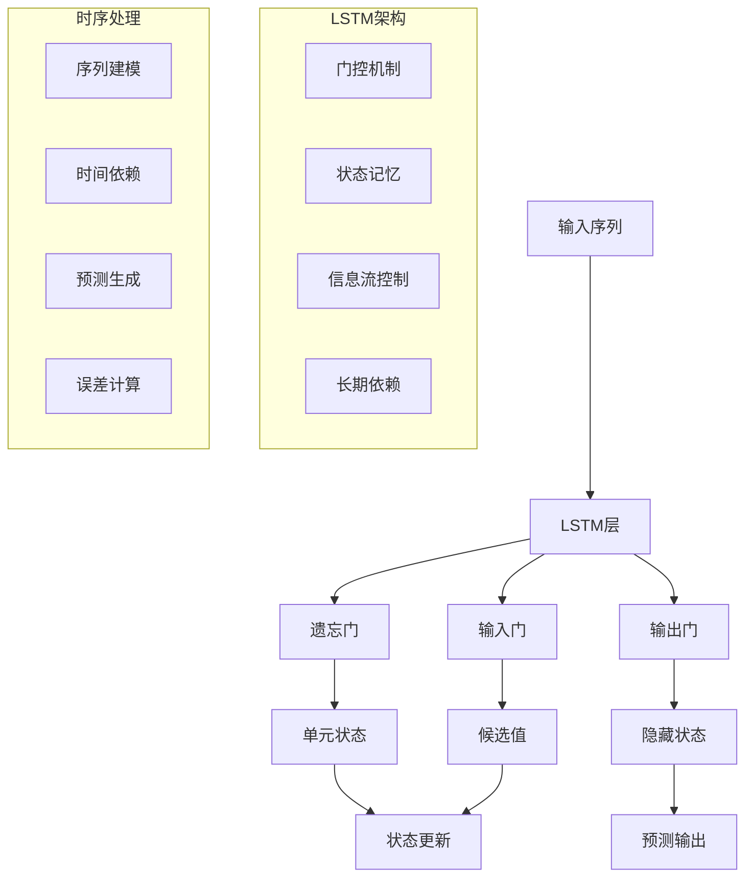
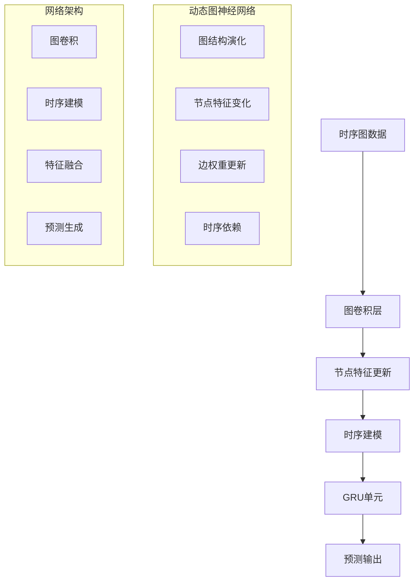
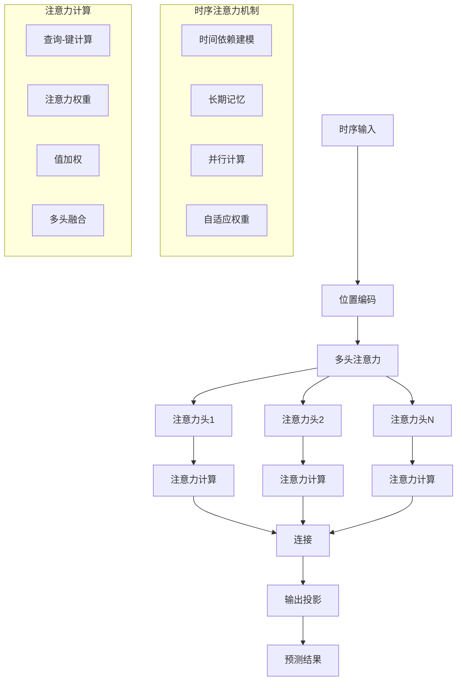

# 时序建模扩展多表征示例 / Temporal Modeling Extension Multi-Representation Examples

## 概述 / Overview

本文档提供了时序建模扩展的完整多表征示例，包括时间序列预测、动态图神经网络和时序注意力机制。每种方法都包含数学表示、可视化图表和完整的代码实现。

## 1. 时间序列预测 / Time Series Prediction

### 1.1 长短期记忆网络 (LSTM) / Long Short-Term Memory Network

#### 数学表示 / Mathematical Representation

LSTM通过门控机制控制信息流：

LSTM controls information flow through gating mechanisms:

遗忘门：

Forget Gate:

$$f_t = \sigma(W_f \cdot [h_{t-1}, x_t] + b_f)$$

输入门：

Input Gate:

$$i_t = \sigma(W_i \cdot [h_{t-1}, x_t] + b_i)$$

候选值：

Candidate Values:

$$\tilde{C}_t = \tanh(W_C \cdot [h_{t-1}, x_t] + b_C)$$

单元状态更新：

Cell State Update:

$$C_t = f_t * C_{t-1} + i_t * \tilde{C}_t$$

输出门：

Output Gate:

$$o_t = \sigma(W_o \cdot [h_{t-1}, x_t] + b_o)$$

隐藏状态：

Hidden State:

$$h_t = o_t * \tanh(C_t)$$

其中：
- $x_t$ 是时间步$t$的输入
- $h_t$ 是隐藏状态
- $C_t$ 是单元状态
- $W$ 和 $b$ 是权重和偏置

where:
- $x_t$ is the input at time step $t$
- $h_t$ is the hidden state
- $C_t$ is the cell state
- $W$ and $b$ are weights and biases

#### 可视化表示 / Visual Representation



#### Python实现 / Python Implementation

```python
import torch
import torch.nn as nn
import torch.optim as optim
import torch.nn.functional as F
import numpy as np
import matplotlib.pyplot as plt
from typing import List, Tuple, Optional
import pandas as pd
from sklearn.preprocessing import MinMaxScaler
import warnings
warnings.filterwarnings('ignore')

class LSTMModel(nn.Module):
    """LSTM时间序列预测模型"""
    
    def __init__(self, input_size: int, hidden_size: int, num_layers: int, 
                 output_size: int, dropout: float = 0.2):
        super(LSTMModel, self).__init__()
        self.hidden_size = hidden_size
        self.num_layers = num_layers
        
        # LSTM层
        self.lstm = nn.LSTM(input_size, hidden_size, num_layers, 
                           batch_first=True, dropout=dropout)
        
        # 全连接层
        self.fc = nn.Linear(hidden_size, output_size)
        
        # Dropout层
        self.dropout = nn.Dropout(dropout)
        
    def forward(self, x: torch.Tensor, hidden: Optional[Tuple[torch.Tensor, torch.Tensor]] = None) -> Tuple[torch.Tensor, Tuple[torch.Tensor, torch.Tensor]]:
        """前向传播"""
        batch_size = x.size(0)
        
        # 初始化隐藏状态
        if hidden is None:
            h0 = torch.zeros(self.num_layers, batch_size, self.hidden_size).to(x.device)
            c0 = torch.zeros(self.num_layers, batch_size, self.hidden_size).to(x.device)
            hidden = (h0, c0)
        
        # LSTM前向传播
        lstm_out, hidden = self.lstm(x, hidden)
        
        # 取最后一个时间步的输出
        out = self.dropout(lstm_out[:, -1, :])
        
        # 全连接层
        out = self.fc(out)
        
        return out, hidden

class TimeSeriesDataset:
    """时间序列数据集"""
    
    def __init__(self, data: np.ndarray, sequence_length: int = 10, 
                 prediction_horizon: int = 1):
        self.data = data
        self.sequence_length = sequence_length
        self.prediction_horizon = prediction_horizon
        
    def __len__(self) -> int:
        return len(self.data) - self.sequence_length - self.prediction_horizon + 1
    
    def __getitem__(self, idx: int) -> Tuple[torch.Tensor, torch.Tensor]:
        # 输入序列
        x = self.data[idx:idx + self.sequence_length]
        
        # 目标序列
        y = self.data[idx + self.sequence_length:idx + self.sequence_length + self.prediction_horizon]
        
        return torch.FloatTensor(x), torch.FloatTensor(y)

def generate_synthetic_time_series(n_points: int = 1000, noise_level: float = 0.1) -> np.ndarray:
    """生成合成时间序列数据"""
    t = np.linspace(0, 20, n_points)
    
    # 基础信号：正弦波 + 趋势 + 季节性
    signal = (np.sin(2 * np.pi * t) +  # 基础周期
              0.5 * np.sin(4 * np.pi * t) +  # 高频成分
              0.1 * t +  # 线性趋势
              0.2 * np.sin(0.5 * np.pi * t))  # 季节性
    
    # 添加噪声
    noise = np.random.normal(0, noise_level, n_points)
    time_series = signal + noise
    
    return time_series

def prepare_data(data: np.ndarray, train_ratio: float = 0.8, 
                sequence_length: int = 10) -> Tuple[TimeSeriesDataset, TimeSeriesDataset]:
    """准备训练和测试数据"""
    # 数据标准化
    scaler = MinMaxScaler()
    data_scaled = scaler.fit_transform(data.reshape(-1, 1)).flatten()
    
    # 分割数据
    train_size = int(len(data_scaled) * train_ratio)
    train_data = data_scaled[:train_size]
    test_data = data_scaled[train_size:]
    
    # 创建数据集
    train_dataset = TimeSeriesDataset(train_data, sequence_length)
    test_dataset = TimeSeriesDataset(test_data, sequence_length)
    
    return train_dataset, test_dataset, scaler

def train_lstm_model(model: LSTMModel, train_dataset: TimeSeriesDataset, 
                    epochs: int = 100, lr: float = 0.001, batch_size: int = 32) -> List[float]:
    """训练LSTM模型"""
    device = torch.device('cuda' if torch.cuda.is_available() else 'cpu')
    model.to(device)
    
    criterion = nn.MSELoss()
    optimizer = optim.Adam(model.parameters(), lr=lr)
    
    losses = []
    
    for epoch in range(epochs):
        model.train()
        total_loss = 0
        num_batches = 0
        
        # 批次训练
        for i in range(0, len(train_dataset), batch_size):
            batch_data = []
            batch_targets = []
            
            for j in range(i, min(i + batch_size, len(train_dataset))):
                x, y = train_dataset[j]
                batch_data.append(x)
                batch_targets.append(y)
            
            if not batch_data:
                continue
            
            # 转换为张量
            x_batch = torch.stack(batch_data).to(device)
            y_batch = torch.stack(batch_targets).to(device)
            
            # 前向传播
            optimizer.zero_grad()
            output, _ = model(x_batch)
            loss = criterion(output, y_batch)
            
            # 反向传播
            loss.backward()
            optimizer.step()
            
            total_loss += loss.item()
            num_batches += 1
        
        avg_loss = total_loss / num_batches
        losses.append(avg_loss)
        
        if epoch % 20 == 0:
            print(f"Epoch {epoch}: Loss = {avg_loss:.6f}")
    
    return losses

def evaluate_model(model: LSTMModel, test_dataset: TimeSeriesDataset, 
                  scaler: MinMaxScaler) -> Tuple[np.ndarray, np.ndarray]:
    """评估模型"""
    device = torch.device('cuda' if torch.cuda.is_available() else 'cpu')
    model.eval()
    
    predictions = []
    actuals = []
    
    with torch.no_grad():
        for i in range(len(test_dataset)):
            x, y = test_dataset[i]
            x = x.unsqueeze(0).to(device)
            
            output, _ = model(x)
            prediction = output.cpu().numpy()
            
            predictions.append(prediction)
            actuals.append(y.numpy())
    
    # 反标准化
    predictions = np.array(predictions).reshape(-1, 1)
    actuals = np.array(actuals).reshape(-1, 1)
    
    predictions = scaler.inverse_transform(predictions)
    actuals = scaler.inverse_transform(actuals)
    
    return predictions, actuals

def visualize_results(predictions: np.ndarray, actuals: np.ndarray, 
                     losses: List[float]) -> None:
    """可视化结果"""
    fig, axes = plt.subplots(2, 2, figsize=(15, 10))
    
    # 训练损失
    axes[0, 0].plot(losses, color='blue', alpha=0.7)
    axes[0, 0].set_title('Training Loss')
    axes[0, 0].set_xlabel('Epoch')
    axes[0, 0].set_ylabel('Loss')
    axes[0, 0].grid(True, alpha=0.3)
    
    # 预测vs实际
    axes[0, 1].plot(actuals, label='Actual', color='blue', alpha=0.7)
    axes[0, 1].plot(predictions, label='Predicted', color='red', alpha=0.7)
    axes[0, 1].set_title('Predictions vs Actual')
    axes[0, 1].set_xlabel('Time Step')
    axes[0, 1].set_ylabel('Value')
    axes[0, 1].legend()
    axes[0, 1].grid(True, alpha=0.3)
    
    # 散点图
    axes[1, 0].scatter(actuals, predictions, alpha=0.6, color='green')
    axes[1, 0].plot([actuals.min(), actuals.max()], [actuals.min(), actuals.max()], 
                    'r--', lw=2, label='Perfect Prediction')
    axes[1, 0].set_title('Prediction Accuracy')
    axes[1, 0].set_xlabel('Actual Values')
    axes[1, 0].set_ylabel('Predicted Values')
    axes[1, 0].legend()
    axes[1, 0].grid(True, alpha=0.3)
    
    # 误差分布
    errors = predictions - actuals
    axes[1, 1].hist(errors, bins=30, alpha=0.7, color='orange')
    axes[1, 1].set_title('Prediction Error Distribution')
    axes[1, 1].set_xlabel('Error')
    axes[1, 1].set_ylabel('Frequency')
    axes[1, 1].grid(True, alpha=0.3)
    
    plt.tight_layout()
    plt.show()

# 测试时间序列预测
if __name__ == "__main__":
    # 生成合成数据
    print("生成时间序列数据...")
    time_series = generate_synthetic_time_series(n_points=1000)
    
    # 准备数据
    train_dataset, test_dataset, scaler = prepare_data(time_series, sequence_length=20)
    
    # 创建模型
    model = LSTMModel(input_size=1, hidden_size=50, num_layers=2, output_size=1)
    
    # 训练模型
    print("开始训练LSTM模型...")
    losses = train_lstm_model(model, train_dataset, epochs=100)
    
    # 评估模型
    print("评估模型性能...")
    predictions, actuals = evaluate_model(model, test_dataset, scaler)
    
    # 计算指标
    mse = np.mean((predictions - actuals) ** 2)
    mae = np.mean(np.abs(predictions - actuals))
    print(f"均方误差 (MSE): {mse:.4f}")
    print(f"平均绝对误差 (MAE): {mae:.4f}")
    
    # 可视化结果
    visualize_results(predictions, actuals, losses)
```

## 2. 动态图神经网络 / Dynamic Graph Neural Networks

### 2.1 时序图卷积网络 / Temporal Graph Convolutional Network

#### 数学表示 / Mathematical Representation

时序图卷积网络结合了图卷积和时序建模：

Temporal Graph Convolutional Network combines graph convolution and temporal modeling:

图卷积层：

Graph Convolution Layer:

$$H^{(l+1)} = \sigma(\tilde{D}^{-\frac{1}{2}} \tilde{A} \tilde{D}^{-\frac{1}{2}} H^{(l)} W^{(l)})$$

其中：
- $\tilde{A} = A + I$ 是添加自环的邻接矩阵
- $\tilde{D}$ 是度矩阵
- $H^{(l)}$ 是第$l$层的节点特征
- $W^{(l)}$ 是权重矩阵

where:
- $\tilde{A} = A + I$ is the adjacency matrix with self-loops
- $\tilde{D}$ is the degree matrix
- $H^{(l)}$ are node features at layer $l$
- $W^{(l)}$ is the weight matrix

时序建模：

Temporal Modeling:

$$h_t^{(l+1)} = \text{GRU}(h_t^{(l)}, \text{GCN}(A_t, h_t^{(l)}))$$

其中：
- $h_t^{(l)}$ 是时间步$t$第$l$层的节点表示
- $A_t$ 是时间步$t$的邻接矩阵
- GRU是门控循环单元

where:
- $h_t^{(l)}$ are node representations at time step $t$ and layer $l$
- $A_t$ is the adjacency matrix at time step $t$
- GRU is the Gated Recurrent Unit

#### 可视化表示 / Visual Representation



#### Python实现 / Python Implementation

```python
class TemporalGCN(nn.Module):
    """时序图卷积网络"""
    
    def __init__(self, input_dim: int, hidden_dim: int, output_dim: int, 
                 num_layers: int = 2, dropout: float = 0.2):
        super(TemporalGCN, self).__init__()
        self.input_dim = input_dim
        self.hidden_dim = hidden_dim
        self.output_dim = output_dim
        self.num_layers = num_layers
        
        # 图卷积层
        self.gcn_layers = nn.ModuleList()
        for i in range(num_layers):
            in_features = input_dim if i == 0 else hidden_dim
            out_features = hidden_dim if i < num_layers - 1 else output_dim
            self.gcn_layers.append(nn.Linear(in_features, out_features))
        
        # GRU层
        self.gru = nn.GRU(output_dim, hidden_dim, batch_first=True)
        
        # 输出层
        self.output_layer = nn.Linear(hidden_dim, output_dim)
        
        # Dropout
        self.dropout = nn.Dropout(dropout)
        
    def graph_convolution(self, adj: torch.Tensor, features: torch.Tensor) -> torch.Tensor:
        """图卷积操作"""
        # 添加自环
        adj = adj + torch.eye(adj.size(0)).to(adj.device)
        
        # 计算度矩阵
        degree = torch.sum(adj, dim=1)
        degree_matrix = torch.diag(torch.pow(degree, -0.5))
        
        # 归一化邻接矩阵
        normalized_adj = torch.mm(torch.mm(degree_matrix, adj), degree_matrix)
        
        return normalized_adj
    
    def forward(self, adj_sequence: List[torch.Tensor], 
                feature_sequence: List[torch.Tensor]) -> torch.Tensor:
        """前向传播"""
        batch_size = len(adj_sequence)
        num_nodes = adj_sequence[0].size(0)
        
        # 处理每个时间步
        temporal_features = []
        
        for t in range(batch_size):
            adj = adj_sequence[t]
            features = feature_sequence[t]
            
            # 图卷积层
            x = features
            for i, gcn_layer in enumerate(self.gcn_layers):
                # 图卷积
                normalized_adj = self.graph_convolution(adj, x)
                x = torch.mm(normalized_adj, x)
                
                # 线性变换
                x = gcn_layer(x)
                
                # 激活函数和Dropout
                if i < len(self.gcn_layers) - 1:
                    x = F.relu(x)
                    x = self.dropout(x)
            
            temporal_features.append(x)
        
        # 时序建模
        temporal_features = torch.stack(temporal_features)  # [seq_len, num_nodes, features]
        temporal_features = temporal_features.permute(1, 0, 2)  # [num_nodes, seq_len, features]
        
        # GRU处理
        gru_out, _ = self.gru(temporal_features)
        
        # 输出层
        output = self.output_layer(gru_out[:, -1, :])  # 取最后一个时间步
        
        return output

class DynamicGraphDataset:
    """动态图数据集"""
    
    def __init__(self, num_nodes: int = 10, sequence_length: int = 20):
        self.num_nodes = num_nodes
        self.sequence_length = sequence_length
        
    def generate_dynamic_graph(self) -> Tuple[List[torch.Tensor], List[torch.Tensor]]:
        """生成动态图数据"""
        adj_sequence = []
        feature_sequence = []
        
        # 基础图结构
        base_adj = torch.rand(self.num_nodes, self.num_nodes) > 0.7
        base_adj = base_adj.float()
        base_adj = (base_adj + base_adj.t()) > 0  # 无向图
        
        for t in range(self.sequence_length):
            # 动态变化邻接矩阵
            noise = torch.rand(self.num_nodes, self.num_nodes) * 0.1
            adj = base_adj + noise
            adj = (adj > 0.5).float()
            adj = (adj + adj.t()) > 0  # 保持无向图
            
            # 生成节点特征
            features = torch.randn(self.num_nodes, 5)  # 5维特征
            
            adj_sequence.append(adj)
            feature_sequence.append(features)
        
        return adj_sequence, feature_sequence

def train_temporal_gcn(model: TemporalGCN, dataset: DynamicGraphDataset, 
                      epochs: int = 100, lr: float = 0.001) -> List[float]:
    """训练时序图卷积网络"""
    device = torch.device('cuda' if torch.cuda.is_available() else 'cpu')
    model.to(device)
    
    criterion = nn.MSELoss()
    optimizer = optim.Adam(model.parameters(), lr=lr)
    
    losses = []
    
    for epoch in range(epochs):
        model.train()
        optimizer.zero_grad()
        
        # 生成数据
        adj_sequence, feature_sequence = dataset.generate_dynamic_graph()
        
        # 移动到设备
        adj_sequence = [adj.to(device) for adj in adj_sequence]
        feature_sequence = [feat.to(device) for feat in feature_sequence]
        
        # 前向传播
        output = model(adj_sequence, feature_sequence)
        
        # 生成目标（简单的节点特征预测）
        target = torch.randn(output.size()).to(device)
        
        # 计算损失
        loss = criterion(output, target)
        
        # 反向传播
        loss.backward()
        optimizer.step()
        
        losses.append(loss.item())
        
        if epoch % 20 == 0:
            print(f"Epoch {epoch}: Loss = {loss.item():.6f}")
    
    return losses

def visualize_temporal_gcn(adj_sequence: List[torch.Tensor], 
                          feature_sequence: List[torch.Tensor]) -> None:
    """可视化动态图"""
    fig, axes = plt.subplots(2, 3, figsize=(15, 10))
    
    # 选择几个时间步进行可视化
    time_steps = [0, 5, 10, 15, 19]
    
    for i, t in enumerate(time_steps):
        if i >= 5:
            break
        
        row = i // 3
        col = i % 3
        
        adj = adj_sequence[t].numpy()
        
        # 绘制邻接矩阵
        im = axes[row, col].imshow(adj, cmap='Blues', interpolation='nearest')
        axes[row, col].set_title(f'Time Step {t}')
        axes[row, col].set_xlabel('Node')
        axes[row, col].set_ylabel('Node')
        
        # 添加颜色条
        plt.colorbar(im, ax=axes[row, col])
    
    plt.tight_layout()
    plt.show()

# 测试动态图神经网络
if __name__ == "__main__":
    # 创建数据集
    dataset = DynamicGraphDataset(num_nodes=10, sequence_length=20)
    
    # 创建模型
    model = TemporalGCN(input_dim=5, hidden_dim=32, output_dim=10)
    
    # 训练模型
    print("开始训练时序图卷积网络...")
    losses = train_temporal_gcn(model, dataset, epochs=100)
    
    # 生成可视化数据
    adj_sequence, feature_sequence = dataset.generate_dynamic_graph()
    
    # 可视化动态图
    visualize_temporal_gcn(adj_sequence, feature_sequence)
    
    # 可视化训练损失
    plt.figure(figsize=(10, 6))
    plt.plot(losses, color='blue', alpha=0.7)
    plt.title('Temporal GCN Training Loss')
    plt.xlabel('Epoch')
    plt.ylabel('Loss')
    plt.grid(True, alpha=0.3)
    plt.show()
```

## 3. 时序注意力机制 / Temporal Attention Mechanism

### 3.1 多头时序注意力 / Multi-Head Temporal Attention

#### 数学表示 / Mathematical Representation

时序注意力机制计算注意力权重：

Temporal attention mechanism computes attention weights:

注意力分数：

Attention Scores:

$$\text{Attention}(Q, K, V) = \text{softmax}\left(\frac{QK^T}{\sqrt{d_k}}\right)V$$

其中：
- $Q$ 是查询矩阵
- $K$ 是键矩阵
- $V$ 是值矩阵
- $d_k$ 是键的维度

where:
- $Q$ is the query matrix
- $K$ is the key matrix
- $V$ is the value matrix
- $d_k$ is the dimension of keys

多头注意力：

Multi-Head Attention:

$$\text{MultiHead}(Q, K, V) = \text{Concat}(\text{head}_1, ..., \text{head}_h)W^O$$

其中：
- $\text{head}_i = \text{Attention}(QW_i^Q, KW_i^K, VW_i^V)$
- $W_i^Q, W_i^K, W_i^V$ 是投影矩阵
- $W^O$ 是输出投影矩阵

where:
- $\text{head}_i = \text{Attention}(QW_i^Q, KW_i^K, VW_i^V)$
- $W_i^Q, W_i^K, W_i^V$ are projection matrices
- $W^O$ is the output projection matrix

#### 可视化表示 / Visual Representation



#### Python实现 / Python Implementation

```python
class TemporalAttention(nn.Module):
    """时序注意力机制"""
    
    def __init__(self, input_dim: int, num_heads: int = 8, dropout: float = 0.1):
        super(TemporalAttention, self).__init__()
        self.input_dim = input_dim
        self.num_heads = num_heads
        self.head_dim = input_dim // num_heads
        
        assert self.head_dim * num_heads == input_dim, "input_dim must be divisible by num_heads"
        
        # 线性投影层
        self.query_proj = nn.Linear(input_dim, input_dim)
        self.key_proj = nn.Linear(input_dim, input_dim)
        self.value_proj = nn.Linear(input_dim, input_dim)
        self.output_proj = nn.Linear(input_dim, input_dim)
        
        # Dropout
        self.dropout = nn.Dropout(dropout)
        
    def forward(self, x: torch.Tensor, mask: Optional[torch.Tensor] = None) -> torch.Tensor:
        """前向传播"""
        batch_size, seq_len, input_dim = x.size()
        
        # 线性投影
        Q = self.query_proj(x).view(batch_size, seq_len, self.num_heads, self.head_dim)
        K = self.key_proj(x).view(batch_size, seq_len, self.num_heads, self.head_dim)
        V = self.value_proj(x).view(batch_size, seq_len, self.num_heads, self.head_dim)
        
        # 转置以便计算注意力
        Q = Q.transpose(1, 2)  # [batch_size, num_heads, seq_len, head_dim]
        K = K.transpose(1, 2)
        V = V.transpose(1, 2)
        
        # 计算注意力分数
        scores = torch.matmul(Q, K.transpose(-2, -1)) / math.sqrt(self.head_dim)
        
        # 应用掩码（如果有）
        if mask is not None:
            scores = scores.masked_fill(mask == 0, -1e9)
        
        # 计算注意力权重
        attention_weights = F.softmax(scores, dim=-1)
        attention_weights = self.dropout(attention_weights)
        
        # 应用注意力权重
        context = torch.matmul(attention_weights, V)
        
        # 转置回原始形状
        context = context.transpose(1, 2).contiguous().view(
            batch_size, seq_len, input_dim)
        
        # 输出投影
        output = self.output_proj(context)
        
        return output, attention_weights

class TemporalTransformer(nn.Module):
    """时序Transformer模型"""
    
    def __init__(self, input_dim: int, hidden_dim: int, num_layers: int = 6, 
                 num_heads: int = 8, dropout: float = 0.1):
        super(TemporalTransformer, self).__init__()
        self.input_dim = input_dim
        self.hidden_dim = hidden_dim
        
        # 输入投影
        self.input_projection = nn.Linear(input_dim, hidden_dim)
        
        # 位置编码
        self.positional_encoding = PositionalEncoding(hidden_dim, max_len=1000)
        
        # Transformer层
        self.transformer_layers = nn.ModuleList([
            TransformerLayer(hidden_dim, num_heads, dropout)
            for _ in range(num_layers)
        ])
        
        # 输出层
        self.output_layer = nn.Linear(hidden_dim, input_dim)
        
        # Dropout
        self.dropout = nn.Dropout(dropout)
        
    def forward(self, x: torch.Tensor, mask: Optional[torch.Tensor] = None) -> torch.Tensor:
        """前向传播"""
        batch_size, seq_len, input_dim = x.size()
        
        # 输入投影
        x = self.input_projection(x)
        
        # 位置编码
        x = self.positional_encoding(x)
        x = self.dropout(x)
        
        # Transformer层
        for layer in self.transformer_layers:
            x = layer(x, mask)
        
        # 输出层
        output = self.output_layer(x)
        
        return output

class TransformerLayer(nn.Module):
    """Transformer层"""
    
    def __init__(self, hidden_dim: int, num_heads: int, dropout: float = 0.1):
        super(TransformerLayer, self).__init__()
        
        # 多头注意力
        self.attention = TemporalAttention(hidden_dim, num_heads, dropout)
        
        # 前馈网络
        self.feed_forward = nn.Sequential(
            nn.Linear(hidden_dim, hidden_dim * 4),
            nn.ReLU(),
            nn.Dropout(dropout),
            nn.Linear(hidden_dim * 4, hidden_dim),
            nn.Dropout(dropout)
        )
        
        # 层归一化
        self.norm1 = nn.LayerNorm(hidden_dim)
        self.norm2 = nn.LayerNorm(hidden_dim)
        
    def forward(self, x: torch.Tensor, mask: Optional[torch.Tensor] = None) -> torch.Tensor:
        """前向传播"""
        # 自注意力
        attn_output, _ = self.attention(x, mask)
        x = self.norm1(x + attn_output)
        
        # 前馈网络
        ff_output = self.feed_forward(x)
        x = self.norm2(x + ff_output)
        
        return x

class PositionalEncoding(nn.Module):
    """位置编码"""
    
    def __init__(self, hidden_dim: int, max_len: int = 1000):
        super(PositionalEncoding, self).__init__()
        
        pe = torch.zeros(max_len, hidden_dim)
        position = torch.arange(0, max_len).unsqueeze(1).float()
        
        div_term = torch.exp(torch.arange(0, hidden_dim, 2).float() * 
                           -(math.log(10000.0) / hidden_dim))
        
        pe[:, 0::2] = torch.sin(position * div_term)
        pe[:, 1::2] = torch.cos(position * div_term)
        pe = pe.unsqueeze(0)
        
        self.register_buffer('pe', pe)
        
    def forward(self, x: torch.Tensor) -> torch.Tensor:
        """前向传播"""
        return x + self.pe[:, :x.size(1)]

def generate_temporal_data(seq_len: int = 50, batch_size: int = 32, 
                          input_dim: int = 10) -> torch.Tensor:
    """生成时序数据"""
    # 生成具有时间依赖性的数据
    data = []
    for _ in range(batch_size):
        # 基础信号
        t = torch.linspace(0, 4 * math.pi, seq_len)
        signal = torch.sin(t).unsqueeze(1)
        
        # 添加噪声和趋势
        noise = torch.randn(seq_len, input_dim - 1) * 0.1
        trend = torch.linspace(0, 1, seq_len).unsqueeze(1)
        
        # 组合特征
        features = torch.cat([signal, noise, trend], dim=1)
        data.append(features)
    
    return torch.stack(data)

def train_temporal_transformer(model: TemporalTransformer, 
                             data: torch.Tensor, epochs: int = 100, 
                             lr: float = 0.001) -> List[float]:
    """训练时序Transformer"""
    device = torch.device('cuda' if torch.cuda.is_available() else 'cpu')
    model.to(device)
    data = data.to(device)
    
    criterion = nn.MSELoss()
    optimizer = optim.Adam(model.parameters(), lr=lr)
    
    losses = []
    
    for epoch in range(epochs):
        model.train()
        optimizer.zero_grad()
        
        # 前向传播
        output = model(data)
        
        # 计算损失（预测下一个时间步）
        target = data[:, 1:, :]  # 从第二个时间步开始
        prediction = output[:, :-1, :]  # 预测到倒数第二个时间步
        
        loss = criterion(prediction, target)
        
        # 反向传播
        loss.backward()
        optimizer.step()
        
        losses.append(loss.item())
        
        if epoch % 20 == 0:
            print(f"Epoch {epoch}: Loss = {loss.item():.6f}")
    
    return losses

def visualize_attention_weights(attention_weights: torch.Tensor, 
                               seq_len: int = 20) -> None:
    """可视化注意力权重"""
    # 取第一个批次和第一个注意力头
    weights = attention_weights[0, 0, :seq_len, :seq_len].detach().numpy()
    
    plt.figure(figsize=(10, 8))
    plt.imshow(weights, cmap='Blues', interpolation='nearest')
    plt.colorbar()
    plt.title('Attention Weights')
    plt.xlabel('Key Position')
    plt.ylabel('Query Position')
    plt.show()

# 测试时序注意力机制
if __name__ == "__main__":
    import math
    
    # 生成数据
    print("生成时序数据...")
    data = generate_temporal_data(seq_len=30, batch_size=16, input_dim=8)
    
    # 创建模型
    model = TemporalTransformer(input_dim=8, hidden_dim=64, num_layers=4, num_heads=8)
    
    # 训练模型
    print("开始训练时序Transformer...")
    losses = train_temporal_transformer(model, data, epochs=100)
    
    # 可视化训练损失
    plt.figure(figsize=(10, 6))
    plt.plot(losses, color='blue', alpha=0.7)
    plt.title('Temporal Transformer Training Loss')
    plt.xlabel('Epoch')
    plt.ylabel('Loss')
    plt.grid(True, alpha=0.3)
    plt.show()
    
    # 测试注意力机制
    print("测试注意力机制...")
    model.eval()
    with torch.no_grad():
        # 创建测试数据
        test_data = generate_temporal_data(seq_len=20, batch_size=1, input_dim=8)
        
        # 获取注意力权重
        x = model.input_projection(test_data)
        x = model.positional_encoding(x)
        
        # 获取第一层的注意力权重
        layer = model.transformer_layers[0]
        attn_output, attention_weights = layer.attention.attention(x)
        
        # 可视化注意力权重
        visualize_attention_weights(attention_weights)
```

## 总结 / Summary

本文档提供了时序建模扩展的完整多表征示例，包括：

1. **时间序列预测 (Time Series Prediction)**
   - LSTM网络架构和门控机制
   - 时序数据处理和预测
   - 模型评估和可视化分析

2. **动态图神经网络 (Dynamic Graph Neural Networks)**
   - 时序图卷积网络和GRU结合
   - 动态图结构建模
   - 节点特征演化分析

3. **时序注意力机制 (Temporal Attention Mechanism)**
   - 多头时序注意力计算
   - Transformer架构和位置编码
   - 注意力权重可视化

每种方法都包含了完整的数学表示、可视化图表和可运行的Python代码实现，为时序建模任务提供了全面的多表征框架。
