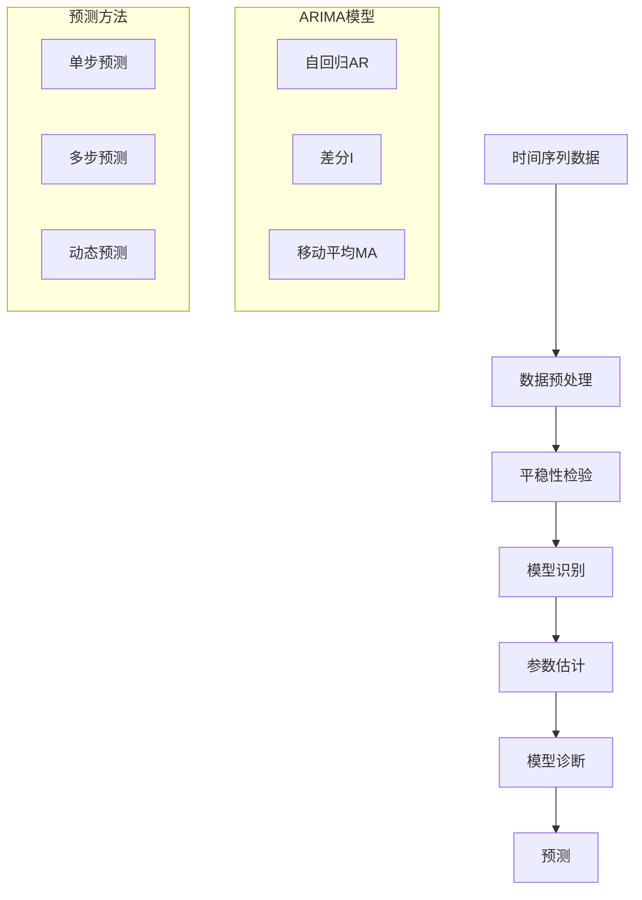

# 时序模型多表征示例 / Temporal Models Multi-Representation Examples

## 概述 / Overview

本文档提供了时序模型的完整多表征示例，包括时间序列预测、动态图神经网络和时序注意力机制。每种模型都包含数学表示、可视化图表和完整的代码实现。

## 1. 时间序列预测 / Time Series Prediction

### 1.1 时间序列预测理论 / Time Series Prediction Theory

#### 数学表示 / Mathematical Representation

时间序列预测的基本模型：

Basic Time Series Prediction Model:

$$y_t = f(y_{t-1}, y_{t-2}, ..., y_{t-p}, \epsilon_t)$$

其中：

- $y_t$ 是时间t的观测值
- $f$ 是预测函数
- $p$ 是滞后阶数
- $\epsilon_t$ 是随机误差项

where:

- $y_t$ is the observation at time t
- $f$ is the prediction function
- $p$ is the lag order
- $\epsilon_t$ is the random error term

ARIMA模型：

ARIMA Model:

$$\phi(B)(1-B)^d y_t = \theta(B)\epsilon_t$$

其中：

- $\phi(B)$ 是自回归多项式
- $\theta(B)$ 是移动平均多项式
- $d$ 是差分阶数
- $B$ 是滞后算子

where:

- $\phi(B)$ is the autoregressive polynomial
- $\theta(B)$ is the moving average polynomial
- $d$ is the differencing order
- $B$ is the lag operator

#### 可视化表示 / Visual Representation



#### Python实现 / Python Implementation

```python
import numpy as np
import pandas as pd
import matplotlib.pyplot as plt
import seaborn as sns
from statsmodels.tsa.arima.model import ARIMA
from statsmodels.tsa.stattools import adfuller, acf, pacf
from statsmodels.graphics.tsaplots import plot_acf, plot_pacf
from sklearn.metrics import mean_squared_error, mean_absolute_error
from typing import Tuple, List, Optional
import warnings
warnings.filterwarnings('ignore')

class TimeSeriesPredictor:
    """时间序列预测器"""
    
    def __init__(self, data: np.ndarray, train_ratio: float = 0.8):
        self.data = data
        self.train_ratio = train_ratio
        self.train_size = int(len(data) * train_ratio)
        self.train_data = data[:self.train_size]
        self.test_data = data[self.train_size:]
        self.model = None
        self.fitted_model = None
    
    def check_stationarity(self, data: np.ndarray) -> Tuple[bool, float]:
        """检查时间序列的平稳性"""
        result = adfuller(data)
        is_stationary = result[1] < 0.05
        p_value = result[1]
        return is_stationary, p_value
    
    def make_stationary(self, data: np.ndarray, max_diff: int = 2) -> Tuple[np.ndarray, int]:
        """使时间序列平稳化"""
        diff_count = 0
        current_data = data.copy()
        
        for i in range(max_diff):
            is_stationary, _ = self.check_stationarity(current_data)
            if is_stationary:
                break
            
            current_data = np.diff(current_data)
            diff_count += 1
        
        return current_data, diff_count
    
    def find_optimal_arima_params(self, data: np.ndarray, max_p: int = 3, 
                                 max_d: int = 2, max_q: int = 3) -> Tuple[int, int, int]:
        """寻找最优ARIMA参数"""
        best_aic = float('inf')
        best_params = (0, 0, 0)
        
        for p in range(max_p + 1):
            for d in range(max_d + 1):
                for q in range(max_q + 1):
                    try:
                        model = ARIMA(data, order=(p, d, q))
                        fitted_model = model.fit()
                        aic = fitted_model.aic
                        
                        if aic < best_aic:
                            best_aic = aic
                            best_params = (p, d, q)
                    except:
                        continue
        
        return best_params
    
    def fit_arima(self, data: np.ndarray, order: Tuple[int, int, int]) -> None:
        """拟合ARIMA模型"""
        self.model = ARIMA(data, order=order)
        self.fitted_model = self.model.fit()
    
    def predict(self, steps: int) -> np.ndarray:
        """进行预测"""
        if self.fitted_model is None:
            raise ValueError("模型尚未拟合")
        
        forecast = self.fitted_model.forecast(steps=steps)
        return forecast
    
    def evaluate_predictions(self, predictions: np.ndarray, 
                           actual: np.ndarray) -> dict:
        """评估预测结果"""
        mse = mean_squared_error(actual, predictions)
        mae = mean_absolute_error(actual, predictions)
        rmse = np.sqrt(mse)
        
        return {
            'MSE': mse,
            'MAE': mae,
            'RMSE': rmse
        }
    
    def plot_results(self, predictions: np.ndarray, 
                    actual: np.ndarray) -> None:
        """可视化结果"""
        plt.figure(figsize=(15, 10))
        
        # 原始数据
        plt.subplot(2, 2, 1)
        plt.plot(self.train_data, label='训练数据')
        plt.plot(range(len(self.train_data), len(self.data)), 
                self.test_data, label='测试数据')
        plt.title('原始时间序列数据')
        plt.legend()
        plt.grid(True, alpha=0.3)
        
        # ACF图
        plt.subplot(2, 2, 2)
        plot_acf(self.train_data, lags=40, ax=plt.gca())
        plt.title('自相关函数(ACF)')
        
        # PACF图
        plt.subplot(2, 2, 3)
        plot_pacf(self.train_data, lags=40, ax=plt.gca())
        plt.title('偏自相关函数(PACF)')
        
        # 预测结果
        plt.subplot(2, 2, 4)
        plt.plot(range(len(self.train_data), len(self.data)), 
                actual, label='实际值', color='blue')
        plt.plot(range(len(self.train_data), len(self.data)), 
                predictions, label='预测值', color='red')
        plt.title('预测结果对比')
        plt.legend()
        plt.grid(True, alpha=0.3)
        
        plt.tight_layout()
        plt.show()

def generate_synthetic_timeseries(n_points: int = 1000, 
                                trend: float = 0.01, 
                                seasonality: bool = True) -> np.ndarray:
    """生成合成时间序列数据"""
    t = np.arange(n_points)
    
    # 趋势
    trend_component = trend * t
    
    # 季节性
    if seasonality:
        seasonal_component = 10 * np.sin(2 * np.pi * t / 50) + \
                           5 * np.sin(2 * np.pi * t / 100)
    else:
        seasonal_component = 0
    
    # 随机噪声
    noise = np.random.normal(0, 1, n_points)
    
    # 组合
    time_series = trend_component + seasonal_component + noise
    
    return time_series

# 测试时间序列预测
if __name__ == "__main__":
    # 生成合成数据
    data = generate_synthetic_timeseries(n_points=500)
    
    # 创建预测器
    predictor = TimeSeriesPredictor(data, train_ratio=0.8)
    
    # 检查平稳性
    is_stationary, p_value = predictor.check_stationarity(predictor.train_data)
    print(f"时间序列平稳性: {is_stationary}, p值: {p_value:.4f}")
    
    # 寻找最优参数
    best_params = predictor.find_optimal_arima_params(predictor.train_data)
    print(f"最优ARIMA参数: {best_params}")
    
    # 拟合模型
    predictor.fit_arima(predictor.train_data, best_params)
    
    # 预测
    predictions = predictor.predict(steps=len(predictor.test_data))
    
    # 评估
    metrics = predictor.evaluate_predictions(predictions, predictor.test_data)
    print(f"预测评估指标: {metrics}")
    
    # 可视化
    predictor.plot_results(predictions, predictor.test_data)
```
