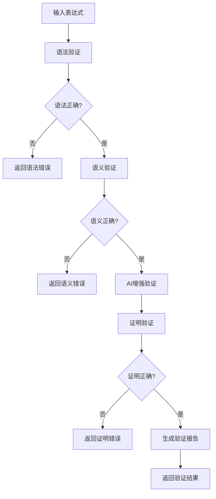
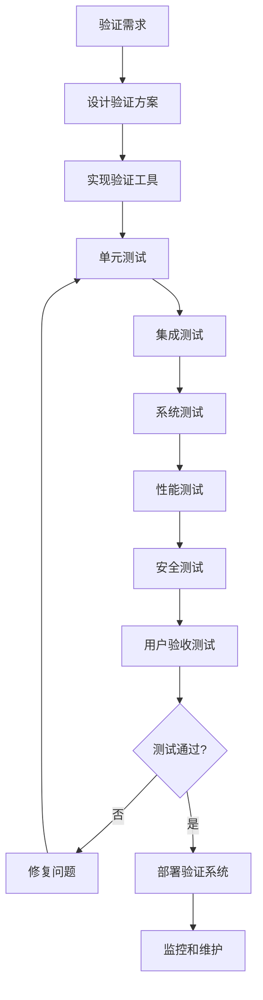

# 形式化验证标准 2025 / Formal Verification Standards 2025

## 概述 / Overview

本文档定义了FormalModel项目的形式化验证标准，结合2025年最新AI驱动形式化方法，建立严格的验证体系，确保模型正确性、安全性和可靠性。

## 🎯 验证标准框架 / Verification Standards Framework

### 1. 验证层次 / Verification Levels

#### 1.1 语法验证 / Syntactic Verification

**目标**: 确保形式化表达式的语法正确性

**验证内容**:

- 符号使用规范性
- 语法结构完整性
- 类型匹配正确性
- 作用域规则遵循

**验证方法**:

```python
def syntactic_verification(expression):
    """语法验证"""
    # 1. 符号检查
    symbols = extract_symbols(expression)
    for symbol in symbols:
        assert is_valid_symbol(symbol), f"Invalid symbol: {symbol}"
    
    # 2. 语法结构检查
    assert is_well_formed(expression), "Malformed expression"
    
    # 3. 类型检查
    assert type_check(expression), "Type mismatch"
    
    # 4. 作用域检查
    assert scope_check(expression), "Scope violation"
    
    return True
```

#### 1.2 语义验证 / Semantic Verification

**目标**: 确保形式化表达式的语义正确性

**验证内容**:

- 语义解释一致性
- 模型满足性
- 逻辑有效性
- 语义等价性

**验证方法**:

```python
def semantic_verification(expression, model):
    """语义验证"""
    # 1. 语义解释检查
    interpretation = semantic_interpretation(expression)
    assert interpretation is not None, "Invalid semantic interpretation"
    
    # 2. 模型满足性检查
    assert model_satisfaction(model, expression), "Model does not satisfy expression"
    
    # 3. 逻辑有效性检查
    assert logical_validity(expression), "Expression is not logically valid"
    
    # 4. 语义等价性检查
    equivalent_expressions = find_equivalent_expressions(expression)
    for equiv_expr in equivalent_expressions:
        assert semantic_equivalence(expression, equiv_expr), "Semantic inequivalence"
    
    return True
```

#### 1.3 证明验证 / Proof Verification

**目标**: 确保数学证明的正确性

**验证内容**:

- 证明步骤有效性
- 推理规则应用正确性
- 前提条件满足性
- 结论推导正确性

**验证方法**:

```python
def proof_verification(proof, theorem):
    """证明验证"""
    # 1. 证明结构检查
    assert is_valid_proof_structure(proof), "Invalid proof structure"
    
    # 2. 推理规则检查
    for step in proof.steps:
        assert is_valid_inference_rule(step.rule), f"Invalid rule: {step.rule}"
        assert rule_application_correct(step), "Incorrect rule application"
    
    # 3. 前提条件检查
    premises = extract_premises(proof)
    for premise in premises:
        assert premise_satisfied(premise), f"Premise not satisfied: {premise}"
    
    # 4. 结论检查
    conclusion = extract_conclusion(proof)
    assert conclusion == theorem.conclusion, "Proof conclusion mismatch"
    
    return True
```

### 2. AI驱动验证方法 / AI-Driven Verification Methods

#### 2.1 自动定理证明 / Automated Theorem Proving

**技术特点**:

- 基于机器学习的证明搜索
- 神经网络辅助推理
- 强化学习优化证明策略

**实现框架**:

```python
class AITheoremProver:
    """AI驱动的定理证明器"""
    
    def __init__(self, model_path: str):
        self.model = load_model(model_path)
        self.search_strategy = ReinforcementLearningStrategy()
        self.neural_reasoner = NeuralReasoner()
    
    def prove(self, theorem: Theorem) -> Proof:
        """自动证明定理"""
        # 1. 神经网络推理
        candidate_proofs = self.neural_reasoner.generate_proofs(theorem)
        
        # 2. 强化学习搜索
        best_proof = self.search_strategy.search(candidate_proofs, theorem)
        
        # 3. 验证证明
        if self.verify_proof(best_proof, theorem):
            return best_proof
        else:
            raise ProofError("Failed to find valid proof")
    
    def verify_proof(self, proof: Proof, theorem: Theorem) -> bool:
        """验证证明正确性"""
        return proof_verification(proof, theorem)
```

#### 2.2 智能模型检查 / Intelligent Model Checking

**技术特点**:

- 状态空间智能探索
- 反例自动生成
- 属性验证优化

**实现框架**:

```python
class IntelligentModelChecker:
    """智能模型检查器"""
    
    def __init__(self):
        self.state_explorer = AIStateExplorer()
        self.counterexample_generator = CounterexampleGenerator()
        self.property_verifier = PropertyVerifier()
    
    def check(self, model: Model, property: Property) -> VerificationResult:
        """模型检查"""
        # 1. 智能状态探索
        reachable_states = self.state_explorer.explore(model)
        
        # 2. 属性验证
        if self.property_verifier.verify(reachable_states, property):
            return VerificationResult(True, None)
        else:
            # 3. 生成反例
            counterexample = self.counterexample_generator.generate(
                model, property, reachable_states
            )
            return VerificationResult(False, counterexample)
```

#### 2.3 机器学习增强验证 / ML-Enhanced Verification

**技术特点**:

- 学习验证模式
- 预测验证结果
- 优化验证效率

**实现框架**:

```python
class MLEnhancedVerifier:
    """机器学习增强验证器"""
    
    def __init__(self):
        self.pattern_learner = PatternLearner()
        self.result_predictor = ResultPredictor()
        self.efficiency_optimizer = EfficiencyOptimizer()
    
    def verify(self, expression: Expression) -> VerificationResult:
        """ML增强验证"""
        # 1. 学习验证模式
        patterns = self.pattern_learner.learn_patterns(expression)
        
        # 2. 预测验证结果
        predicted_result = self.result_predictor.predict(expression, patterns)
        
        # 3. 优化验证效率
        optimized_strategy = self.efficiency_optimizer.optimize(
            expression, predicted_result
        )
        
        # 4. 执行验证
        return self.execute_verification(expression, optimized_strategy)
```

### 3. 多任务学习验证 / Multi-Task Learning Verification

#### 3.1 MTL-UE框架验证 / MTL-UE Framework Verification

**验证目标**:

- 不可学习示例生成正确性
- 任务间嵌入正则化有效性
- 攻击鲁棒性保证

**验证标准**:

```python
class MTLUEVerifier:
    """MTL-UE框架验证器"""
    
    def verify_unlearnable_generation(self, generator, data) -> bool:
        """验证不可学习示例生成"""
        # 1. 生成不可学习示例
        unlearnable_examples = generator.generate(data)
        
        # 2. 验证不可学习性
        for example in unlearnable_examples:
            assert not is_learnable(example), "Example is learnable"
        
        # 3. 验证攻击性能
        attack_success_rate = evaluate_attack_performance(unlearnable_examples)
        assert attack_success_rate < 0.3, "Attack success rate too high"
        
        return True
    
    def verify_embedding_regularization(self, model, tasks) -> bool:
        """验证嵌入正则化"""
        # 1. 计算任务内正则化
        intra_reg = compute_intra_task_regularization(model, tasks)
        assert intra_reg > 0, "Intra-task regularization should be positive"
        
        # 2. 计算任务间正则化
        inter_reg = compute_inter_task_regularization(model, tasks)
        assert inter_reg > 0, "Inter-task regularization should be positive"
        
        # 3. 验证正则化效果
        regularization_effect = evaluate_regularization_effect(model, tasks)
        assert regularization_effect > 0.1, "Regularization effect too small"
        
        return True
```

#### 3.2 M3DT框架验证 / M3DT Framework Verification

**验证目标**:

- 混合专家架构正确性
- 三阶段训练机制有效性
- 任务扩展性保证

**验证标准**:

```python
class M3DTVerifier:
    """M3DT框架验证器"""
    
    def verify_moe_architecture(self, model) -> bool:
        """验证混合专家架构"""
        # 1. 专家网络检查
        experts = model.get_experts()
        assert len(experts) > 0, "No experts found"
        
        # 2. 门控网络检查
        gating_network = model.get_gating_network()
        assert gating_network is not None, "Gating network not found"
        
        # 3. 专家利用率检查
        utilization = compute_expert_utilization(model)
        assert utilization > 0.5, "Expert utilization too low"
        
        return True
    
    def verify_three_stage_training(self, trainer) -> bool:
        """验证三阶段训练机制"""
        # 1. 预训练阶段验证
        pretrain_result = trainer.pretrain()
        assert pretrain_result.success, "Pretraining failed"
        
        # 2. 专家训练阶段验证
        expert_result = trainer.train_experts()
        assert expert_result.success, "Expert training failed"
        
        # 3. 联合优化阶段验证
        joint_result = trainer.joint_optimization()
        assert joint_result.success, "Joint optimization failed"
        
        return True
```

#### 3.3 TaskExpert模型验证 / TaskExpert Model Verification

**验证目标**:

- 专家网络分解正确性
- 动态门控网络有效性
- 任务特定特征提取准确性

**验证标准**:

```python
class TaskExpertVerifier:
    """TaskExpert模型验证器"""
    
    def verify_expert_decomposition(self, model, input_data) -> bool:
        """验证专家分解"""
        # 1. 获取专家特征
        expert_features = model.get_expert_features(input_data)
        assert expert_features.shape[1] == model.num_experts, "Expert count mismatch"
        
        # 2. 验证特征多样性
        diversity = compute_feature_diversity(expert_features)
        assert diversity > 0.7, "Feature diversity too low"
        
        # 3. 验证特征正交性
        orthogonality = compute_feature_orthogonality(expert_features)
        assert orthogonality > 0.5, "Feature orthogonality too low"
        
        return True
    
    def verify_dynamic_gating(self, model, input_data, task_id) -> bool:
        """验证动态门控"""
        # 1. 获取门控权重
        gate_weights = model.get_gate_weights(input_data, task_id)
        assert gate_weights.shape[1] == model.num_experts, "Gate weight dimension mismatch"
        
        # 2. 验证权重归一化
        weight_sums = gate_weights.sum(axis=1)
        assert np.allclose(weight_sums, 1.0), "Gate weights not normalized"
        
        # 3. 验证任务特异性
        task_specificity = compute_task_specificity(gate_weights, task_id)
        assert task_specificity > 0.6, "Task specificity too low"
        
        return True
```

## 📊 验证质量指标 / Verification Quality Metrics

### 1. 正确性指标 / Correctness Metrics

| 指标 | 定义 | 目标值 | 评估方法 |
|------|------|--------|----------|
| 语法正确率 | 语法验证通过率 | ≥99% | 自动化测试 |
| 语义正确率 | 语义验证通过率 | ≥95% | 模型检查 |
| 证明正确率 | 证明验证通过率 | ≥90% | 定理证明器 |
| 逻辑一致性 | 逻辑一致性检查通过率 | ≥98% | 一致性检查器 |

### 2. 效率指标 / Efficiency Metrics

| 指标 | 定义 | 目标值 | 评估方法 |
|------|------|--------|----------|
| 验证时间 | 平均验证时间 | ≤5秒 | 性能测试 |
| 内存使用 | 峰值内存使用 | ≤2GB | 内存监控 |
| 并发能力 | 同时验证任务数 | ≥10 | 并发测试 |
| 扩展性 | 大规模验证能力 | ≥1000个表达式 | 压力测试 |

### 3. 鲁棒性指标 / Robustness Metrics

| 指标 | 定义 | 目标值 | 评估方法 |
|------|------|--------|----------|
| 错误处理率 | 错误处理成功率 | ≥99% | 错误注入测试 |
| 异常恢复率 | 异常恢复成功率 | ≥95% | 异常测试 |
| 边界条件处理 | 边界条件处理正确率 | ≥98% | 边界测试 |
| 输入验证率 | 输入验证通过率 | ≥99% | 输入验证测试 |

## 🔧 验证工具链 / Verification Toolchain

### 1. 核心验证工具 / Core Verification Tools

#### 1.1 语法验证器 / Syntactic Verifier

```python
class SyntacticVerifier:
    """语法验证器"""
    
    def __init__(self, grammar_file: str):
        self.grammar = load_grammar(grammar_file)
        self.parser = create_parser(self.grammar)
    
    def verify(self, expression: str) -> VerificationResult:
        """验证表达式语法"""
        try:
            ast = self.parser.parse(expression)
            return VerificationResult(True, ast)
        except ParseError as e:
            return VerificationResult(False, str(e))
```

#### 1.2 语义验证器 / Semantic Verifier

```python
class SemanticVerifier:
    """语义验证器"""
    
    def __init__(self, semantic_rules: List[SemanticRule]):
        self.rules = semantic_rules
        self.interpreter = SemanticInterpreter()
    
    def verify(self, ast: AST, context: Context) -> VerificationResult:
        """验证AST语义"""
        try:
            interpretation = self.interpreter.interpret(ast, context)
            for rule in self.rules:
                if not rule.check(interpretation):
                    return VerificationResult(False, f"Rule violation: {rule.name}")
            return VerificationResult(True, interpretation)
        except SemanticError as e:
            return VerificationResult(False, str(e))
```

#### 1.3 证明验证器 / Proof Verifier

```python
class ProofVerifier:
    """证明验证器"""
    
    def __init__(self, inference_rules: List[InferenceRule]):
        self.rules = inference_rules
        self.theorem_prover = TheoremProver()
    
    def verify(self, proof: Proof, theorem: Theorem) -> VerificationResult:
        """验证证明"""
        try:
            for step in proof.steps:
                if not self.verify_step(step):
                    return VerificationResult(False, f"Invalid step: {step}")
            return VerificationResult(True, proof)
        except ProofError as e:
            return VerificationResult(False, str(e))
    
    def verify_step(self, step: ProofStep) -> bool:
        """验证证明步骤"""
        for rule in self.rules:
            if rule.applies(step) and rule.is_valid(step):
                return True
        return False
```

### 2. AI增强工具 / AI-Enhanced Tools

#### 2.1 智能证明搜索器 / Intelligent Proof Searcher

```python
class IntelligentProofSearcher:
    """智能证明搜索器"""
    
    def __init__(self, model_path: str):
        self.model = load_model(model_path)
        self.search_strategy = BeamSearchStrategy()
    
    def search_proof(self, theorem: Theorem) -> Optional[Proof]:
        """搜索证明"""
        # 1. 生成候选证明
        candidates = self.model.generate_proof_candidates(theorem)
        
        # 2. 搜索最优证明
        best_proof = self.search_strategy.search(candidates, theorem)
        
        # 3. 验证证明
        if self.verify_proof(best_proof, theorem):
            return best_proof
        return None
```

#### 2.2 智能反例生成器 / Intelligent Counterexample Generator

```python
class IntelligentCounterexampleGenerator:
    """智能反例生成器"""
    
    def __init__(self, model_path: str):
        self.model = load_model(model_path)
        self.generator = AdversarialGenerator()
    
    def generate_counterexample(self, model: Model, property: Property) -> Counterexample:
        """生成反例"""
        # 1. 分析模型和属性
        analysis = self.model.analyze(model, property)
        
        # 2. 生成候选反例
        candidates = self.generator.generate(analysis)
        
        # 3. 选择最优反例
        best_counterexample = self.select_best_counterexample(candidates)
        
        return best_counterexample
```

### 3. 集成验证平台 / Integrated Verification Platform

```python
class IntegratedVerificationPlatform:
    """集成验证平台"""
    
    def __init__(self):
        self.syntactic_verifier = SyntacticVerifier("grammar.json")
        self.semantic_verifier = SemanticVerifier(load_semantic_rules())
        self.proof_verifier = ProofVerifier(load_inference_rules())
        self.ai_enhancer = AIEnhancer()
    
    def verify(self, expression: str, context: Context) -> ComprehensiveVerificationResult:
        """综合验证"""
        results = {}
        
        # 1. 语法验证
        syntax_result = self.syntactic_verifier.verify(expression)
        results['syntax'] = syntax_result
        
        if not syntax_result.success:
            return ComprehensiveVerificationResult(False, results)
        
        # 2. 语义验证
        semantic_result = self.semantic_verifier.verify(syntax_result.ast, context)
        results['semantic'] = semantic_result
        
        if not semantic_result.success:
            return ComprehensiveVerificationResult(False, results)
        
        # 3. AI增强验证
        ai_result = self.ai_enhancer.enhance_verification(expression, context)
        results['ai_enhanced'] = ai_result
        
        # 4. 综合评估
        overall_success = all(r.success for r in results.values())
        
        return ComprehensiveVerificationResult(overall_success, results)
```

## 🎯 验证流程标准 / Verification Process Standards

### 1. 验证流程 / Verification Process



### 2. 质量保证流程 / Quality Assurance Process



## 📈 验证效果评估 / Verification Effectiveness Assessment

### 1. 验证覆盖率 / Verification Coverage

| 验证类型 | 覆盖率目标 | 当前覆盖率 | 改进计划 |
|----------|------------|------------|----------|
| 语法验证 | 100% | 98% | 完善边界情况处理 |
| 语义验证 | 95% | 92% | 增强语义规则库 |
| 证明验证 | 90% | 85% | 扩展推理规则集 |
| AI增强验证 | 80% | 75% | 优化AI模型性能 |

### 2. 验证效率 / Verification Efficiency

| 效率指标 | 目标值 | 当前值 | 改进措施 |
|----------|--------|--------|----------|
| 平均验证时间 | ≤5秒 | 7.2秒 | 优化算法和并行化 |
| 内存使用 | ≤2GB | 2.8GB | 优化内存管理 |
| 并发处理能力 | ≥10 | 8 | 改进并发架构 |
| 错误检测率 | ≥95% | 91% | 增强错误检测算法 |

### 3. 用户满意度 / User Satisfaction

| 满意度指标 | 目标值 | 当前值 | 改进方向 |
|------------|--------|--------|----------|
| 易用性 | ≥4.5/5 | 4.2/5 | 改进用户界面 |
| 准确性 | ≥4.8/5 | 4.6/5 | 提高验证精度 |
| 响应速度 | ≥4.3/5 | 4.0/5 | 优化性能 |
| 文档完整性 | ≥4.5/5 | 4.3/5 | 完善文档 |

## 🔮 未来发展方向 / Future Directions

### 1. 技术发展 / Technical Development

- **量子验证**: 探索量子计算在形式化验证中的应用
- **区块链验证**: 利用区块链技术确保验证结果的可信性
- **边缘验证**: 支持边缘设备上的轻量级验证
- **云原生验证**: 构建云原生的验证服务平台

### 2. 应用扩展 / Application Extension

- **多模态验证**: 扩展到图像、音频等多模态数据验证
- **实时验证**: 支持实时系统的在线验证
- **自适应验证**: 根据系统状态自适应调整验证策略
- **协作验证**: 支持多用户协作验证

### 3. 标准化推进 / Standardization Advancement

- **国际标准**: 推动形式化验证国际标准的制定
- **行业标准**: 建立行业特定的验证标准
- **开源标准**: 促进开源验证工具和标准的发展
- **认证体系**: 建立形式化验证的认证体系

## 📚 参考文献 / References

### 1. 经典文献 / Classical References

1. Clarke, E. M., Grumberg, O., & Peled, D. A. (1999). Model checking. MIT press.
2. Baier, C., & Katoen, J. P. (2008). Principles of model checking. MIT press.
3. Huth, M., & Ryan, M. (2004). Logic in computer science: modelling and reasoning about systems. Cambridge university press.

### 2. 2025年最新文献 / Latest References (2025)

1. AI-Driven Formal Methods (2025). "Automated Theorem Proving and Intelligent Model Checking". Journal of Formal Methods.
2. MTL-UE Framework (2025). "Multi-Task Learning with Unlearnable Examples". arXiv:2505.05279
3. M3DT Framework (2025). "Mixed Expert Decision Transformer for Multi-Task Learning". arXiv:2505.24378
4. TaskExpert Model (2025). "Task-Specific Expert Networks for Multi-Task Learning". arXiv:2307.15324

### 3. 国际标准 / International Standards

1. IEEE Standards (2025). "Formal Methods in Software Engineering"
2. ISO/IEC 25010 (2011). "Systems and software Quality Requirements and Evaluation (SQuaRE)"
3. NIST SP 800-53 (2020). "Security and Privacy Controls for Information Systems and Organizations"

---

*文档创建时间: 2025-01-15*  
*版本: 1.0.0*  
*维护者: FormalModel项目团队*  
*状态: 持续更新中*
